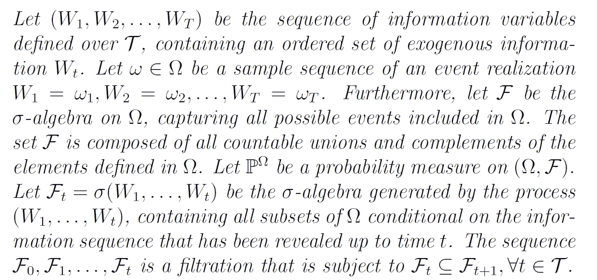
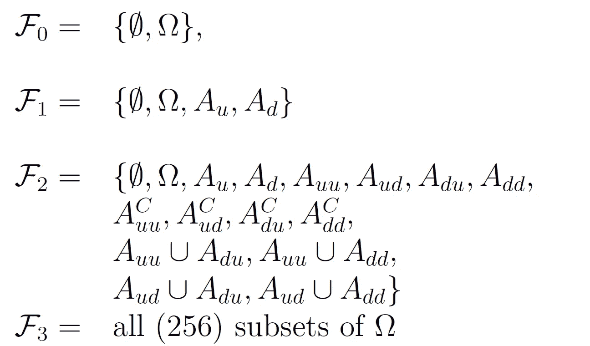
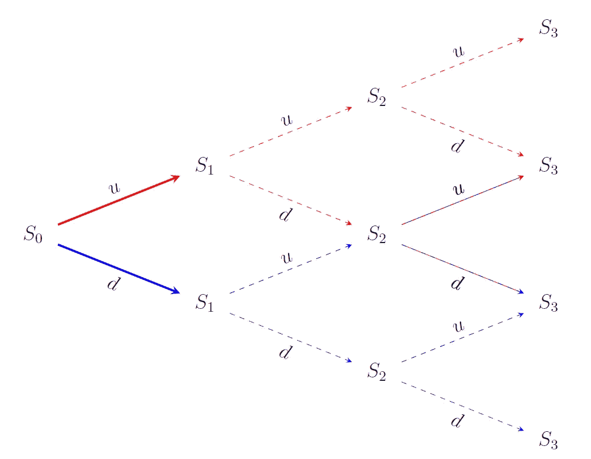
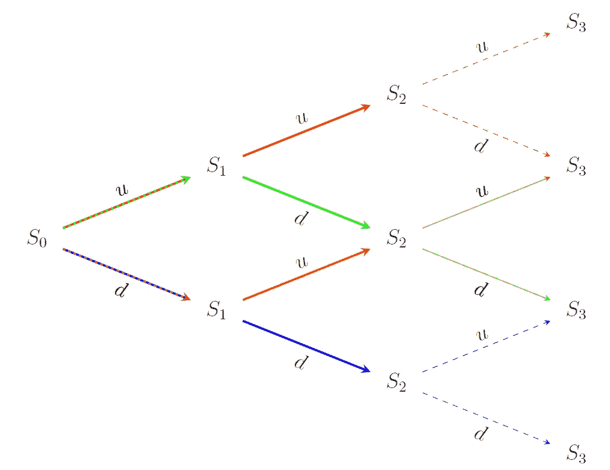
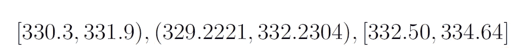
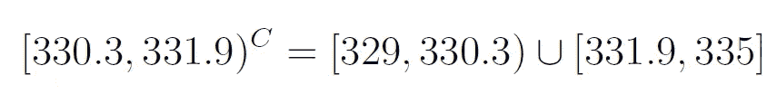
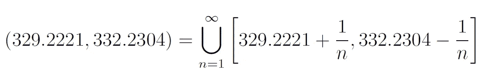
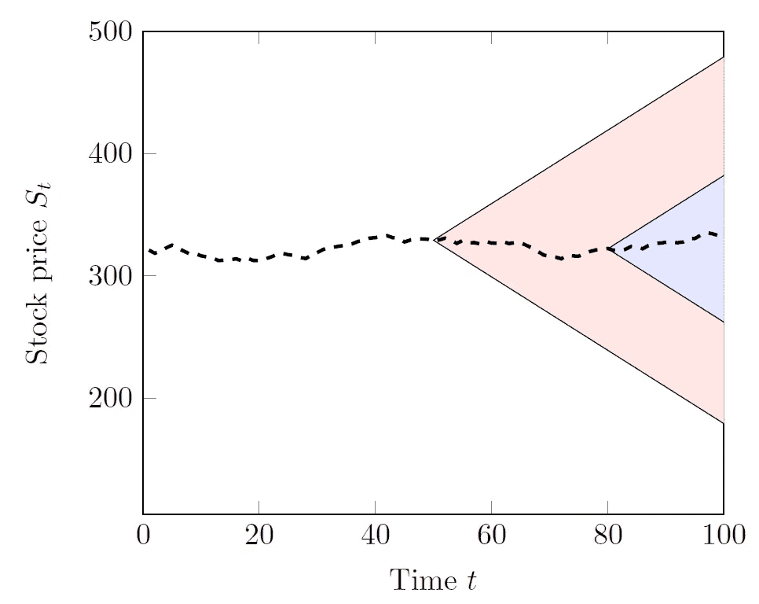

# 强化学习中的过滤——它们是什么，为什么我们不需要它们

> 原文：<https://towardsdatascience.com/filtrations-in-reinforcement-learning-what-they-are-and-why-we-dont-need-them-463c93a170d4?source=collection_archive---------37----------------------->

## 过滤的数学概念的基本解释，以及我们如何在强化学习中应用它们。

进行强化学习所需的 ***为*** 的过滤【来源:【pixabay.com】pixel 2013

偶尔，当阅读强化学习领域的论文时，你可能会偶然发现一些听起来很神秘的短语，如*“我们处理一个过滤的概率空间”*、*期望值取决于过滤*或*“决策政策是ℱ*ₜ*-可测量的*”。没有测量理论[2，3]的正规训练，可能很难准确理解这种过滤需要什么。正式定义如下所示:

过滤的正式定义([2]，自己的工作)

毫无疑问，对于那些熟悉测度理论的人来说，这是样板语言，但除此之外几乎没有帮助。谷歌搜索答案可能会导致通过*σ*-代数、Borel 集、Lebesgue 测度和 Hausdorff 空间的迷宫，再次假设你已经知道了基本知识。幸运的是，只需要对滤波有一个非常基本的了解，就可以理解它在 RL 域中的含义。本文将提供关于该主题的远非全面的讨论，但旨在给出核心概念的一个简要且直观的轮廓。

# **一个例子**

在 RL 中，我们通常定义一个结果空间*ω*，它包含所有可能发生的结果或样本，其中 *ω* 是一个特定的样本路径。为了便于说明，我们将假设我们的 RL 问题与在第 *t* 日价格为 *S* ₜ的股票相关。我们当然希望低买高卖(精确的决策问题在这里无关紧要)。我们可以将买入/卖出决策表示为 *xₜ(ω)* ，，即该决策取决于价格路径。我们从价格 *S₀* (一个实数)开始，每天价格按照某种随机过程上涨或下跌。在播放这一集之前，我们可以提前模拟(或数学定义)这样一个价格路径*ω=[ω₁,…,ωₜ】*。然而，这并不意味着我们应该在股票价格变动实际发生之前就知道它们——即使是沃伦·巴菲特也只能梦想拥有这样的信息！为了声称我们的决策基于ω而不是千里眼，我们可以说结果空间是“过滤的”(使用符号 *ℱ )* ，这意味着我们只能观察到时间 *t* 的样本。

对于大多数 RL 从业者来说，这个限制听起来一定很熟悉。我们通常不是根据当前状态 *Sₜ* 来做决定的吗？的确，我们有。事实上，由于马尔可夫性质意味着随机过程是无记忆的——我们只需要嵌入在主导状态中的信息 *Sₜ —* 来自过去的信息是不相关的[5]。正如我们将很快看到的，过滤比状态更丰富、更通用，但实际上它们的含义是相似的。

让我们进一步形式化一下我们的股票价格问题。我们从一个离散的问题设置开始，其中价格要么上升( *u* )要么下降( *-d* )。考虑到三天的事件范围，结果空间*ω*可以通过二项式点阵来可视化[4]:

代表股票价格变化的二项式点阵模型(来源:[1]，作者

# **事件和过滤的定义**

在这一点上，我们需要定义一个“事件”的概念*A∈ω*。或许有点抽象地说，事件是结果空间的一个元素。简单地说，我们可以给一个事件分配一个概率，并断言它是否已经发生。正如我们将很快展示的那样，这与实现 *ω* 并不相同。

过滤 *ℱ* 是一个数学模型，代表关于结果的部分知识。本质上，它告诉我们一个事件是否发生过。“过滤过程”可以被视为一系列过滤器，每个过滤器为我们提供更详细的视图。具体地说，在 RL 环境中，过滤为我们提供了计算当前状态 *Sₜ* 所需的信息，而没有给出过程中未来变化的任何指示【2】。的确，就像马尔可夫性质一样。

形式上，过滤是一个*σ*-代数，虽然你不需要知道来龙去脉，但一些背景知识是有用的。不严格地定义，*σ*-代数是结果空间的子集的集合，包含可数个事件以及它们的所有补和并。在测量理论中，这个概念有着重要的含义，为了本文的目的，你只需要记住，*σ*-代数是事件的集合。

# **重温示例—离散案例**

回到这个例子，因为过滤只有在付诸行动时才会活跃起来。我们首先需要定义事件，使用像' *udu'* 这样的序列来描述价格随时间的变化。在 *t=0* 时，我们基本上什么都不知道——所有的路径都是可能的。因此，事件集合 *A={uuu，uud，udu，udd，ddd，ddu，dud，duu}* 包含所有可能的路径ω∈ω。在 *t=1* 时，我们知道更多一点:股票价格上涨或下跌。对应的事件由****u****uu、****u****ud、****u*******u****【DD】*和****d 如果股价上涨，我们可以推测我们的样本路径 *ω* 将在 *Aᵤ* 而不是 *Aₔ* (当然反之亦然)。在 *t=2* 时，我们有四个事件集: *Aᵤᵤ={uuu,uud}* 、*aᵤₔ={****ud****u、****ud****d }*、*aₔᵤ={**杜**** *观察信息变得越来越细粒度； *ω* 可能所属的集合变得越来越小，数量越来越多。在 *t=3* 时，我们显然知道已经遵循的确切价格路径。****

*定义了事件之后，我们可以为 *t=0，1，2，3* 定义相应的过滤:*

**

*二项式点阵示例的筛选(来源:[2]，i *由作者*创建)*

*在 *t=0* 时，每种结果都有可能。我们用空集∅和结果空间ω初始化过滤，也称为*平凡**σ*-代数。*

*在 *t=1* 时，我们可以简单地将 *Aᵤ* 和 *Aₔ* 加到 *ℱ* ₀上得到*ℱ*₁；回想一下定义，每个过滤总是包括其前一个过滤的所有元素。我们可以使用最新披露的信息来计算 S₁。我们也可以窥见未来(实际上没有透露未来的信息！):如果价格上涨，我们就不能在 t=3 时达到最低价格。事件集如下所示*

**

*t=1 时事件集 *Aᵤ* 和 *Aₔ* 的可视化(来源:[2]，作者本人*法师*)*

*在 *t=2* ，我们可以根据目前揭示的价格路径来区分四个事件。这里事情变得有点复杂，因为我们还需要添加并集和补集(符合*σ*-代数的要求)。这对 *ℱ* ₁来说没有必要，因为 *Aᵤ* 和 *Aₔ* 的并集等于结果空间，而 *Aᵤ* 是 *Aₔ* 的补码。从 RL 的角度来看，你可能会注意到我们有比严格需要的更多的信息。例如，一个向上的运动跟随一个向下的运动产生了与反向运动相同的价格。在 RL 应用中，我们通常不会存储这样的冗余信息，但您可能会意识到数学上的吸引力。*

**

**事件集可视化 Aᵤᵤ、* *Aᵤₔ* 、 *Aₔᵤ* 和 *Aₔₔ* 在 t=2(来源:[2]，作者本人*法师*)*

*在 *t=3* 时，我们已经有 256 套，使用与之前相同的程序。你可以看到过滤很快变得非常大。过滤总是包含前面步骤的所有元素——随着时间的推移，我们的过滤变得更加丰富和精细。所有这一切意味着，我们可以更精确地指出我们的样本价格路径可能属于或可能不属于的事件。*

# ***一个连续的例子***

*我们几乎已经做到了，但如果我们只处理分散的问题，那将是我们的失职。在现实中，股票价格不只是“涨”或“跌”；它们将在一个连续的域内变化。许多其他 RL 问题也是如此。虽然在概念上与离散情况相同，但在连续设置中提供过滤的明确描述是困难的。同样，一些插图可能比正式定义更有帮助。*

*假设在每个时间步，我们模拟一个从实域 *[-d，u】*的返回。根据我们预测的时间，我们可以定义未来股票价格下跌的区间，比如在给定的时间点*【329，335】*。然后我们可以在这个域内定义区间。任何任意间隔都可能构成一个事件，例如:*

**

*区间的补码可能看起来像*

**

*此外，可能会定义过多的联合，例如*

**

*正如你可能已经猜到的，有无限多的各种形状和大小的这种事件，但它们仍然是可数的，我们可以给它们每个分配一个概率[2，3]。*

*我们对未来看得越远，我们就越能偏离当前的股价。我们可以用一个随时间扩展的圆锥形状来想象这一点(下面显示的是 *t=50* 和 *t=80* )。在圆锥内，我们可以定义无穷多个区间。和以前一样，随着时间的推移，我们获得了更详细的视图。*

**

*t=50 和 t=80 时连续域中的事件集。在锥内，可以定义无限多个区间来构造过滤。(来源:[2]，我*法师作者*)*

# ***包装东西***

*当在任何 RL 论文中遇到过滤时，本文中讨论的基础知识就足够了。从本质上来说，引入过滤的唯一目的是ℱₜ确保决策不会利用尚未披露的信息。当马尔可夫性质成立时，对当前状态进行操作的决策*xₜ(sₜ】*服务于相同的目的。过滤提供了对过去的丰富描述，然而在无记忆问题中我们不需要这些信息。然而，从数学的角度来看，这是一个优雅的解决方案，有许多有趣的应用。强化学习社区由许多来自不同领域的不同背景的研究人员和工程师组成，并非每个人都讲同一种语言。有时学习另一种语言会有很大的帮助，即使只有几个单词。*

**【本文部分基于我的 ArXiv 文章《强化学习中过滤的温和讲义》】**

# ***参考文献***

*[1]世界法官协会范·赫斯维克(2020 年)。强化学习中的过滤。arXiv 预印本 [arXiv:2008.02622](https://arxiv.org/abs/2008.02622)*

*[2] Shreve，S. E. (2004 年)。金融随机微积分 II:连续时间模型，第 11 卷。斯普林格科学与商业媒体。*

*[3] Shiryaev，A. N. (1996 年)。概率。斯普林格纽约-海德堡。*

*4 luen Berger，D. G. (1997 年)。投资科学。牛津大学出版社。*

*[5]鲍威尔(2020 年)。关于状态变量、Bandit 问题和 POMDPs。arXiv 预印本 [arXiv:2002.06238](https://arxiv.org/abs/2002.06238)*