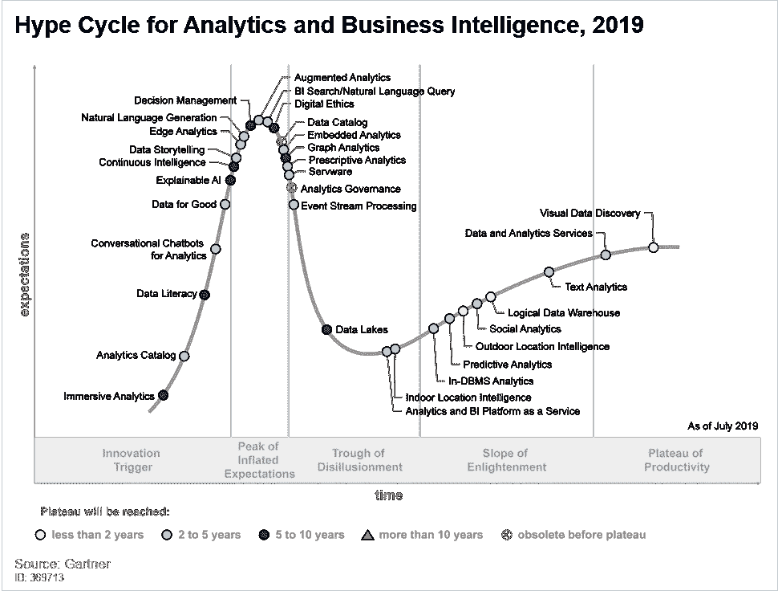
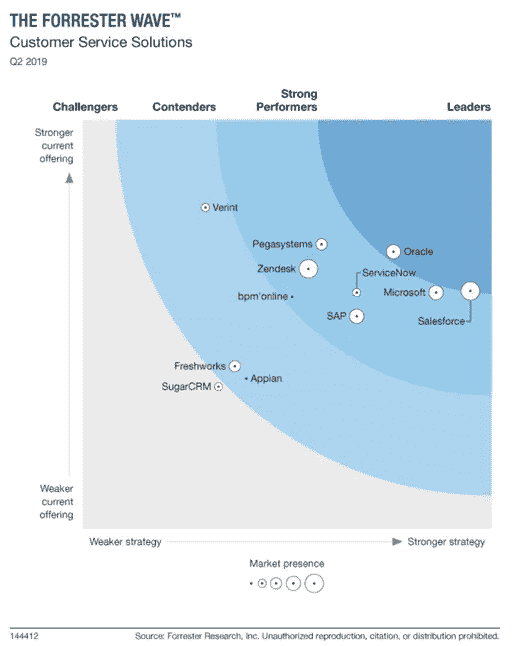

# 终于可用和可访问，但错误的方式？

> 原文：<https://towardsdatascience.com/finally-available-and-accessible-but-wrong-way-bec731a151a6?source=collection_archive---------64----------------------->

“嵌入式分析是一种数字工作场所功能，数据分析在用户的自然工作流程中进行，无需切换到另一个应用程序。”[1]在 Logi Analytics 年度嵌入式分析状况调查[2]的 500 多名受访者中，超过 85%的受访者(主要来自北美)以某种形式为其 SaaS 应用提供嵌入式分析。听起来不错，但似乎行不通。根据 Gartner 对分析和商业智能的宣传周期，嵌入式分析已经度过了“膨胀的期望”的高峰，正在走向幻灭的低谷，在此期间，“随着实验和实施失败，兴趣减弱”[3]。

来源: [Gartner 的分析和商业智能炒作周期，2019 年](https://www.gartner.com/en/newsroom/press-releases/2019-10-02-gartner-reveals-five-major-trends-shaping-the-evoluti)

为什么采用速度比预期慢？依我拙见，即使技术使可用的数据，读“数据收集并准备使用”，读“容易检索”，但它有多大用处？

*终于可用且易得，但方法不对？*
在过去的几个月里，我收到了几个关于一些 SaaS 应用程序中嵌入的默认现成仪表板和报告的问题，这让我想知道应用程序团队是如何提出在那里显示指标的。我在这里是什么意思？成熟&成熟的行业/领域/学科通常有一套预定义的标准和关键绩效指标(KPI)来管理和衡量其增长，例如，在客户服务方面，可能是平均响应时间、首次呼叫解决、平均解决时间、票据数量等。如果幸运的话，您的 SaaS 应用程序将跟踪 2-3 个与您的业务相关的指标。如果你想得到比开放票和封闭票数量稍微严重一点的东西，你需要做好花钱的准备。“数据是新的黄金”这句话在这里变成了现实，因为在许多情况下，你需要为每个座位付费。本文的目的是为作为 Freshdesk 最终用户的您提供一些嵌入式仪表盘/报表的替代方案，以防它们无法满足您的某些信息需求/您不想为您的报表倾家荡产。

*可用*
[fresh desk](https://freshdesk.com/)(fresh works Inc .的产品)是一个票证管理解决方案，允许您的客户服务团队管理票证和联系人。收集的数据:票证、对话、联系人、代理、技能、角色、组、公司、讨论、解决方案、满意度、产品等—有关端点的完整列表，请查看 Freshdesk API 文档[此处](https://developers.freshdesk.com/api/#introduction)。

来源:[Forrester Wave:客户服务解决方案，Q2 2019](https://go.oracle.com/LP=86252?elqCampaignId=229913)

*可访问*
您可以查看的报告和指标数量取决于您的订阅(请参见 Freshdesk 的客户服务指标[此处](https://freshdesk.com/customer-service-training/customer-service-metrics))。如果您不准备让您的订阅成本增加一倍或三倍，您可以查看下面的集成平台即服务(iPaaS)，它从您的 Freshdesk 中提取数据并将这些数据加载到您的数据存储中，以便您可以使用商业智能/仪表板工具来访问这些数据，例如，下面的 iPaaS 具有连接 Freshdesk 和 Power BI 的连接器:
1。扎皮尔

2.[歌手/缝线](https://www.singer.io/tap/freshdesk/)

3. [Skyvia](https://skyvia.com/data-integration/analyze-freshdesk-with-powerbi)

4.[工作狂](https://www.workato.com/users/request_demo)

5.或者，你也可以研究一些专门的工具，比如荧光瞄准镜。如果你预算不足，这里有一个方法可以让你仍然获得客户服务绩效的仪表板/报告。

*什么？Python，crontab 文件，数据存储。*
1。假设您的系统上已经安装了 Python。如果没有，可以使用 [Conda](https://docs.conda.io/projects/conda/en/latest/user-guide/install/index.html) ，一个开源的软件包管理系统和环境管理系统，用于安装多个版本的软件包及其依赖项。

2.检索您的 Freshdesk API 密钥。点击查看帮助文章[。](https://support.freshdesk.com/support/solutions/articles/215517-how-to-find-your-api-key)

3.更改您的 Freshdesk 和数据库连接，并运行以下代码片段。

看代码[这里](https://github.com/eponkratova/articles/blob/master/freshdesk_with_pentaho/freshdesk_code.ipynb)

4.使用 cron 调度脚本的执行。根据你的操作系统，你需要执行不同的步骤，因此，我会建议你谷歌一下。

就是这样。通过使用现有的连接器或运行您自己的 Python 脚本，您将能够提取几乎所有收集到的数据，对其运行不同类型的报告/分析，并且有希望从中获得价值，而不局限于应用程序团队添加到默认视图中的指标。

*参考*:

1.  位于[的 Gartner 词汇表 https://www . Gartner . com/en/information-technology/Glossary/embedded-analytics](https://www.gartner.com/en/information-technology/glossary/embedded-analytics)。于 2020 年 4 月 11 日访问
2.  Logi Analytics 嵌入式分析状态报告，2018 年。于 2020 年 4 月 11 日访问
3.  Gartner 的分析和商业智能炒作周期，2019 年在[https://www . Gartner . com/en/news room/press-releases/2019-10-02-Gartner-揭示-五大趋势-塑造-演进](https://www.gartner.com/en/newsroom/press-releases/2019-10-02-gartner-reveals-five-major-trends-shaping-the-evoluti)。于 2020 年 4 月 11 日访问
4.  Forrester Wave:客户服务解决方案，https://go.oracle.com/LP=86252?elqCampaignId=229913[2019 年 Q2。于 2020 年 4 月 11 日访问](https://go.oracle.com/LP=86252?elqCampaignId=229913)