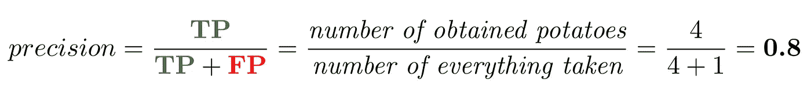

# 最后记住精确和回忆

> 原文：<https://towardsdatascience.com/finally-remember-precision-and-recall-94b4d481f9bf?source=collection_archive---------60----------------------->

## 对基本指标——精确度和召回率——的解释，并以土豆分类为例

你是否也很难记住什么是**精度**和**召回**？在计算时，我们必须考虑混淆矩阵的行或列。但是什么是什么呢？它们的含义有什么不同？为什么准确度不够？

本文将解释这些问题，并阐明这两个指标之间的区别。最后，你会发现两个测试你理解能力的问题。

# 动机

假设你是一个农民——马铃薯种植者。你有一台从地里摘土豆的机器，但有一个问题。机器有时**拿石头当土豆**(反之亦然)。想象机器本身是一个分类器。如果它**接受**一个对象，这意味着它认为对象**是一个土豆**。相反，如果它没有**不接受**该对象，就意味着**它是一块石头**，所以我们把它留在现场。只有这两种状态。

罗布·穆德在 [Unsplash](https://unsplash.com?utm_source=medium&utm_medium=referral) 上拍摄的照片

# 精度不够吗？

不，不幸的是没有。让我们考虑一个极端的例子。田地里有 **95 颗石头**和仅仅 **5 个土豆**(总共 100 个物体)，我们有一个**准确率 95%** 的模型。这是一个相当高的精度，我们可以满意的模型。然而，我们不知道我们有多少土豆。有更多可能的变体，我们可以得到什么(什么模型认为是一个土豆):

*   **5 个土豆**和 5 块石头(90 块石头正确留在地里)，
*   **2 个土豆**和 2 块石头(93 块石头正确留在地里)，
*   **0 个土豆**和 0 颗石子(95 颗石子正确留在地里)，
*   …

所有这些例子都有 **95%的准确率**，因为它们正确识别了 100 个物体中的 95 个，**无论是土豆还是石头**。我承认这个例子不太可能。然而，正如我们所看到的，我们可以获得**所有土豆**以及**没有土豆**的相同精度。准确性告诉我们关于一个类的任何具体信息。

**精确**和**召回**解决了这些问题。一般来说，准确性并不完全适合不平衡的数据，如果我们只对一个类感兴趣(更一般地说:如果我们只对类的子集感兴趣)，准确性就不方便了。

照片由[马库斯·斯皮斯克](https://unsplash.com/@markusspiske?utm_source=medium&utm_medium=referral)在 [Unsplash](https://unsplash.com?utm_source=medium&utm_medium=referral) 拍摄

# 回到我们的土豆…

我们制作了一个模型(分类器),学习土豆的样子。模型的学习(训练)看起来是这样的:

> *老师:*“嘿模特，这是土豆。”
> *型号:*“好的，我会**记住**那个土豆长这样。”
> *老师:*“嘿模特，这又是一个土豆。”
> *型号:*“好的，我会**记住**土豆也可以是这个样子的。”
> *老师:*“嘿模特，这不是土豆。”
> *型号:*“好的，我会**记住**那个土豆不是这样的。”
> *…*

这有点抽象。模特训练不完全是对话。但是我们稍后将回到模型**记得**某事的想法。

假设机器从地面上拿起 **10 个物体**(真值)，并确定它们**是否是土豆**，如下图所示。我们将在下面的解释中使用这个例子。

*作者图片*

# 混淆矩阵

不提到混淆矩阵就无法解释度量。如果您熟悉这个问题，可以跳过这一部分。

混淆矩阵(CM)是一张**命中**(右侧预测案例——绿色部分:TP、TN)和**错误**(红色部分:FP、FN)的表格。

*作者图片*

*   **TP** (真阳性)是**正确**预测 **p** 阳性病例的数量(命中)。
*   **TN** (真阴性)是**正确**预测 **n** 阴性情况(命中)的数量。
*   **FP** (假阳性)是**错误**预测 **p** 阳性病例(错误)的数量。
*   **FN** (假阴性)是**错误**预测 **n** 阴性情况(错误)的数量。

然后根据这些值计算各个指标。

如果我们将测试(预测)阶段视为一个对话，它看起来会像这样:

> *老师*:“嘿模特，这是什么？”
> *型号*:“我觉得，是土豆。”
> *老师*:“那是 **T** 芸香！你称它为 **P** otato ( **P** 正值)，所以我将增加**真正**值。”
> # TP += 1
> 
> *老师*:“嘿模特，这是什么？”
> *型号*:“我会说，它是个土豆。”
> *老师*:“不，不是土豆！你说土豆，但它是石头——所以它也是石头。你预测了 **P** otato ( **P** 正值)，所以我给**误报**加一。”
> # FP += 1
> 
> *老师*:“嘿模特，那这个呢？”
> *型号*:“我觉得，它不是土豆。”
> *老师*:“那是 **F** alse，这是土豆！你的预测是 **N** 不是土豆，所以我必须增加**假阴性**值。”
> # FN += 1
> 
> *老师*:“嘿模特，这是什么？”
> *型号*:“这样的话，我猜它不是土豆。”
> *老师*:“那是 **T** rue！正如你所猜测的，这是一个土豆。我给**真底片加一。**
> # TN+= 1
> …

# 精确

精度告诉我们**模型的精度有多高。换句话说，我们收集的物品中有百分之多少实际上是土豆。**

它是**右预测正值** (TP)除以**预测数**(检索项——在我们的例子中是 CM 的第一列之和)的比值。

在土豆的例子中，它是检索到的土豆除以所有检索到的对象的比率(我们的机器获取的所有东西——我们的模型归类为土豆的所有东西)。

**阳性预测值** (PPV)是精度的别称。

# 回忆

另一方面，回忆告诉我们收集的土豆占实际土豆的百分比。它是**右预测正值** (TP)除以**所有现有正值**(在我们的例子中是第一行 CM 之和)的比值。

在马铃薯的例子中，它是取回的马铃薯的比率**除以田地中生长的所有马铃薯的比率**。

这个公式里只有**土豆**(正值)！它有时被称为**敏感度**或**真阳性率。**

# 好吧，那怎么记呢？

**回忆**这个词也有“*记住*”(作为动词)的意思。所以它是**模型正确记忆的比率——正确预测的正值**。让我们回到前面提到的观点，模型训练就是背诵或者记忆。

在训练中，我们向我们的模型展示了(例如)10 个土豆。现在我们将再次向我们的模型展示同样的 10 个土豆，但是我们将要求模型决定它们是否是土豆。该模型将在 8 种情况下决定(**记住**)马铃薯(例如)。这意味着**召回率等于 80%** 。这个模型正确地识别了 10 个土豆中的 8 个。

> **边注:**合适的模型要能概括。换句话说，它也应该正确地预测以前未见过的情况。

# 结论

**如果我们**只对一类**感兴趣，或者**数据不平衡**，那么精度**并不完全合适。它是所有正确预测的百分比(土豆和石头加在一起)。

如果我们计算**精度**，我们只看**模型的正面预测**。另一方面，**只有阳性病例**包含在**召回**计算中。

**使用精度**，如果农民从田地里尽量少拿石头更重要。如果当务之急是在田地里留下尽可能少的土豆，**召回**正好相反。

# 问题—现在清楚了吗？

## 1)模型选择的内容直接用于(无需进一步分类)食物准备。哪个型号最好？

*   模型 A: 准确率= 100%，召回率= 90%
*   模型 B: 准确率= 90%，召回率= 100%
*   **模型 C:** 准确度= 98%

## 2)如果你的目的是从地里尽可能多的获取土豆，那么哪个型号最合适？

*   **模型 A:** 准确率= 100%，召回率= 90%
*   **模型 B:** 准确率= 90%，召回率= 100%
*   **模型 C:** 准确率= 98%

Monika Grabkowska 在 [Unsplash](https://unsplash.com?utm_source=medium&utm_medium=referral) 上拍摄的照片

# 问题的解决

## 1)模型 A

在这种情况下，**精度等于 100%** 很重要。我们不想在饭里放石头。

## 2)模型 B

在这种情况下，**召回等于 100%** 是重要的。我们不想在地里留下任何土豆。

一旦你直接用你的模型选择的土豆准备午餐，我祝你精度等于 100%。:-)

> **请慢用！；——)**

## 新到中？[解锁](https://medium.com/@jakubrysavy/membership)无限访问(并支持我)！