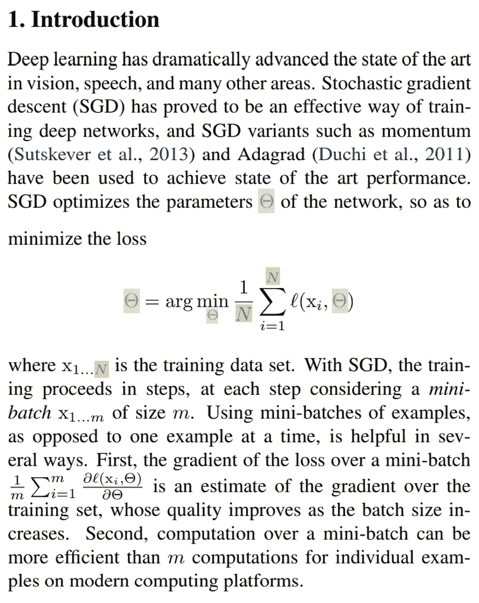
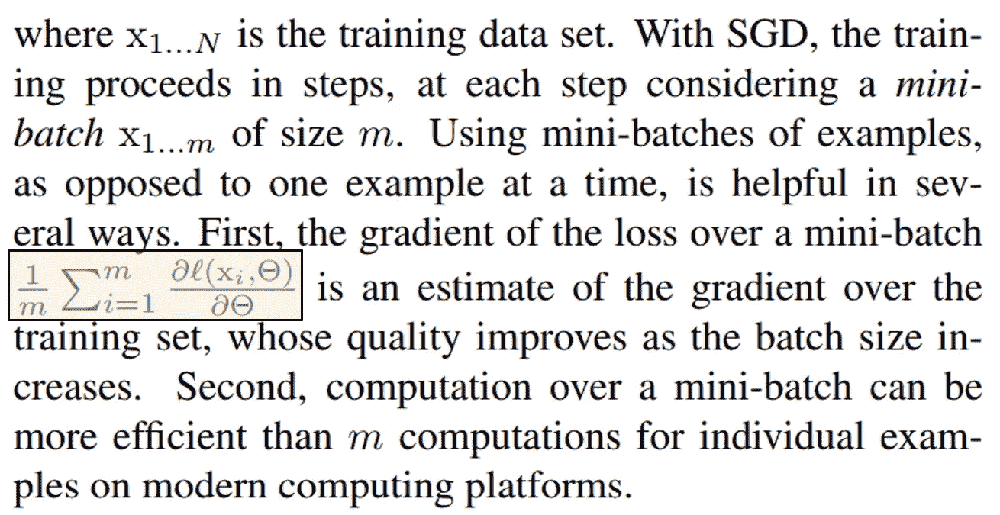
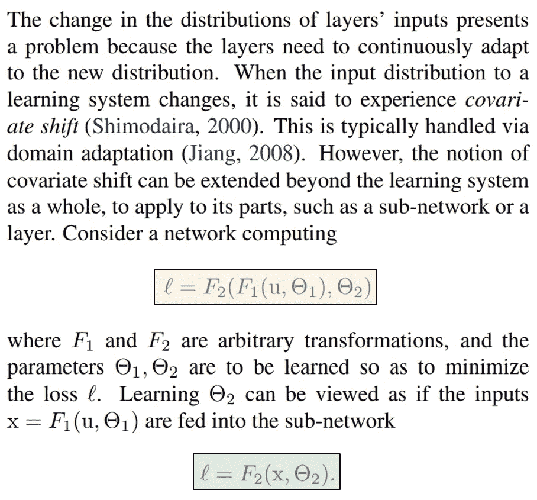
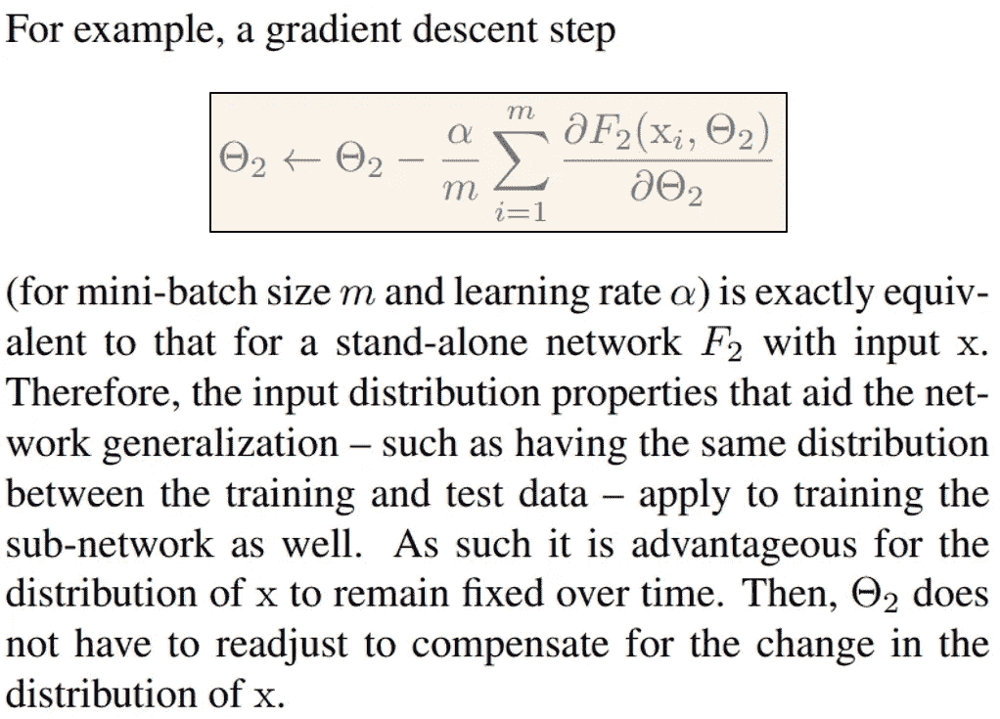
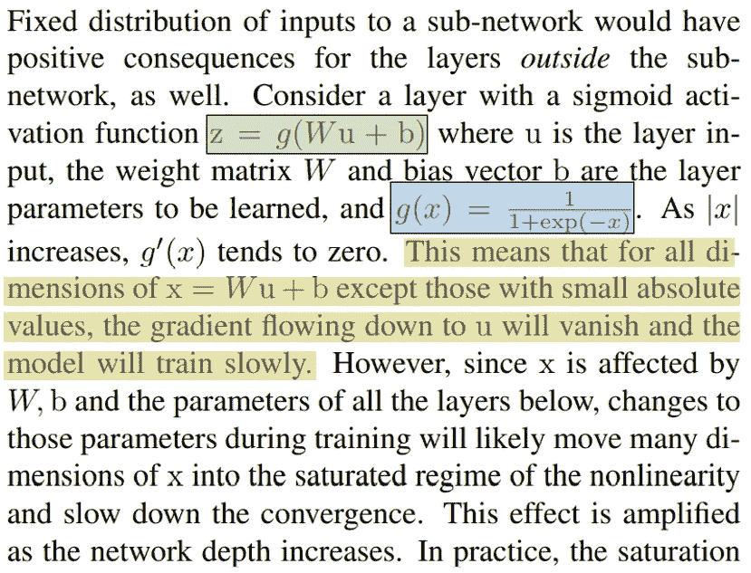
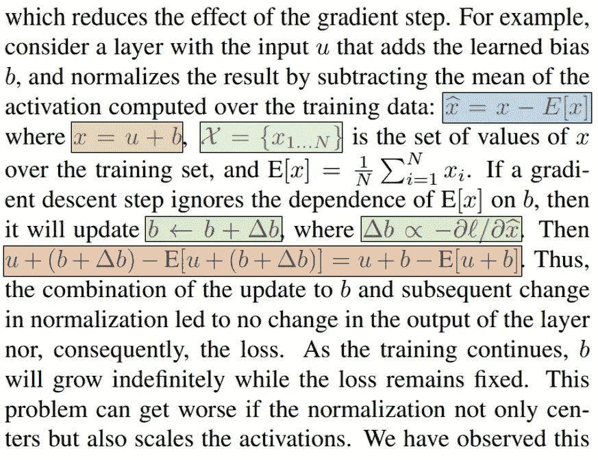
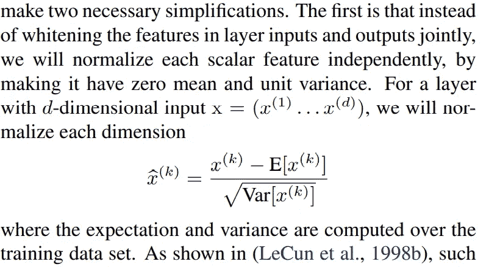

# 终于可以开始理解机器学习论文了

> 原文：<https://towardsdatascience.com/finally-you-can-start-understanding-machine-learning-papers-85183fe6734f?source=collection_archive---------38----------------------->

[Pixabay](https://pixabay.com/photos/laptop-computer-browser-research-2562325/)

## 示例、提示、注释和解释

你上一次打开机器学习论文，看到大量术语和数学，然后决定不打开它是什么时候？我怀疑很多人都有过这样的经历，包括我自己。

数据科学变得越来越容易为所有人所掌握。然而，随之而来的是负面影响——许多通过在线资源学习机器学习的人可能不熟悉阅读深入描述他们日常工作方法的技术论文。这篇文章的目标是给那些以前觉得机器学习论文不适合他们的人一个演示，如果用正确的工具和心态武装起来，他们可以变得多么容易。

当然，一篇文章不足以充实大学课程和学习的时间，从而对机器学习背后的复杂数学有一个坚实的理解。然而，希望它能够在阅读原始机器学习论文突破时给予更大的理解和信心。再多的谷歌搜索或在线资源也无法击败原始论文。

我们将浏览最初的批量标准化论文，许多人认为这是机器学习中最大的突破之一。这篇论文虽然充满了数学，但并不过分技术化、易懂和直观。沿着这条路，本文将提供细目分类、提示、注释和词汇表。记得先读报纸上的剪报。

批处理规范化论文的作者立即开始初始化变量。

*提示*:众所周知，机器学习论文创造了许多变量，并期望读者在以后引用它们时知道它们的意思。拿一支荧光笔，在变量“初始化”的地方和以后使用的地方突出显示。这将使阅读变得容易得多。

作者提出了随机梯度下降的公式，初始化几个变量，如参数和训练样本集中的最大数量。

> glossay:*“arg min*f(x)*指的是最小化以下函数的自变量或输入，在本例中为* f *(* x *)。*

用英语来说，该语句是这样的:“网络的参数θ等于[由函数*l*概括的所有值的平均值]最小化的值，该函数接受单个训练点和当前参数。”这是神经网络目标的数学上的严格定义。仅仅为了严谨起见，数学方程通常被写得比实际更复杂。写出方程式在人类语言中的含义是很有帮助的。

作者指出，使用 SGD，训练分步骤进行，概述了代表每个“小批量”大小的附加变量 *m* 。通过使用小批量而不是一次一个示例，损失的梯度是对整个集合的梯度的更好估计。

突出显示的语句为“训练小批量中所有值 *i* 的[损失函数的变化，其包括当前训练示例和参数，相对于参数]”的平均值。这是“梯度”的定义，它计算损失函数的误差范围，以提供关于应该如何更新参数的见解。使用[分数][sigma]几乎总是一种复杂的方式来表示平均值。

> 术语表: *∂被普遍用来表示偏导数，或者一个函数中两个或更多变量的变化。简单来说，导数可以被认为是“一个变量对另一个变量的影响的微小变化。”*

虽然 SGD 由于各种原因而工作良好，但作者写道，一层输入分布的变化会给下面的层带来困难，因为它们需要适应变化的分布，这种现象被他们称为协变量移位。

虽然传统上这是通过域适配来处理的，但是作者认为该思想可以扩展到子网或层。

第一个突出显示的语句是“损失等于对[一个参数]的任意变换和对(另一个参数和一个输入 *u* )]的任意变换”。在这份声明中，作者正在建立一个假设的网络来支持他们的想法。作者简化了初始语句，用 *x* 替换一个组件来表示前一个函数的输入。θ[1]和θ[2]是为了使损耗 *l* 最小而学习的参数。这些前提等同于一个完整的神经网络，只是以较小的规模构建。

突出显示的方程演示了梯度下降背后的机制，它通过计算偏导数来计算梯度，进度由学习速率决定。该变化可以是正的或负的，从参数θ[2]中减去，并且旨在将参数导向最小化损耗/ *F2* 的方向。

作者写道，这个梯度下降步骤对于输入为 *x* 的单个网络 *F2* 是相同的，以建立真实神经网络和假设神经网络之间比较的合法性。因为 itθ[2]不需要重新调整来补偿 *x* 的分布变化，所以保持 *x* 的分布固定一定是有利的。

> 注:*这是机器学习论文中常见的主题。因为机器学习涉及的系统比其他领域涉及的变量多得多，也复杂得多，所以它的论文通常会遵循三个步骤来展示论文是如何工作的:*
> 
> *1。创建一个假设的简单系统。
> 2。建立它与真实神经网络之间的相同性质。
> 3。通过对简单系统进行运算得出结论。*
> 
> *当然，在更现代的论文中，我们会看到一个完全致力于显示准确性的部分，以及该方法如何在各种常见的基准数据集(如 ImageNet)上工作，并与其他方法进行比较。*

此外，作者写道，固定的输入分布对整个网络的输入都是有益的。他们提出了标准方程
*z = g(Wu + b)* ，其中 *W* 代表权重， *b* 代表偏差。 *g(x)* 被定义为 sigmoid 函数。作者指出，随着 *x* 与 0 的距离增加，其导数——或梯度——越来越接近 0。

因为导数在极值 *x* 处倾斜，当分布移动时，由于 sigmoid 函数的性质，给出的信息(梯度)较少。

> 术语表:g'(x) *是* g(x) *的导数的另一种表示法。*

因此，作者得出结论，梯度传播的有用信息在到达网络后部时会慢慢消失，因为分布的变化会导致信息的累积衰减。这也被称为消失梯度问题。(它的反面，爆发式梯度问题，是海量梯度导致权重剧烈波动，导致学习不稳定。)

作为解决这一问题的一个建议，他们考虑了一个向输入添加可学习偏差的层，然后将结果标准化。如果由偏差引起的归一化变化被忽略(偏差的梯度被独立计算和更新)，更新 *b* 和归一化的相应变化的组合在输出层中没有产生变化。

> 词汇表:E[x] *常用来表示* x *的均值，其中“* E *”表示“期望值”。这将在后面用正式的求和定义来定义。∧**表示“正比于”——*b*中的 delta(变化)正比于标准的梯度下降公式。*

这在数学上得到了证明——由于 *x* [hat]等于*x*—*E*[*x*]*x*等于 *u + b* ，这些语句组合起来就形成了*u*+*b*—*E*[*u+b*。而对 *b* 的变化，用δ*b*表示，相互抵消，等于本身没有任何变化。因此， *b* 将由于故障梯度而无限增长，而损耗保持固定。

> 提示:*往往论文会设置各种语句，突然组合在一起。作者如何得出结论可能令人费解；试着找出各种相关的方程式，看看它们是如何组合在一起的。然而，更重要的是，理解这个等式意味着什么。*

出于这些考虑，作者稍微调整了他们的批量归一化公式，以独立地归一化每个标量特征，每个特征都具有零均值和单位方差。通过消除不必要的偏差，该层将所有输入转换为正态分布的输出。

批处理标准化文档中还有很多内容需要阅读和理解。但是，请注意，这些作者得出的结论已被证明存在轻微缺陷，具体来说，内部协变量变化是批处理规范化如此有效的原因。

# 现在你有了工具…

你已经准备好接受其他机器学习论文了！看看这些伟大的原创论文:

[批量归一化论文](http://proceedings.mlr.press/v37/ioffe15.pdf)，[辍学论文](http://jmlr.org/papers/volume15/srivastava14a/srivastava14a.pdf)，[用于图像识别的深度残差学习](https://www.cv-foundation.org/openaccess/content_cvpr_2016/papers/He_Deep_Residual_Learning_CVPR_2016_paper.pdf)，[利用卷积神经网络进行大规模视频分类](https://www.cv-foundation.org/openaccess/content_cvpr_2014/papers/Karpathy_Large-scale_Video_Classification_2014_CVPR_paper.pdf)，[生成式对抗网络](http://datascienceassn.org/sites/default/files/Generative%20Adversarial%20Nets.pdf)。

如果您有兴趣了解更多关于批处理规范化的知识，以及它如此有效的真正原因(不是因为内部协变量的变化)，请查看这篇文章:

 [## 批量规范化:深度学习的最大突破

### 它是如何工作的——又是如何如此有效的？

medium.com](https://medium.com/analytics-vidhya/batch-normalization-the-greatest-breakthrough-in-deep-learning-77e64909d81d)