# 财务独立——用 Python 模拟 ODEs

> 原文：<https://towardsdatascience.com/financial-independence-simulating-odes-with-python-c9b5468dbe74?source=collection_archive---------72----------------------->


作者试图战胜地心引力。波兰 2015。

## 使用 Python 来设置你的路径。

# 介绍

想象一下，有一天你醒来，你知道你可以在余生中自由地做任何你想做的事情…而且…钱不再是问题。你变得真正经济独立*并且你不再需要工作来保证来年的收入。听起来有吸引力吗？*

*虽然听起来可能如此，但实现这一目标的道路肯定不容易(不像 Youtube 广告所说的那样)。在处理你的财务问题时，有许多因素需要考虑，而推理往往被复杂性所掩盖。*

*在本文中，我们将从数学和程序上解决这个问题。*

*我们将使用一组*常微分方程* (ODEs)来为你的钱包建模，稍后我们将使用`scipy`库和 Python 来*求解*。在每个阶段，我们将尝试**将数学公式与 python 代码**联系起来，并解释其背后的推理。*

*目标是使模型具有可解释性和可扩展性。我们将一步一步地创建它，希望这能让我们对底层数学和代码有更直观的理解。作为参考，请看看下面的笔记本:[这里](https://github.com/OlegZero13/Data-Science-Algorithm-Gallery/blob/master/Personal_Financial_Simulator_with_ODE.ipynb)。*

## *放弃*

*在我们进入等式之前，我们想强调的是，这篇文章在任何情况下都不应该被视为财务建议。这篇文章的作者有物理学而不是金融的背景，所以也请原谅使用的词汇中任何可能的不一致。*

# *问题陈述*

*看钱包有两种方法。*

*一种方法是看看在任何给定的时间点 *t* 你**有** *x(t)* 多少钱。另一种方法是看它**如何随时间变化**。知道初始量 *x₀ = x(0)* 以及一阶导数 *dx/dt* ，你就可以预测未来的情况。*

*因为在我们看来，为导数制定方程是一个简单得多的过程，我们将倾向于这种方法，而不是直接寻找 *x(t)* 。毕竟，一旦我们有了 *dx/dt* 的完整表达式， *x(t)* 就可以通过数值积分 *dx/dt* 得到:*

*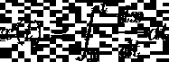*

*前提是我们知道 x₀。*

# *简单模型*

## *你朝九晚五地工作…*

*让我们从一个简单的例子开始，你有一份工作。您现在还没有投资，您的年度余额由以下三个因素决定:*

*   *你的年收入是多少？*
*   *你所有的花费……一切:食物、房租、汽车、饮料，无论什么，*
*   *你为你的收入缴纳的税。*

*如果没有其他因素起作用，你的*收益*(或*损失* ) —你变富或变穷的比率是:*

*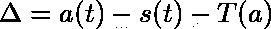*

*因此，我们可以设定*

*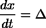*

*如果 *a，s* 和 *T* 是常数，那么这个等式实际上非常简单，我们可以解析地求解它:*

*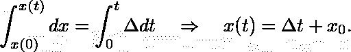*

*这是一条直线，但是因为我们只是设置了逐渐增加复杂性的路径，所以让我们用 python 来做。*

```
*import numpy as np
import pandas as pd
from scipy.integrate import odeint

class Life:
    def __init__(self):
        self.income = 10000  # gold pcs. per month
        self.spending = 5000 # gold pcs. per month
        self.tax_rate = 0.19 # example

    def earn(self, t):
        return 12 * self.income

    def spend(self, t):
        return 12 * self.spending

    def pay_taxes(self, t):
        return self.earn(t) * self.tax_rate

def live_without_investing(x, t, you):
    return you.earn(t) - you.spend(t) - you.pay_taxes(t)*
```

*这里，`Life`是类，我们将使用它的方法来定义分数贡献。虽然其形式纯粹是为了方便起见，但将贡献的定义分开是有意义的，因为它们本身会变得复杂(例如累进税)。*

*`live_without_investing(...)`函数是我们的衍生物，因此，它有一个精确定义的接口`func(x, t, **args)`。*

*为了执行集成，我们可以使用来自 [scipy](https://docs.scipy.org/doc/scipy/reference/generated/scipy.integrate.odeint.html) 的`odeint`。*

```
*def simulate(you):
    t = np.linspace(0, 100, num=101)
    x = odeint(live_without_investing, 0, t, args=(you,))
    return pd.DataFrame({'time': t, 'wallet (non-investor)': x})

you = Life()
df = simulate(you)*
```

*这里，我们定义了 100 年的时间线，粒度为 1，并将其作为第三个参数传递给`odeint`。作为第二个参数传递的零代表 *x₀ = 0* 这是我们的初始条件。第四个(可选的)参数允许我们向函数传递额外的参数，我们刚刚通过传递`you` object 做到了这一点。*

# *生活的不连续性*

*很难想象你五岁的时候就已经在交税了。同样，过了某个年龄，你可能会想收获你工作的成果。*

*为了将这些关键变化融入你的生活，我们将把它分成三个阶段:*

*   **童年*——你完全依赖父母，因此 *x(t) = 0* 。*
*   *积极的生活——你挣钱，你消费，你纳税。*
*   **退休* —你的收入被低于收入的养老金取代，你的支出故意保持在同一水平，但税收被认为已经缴纳。*

*同时，我们引入了另外两个参数:`you.starting_age`和`you.retirement_age`作为你在上述阶段之间转换的年龄。*

*对于我们的数学模型，这种转变意味着存在两个点 *t₁* 和 *t₂* ，在这两个点 *dx/dt* 是不连续的。为了正确计算 *x(t)* ，我们需要*对你一生中的 *dx/dt* 进行分段积分，从摇篮到坟墓。**

*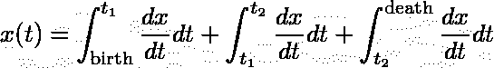*

*对于我们的代码，我们以下列方式修改模型:*

```
*class Life:
    def __init__(self):
        ...  # as before
        self.pension = 1000
        self.starting_age = 18
        self.retirement_age = 67

    def earn(self, t):
        if t < self.starting_age:
            return 0
        elif self.starting_age <= t < self.retirement_age:
            return 12 * self.income
        else:
            return 12 * pension

    def spend(self, t):
        ...  # as before

    def pay_taxes(self, t):
        ...  # as before

def life_without_investing(x, y, you):
    ...  # as before*
```

*然后，模拟变成:*

```
*def simulate(you):
    t0 = np.linespace(0, you.starting_age - 1, num=you.starting_age)
    t1 = np.linespace(you.starting_age, you.retirement_age - 1, num=(you.retirement_age - you.starting_age))
    t2 = np.linespace(you.retirement_age, 100, num=(100 - you.retirement_age))

    x0 = np.zeros((t0.shape[0], 1))
    x1 = odeint(live_without_investing, 0, t1, args=(you,))
    x2 = odeint(live_without_investing, x1[-1], t2, args=(you,))

    df0 = pd.DataFrame({'time': t0, 'wallet (non-investor)': x0})
    df1 = pd.DataFrame({'time': t1, 'wallet (non-investor)': x1})
    df2 = pd.DataFrame({'time': t2, 'wallet (non-investor)': x2})
    return pd.concat([df0, df1, df2])*
```

*注意，我们还将 *x(tₙ)* 作为初始条件输入到下一个积分中。虽然 *dx/dt* 是不连续的，但是 *x(t)* 就不能这么说了！*

*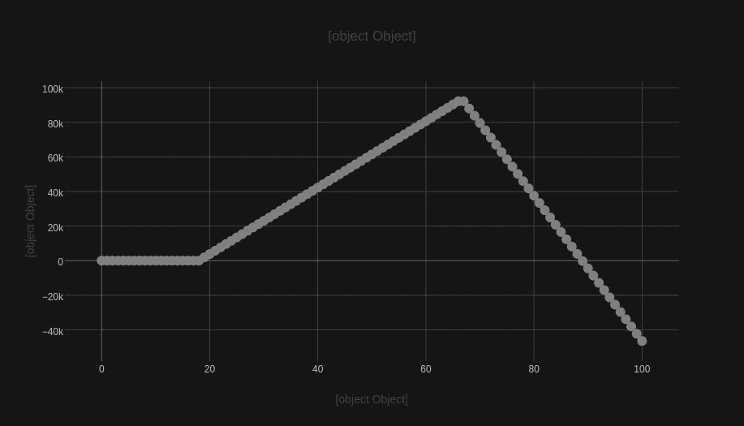*

*图一。示例“使用起始年龄=18 岁”，“退休年龄= 67 岁”，收入= 1000，成本= 650，税率= 19%。注意到一旦过了退休年龄，养老金就不能补偿支出，从而导致债务。*

# *添加非线性*

*到目前为止，我们假设钱包每年的增长是一个常数函数*δ= a—s—T(a)*，*δ≠δ(T)*。你可能会获得一些年度加薪或增加你的支出。也有可能你想把税率本身建模成一个依赖于时间的函数。*

*假设你的收入现在是时间的线性函数 a(t)=α₀+α₁t(T25)，这里是你的预期基本收入(平均值)，是额外的“黄金个人电脑”数量你每年都会收到。类似地，支出也可以用 s(t)=σ₀+σ₁t(t27)的形式表示，σ₀是平均每月支出，是你未来将要支出的额外金额——一种“生活水平的通胀”。*

*现在，我们的导数与时间成正比 *dx/dt ∝ t* ，因此我们可以期望是二次的 *x(t) ∝ t* 。*

*同样，以编程方式:*

```
*class Life:
    def __init__(self):
        ...  # as before
        self.pay_raise = 100
        self.life_inflation = 50

    def earn(self, t):
            ...  # as before
        elif self.starting_age <= t < self.retirement_age:
            return 12 * (self.income + self.pay_raise \
                      * (t - self.starting_age))
        else:
            ...  # as before

    def spend(self, t):
        ...  # as before
        return 12 * (self.costs + self.life_inflation \
                  * (t - self.starting_age))*
```

*集成保持不变，但它带来了一个新的结果。*

*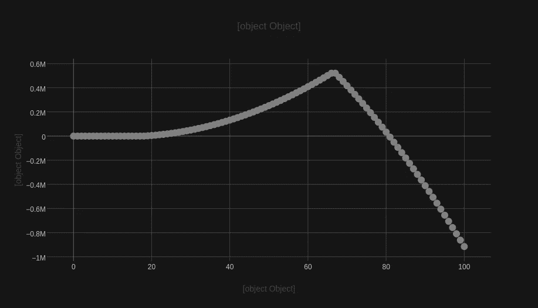*

*图二。使用附加参数的示例:` pay _ raise = 100 `,` life _ inflation = 50`。观察两条曲线的抛物线形状。*

# *投资*

*如果你按照计算，你可能已经试图根据与你更相关的数字来预测你的财务状况。你可能已经注意到，即使你选择不提高自己的生活水平，平均工资的高增长也不能保证提前或安全退休。*

*从数学上来说，你可以自由构建任何你想要的“加薪”条款(例如 *a(t) ∝ t* 或 *a(t) ∝ t* )，但你可能很难证明它们的实际来源。况且这样的条款只能给你的钱包*多项式*的增长，说实话，还没有它能得到的那么快。*

*在这个阶段，你们中的一些人可能已经回忆起了*复利*的公式:*

*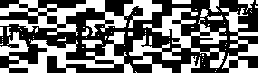*

*其中 FV 代表*未来值*，PV 为*现值*(通常称为*本金*)， *R* 为*利率*， *t* 为时间步长(年) *n* 为每年利息资本化的次数。在我们的例子中，为了简单起见，FV *≡ x(t)* 、PV *≡ x₀* 和 *n = 1* 。*

*公式本身可以有两种不同的理解方式。一种方式是理解它作为随后应用某个函数 *f: x → x ⋅ (1 + R)* 的结果，该函数将输入乘以某个因子 *(1 + R)* :*

*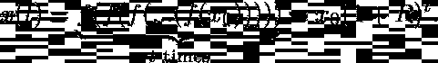*

*另一种方法是把它想成下面导数的一个主要函数:*

*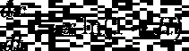*

*上面的等式不是别的，只是一个例子，其中一个函数**与其自身的增长**成比例，我们可以通过重新排列各项并积分来确认这一点:*

*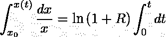**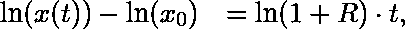**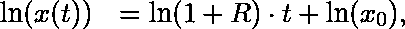**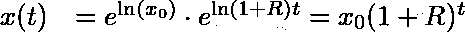*

# *包括对模型的投资*

*这就是有趣的地方。在实践中，我们更感兴趣的是为投资持续提供资金，而不是投资一些 x₀作为一次性机会。此外，要了解整体情况，重要的是我们仍然要考虑本文前面提到的影响因素。*

*由于表达式可能会很快变得错综复杂，导数方法似乎是一种更简单、更优雅的表述问题的方式。我们要做的就是不断增加不同的贡献，然后积分方程。*

*为了更直观，现在让我们定义两个 *x* 。让 *x₁* 做原钱包，而 *x₂* 做投资桶。换句话说，你可以将 *x₁* 视为你的主要银行账户，在那里你领取工资、支付账单和纳税，但现在你也可以选择将剩余的部分 *β ∈ [0，1]* 转移到 *x₂* 。然后，你用这些钱购买股票、债券、商品、房地产等。无论你做什么，你都在继续**(再)投资***x₂，假设一些预期利率 *R* 并倍增你的钱。**

**在这种情况下，初始方程变成两个*耦合的常微分方程*的系统:**

**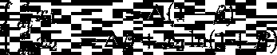**

**为了说明新的情况，让我们更新代码:**

```
**class Life:
    def __init__(self):
        ...  # as before
        self.investment_fraction = 0.75  # beta
        self.interest_rate = 5  # 5%

    ...  # as before

def live_with_investing(x, t, you):
    balance = you.earn(t) - you.spend(t) - you.pay_taxes(t)
    if t < self.retirement_age:
        x1 = balance * (1 - you.investment_fraction)
        x2 = np.log(1 + 0.01 * you.interest_rate) * x[1] \
           + balance * you.investment_fraction
    else:
        x1 = balance
        x2 = 0
    return [x1, x2]**
```

**这个实现与我们刚刚讨论的方程组有一点不同。在这里，为了清楚起见，我们假设你退休的决定相当于从 *x₂* 取出你所有的钱，并把它提供给 *x₁* 。换句话说，在我们的模拟中，我们想要检查你可以用所有积累和产生的资本支持自己多久。**

**因此，`simulate`函数也得到更新:**

```
**def simulate(you):
    ...  # t0, t1, t2 - as before

    # non-investor
    x1_0 = np.zeros((t0.shape[0], 1))
    x1_1 = odeint(live_without_investing, 0, t1, args=(you,))
    x1_2 = odeint(live_without_investing, x1_1[-1], t2, args=(you,))

    # investor
    x2_0 = np.zeros((t0.shape[0], 2))
    x2_1 = odeint(live_with_investing, [0, 0], t1, args=(you,))
    x2_2 = odeint(live_with_investing, [x2_1[-1].sum(), 0], t2, args=(you,))

    df0 = pd.DataFrame({'time': t0, 'wallet (non-investor)': x1_0[:, 0], 'wallet (investor)': x2_0[:, 0], 'investment bucket (investor)': x2_0[:, 1]})
    df1 = pd.DataFrame({'time': t1, 'wallet (non-investor)': x1_1[:, 0], 'wallet (investor)': x2_1[:, 0], 'investment bucket (investor)': x2_1[:, 1]})
    df2 = pd.DataFrame({'time': t2, 'wallet (non-investor)': x1_2[:, 0], 'wallet (investor)': x2_2[:, 0], 'investment bucket (investor)': x2_2[:, 1]})
    return pd.concat([df0, df1, df2])**
```

**观察第 12 行。这就是我们为第三个积分 *x₁(t₂) + x₂(t₂) → x₁(t₂)* 设置新的初始条件的地方。**

**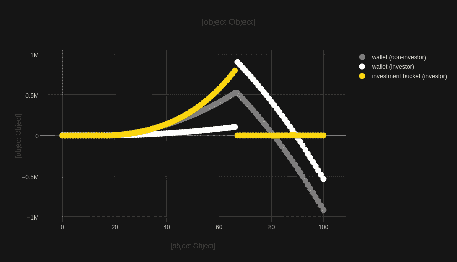**

**图 3。“投资分数= 0.8”和“利率= 3.3%”的示例。观察一下，即使利率如此之低，你也能为自己争取近十年的时间，或者相反，你的提前退休变得更容易实现。**

# **通货膨胀——你的敌人**

**我们刚刚看到了指数增长的威力。不幸的是，不管你是否选择投资，有一个因素几乎肯定存在，它也具有指数性质，但对你不利。这是**通货膨胀**。**

**简单来说，通货膨胀不是物价的整体上涨，而是货币随着时间的推移而贬值。比方说，50%的通货膨胀率将导致同样的钞票只有其早期购买力的 2/3。因此，为了在我们的模型中考虑通货膨胀，而不是保持货币的名义价值，而是以某种方式想象价格上涨，我们宁愿将 is 建模为负利率——一种吞噬你的钱的复利。**

**利用我们以前的知识，并把通货膨胀率表示为ξ，我们只需要稍微修改一下方程组:**

**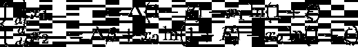**

**现在，注意乘以 *x₂* 的项。利用对数的性质，我们可以只用一个常数来表示这两个值，**

**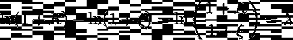**

**现在很容易发现，只有当我们战胜通货膨胀时，我们才能从投资中获利。自然，对于“钱包”，我们的数字永远是 *λ < 0* ，因为没有 *R* 来“拉起来”。这又是一个原因，为什么“努力工作，努力储蓄”是一个完全没有希望的想法。**

**“代码方式”:**

```
**def live_without_investing(x, t, you):
    balance = you.earn(t) - you.spend(t) - you.pay_taxes(t)
    return balance - np.log(1 + 0.01*you.inflation_proc) * x

def live_with_investing(x, t, you):
    balance = you.earn(t) - you.spend(t) - you.pay_taxes(t)
    if t < you.retirement_age:
        x1 = balance * (1 - you.investment_fraction)
        x2 = np.log(1 + 0.01*you.interest_rate_proc) * x[1] \
           + you.investment_fraction * balance

        x1 -= np.log(1 + 0.01*you.inflation_proc) * x[0]
        x2 -= x2 - np.log(1 + 0.01*you.inflation_proc) * x[1]
    else:
        x0 = balance
        x1 -= np.log(1 + 0.01*you.inflation_proc) * x[0]
        x2 = 0
    return [x0, x1]**
```

**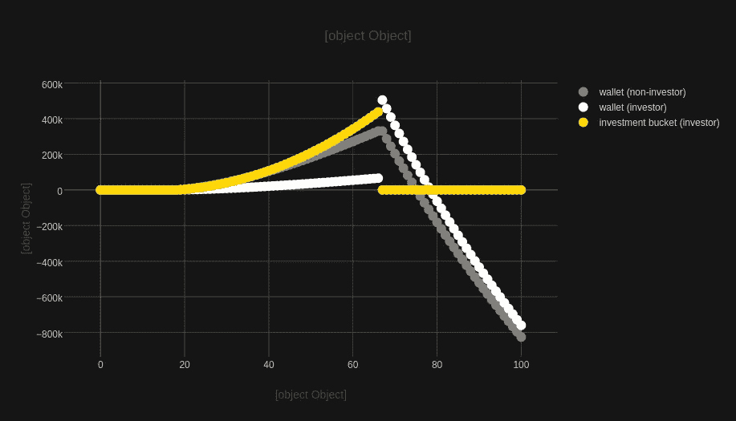**

**图 4。前面的例子中，“通货膨胀率”设置为 3.0%，而“利率”设置为 3.3%。**

# **结论**

**在本文中，我们展示了如何使用常微分方程对财务状况建模，以及如何使用 python 将它们转化为模拟器。**

**这里讨论的案例没有考虑很多因素。一些因素，如你所在国家的税法，突然的遗产继承，或者由于意外的金融危机导致的通货膨胀，无疑增加了复杂性。此外，我们在这里没有提到贷款或债务，尽管使用刚才介绍的方法，我们确信您能够将它们包含在您的模型中——而这正是本文的目标。**

**最后，关键在于，特别是对于那些对编码不感兴趣的人，记住那些增长与其价值成正比的函数正是你想要使用并为你所用的机器。**

**也可以在 Google Colab: [这里](https://github.com/OlegZero13/Data-Science-Algorithm-Gallery/blob/master/Personal_Financial_Simulator_with_ODE.ipynb)找到可以运行的笔记本。您可以随意克隆它、修改它，并随意使用它。让我知道你的想法。**

# **还会有更多…**

**我计划把文章带到下一个层次，并提供简短的视频教程。**

**如果您想了解关于视频和未来文章的更新，**订阅我的** [**简讯**](https://landing.mailerlite.com/webforms/landing/j5y2q1) **。你也可以通过填写[表格](https://forms.gle/bNpf9aqZJGLgaU589)让我知道你的期望。回头见！****

***原载于*[*https://zerowithdot.com*](https://zerowithdot.com/financial-independence-ode-python/)*。***