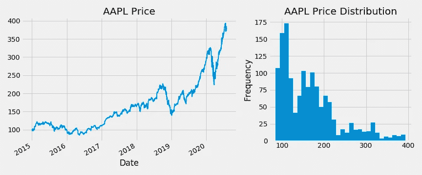
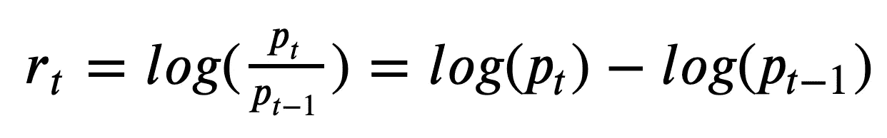
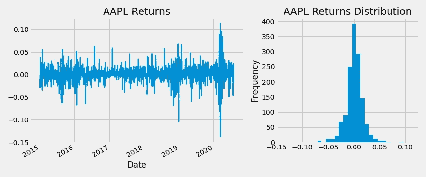
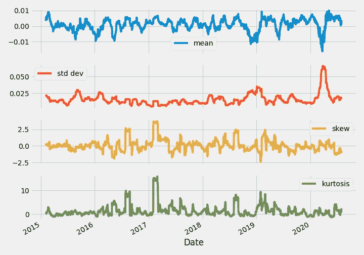
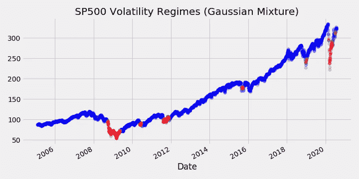

# 金融信号处理—第一部分

> 原文：<https://towardsdatascience.com/financial-signal-processing-part-1-69c20fd5ad6d?source=collection_archive---------7----------------------->

## 为统计分析和机器学习处理财务数据

算法交易很难。你不能只是把一打技术分析信号塞进一个神经网络，就指望下个月成为百万富翁。这是因为处理财务数据都是关于细节的。抛开初学者可能犯的所有潜在偏见和错误，大多数金融机器学习和算法交易项目都失败了，因为他们忽略了金融环境中的微妙假设。

为此，今天我将回顾并讨论金融信号处理的基本原理。我将研究金融数据的各种属性，何时以及如何以特定的方式处理它们，以及如何通过机器学习技术来分析它们。

([你可以在这里找到完整的代码和其他资源](https://www.yaoleixu.com/quant-finance)

# 1.对平稳性的需求

> 大多数机器学习技术都假设数据是平稳的。然而，在金融中很少发现平稳性，这会导致几个问题。

在深入研究金融信号之前，提到平稳性的概念很重要，因为它是大多数现代机器学习技术背后的基本假设。

## 1.1.什么是平稳性

抛开严格的数学定义，平稳性意味着基础信号的统计数据(例如均值和方差)在一段时间内是恒定的。

例如，考虑涉及猫和狗的分类的最大似然问题，其中动物的潜在生物学不会每天都发生巨大的变化。生物特征的平稳性允许 ML 模型挑选将随时间保持真实的模式，这允许模型在样本外很好地概括。

## 1.1.金融中的平稳性和潜在问题

然而，在金融领域，稳定性是一个大问题。例如，考虑下图中苹果的价格信号。不需要严格的统计测试就能看出平均价格不会随着时间的推移而保持不变。



作者图片

考虑一个具有上述数据的训练-测试拆分框架，其中 2019 年之前的价格信号用于训练，其余用于测试。如果有人天真地将价格范围从[100，400]扩大到[0，1]，就会导致 ***前瞻偏差*** (测试集信息泄露给训练集)。这将导致不切实际的更好的性能，因为 ML 模型通过缩放隐含地知道将来的最高价格。

直觉上，如果你在 2019 年实施这种 ML 模型，你不可能知道 AAPL 的价格在 2020 年最终会达到 400 英镑左右(如果你知道，你首先就不需要 ML)。

如果我们使用训练集来调整价格范围会怎么样？将价格范围从[100，250]缩放到[0，1]将不会导致前瞻偏差，但是测试集中所有大于 250 的价格都将被缩放到大于 1。这对于需要特征在某个比例范围内的 ML 模型来说尤其成问题，例如神经网络。

更好的解决方案是通过对数差分来处理上述信号，如下所述。

# 2.对数差分和对数回归

> 对价格数据进行差分可以生成适用于机器学习技术的平稳信号，这通常比原始价格信号更好。

## 2.1.日志返回的属性

对数差分计算在时间 ***t-1*** 和 ***t*** 的对数值之间的差值，这通常也称为对数回归，如下所示。



通过对数收益处理的价格信号有许多优点:(1)它使原始信号变得平稳，如下图所示。通过简单的观察，我们可以看到新信号有一个大约为 0 的恒定平均值，以及一个更恒定的方差。(2)对数收益比价格数据更趋于正态分布，这对于依赖于正态假设的经典统计模型来说是很好的。(3)对数回归是时间累加的，这允许我们通过简单的加法计算回测(参见[文章，此处](/backtest-trading-strategies-with-pandas-vectorized-backtesting-26001b0ba3a5)有更详细的解释)。



作者图片

## **2.2。何时不使用日志返回**

log-return 的主要缺点是它删除了存储部分，这破坏了定价信息。在大多数应用程序中，这通常不是问题。例如，投资组合优化、动量策略、均值回归策略等方面的大量量化金融文献。依靠多少资产价格一起变化。因此，对数收益的比较比价格的比较更有意义。

然而，对于大宗商品期货等其他金融工具，确切的价格可能会对依赖这些大宗商品的行业产生现实影响。因此，在这种情况下，定价信息可能比对数收益更有意义。

最后，在对数收益的计算中可能有一些额外的微妙之处，可以通过基于体积的采样和分数差分进行调整。这些技术将在以后的文章中讨论。

# 3.处理日志-返回

> R 对数收益的滚动统计可以通过机器学习方法进行处理，从而提供市场洞察力。

## 3.1.滚动统计

如前所述，对数收益往往遵循更好的分布。对于短期窗口，通常需要分析与该分布相关的不同统计数据，如均值、标准差、偏斜度和峰度，这些数据也趋于稳定。

在 Python 中，这些可以通过 pandas 中的滚动函数轻松计算:

```
w = 22 # number of trading days in a months1 = rs.rolling(w).mean() # moving average
s2 = rs.rolling(w).std() # moving standard deviation
s3 = rs.rolling(w).skew() # moving skewness
s4 = rs.rolling(w).kurt() # moving kurtosissignals = pd.concat([s1, s2, s3, s4], axis=1)
signals.columns = ['mean', 'std dev', 'skew', 'kurtosis']
signals.plot(subplots=True, figsize=(10,7), legend=True);
```



作者图片

特别是，标准差的滚动计算在分析*市场波动*时非常有用。

## 3.1.波动性和市场机制

波动性在金融机器学习中有着特殊的作用。直观地说，波动性衡量市场中存在多少不确定性/运动/混乱。此外，它还可用于衡量市场中存在的“风险”量(尽管存在其他/更好的风险定义，如“敞口”)。

波动性的概念也与市场机制的概念紧密相连，市场机制可以用来识别不同的市场条件。例如，我们可以对 SP500 在不同时间的波动水平运行聚类算法:

```
from sklearn.mixture import GaussianMixturew = 22
vol = rs.rolling(w).std()
vol = vol.dropna()labels = GaussianMixture(2).fit_predict(vol.values.reshape(-1,1))prices = prices.reindex(vol.index)
prices[labels==0].plot(style='bo', alpha=0.2)
prices[labels==1].plot(style='ro', alpha=0.2)
plt.title('Volatility Regimes SPY')
```



作者图片

通过在观察到的波动水平上拟合高斯混合，ML 模型自动推断出看涨和看跌的市场机制。这是直观的，因为市场抛售往往是由恐慌性抛售决定驱动的，这可能导致大幅下跌，加剧市场混乱，导致更高的波动性。相比之下，牛市的特点是价值稳定增长，导致波动性降低。

识别市场机制对于金融机器学习尤其重要，因为在牛市中训练的模型不太可能在熊市中表现良好，反之亦然。

***来自《走向数据科学》编辑的提示:*** *虽然我们允许独立作者根据我们的* [*规则和指导方针*](/questions-96667b06af5) *发表文章，但我们不认可每个作者的贡献。你不应该在没有寻求专业建议的情况下依赖一个作者的作品。详见我们的* [*读者术语*](/readers-terms-b5d780a700a4) *。*

我希望你喜欢这篇文章！如果你想看更多这样的内容，请关注我。

此外，查看我的网站的完整代码和其他资源。