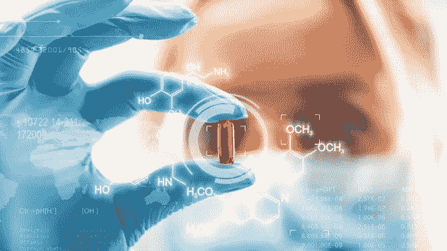
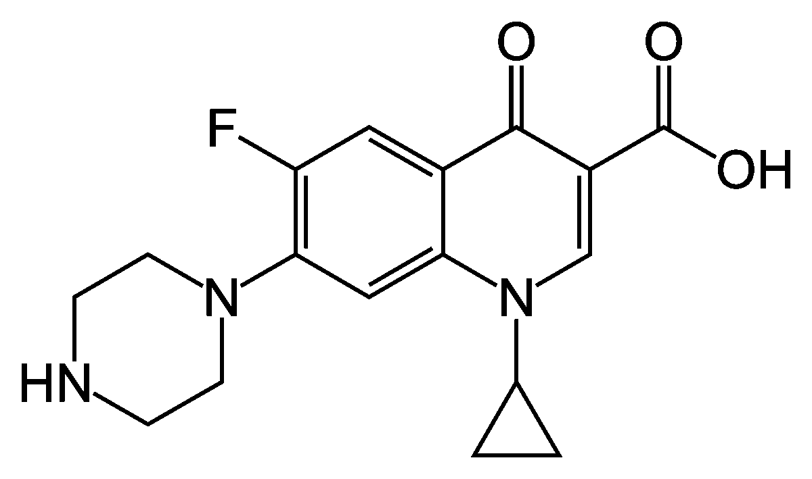

# 寻找并使用“分子”数据集

> 原文：<https://towardsdatascience.com/find-and-play-with-molecule-datasets-ef1116e4524f?source=collection_archive---------23----------------------->

## 分子数据集以及在哪里可以找到它们！

机器学习已经在各个领域普及。它有助于提高所有行业的工业流程效率，无论是物流还是国防。尽管制药公司采用机器学习的速度很慢，但他们肯定会迎头赶上。在这篇文章中，我谈到了一些标准数据集，数据科学家可以使用这些数据集开始工作，并为这个令人兴奋的制药和人工智能联盟做出贡献。



分子数据在哪里？来源

# 如何表示分子？

现在首先想到的问题，是如何把复杂的分子结构表示成*机器可以理解的*表示法？



环丙沙星抗生素[ [来源](https://upload.wikimedia.org/wikipedia/commons/thumb/7/7d/Ciprofloxacin.svg/1200px-Ciprofloxacin.svg.png)

在左边，你可以看到一种叫做`Ciprofloxacin`的流行药物的分子结构，它是一种抗生素。在其原始格式中，它不是机器可以理解的。那么解决办法是什么呢？简而言之，这个解决方案被称为**简化分子输入线输入系统**或 SMILES。

# 微笑？这是什么？

SMILES 是将化合物的分子结构指定为简单字符串表示的标准方法。上图中结构的字符串表示为**OC(= O)C1 = CN(c2cc 2)c3cc(n4cc NCC 4)c(F)cc3c 1 = O**。人们可以很容易地将这些字符串表示转换成 2D 图——这使得它成为用于 ML 模型和可视化目的的流行描述。也有其他方法来表示结构，但是 SMILES 更好，因为它更易于阅读，并且可以转换成其他表示类型，比如图形。

由于我是一名数据科学家，并且*没有*扎实的化学背景，我不会深入研究 SMILES 是如何工作的。但是你可以通过阅读 OPENSMILES 文档更深入的了解。

简而言之，这是一种真正的*表示结构的强大方式*，并且能够表示不同种类的原子、键、环，甚至复杂的概念，如分支和芳香性。

> 让我们深入了解开源数据集吧？我们走吧。👌👌


我知道你被这些信息吓到了，但是等等。[ [来源](https://media1.giphy.com/media/l0NwHXQy3kUSfFF60/giphy.gif)

# 数据集时间？

我将提到我使用过的三个主要的 SMILES 数据集，它们在计算化学社区中也非常流行。

**一)**[GDB](http://gdb.unibe.ch/downloads/)

GDB 数据集来自伯尔尼大学的 Raymond 研究小组。该数据集有两个变体:GDB 11 和 GDB 13。这两个数据集都包含本质上很小的化合物(就字符串表示的长度而言)。对于特征来说，它只是包含了弦，并不具有分子的任何其他性质。

GDB 11 号:包含大约 65k 个分子，大小为 122 MB。

**GDB 13** :包含大约 9.77 亿个分子，大小为 2.6 GB。这也是目前发表的最大的小分子数据集。

**b)**锌 

锌是商业上可获得的分子的数据集。它有超过 7.5 亿个分子，是研究和生物技术公司使用的标准集之一。除了微笑，它还保存了每个分子的其他信息，如其物理化学性质和商业销售相关信息。

托管数据集的网站还允许用户查询有趣的问题，如“有多少化合物已经用于临床试验？”并以其对查询的快速响应而闻名。它在机器学习社区中也非常受欢迎，在《药物发现》上发表了多篇研究论文，将锌作为基线数据集。

**c)**[**ChEMBL**](https://www.ebi.ac.uk/chembl/)

ChEMBL 数据集由欧洲生物信息学研究所开发，不仅为用户提供了关于微笑及其化学性质的信息，还提供了关于其活性和基因组的信息。作为数据集的一部分，它有超过 190 万种化合物。它拥有一系列具有类似药物特性的分子。

由于 ChEMBL 提供的功能数量非常广泛，它是这个领域中最全面的公共数据集之一。可以使用他们的网络界面或 ElasticSearch 来查询数据集。通过使用 ElasticSearch 进行查询，它为用户提供了更多的灵活性，使他们可以在数据集中选择所需的要素。

# 该实验了！

由于大多数机器学习社区使用 Python，我将谈论一个工具，它将帮助您使用 Python 处理上述数据集。

**库是**[**RDKit**](https://www.rdkit.org/docs/GettingStartedInPython.html)**，是一个开源的知名化学信息学库。用户可以使用`conda`安装`rdkit`包:**

```
conda install -c rdkit
```

**一旦安装了`rdkit`包，给定一个 SMILES 字符串，就可以将其转换为`rdkit.Chem.rdchem.Mol`对象，或者换句话说，可以将其转换为*分子对象*，用户可以对其调用方法以获得额外的功能:**

```
In [**1**]: **from** **rdkit** **import** Chem
In [**2**]: **from** **rdkit.Chem.Descriptors** **import** MolWt## Here Cc1ccccc1 is a SMILES string of a compound
In [**3**]: m = Chem.MolFromSmiles('Cc1ccccc1')In [**4**]: m
Out[**4**]: <rdkit.Chem.rdchem.Mol at 0x10cedf5d0>## Let's get the weight of these molecule (or string)
In [**6**]: MolWt(m)
Out[**6**]: 92.14099999999999
```

**这只是我们发现的一个特征，但使用 RDKit，我们可以发现其他特征，如字符串的*一键编码向量*(摩根指纹)*化学环总数*、*价电子数、*等。**

**现在，走出去，开始玩这些数据集。有数不清的机会——你可以潜在地开发治疗疾病的新药，或者预测一种化合物在某种情况下的活性。**

**我希望你觉得这篇文章有趣并且有用。如果你有，请分享。**

**此外，如果你觉得有重要的数据集或库，请在评论中随意提及！**

**💊💊💊💊💊💊💊💊💊谢谢大家！**