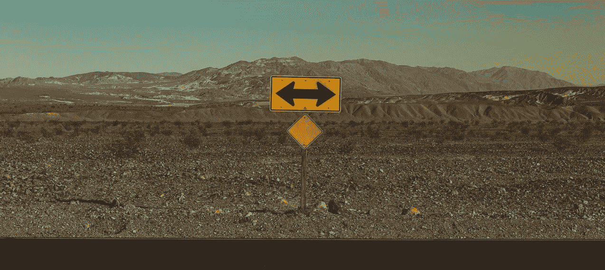
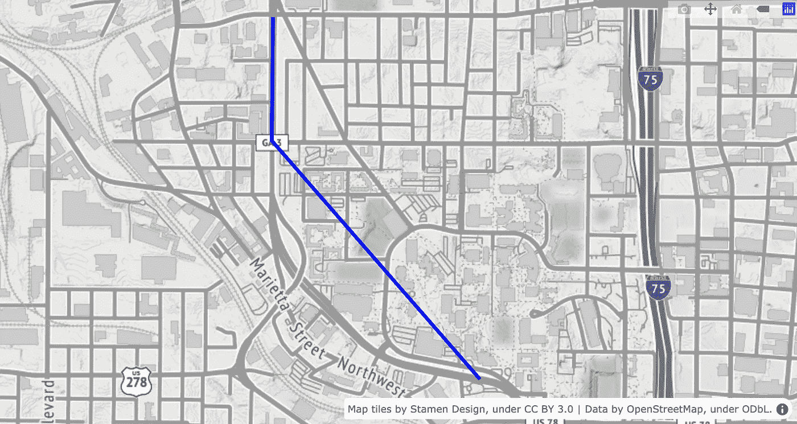
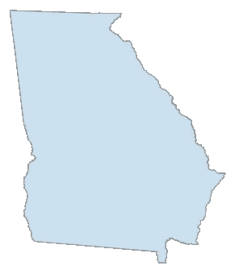
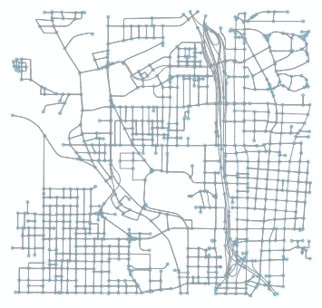
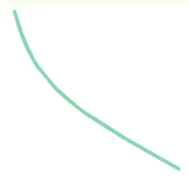
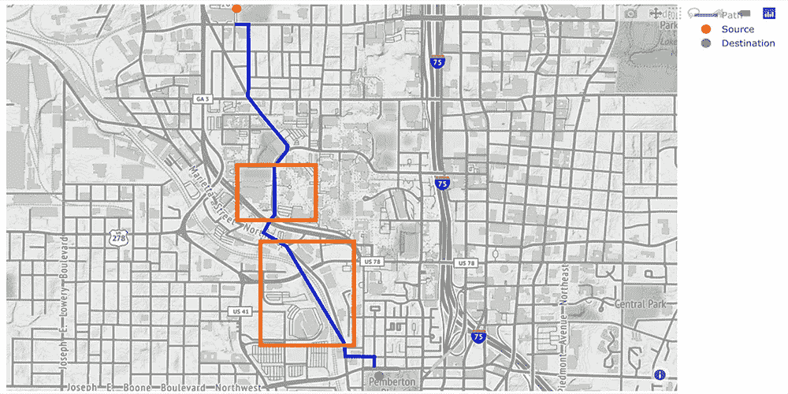
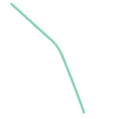
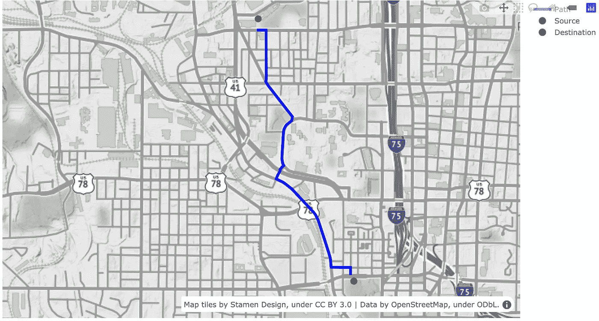

# 使用 Python 中的 OSM、Plotly 和 NetworkX 找到并绘制最佳路径

> 原文：<https://towardsdatascience.com/find-and-plot-your-optimal-path-using-plotly-and-networkx-in-python-17e75387b873?source=collection_archive---------9----------------------->

## 使用 **OpenStreetMap、** OSMnx & NetworkX 寻找最佳路径的指南，并使用 Python 中的 Plotly 绘制带有弯曲和曲线的详细路径。



来源:[像素](https://pixabay.com/users/pexels-2286921/)，通过[像素](https://pixabay.com/photos/arrows-barren-direction-road-1834859/)

使用 Google Maps API 可以使用许多库来绘制路径，但这会导致灵活性降低。同样，如果你用一组线条来画一条路径，在缺乏更好的词语的情况下，它看起来并不好。让我给你举个例子:



使用 Plotly 生成

此外，在许多情况下，您可能需要一些灵活性，不仅可以更改两点之间的所需路径(例如，您需要满足您的标准的路径，而不是 google maps 给出的最短或最快路径)，还可以更改您想要的绘图方式。

在这篇博客中，我试图解决这样一个问题，我们不仅可以找到最佳路径，还可以使用 Plotly 绘制它们。我们先从导入一些库开始。

```
import osmnx as ox
import networkx as nx
import plotly.graph_objects as go
import numpy as np
```

OSMnx 库有助于从 OpenStreetMap 检索、分析和可视化街道网络。你可以在这里阅读更多关于 OSMnx [的内容。为了演示，我将下载美国佐治亚州的州界，并使用 OSMnx 库绘制它。](https://github.com/gboeing/osmnx)

```
state = ox.gdf_from_place('Georgia, US') ox.plot_shape(ox.project_gdf(state))
```



使用 OSMnx 库生成的佐治亚州地图

现在让我们下载一张地图。这一次，我们将通过提供一个参数`network_type = 'drive'`来下载佐治亚理工学院周围地区的更详细地图。OSMnx 以图形对象的形式下载地图，可以很容易地被 NetworkX 库使用。

```
# Defining the map boundaries 
north, east, south, west = 33.798, -84.378, 33.763, -84.422  
# Downloading the map as a graph object 
G = ox.graph_from_bbox(north, south, east, west, network_type = 'drive')  
# Plotting the map graph 
ox.plot_graph(G)
```



显示使用 OSMnx 库生成的边(道路)和节点的道路网络图

在上图中，我们可以看到所有的节点(蓝色)和边(灰色)以精确的形状表示道路。让我们深入研究一下我们下载的图形对象，看看边和节点是什么样子的:

```
# Displaying the 3rd node 
list(G.nodes(data=True))[2]
```

(69128194，
{'y': 33.7692046，
'x': -84.390567，
'osmid': 69128194，
'ref': '249C '，
' highway ':' automobile _ junction ' })

上面的输出显示了节点 id `69128194`的信息及其 x 和 y 坐标、OSM id 和节点类型(交汇点)。同样，我们可以看到边缘的细节:

```
# Displaying the 1st edge
list(G.edges(data=True))[1]
```

(69259268，
69508853，
{'osmid': 9270483，
'名称':'林赛街西北'，
'公路':'住宅'，
'单向':False，
'长度':145.352，
'几何':))

这显示了连接节点`69259264`到`69290452`的边的细节，以及它的 OSM id、名称、类型、单向/双向、长度和一个有趣的 geometry.linestring 类型的元素。我们可以看到这个几何图形是什么样子。

```
# Displaying the shape of edge using the geometry list(G.edges(data=True))[1][2]['geometry']
```



边缘的几何形状

这说明边缘不是直线而是曲线路径。我们将在以后绘制这种类型的曲线边时使用这些信息。

现在我们将找到最佳路径。现在，让我们把目标定为找到最小长度的路径。这可以改变以满足任何标准，并将在一个单独的博客中讨论。在决定了起点和终点之后，首先，我们需要得到离这些位置最近的节点。这可以使用 OSMnx 的函数`get_nearest_node`来完成。

```
# define origin and desination locations 
origin_point = (33.787201, -84.405076) 
destination_point = (33.764135, -84.394980)# get the nearest nodes to the locations 
origin_node = ox.get_nearest_node(G, origin_point) 
destination_node = ox.get_nearest_node(G, destination_point)# printing the closest node id to origin and destination points origin_node, destination_node
```

(69425048, 2919090915)

现在，我们可以使用`NetworkX`库中的`shortest_path`函数，通过 Dijkstra 算法得到总长度最小的最优路径。注意，我们已经提供了`weight='length'`。这个函数返回路径中有序节点的列表。

```
# Finding the optimal path 
route = nx.shortest_path(G, origin_node, destination_node, weight = 'length') route
```

[69425048，
69425021，
69466983，
69466977，
。
。

让我们在地图上标出这些节点。为此，我们将使用 Plotly 库。我们将绘制所有这些节点，并用线将它们连接起来以表示一条路径。让我们看看它看起来怎么样。但是首先，让我们得到这些节点的坐标

```
# getting coordinates of the nodes# we will store the longitudes and latitudes in following list 
long = [] 
lat = []  
for i in route:
     point = G.nodes[i]
     long.append(point['x'])
     lat.append(point['y'])
```

我们将在地图上多次绘制路径，因此让我们为此定义一个函数:

```
def plot_path(lat, long, origin_point, destination_point):

    """
    Given a list of latitudes and longitudes, origin 
    and destination point, plots a path on a map

    Parameters
    ----------
    lat, long: list of latitudes and longitudes
    origin_point, destination_point: co-ordinates of origin
    and destination Returns
    -------
    Nothing. Only shows the map.
    """ # adding the lines joining the nodes
    fig = go.Figure(go.Scattermapbox(
        name = "Path",
        mode = "lines",
        lon = long,
        lat = lat,
        marker = {'size': 10},
        line = dict(width = 4.5, color = 'blue'))) # adding source marker
    fig.add_trace(go.Scattermapbox(
        name = "Source",
        mode = "markers",
        lon = [origin_point[1]],
        lat = [origin_point[0]],
        marker = {'size': 12, 'color':"red"}))

    # adding destination marker
    fig.add_trace(go.Scattermapbox(
        name = "Destination",
        mode = "markers",
        lon = [destination_point[1]],
        lat = [destination_point[0]],
        marker = {'size': 12, 'color':'green'}))

    # getting center for plots:
    lat_center = np.mean(lat)
    long_center = np.mean(long) # defining the layout using mapbox_style
    fig.update_layout(mapbox_style="stamen-terrain",
        mapbox_center_lat = 30, mapbox_center_lon=-80)
    fig.update_layout(margin={"r":0,"t":0,"l":0,"b":0},
                      mapbox = {
                          'center': {'lat': lat_center, 
                          'lon': long_center},
                          'zoom': 13})
    fig.show()
```

让我们调用函数并在地图上绘制路径:

```
plot_path(lat, long, origin_point, destination_point)
```



使用连接节点的直线显示最短路径的地图。橙色方框显示绘制的线与实际道路的偏差。使用 Plotly 库生成。

这看起来不错。我们绘制了一条从源节点到目的节点的路径，这些节点非常接近我们作为源节点和目的节点提供的实际坐标(分别用红色和绿色标记表示)。但是少了点什么。是的，道路上的曲线被连接路径中两个节点的直线所取代。这可以在橙色方框中观察到。如果你记得上面边的几何元素，我们将使用它来解决这个问题。

为了说明，我们将看到这部分路径的边缘形状。该路径位于从终点输入输出路由变量开始的第 6 个和第 7 个节点之间。让我们得到连接这两个节点的边，我们将看到它的形状。

```
# Getting the start and end node of this part 
start_node=route[-7] 
end_node=route[-6]# Getting the edge connecting these nodes and storing it as a list in z to maintain the data structure of G.edges 
z = []  
for i in list(G.edges(data=True)):
     if (i[0]==start_node) & (i[1]==end_node):
         z.append(i)

z[0][2]['geometry']
```



上图中橙色框中标记的一条道路的几何图形

这看起来和第二个橙色盒子里的街道一模一样。所以现在我们有一种方法来绘制这些曲线形状。我们只需要得到这些形状，并用我们的原始路线数据替换它们。为此，我们将定义一个函数来实现这一点。它在所有边上循环，如果该边有曲线形状，它就存储该曲线。

```
def node_list_to_path(G, node_list):
    """
    Given a list of nodes, return a list of lines that together
    follow the path
    defined by the list of nodes.
    Parameters
    ----------
    G : networkx multidigraph
    route : list
        the route as a list of nodes
    Returns
    -------
    lines : list of lines given as pairs ( (x_start, y_start), 
    (x_stop, y_stop) )
    """
    edge_nodes = list(zip(node_list[:-1], node_list[1:]))
    lines = []
    for u, v in edge_nodes:
        # if there are parallel edges, select the shortest in length
        data = min(G.get_edge_data(u, v).values(), 
                   key=lambda x: x['length']) # if it has a geometry attribute
        if 'geometry' in data:
            # add them to the list of lines to plot
            xs, ys = data['geometry'].xy
            lines.append(list(zip(xs, ys)))
        else:
            # if it doesn't have a geometry attribute,
            # then the edge is a straight line from node to node
            x1 = G.nodes[u]['x']
            y1 = G.nodes[u]['y']
            x2 = G.nodes[v]['x']
            y2 = G.nodes[v]['y']
            line = [(x1, y1), (x2, y2)]
            lines.append(line)return lines# getting the list of coordinates from the path 
# (which is a list of nodes)lines = node_list_to_path(G, route)long2 = []
lat2 = []for i in range(len(lines)):
    z = list(lines[i])
    l1 = list(list(zip(*z))[0])
    l2 = list(list(zip(*z))[1])
    for j in range(len(l1)):
        long2.append(l1[j])
        lat2.append(l2[j])
```

如果我们比较 lat 和 lat2 的长度，我们会注意到 lat2 的坐标是 lat 的 6 倍以上。

```
print("Length of lat: ", len(lat))
print("Length of lat2: ", len(lat2))
```

lat: 23 长度
lat 2 长度:141

现在要做的最后一件事是绘制路径，看看它看起来如何。

```
plot_path(lat2, long2, origin_point, destination_point)
```



使用 Plotly 库生成的最终路径

这个看起来好多了。在这篇博客中，我们使用了像`OSMnx`和`Plotly`这样的库来创建我们的方向图。我们使用`NetworkX`来获得基于我们目标的最优路径。这里我们使用了最常见的目标——长度，但这可以很容易地替换。

在我的网站上找到原帖【apurv.page/plotthepath.html 