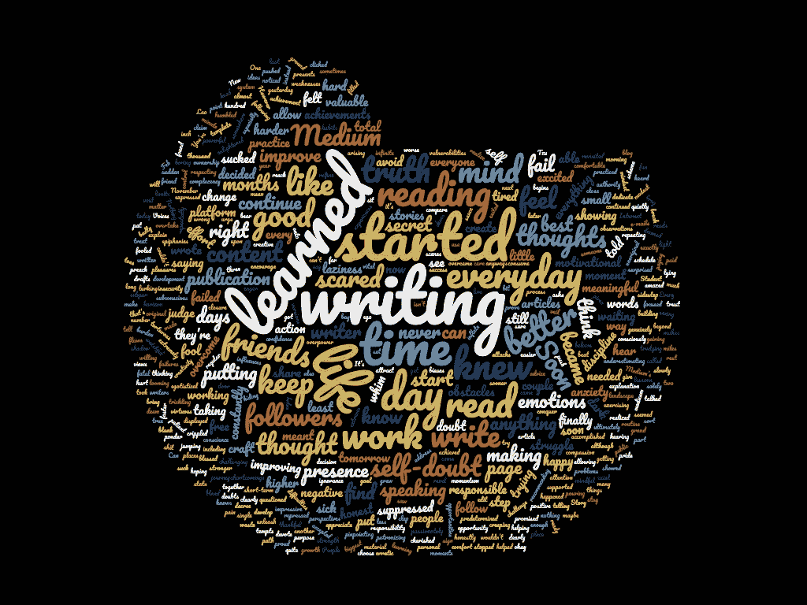

# 用 Python 模块 Newspaper 和 NLTK 查找文章中的常用词

> 原文：<https://towardsdatascience.com/find-common-words-in-article-with-python-module-newspaper-and-nltk-8c7d6c75733?source=collection_archive---------35----------------------->

## 使用 newspaper3k 和 NLTK 从报纸中提取信息和发现见解的分步指南


你想从一篇有趣的文章中提取必要的信息，但是发现这篇文章太长了，无法在有限的时间内阅读。在你一头扎进整篇文章，最终对无关的内容感到失望之前，你应该事先看看摘要和关键词。

`newpaper3k`和`nltk`是两个有效的工具，可以用来搜集和总结新闻文章。让我们来分析一下我今天在 Medium 上看到的一篇有趣的文章: [*我花了两年时间获得了 1000 名粉丝——这是我在整个旅程中使用这两种工具学到的人生经验*](https://mystudentvoices.com/it-took-me-2-years-to-get-1000-followers-life-lessons-ive-learned-throughout-the-journey-9bc44f2959f0) 。

# 使用报纸 3k

## 安装和创建项目的实例

```
pip install newspaper3kfrom newspaper import Article url = '[https://mystudentvoices.com/it-took-me-2-years-to-get-1000-followers-life-lessons-ive-learned-throughout-the-journey-9bc44f2959f0](https://mystudentvoices.com/it-took-me-2-years-to-get-1000-followers-life-lessons-ive-learned-throughout-the-journey-9bc44f2959f0)'article = Article(url)article.download()
```

## 从文章中提取有趣的信息

查找发布日期

```
article.publish_date
```

提取顶部的图像并快速浏览图像

```
image_url = article.top_image**from** **IPython.display** **import** Image
**from** **IPython.core.display** **import** HTML 
Image(url=image_url)
```

输出:


摘录作者姓名

```
article.authors
```

输出:

```
['William Cho']
```

提取文章关键词:

```
article.keywords
```

输出:

```
['soon',
 'ive',
 'work',
 'journey',
 '1000',
 'took',
 'followers',
 'started',
 'truth',
 'life',
 'writing',
 'wasnt',
 'lessons',
 'doing',
 'read',
 'maybe',
 'learned',
 'youre']
```

总结文章

```
article.summary
```

输出:

```
'But I’ve only been writing on Medium for a total of maybe 4.5 months.\nI started writing passionately, and you could tell from my writing that I thought I was enlightened and speaking from authority.\nI’ve noticed that it comes in moments where I put in effort to improve myself — working out, writing, and reading.\nYou’re just doing it to put yourself on a higher ground than your friends, to judge them from a higher platform and deem everything you’re doing more virtuous than what they’re doing.\nI would sidestep and avoid the truth — the truth that would hurt but ultimately set me free.'
```

通过总结，我们可以快速掌握文章的要点:

*   为了成为一名更好的作家，他通过写作、阅读和锻炼不断提高自己的写作技巧。
*   他的动力曾经来自朋友等外部来源。
*   在他的旅程中有挣扎。但是通过评估他的方法，他让自己自由了。

让我们看看是否可以使用 NLTK 从文章中提取更多的见解

# 用于文本处理的 NLTK

从从报纸上摘录文字开始

```
text = article.text
```

通过查看最常用词的情节，我们对这篇文章的内容有了更好的了解。

让我们利用另一个叫做 [WordClouds](https://www.wordclouds.com) 的工具来为我们的文章创建一个更有趣的可视化



从这个单词列表中，我可以猜出文章的大意:成为一个更好的作家需要努力。你必须坚持每天写作和阅读来提高你的技能。可能会有怀疑和恐惧，但如果你相信旅程并着眼于更大的愿景，事情最终会有所改善。现在，我可以开始阅读这篇文章了，因为我知道它会给我一些实用的课程来提高我的写作技巧。

# 结论

`newspaper3k`和`nltk`是从在线文章中提取重要信息的绝佳组合。你也可以利用这个工具来掌握文章的大意，以决定文章是否值得一读，或者同时分析几篇文章。

在这个 [Github repo](https://github.com/khuyentran1401/Extract-text-from-article) 中，您可以随意使用本文的代码。

我喜欢写一些基本的数据科学概念，并尝试不同的算法和数据科学工具。你可以通过 [LinkedIn](https://www.linkedin.com/in/khuyen-tran-1401/) 和 [Twitter](https://twitter.com/KhuyenTran16) 与我联系。

如果你想查看我写的所有文章的代码，请点击这里。在 Medium 上关注我，了解我的最新数据科学文章，例如:

[](/choose-stocks-to-invest-with-python-584892e3ad22) [## 用 Python 选择要投资的股票

### 您计划在未来 3 年投资几只股票，每只股票的每一美元都有不同的预期回报…

towardsdatascience.com](/choose-stocks-to-invest-with-python-584892e3ad22) [](/step-by-step-tutorial-web-scraping-wikipedia-with-beautifulsoup-48d7f2dfa52d) [## 用美丽的声音抓取维基百科

### 关于如何使用 Beautiful Soup 的分步教程，这是一个用于 web 抓取的简单易用的 Python 库

towardsdatascience.com](/step-by-step-tutorial-web-scraping-wikipedia-with-beautifulsoup-48d7f2dfa52d) [](/how-to-build-a-matrix-module-from-scratch-a4f35ec28b56) [## 如何从头开始构建矩阵模块

### 如果您一直在为矩阵运算导入 Numpy，但不知道该模块是如何构建的，本文将展示…

towardsdatascience.com](/how-to-build-a-matrix-module-from-scratch-a4f35ec28b56) [](https://medium.com/@khuyentran1476/comprehensive-numpy-tutorials-for-beginners-8b88696bd3a2) [## 为您的数据科学项目提供 Numpy 技巧

### 创建数组、矩阵、执行矩阵运算、解决线性代数问题和常见数据科学的技巧…

medium.com](https://medium.com/@khuyentran1476/comprehensive-numpy-tutorials-for-beginners-8b88696bd3a2) 

## 参考

[1][https://care . press reader . com/HC/en-us/articles/203210155-Advanced-Keyword-Search](https://care.pressreader.com/hc/en-us/articles/203210155-Advanced-Keyword-Search)

[2] William Cho，我花了 2 年时间获得了 1000 名粉丝——我在整个旅程中学到的人生经验(2018)，我的学生之声