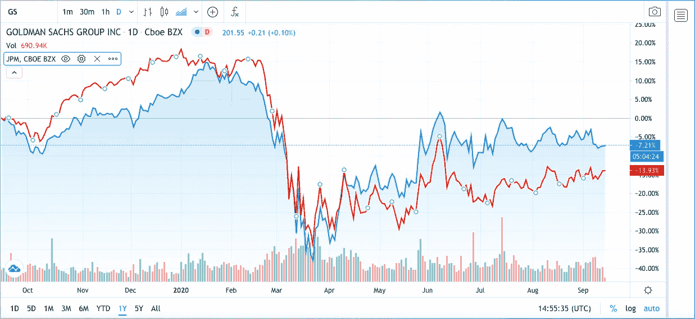

# 用 Python 找高度相关的股票！

> 原文：<https://towardsdatascience.com/find-highly-correlated-stocks-with-python-77eba4fd061b?source=collection_archive---------14----------------------->

## 了解如何使用 Python 来识别股票走势的相似性

帕特里克·韦森伯格在 [Unsplash](https://unsplash.com/s/photos/stock-market?utm_source=unsplash&utm_medium=referral&utm_content=creditCopyText) 上拍摄的照片

***来自《走向数据科学》编辑的提示:*** *虽然我们允许独立作者根据我们的* [*规则和指导方针*](/questions-96667b06af5) *发表文章，但我们并不认可每个作者的贡献。你不应该在没有寻求专业建议的情况下依赖一个作者的作品。详见我们的* [*读者术语*](/readers-terms-b5d780a700a4) *。*

无论你是在精心设计投资组合，想要融入多样化，还是试图为[配对交易策略](https://www.investopedia.com/terms/p/pairstrade.asp)寻找股票，计算两只股票走势之间相关性的能力都是必须的。

拥有一个不密切相关的股票投资组合，可以让你投资于不同的表现良好的资产，这些资产可能不会一起下跌太多。举例来说，在疫情期间，仅持有航空股的投资组合今年平均下跌约 38%。然而，通过将投资组合多元化，组合科技、零售或几乎任何其他行业的股票，损失会小得多(如果有的话)。

除非你使用的是配对交易策略，否则最好的办法是降低投资组合中的相关性，以最大限度地分散风险。这就是我们今天要做的——计算和排序一系列股票之间的相关性。这个过程是完全直观的，到本文结束时，您也应该能够在几分钟内重新创建这个程序，并且只需要几行代码！

本文中项目的全部代码都在这个 [GitHub 要点](https://gist.github.com/shashankvemuri/a210f7399b56075cbe55c309b460fa9b)中。

## 开始项目！

介绍

首先，我们必须导入整个程序中需要的所有依赖项。我们将使用的主要库是 Yfinance、Datetime 和 Yahoo-fin。Yfinance 将允许我们覆盖 pandas-datareader 中的不赞成意见，Datetime 将允许我们设置价格的开始/结束日期，Yahoo-fin 将允许我们快速访问不同指数中的报价器列表。

如果您没有安装这些模块，您可以在您的终端中使用 [PyPi](https://pypi.org/) 和 pip install 命令轻松下载它们。现在我们已经设置了依赖项，我们终于可以开始构建我们的应用程序了！

通过输入您想要开始的年数，我们可以使用 datetime 模块来创建历史数据的开始和结束日期。我们还可以设置道琼斯工业平均指数(DJIA)的报价机列表，但这可以根据您的喜好进行更改。

股票数据

使用 pandas-datareader，我们可以从 Yahoo Finance 中获取在前面代码块中设置的日期和报价机的历史数据。因为我们关注的是股票变动之间的相关性，所以我们可以专注于调整后的收盘价列，然后用每日百分比变化的以 10 为底的对数创建一个新的 Pandas 数据框架。用熊猫的方法。corr()，我们可以创建新数据帧的相关矩阵。

然而，我们还没有完成。相关矩阵包括冗余对，例如 AAPL 到 AAPL 或出现两次的对(AAPL 到 MSFT 和 MSFT 到 AAPL)。我们可以去掉这些，对数据帧进行排序，以获得与下面要点中的函数的最高绝对相关性。

清理数据帧的函数

我们可以使用函数 get_redundant_pairs(df)来去除两只相同股票之间的相关性。通过将变量“pairs_to_drop”设置为一个集合，并对每一列和每一行运行两个 for 循环，我们可以找到双对并返回它。

然后，我们可以创建相关性数据框架，目标绝对值数字，并拆分它，使其更容易阅读。最后，我们可以调用 get_redundant_pairs 函数，将它们从结果数据帧中删除。现在，程序应该返回输入的报价机列表中的最高相关性。在这种情况下，对于 DJIA 去年的数据，我有以下输出。

DJIA 的最高绝对相关性— 1 年

正如你所看到的，高盛、摩根大通和美国运通都如预期的那样有很强的相关性，因为它们都在同一个行业。为了测试输出的准确性，让我们快速地把高盛和摩根大通放在一起。使用 [TradingView 的](https://tradingview.com/)绘图工具，我们可以看到，尽管 JPM 的波动性更大，但这两只股票在过去的一年里几乎是一样的！

高盛(蓝色)对摩根大通(红色)1 年

虽然在这篇文章中，我着重于寻找具有最高绝对相关性的股票，但可能性确实是无穷无尽的。我希望这个算法将来对你有用。非常感谢您的阅读！

*免责声明:本文材料纯属教育性质，不应作为专业投资建议。自行决定投资。*

如果你喜欢这篇文章，可以看看下面我写的其他一些 Python for Finance 文章！

 [## 使用 Python 在几分钟内解析数千份股票推荐！

### 了解如何在不到 3 分钟的时间内解析顶级分析师的数千条建议！

towardsdatascience.com](/parse-thousands-of-stock-recommendations-in-minutes-with-python-6e3e562f156d)  [## 用 Python 制作股票筛选程序！

### 学习如何用 Python 制作一个基于 Mark Minervini 的趋势模板的强大的股票筛选工具。

towardsdatascience.com](/making-a-stock-screener-with-python-4f591b198261)  [## 在 3 分钟内创建一个财务 Web 应用程序！

### 了解如何使用 Python 中的 Streamlit 创建技术分析应用程序！

towardsdatascience.com](/creating-a-finance-web-app-in-3-minutes-8273d56a39f8)