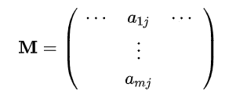
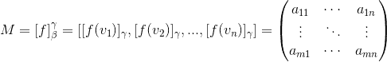
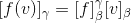

# 基于已知点寻找线性变换

> 原文：<https://towardsdatascience.com/find-linear-transformation-based-on-known-points-64785e987db0?source=collection_archive---------8----------------------->

## 线性代数和计算机视觉的代码片段

这个故事展示了如何仅基于几个点的变换来识别线性变换。为了这个故事中的数学，我使用了[亚历山大·尼塔](http://math.colorado.edu/~nita/index.html)的[这个](https://math.colorado.edu/~nita/MatrixRepresentations.pdf)作品，以及来自[维基百科(线性地图)](https://en.wikipedia.org/wiki/Linear_map)的描述。代码见[这个谷歌 Colab。](https://colab.research.google.com/drive/1m9ctAIKwFYTe6ecTdvUaqrFFC-15PVRM)

例子:让我们假设在三维空间中有一个移动的物体。我们有对象的两个时间戳，并且我们想要识别可以将对象从第一状态移动到第二状态的转换。如果我们知道每个状态中 3 个点的位置(例如 [Harris 角点检测](https://en.wikipedia.org/wiki/Harris_Corner_Detector)，我们可以定义变换的矩阵。

找出埃菲尔铁塔图像之间的变换——基于[荣克森公园](https://unsplash.com/@xxxon?utm_source=unsplash&utm_medium=referral&utm_content=creditCopyText)在 [Unsplash](https://unsplash.com/s/photos/eiffel-tower?utm_source=unsplash&utm_medium=referral&utm_content=creditCopyText) 上的照片和[佩德罗·甘德拉](https://unsplash.com/@pedrogandra?utm_source=unsplash&utm_medium=referral&utm_content=creditCopyText)在 [Unsplash](https://unsplash.com/s/photos/eiffel-tower?utm_source=unsplash&utm_medium=referral&utm_content=creditCopyText) 上的照片

# 线性转换

> *线性变换*(线性映射、线性映射或线性函数)是两个向量空间之间的映射 V →W，保留了*加法*和*标量乘法*。
> —维基百科([线性地图](https://en.wikipedia.org/wiki/Linear_map))

形式上，对于同一域 **K** 上的向量空间 *V* ， *W* ，函数*f*:*V*→*W*是一个*线性映射*如果任意两个向量 u，v ∈ *V* 和任意标量 c ∈ **K** 满足以下两个条件:

(1):*f*(**u**+**v**)=*f*(**u**)+*f*(**v**)
(2):*f*(c**u**)= c*f*(**u**)

# 变换矩阵

如果 *V* 和 W 是有限维向量空间，并且为每个向量空间定义了基，则线性映射 f 可以由**变换矩阵**来表示。如果 **M** 是一个 *m* x *n* 那么
(3):*f*(**x**)=**MX** 描述一个线性映射 **R** ⁿ→ **R** ⁿⁿ.

如果我们知道一个基β={ **v** ₁， **v** ₂,…， **v** ₙ}对于 *V* ，那么每一个向量 **v** 都可以写成这个基的线性表示:**v**=c₁**v**₁+…+cₙ**v**ₙ.

如果*f*:*V*→*W*是线性映射，

因此， *f* 由 *f* (v₁),…， *f* (vₙ).)决定

设γ ={ **w** ₁,…， **w** ₘ}为 w 的一个基，那么 *f* ( **v** ⱼ)可以写成

线性映射 *f* 可以由 *f* (v₁),…， *f* (vₙ)确定，从而使用 aᵢⱼ系数。矩阵 M 是

如果我们在 *a* 基中使用【v]ₐ符号】来表示 v 向量，则在有序基中线性变换的矩阵表示为:

有序基中函数的变换矩阵

以下重要等式的证明，参见[亚历山大·尼塔](http://math.colorado.edu/~nita/index.html)的[著作](https://math.colorado.edu/~nita/MatrixRepresentations.pdf)。它指出，用 M 矩阵乘以用β基表示的 v 向量变换成用γ基表示的 f(v)。

使用相应的变换矩阵将一种基中的向量变换到另一种基中

因此，如果我们有一个向量 V，一个在向量空间(V，W)和 m 点中的基与{ **v** ， *f* ( **v** )}对，我们可以确定线性变换。对于这个，我们要知道，如何把 V 中的点变换成第一基，然后，计算矩阵 M，最后从第二基变换回标准基(如果我们想的话)。

# Python 实现

为了得到基 a 的 v]ₐ，我们可以使用`[numpy.linalg.solve()](https://docs.scipy.org/doc/numpy/reference/generated/numpy.linalg.solve.html)`函数:
`np.linalg.solve(np.transpose(a), v)`

为了得到有序基中的矩阵表示，我们简单地将上面的等式转化为`numpy`项:函数`lin_map_matrix` 使用 *f* (v₁),…， *f* (vₙ)的矩阵 FV 和 w₁,…,wₘ.的矩阵 w 产生 m

函数`linmap_predict` 计算 V 基的 V 向量表示，然后使用 M 矩阵乘法进行转换，并使用 w 得到标准基表示

Python 中的变换矩阵

# 摘要

如果我们有一个 *n* 和一个 *m* 维向量空间，并且我们知道两个空间中的一个基(分别是线性独立的 n 和 m 个向量)和两个空间中的 m 个点，那么如果它存在，我们就可以确定空间之间的线性映射。

在特殊情况下，如果我们在 3D 空间中有 3 个点(不在一条线上),并且我们知道它们在线性变换后的表示，我们可以确定线性变换。