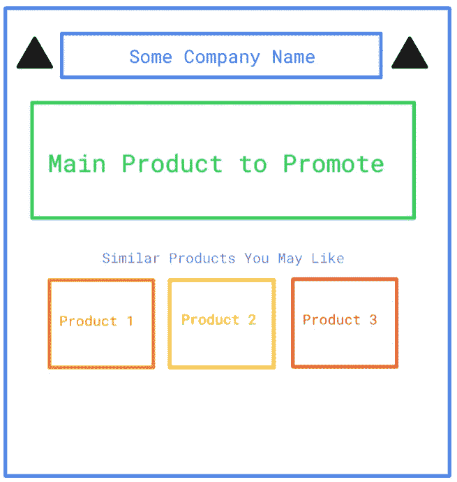
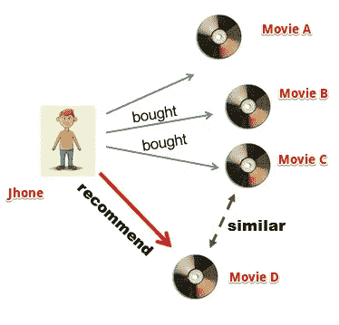
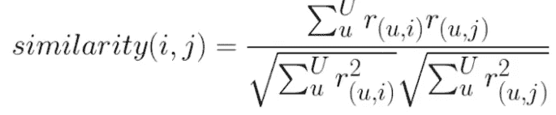
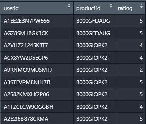
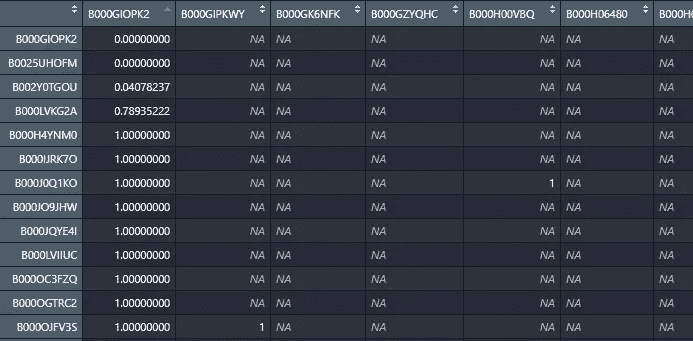
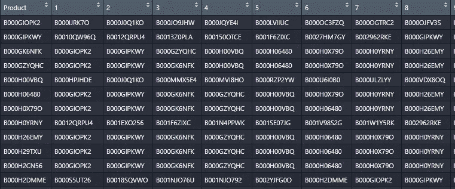

# 找到类似的产品推荐给用户

> 原文：<https://towardsdatascience.com/find-similar-products-to-recommend-to-users-8c2f4308c2e4?source=collection_archive---------19----------------------->

## 在 R 中使用 recommenderlab 获得类似的产品推荐

来源 [pixabay](https://pixabay.com/photos/fashion-accessories-handbag-2208045/) ，作者[卢蒙](https://pixabay.com/users/lum3n-1066559/)

找到相似的产品来推荐是一件棘手的事情，尤其是当我们有大量产品的时候。我们希望在我们的营销和产品活动中推荐类似的产品，例如在促销电子邮件营销中。

这是我用 [autodraw](https://www.autodraw.com/) 制作的超级艺术作品，展示了一封营销电子邮件，其中包含对主要产品的类似产品的建议。

类似品牌的促销邮件插图，作者 Muffaddal

在本指南中，我们将使用推荐系统中使用的技术来获取彼此相似的产品列表。虽然推荐系统在用户层面上推荐产品，这意味着每个用户可能有不同的建议，但我们的系统将在产品层面上，所以我们得到一个类似项目的列表，以推荐给与主促销产品交互的每个用户。

但是在我们深入研究如何获得相似的产品之前，我们需要首先了解推荐系统如何找到相似的产品推荐给用户。

# 推荐系统是如何工作的？

推荐系统，例如基于项目的协同过滤，基于用户先前消费的产品历史来推荐产品。系统寻找用户已经积极互动的产品，然后找到与消费的产品相似的其他**产品，并相应地推荐。**

Sidharth 在 [spatnaik77](https://spatnaik77.wordpress.com/2013/07/17/recommendation-engine/) 上的照片

因此，推荐系统的核心就是寻找与用户已经喜欢的产品相似的产品。

但是产品相似度是怎么计算的呢？如果有多种类似的产品，在这种情况下应该推荐哪种产品呢？关于这些技术如何工作的细节超出了这篇文章的范围，但是你可以参考下面的文章，在文章中，我使用 excel 表格更详细地解释了每一步。

 [## 推荐系统综合指南

### 本指南将详细介绍推荐系统的工作原理以及如何在实际工作中实现它…

towardsdatascience.com](/comprehensive-guide-on-item-based-recommendation-systems-d67e40e2b75d) 

下面是计算产品相似度的公式:

相似性方程(Muffaddal)

其中,`i`是计算相似度的产品，我们的促销产品，而`j`是与`i`进行比较的产品。`r`是用户`u`对产品`i`的评价。

*如果你想深入研究相似度计算技巧，我建议从* [***这门课开始，这里有***](https://bit.ly/35YPdOj) *。*

# 寻找产品之间的相似性

我们将使用 RecommenderLab，一个 R 包来构建推荐系统，帮助我们获得相关产品。它有一个名为`similarity`的函数，可以帮助计算项目之间的相似度。下面是基本代码:

`similarity`函数有三个输入:

***数据集:*** *包含产品及其评级的数据集。数据集应采用 realRatingMatrix 格式。*

***方法:*** *这是我们指定计算相似性的技术，比如上面讨论的余弦相似性。其他方法包括 Jaccard，欧几里德，皮尔逊相似性。*

***其中:*** *这告诉了* `*similarity*` *函数在什么层次上计算相似度。它可以是产品级的，也可以是用户级的。产品级计算相似的产品，而用户级计算相似的用户。*

现在让我们使用 recommenderLab 的`similarity` 函数来计算类似的产品。这是我们的主要数据集的样子。

Muffaddal 的评级数据集示例

r 代码来计算我们的评级数据集的相似性。

上面的代码为我们提供了产品间相似性得分的矩阵。

产品之间的相似性得分矩阵，Muffaddal

上面的输出确实让我们得到了每个产品的相似性得分，但是很难知道对于任何给定的项目，什么是最相似的产品。所以，让我们来有序地找出前 50 个高度相似的产品。

下面是输出的样子:

Muffaddal 的类似产品列表

`product`列代表主要产品，我们将从中提取其他类似产品。列`1`包含与我们的主要产品最相似的产品。所以产品`B000GIOPK2’s`最相似的产品是`B000IJRK7O` 等等。

就是这样！

几行代码为我们提供了用于营销和应用内建议的类似产品列表。

# 其他相似性计算技术

除了余弦相似度，还有`Jaccard, Euclidean, Pearson etc.,` 来计算产品之间的相似度得分。每个人都有自己的方法来计算两个产品有多相似。参见 Marvin Lü的文章，他在文章中讨论了所有不同的相似性计算技术。

你只需要用你想用来计算相似性得分的方法替换单词`cosine`，例如，对于`Jaccard` 相似性，我们的代码将改为；

`product.similarity <- similarity(rr, method = “**jaccard**”, which = ‘items’)`

# 标准化评级值

除了不同的相似性计算技术之外，我们还可以标准化评分值。正常化有助于迎合人们乐观的天性。不同的人会根据他们的乐观程度对同一件事做出不同的评价。例如，在 5 的范围内，一个人可以给产品打 5 星，而另一个人可以打 3 星，即使他们都非常喜欢这个产品。
RecommenderLab 有一个内置函数来帮助规范化这些值。

`r <- normalize(r, “Center”)`

关键字“Center”告诉`normalize`函数使用哪种方法来标准化评级。除了`center`之外，我们还有`z-score`来使值规范化。

# 最后的话

向用户推荐合适的产品不仅可以提高互动率，还可以带来更多的商业转化和回报。基于机器学习找到类似的产品是一种有效的方法，可以让相关的产品用于营销和应用程序中。这样做不仅能提供更好的用户体验，还能增加产品的知名度。

# 你可能喜欢的类似文章

 [## 基于项目的推荐系统综合指南

### 本指南将详细介绍基于项目的推荐系统是如何工作的，以及如何在实际工作中实现它…

towardsdatascience.com](/comprehensive-guide-on-item-based-recommendation-systems-d67e40e2b75d)  [## 基于购买历史的用户细分

### 根据用户的购买行为对其进行细分，从而改进广告活动。

towardsdatascience.com](/user-segmentation-based-on-purchase-history-490c57402d53)