# 用你自己的机器学习算法找到文本相似之处

> 原文：<https://towardsdatascience.com/find-text-similarities-with-your-own-machine-learning-algorithm-7ceda78f9710?source=collection_archive---------4----------------------->

## 只需几行代码和一点点线性代数，我们就可以创建一个强大的 ML 算法，轻松地将相似的文本片段聚集在一起。

*首先，有大量的材料专注于处理文本数据，并使用各种分类算法来提供相似性和/或聚类。我们将使用一种方法来精确计算与我们任意选择的文档相似的文档。相似性评价基于“***”最重要的词语的文档及其相关语料库。**

*为什么？您曾经使用简单的分类或回归实现来对数据进行分类吗——非常肯定您使用过。今天，我们来看看记录非常完整的方法，它们具有很高的准确性和稳定的性能。不过，我发现对我个人的学习曲线至关重要的是，实现类似的算法和概念**来理解基本思想**。记住这些知识，你将很难理解更深层次的概念。一步接一步。*

****我们将在这里做什么:****

*   **从 HTML 和 CSV 文件导入数据——我们使用的是 Beautifulsoup**
*   **清洗数据**
*   **使用正则表达式、NLTK 和 concentration 创建单词包**
*   **对字典中的数据进行排序和分类**
*   **创建单词到矢量的实例**
*   **将数据合并成一个(稀疏)矩阵**
*   **识别相关文本元素**
*   **喝一杯有机茶，为自己感到骄傲**

*如果这是您在“使用文本世界”中的第一次冒险，我认为这里的这些文字将是一个很好的开始，让您了解仅用几行代码就能做些什么。关于文本相似性，我个人推荐我最喜欢的出版物“文本相似性:估计两个文本之间的相似程度”，这可以在[medium.com](https://medium.com/@adriensieg/text-similarities-da019229c894)找到。如果你想深入研究文本处理程序。*

*现在让我们关注一个非常简单的实现，仅用几个词来描述一个文档的特征，并检查这是否是在彼此之间比较文档/文本的合适的度量。*

**

*《不是一袋文字》[来源](https://unsplash.com/@denisseleon?utm_source=medium&utm_medium=referral)*

*对于我们的实验，我们将处理与计算机和数据科学有关的各种领域，换句话说，期待巨大的乐趣！在概述的步骤过程中，我们将使用几个库作为快捷方式，例如，我们将使用预定义的英语停用词来“过滤”我们不能用于进一步分析的词，我们将使用库来处理 HTML，我们将使用标准数学库。*

*为了确定文本元素之间的相似性，我们将经历以下步骤:*

```
***0.** Define the procedure of evaluating word importance
**1.** Import the data we would like to analyze
**2.** Clean data in order to being able to process paragraphs, phrases and words without running into issues
**3.** Use the cleaned data to create bag of words
**4.** Implement the tf_idf algorithm (adapted)
**5.** Calculate frequencies per bag vectors
**6.** Store data in a matrix
**7.** Calculate similarities
**8.** Analysis*
```

*我们将通过分析两个不同的数据集来测试我们的方法:(1) IMDB 的评论集以及(2) [Reuters](http://archive.ics.uci.edu/ml/datasets/Reuters-21578+Text+Categorization+Collection) -21578 数据集[1]，这两个数据集都可以很容易地在网上找到并下载到您的机器上。为了正确起见，我根本不隶属于 IMDB 或路透社。*

*凭直觉，我们可以假设重要的单词对文档来说是某种“特殊的”,所以如果我们计算文档中的所有单词，而忽略对文档值没有贡献的单词，如(is、has、will 等。我们可能会在文档中找到重要的单词。*

*我最初尝试的是统计单词，并认为最常用的单词是最重要的(这种方法最多是**的**)。为什么这在某种程度上起作用是很简单的，我们清理了文本并删除了(非常频繁出现的)停用词，所以自然地我们会以频繁出现的词结束，这些词可能是重要的。这个想法有一个很好的理由是有缺陷的:那些绝对不重要，但是没有通过前面的过程(停用词清理)过滤的词可能会保留在文本中，然后被认为对我们的分析很重要。*

*我们将继续用代码片段覆盖必要的步骤，完整的代码可以在 [Github](https://github.com/guenter-r/medium/blob/master/tf_idf.py) 上找到。*

***0。**基本思路，“逆文本频率”*

*例如，在我们谈论电影评论的情况下，电影可能经常出现(有趣的事实:我们即将分析电影评论)——然而，“电影”的出现不太可能为我们提供任何可靠的信息，即两个文本片段是否可能相似。换句话说，如果我们依赖“电影”，我们最终会有太多的相似之处。*

*词频-逆文档频率，简称 tf-idf，是评估单个单词对语料库的重要性的常用方法。一般来说，这可以概括为三个计算[2，3]。请注意，tf-idf 空间中有相当多的变化(特别是在计数规范化方面)——我尝试了一些变化，并选择了提供良好总体结果的方法。*

*我们多久能在文档 **D** 中找到术语 **t** ？由于长文档可能导致这个问题的扭曲(因为术语可能出现得更频繁)，我们考虑文档中一个术语 t '的**最大频率**，以便**归一化 D** 中的#t。*

*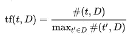*

*D 中的项 t 的数量除以 D [2]中的项 t '的最大频率*

*2.在整个语料库的多少个文档中，我们找到了术语 **t** ？(在所有被考虑的文档中出现的术语如果在那些被考虑的文档中多次出现，则不太重要)*

*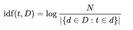*

*N =文件总数 D；{d 的 D 元素，其中 t 项是 D 的元素}*

*3.在最后一步中，给定文档 D 中的词 t 的权重被计算为上述两个计算的乘积:*

*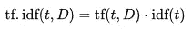*

*为什么我们需要对数函数呢？这是一种自然的方式，允许我们限制大量事件的重要性。出现的次数越多，如果按对数计算，重要性的变化就越不明显。*

*我们将使用前面描述的 ft-id 案例。对于这种方法，我们将考虑**所有可用的文档**，而不是只计算单个文档中的单词(这是我们首先想到的，如何解决这个问题)——这当然需要更多的 CPU 内存来进行计算，但代价是希望更加准确。*

*我们已经通过了数学运算，大部分都通过了——太好了！我认为这是一个很好的时间休息一下，回顾一下我们到目前为止所看到的。至少这是我在这里做的。现在让我们来谈谈更多的代码🐍。*

***1。导入数据***

*我们的开始很简单，我们将导入我们的 IMDB 和 Reuters 数据:*

***IMDB***

```
*data = pd.read_csv('.../PATH/imdb.csv')*# limit the number of records, avoid loading times while tweaking*
NO_OF_ENTRIES = len(data)//8
**imdb = data.review.iloc[:NO_OF_ENTRIES]***
```

***路透社***

*在这种情况下，我们不能依赖可靠的 pandas 功能，但是 bs4 允许我们毫不费力地提取数据，只需 n🍦。有一件事可能会立即映入你的眼帘，那就是" **soup-functions"** 确实经常看起来像典型的 **regex** 函数。如果需要，这个提示可以帮助您浏览文档。*

*对于我们之前的定义来说，重要的是我们能够正确地清理数据。这将进一步允许我们将句子、段落和最终文档压缩成一组独特的单词。(我们没有特别介绍词干，但是这可以在某种程度上改进我们的方法——如果感兴趣的话，请看这里的[和](https://en.wikipedia.org/wiki/Stemming)【4】)。*

***2。& 3。清理数据，把单词装进他们的包里***

*从 tf、idf 公式推导出，我们需要收集所有(干净的)单词，确定这些单词在文档中出现的频率以及这些单词在所有文档中出现的最大频率。为了删除停用词，我推荐 *nltk* 的停用词，它在许多语言中都有。*

```
*#Note the global dicts:
**maximum_per_document** -> which is the denominator for the first equation
**number_docs_containing_term** -> which is the denominator for the second equation*
```

*只是一个非常基本的数据过滤方法(使用正则表达式)*

*我没有使用过[](https://www.nltk.org/api/nltk.tokenize.html)**，因为我们的基本实现的结果很好，但是只需要几行代码，就可以了。如果我们选择所有我们找到(并过滤)的单词，记下它们，并根据单词出现的次数来调整后者的大小，我们可以生成一个单词云，如下所示:***

******

***《星球大战评论》一词云***

*****4。TF-IDF 算法*****

***由于我们使用了上述函数来清理和过滤数据以及设置计数，因此我们将继续实施我们实验的核心功能，即 tf-idf 算法:***

***TF IDF 主要使用字典***

***利用我们的 tf-idf 算法，我们现在可以决定只考虑有限数量的单词，只考虑每个文档中计算出的得分最高的 **n** 个单词[3]。这个 n 是任意的，n 越大，我们的相似矩阵就越稀疏——记住这一点。***

***为了计算相似性，我们需要一个参考向量。在遍历所有文档、清理它们并计算字数时，我们将***

1.  ***计算 tf_idf 分数，以及***
2.  ***创建一个参考向量—这是一个由所有相关单词(每个文档 n 个单词)组成的向量。自然，相似的文档越多，我们的向量就越小。预计它会很大。***

*****5。计算相似度*****

***我们接下来要做的是计算袋子相似度，其中袋子由它的 n 个顶部单词表示。所有顶部的单词都聚集在一个单词向量中。我们将为每个包创建向量(迭代过程)，在下一步中，我们将把所有向量叠加到一个矩阵中。***

*****6。适当存储数据*****

***我们已经做了相当多的工作，以便处理和组织数据，使我们能够非常接近我们分析的最后步骤。在堆叠我们的向量之后，我们找到一个稀疏矩阵，它只在对角线周围是密集的(这很有意义，但是在 **7 下更多。计算相似度**)。让我们先做一些理智检查。***

```
***# for our matrix m
np.where(m.toarray()[0] > 0) 
# n top values:
(array([  52,  803, 1151, 1778, 1993], dtype=int64),)***
```

***让我们检查路透社和 IMDB 的矩阵(图限于 25000 条评论):***

***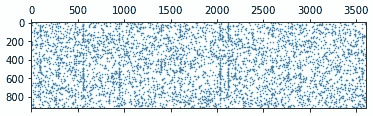***

***Matrix **m** 在路透社数据下看起来——由于大量的热门词汇***

***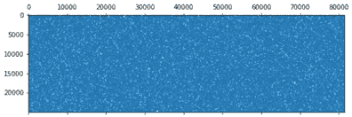***

***矩阵 **m** 在 IMDB 数据[:25，000]下的样子—密集***

***7。计算相似度***

***计算相似性是一项有趣的任务，线性代数提供了一种非常直接的方法来计算相似性:我们感兴趣的是两个向量 A 和 B 之间的余弦角，这两个向量指向同一方向越近，它们的值就越接近 1:***

***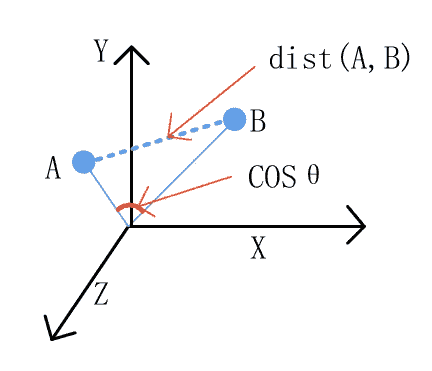***

***余弦相似度——谷歌上出现的第一张图片；) [5]***

***在我们的最后一步中，我们将把我们的矩阵值与矩阵中的所有其他值相乘(如果我们把一个向量与它本身相乘，则相似性是 1)，我们把这个相似性矩阵称为 **m_d_m** 。正如我们可以看到的，有一个清晰的模式，我们可以从中找到明显的相似之处——如果我们需要将它们放在一起，这将是一个完美的聚类任务。***

***在下图中，我们将检查路透社的数据，原因很简单:路透社的数据是每日新闻。这意味着我们当然期望某些相似的模式，然而新闻覆盖了许多不同的领域，自然会有更广泛的词汇。如果我们对电影评论使用相同的情节，我们基本上会得到一个巨大的蓝色正方形(由于密度)。***

***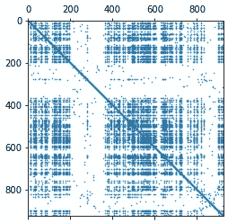***

***我们的**路透社**矩阵 **m_d_m** 包含非零值***

*****8。分析*****

***在我们的任务中，我们的目标是找到与我们选择的文档相似的文档。我们使用一个简单的迭代来查找所有至少 **x%** 相似的相关文档，其中 **x** 再次被任意定义。我得出的结论是，0.5 左右的相似性非常好。***

*****IMDB** —与路透社数据集相比，如果我们只选择文本中的 **n 个**重要单词，我们可能会得到相当密集的结果。这可以解释为这样一个事实，评论，好的或坏的，很可能包含许多相似的词——这导致了巨大的密集矩阵！这将我们带到一个非常敏感的点:我们可以选择更多的单词(一个更大的 n)，但是计算将变得相当消耗内存。让我们在给定不同参数的情况下进行几次比较:***

```
***n=10
[**7054**] vs [**11311**] vs [**7637**] ~ similarity 0.6***
```

***似乎有些用户发明了自己写评论的捷径😏。也许这只是我，但我真的觉得这很有趣:***

***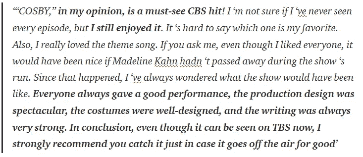***

## ***对抗***

***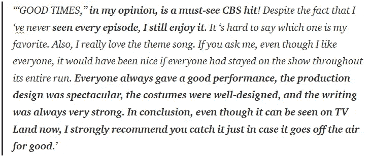***

## ***对抗***

***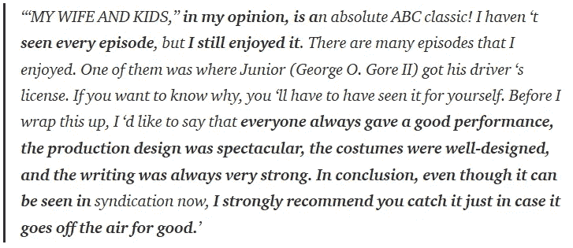***

***我之前提到过“**词干**”是查找相似单词的一个有趣选项，在我们的例子中，我们可以清楚地看到为什么:***

> ***我仍然喜欢它|我仍然喜欢它***

***这两个不同于我们的代码，享受和被享受是两个不同的术语，因此它们的重要性可能完全不同。正如我们在这三个片段的比较中所看到的，很可能“享受[ed]”不在我们的 n 大热门词汇中。***

***如果考虑到我们的下一个测试场景是相当令人印象深刻的，并表明我们的算法必须至少在某些点上工作。由于我们的 IMDB 数据集没有**而不是**提供电影本身的任何参考(除非明确提到)，我希望找到属于彼此的评论(连续实验的潜在参考——聚类)。还要注意的是，即使这部电影被提及，也只是被提及了几次，因此它可能不会被视为一个重要的词，也不会被列入我们的 n 大**词汇中。*****

***在下面的例子中，我们的算法将两个评论匹配在一起，而两个都提到了电影的原始日文标题，一个提到了英文电影标题。***

```
***[8745] vs. [18038]***
```

******

## ***对抗***

******

***好吧，让我们在包含路透社新闻数据的稀疏矩阵中检查我们的发现。***

*****路透社**——浏览结果，我们可以在 **m_d_m** 中看到，数据聚集在各种条目周围。当更详细地研究这一点时，我们发现这是由于数据包含许多简短的股票价格更新(看起来非常相似)。对于这些更新，我们将在矩阵中找到许多类似的条目。这里有一个例子，我假设 *Shr、cts、Net、Revs* 可能被视为对我们的算法“重要”:***

```
***# example of a "very similar" document
'Shr 24 cts vs 15 cts
Net 1,520,797 vs 929,017
Revs 5,268,486 vs 2,617,995
Reuter'***
```

***如果我们采用更严格的方法，比如 99%的相似度，我们几乎不会期望任何结果(因为文档与其自身匹配，总是 1，**被排除**)，但是我们确实找到了一个。事实证明，这是我们数据中的重复和非常相似的文本片段。很公平。***

```
*****# data point 3 and 15 are perfect duplicates**
BankAmerica Corp is not under
pressure to act quickly on its proposed equity offering and
would do well to delay [...]***
```

***总体而言，路透社的数据似乎更具挑战性。这一方面是由于各种金融术语和缩写(这将占用我们“重要”词汇的一部分)另一方面，看起来相似的文本不一定谈论相似的事情。为了只获取可能在内容方面有关联的文本，我将忽略相似性值大于. 55 的数据(因为这将是看起来非常相似的财务数据)。***

```
***[915] vs [660] ~ similarity .39***
```

***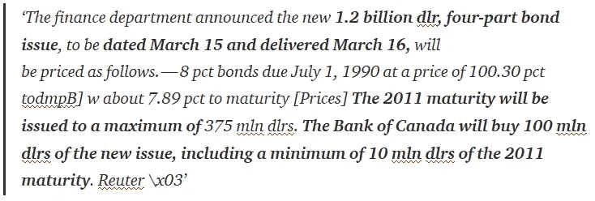***

## ***对抗***

***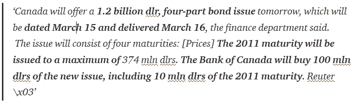***

***尽管这些收件人邮件分享了它们的大部分单词，但它们的相似性得分远低于我的预期——特别是关于我们在 IMDB 数据集中可以达到的得分。***

## *****先不说:奇异值分解*****

***由于我们已经计算了一个奇异矩阵，识别出与其他文档有最多共同点的**顶级文档可能会很方便**(因此，如果我们也检查了这个，这些文档应该在同一个集群中)。***

```
***from scipy.sparse.linalg import svds
U, Sigma, V_T = svds(m_d_m, k=1, which='LM', return_singular_vectors=True)sorted_U = np.argsort(abs(U.reshape(m_d_m.shape[0])))[::-1][:10] #**top 10 only*****
```

## ***tldr***

***这个简单的算法允许我们找到相似的文本(例如，我们可以看到，可以很容易地找到重复的文本)，但是文档变得越复杂，文档之间的差异越多，**计算的代价就越大**。由于我们需要遍历整个数据集，对重要单词的说明和计数过程，算法的资源需求会随着每一个额外的记录而大量增加。***

***如果你觉得这篇文章有帮助，我会很感激“关注”🫀，直到那时:***

*****下次见。*****

******(注意安全！)******

***[0]链接完整代码:[https://github.com/guenter-r/medium/blob/master/tf_idf.py](https://github.com/guenter-r/medium/blob/master/tf_idf.py)***

***[1]路透社的数据:[https://stack overflow . com/questions/25134160/what-the-meaning-of-the-categories-in-corpus-Reuters-of-nltk/25149714 # 25149714](https://stackoverflow.com/questions/25134160/whats-the-meaning-of-the-categories-in-the-corpus-reuters-of-nltk/25149714#25149714)***

***[2]维基百科(TF-IDF):[https://en.wikipedia.org/wiki/Tf%E2%80%93idf](https://en.wikipedia.org/wiki/Tf%E2%80%93idf)***

***MSalnikov 对一个三个句子的实验做了一个非常好和清晰的解释👍:[https://medium . com/@ MSalnikov/text-clustering-with-k-means-and-TF-IDF-f 099 BCF 95183](https://medium.com/@MSalnikov/text-clustering-with-k-means-and-tf-idf-f099bcf95183)***

***[https://en.wikipedia.org/wiki/Stemming](https://en.wikipedia.org/wiki/Stemming)***

***[5] C [余弦相似度—https://www . research gate . net/publication/320914786/figure/fig 2/AS:558221849841664 @ 1510101868614/The-difference-between-Euclidean-distance-and-cosine-Similarity . png](https://www.researchgate.net/publication/320914786/figure/fig2/AS:558221849841664@1510101868614/The-difference-between-Euclidean-distance-and-cosine-similarity.png)***

***[文字云图片]一个“星球大战评论文字云”，创建于[wordclouds.com](https://www.wordclouds.com/)***

***# NLP # corpus # numpy # bs4 # beautiful soup # examples # github # TF-IDF # data science # tokenize # sk learn # python # R # rlang #词干#wordcloud***