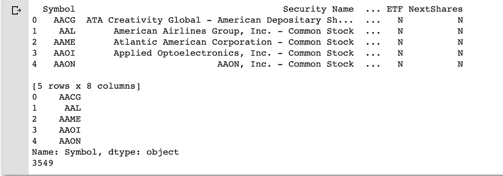
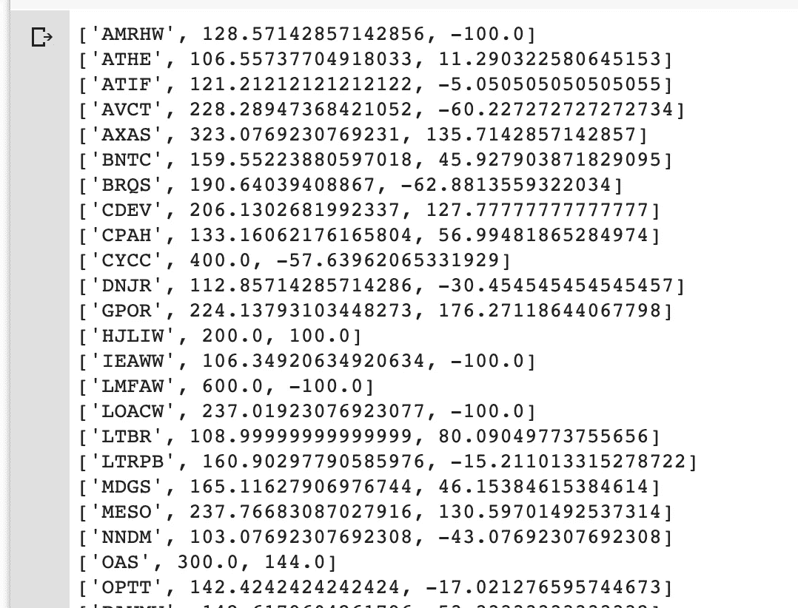
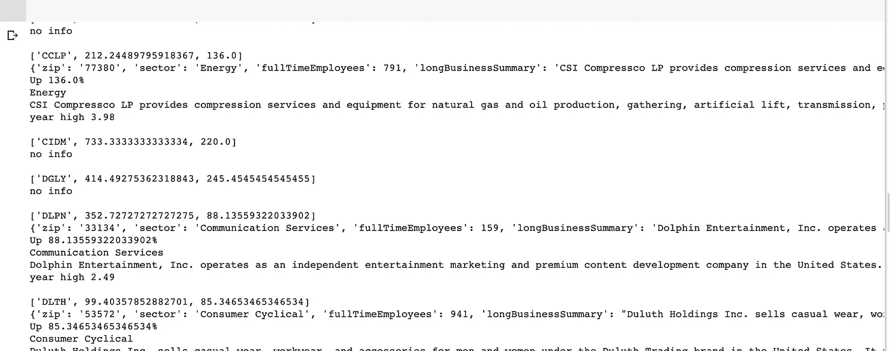

# 用 Python 找到当天最高的移动(隐藏)股票

> 原文：<https://towardsdatascience.com/find-the-highest-moving-hidden-stocks-of-the-day-with-python-aab0d7bfe5ff?source=collection_archive---------17----------------------->


图片来自 [unsplash](https://unsplash.com/photos/DfjJMVhwH_8) 。

## 有更多的股票不只是 SP500！在本文中，我们将探索揭示快速移动的小型创业板股票的 Python 代码…

## 股票市场是一个瞬息万变的地方，尤其是在这些动荡时期。虽然我们经常听说最受欢迎的股票(所谓的 SP500)，但还有许多其他股票。有些小，有些快速上涨，有些是新的 IPO，有些是快速崩溃…在这篇文章中，我将分享一些我编写的有用的 Python 代码，以深入研究最不为人知的股票，并找到那些快速移动/快速上涨的股票…

我们将利用一个名为 [yfinance](https://pypi.org/project/yfinance/) 的图书馆，它将为我们提供历史库存数据并进口熊猫。

```
# imports
!pip install yfinance
import yfinance as yf
from pandas_datareader import data as pdr
import pandas as pd
```

由于我们不只是想探索最知名的股票，我们将加载所有纳斯达克股票的完整列表:

```
# list all stocks
url = “ftp://ftp.nasdaqtrader.com/SymbolDirectory/nasdaqlisted.txt"
df=pd.read_csv(url, sep=”|”)
print(df.head())
print(df['Symbol'].head())
print(len(df['Symbol']))
```



这为我们提供了一个包含 3549 个股票代码的变量(df )!

那么，我们如何获得今天的高推动者？让我们从检索列表中每只股票的最近历史开始，并将其存储在`movementlist`中

我首先定义了一个助手函数，它允许我们通过错误检查从数据帧中快速查找值。

```
def lookup_fn(df, key_row, key_col):
 try:
 return df.iloc[key_row][key_col]
 except IndexError:
 return 0
```

我回顾 5 天前。您可以在命令`hist = thestock.history(period=”5d”)`中更改时间段

我们填充运动列表(股票代码，在一段时间内的低，在一段时间内的高)。

```
movementlist = []for stock in df['Symbol']:
  # get history
  thestock = yf.Ticker(stock)
  hist = thestock.history(period="5d") # print(stock) low = float(10000)
  high = float(0) # print(thestock.info) for day in hist.itertuples(index=True, name='Pandas'): if day.Low < low:
      low = day.Low
    if high < day.High:
      high = day.High

  deltapercent = 100 * (high - low)/low
  Open = lookup_fn(hist, 0, "Open") # some error handling: 
  if len(hist >=5):
    Close = lookup_fn(hist, 4, "Close")
  else :
    Close = Open if(Open == 0):
    deltaprice = 0 else:
    deltaprice = 100 * (Close - Open) / Open print(stock+" "+str(deltapercent)+ " "+ str(deltaprice))
  pair = [stock, deltapercent, deltaprice]
  movementlist.append(pair)
```

现在我们已经填充了我们的股票移动列表，我们可以继续过滤出最高的移动。如果您只想快速获得那些移动超过 100%的人的列表:

```
for entry in movementlist:
  if entry[1]>float(100):
    print(entry)
```



如果我们有兴趣更详细地了解这些股票，我们需要更多的信息，比如它们所属的行业。下面是我们如何正确清理列表:

```
# High risers:
def lookup_stockinfo(thestock):
  try
    return thestock.info
  except IndexError:
    return 0cutoff=float(80)for entry in movementlist:
  if entry[2]>cutoff:
    print("\n"+ str(entry))
    thestock = yf.Ticker(str(entry[0])) if entry[0]=='HJLIW':
      print("no info")
    else:
      a = lookup_stockinfo(thestock)if a == 0:
        print("no info")
      else:
        if a is None:
          print("no info")
        else:
          if a == "":
            print("no")
          else:
            print(a)
            print('Up '+ str(entry[2]) + "%")
            print(str(a['sector']))
            print(str(a['longBusinessSummary']))
            print("year high "+ str(a['fiftyTwoWeekHigh']))
```



结果是一个详细的概述，其中包含过去 5 天中涨幅最大的股票的一些信息。非常有趣的检测一些快速移动的股票，为投机者或只是为任何人想找到一个隐藏的宝石股票！