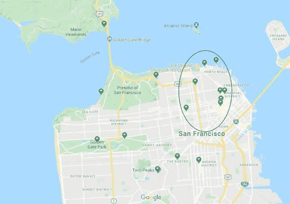
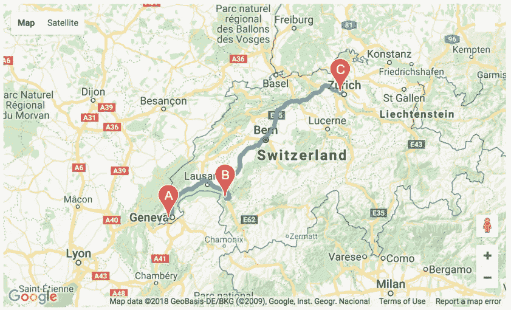

# 在众多旅游景点中寻找出路——城市行程规划者

> 原文：<https://towardsdatascience.com/find-your-way-out-of-a-mass-of-tourist-attractions-a-city-itinerary-planner-eb9c1731f851?source=collection_archive---------22----------------------->


来源:谷歌搜索

数据科学的最终目标是优化人们的生活，尤其是日常生活。从我的生活中找到真正的问题和不便，并利用技术工具来解决它，这正是我如何在这个寒假发现数据科学的魅力。

整个故事始于我的旧金山之旅，这是一个世界闻名但对我来说却有些陌生的城市。我知道我要去参观金门大桥、朗伯德街、斯坦福大学和其他著名的景点。然而，伴随我兴奋而来的是任何旅行中最烦人和最耗时的部分——为一天的往返行程制定一个有效的旅行计划。事实上，对于那些到一个不熟悉的城市旅行的人来说，规划行程是一个很常见的障碍，因为通常情况下，我们不知道每个景点的位置以及它们各自相对于彼此的方向，这使得设计一条精心规划的路线变得极其困难。我能做的最好的事情就是在谷歌地图上标出每一个感兴趣的地方，并根据我内置的雷达直觉设计一条旅行路线。大体上知道去哪个地区是容易的，但困扰我的是确定在一个区域内去的地方的具体顺序。例如，我知道我将在 SF 的东北部(在地图中圈出)度过我的第一天，但我很难立即找到最省时高效的路线来覆盖地图中所有标记的地方。此外，游客开始一天生活的最典型地点——住宿的酒店，将在很大程度上影响他们随后选择的路线。



*图 1:旧金山旅行的准备工作*

被每天规划旅行路线的不便所困扰，我转向算法来实现路线设计的自动化。这个项目的目标是解决一个痛点:我如何优化一天往返的路线？

# **数据收集**

我需要的数据无非就是地理信息。因此，唯一的数据来源是谷歌地图。使用了他们的几个应用程序接口(API)。具体来说，我需要旅游景点的名称，各自的经度和纬度，所在的城市，路线的长度，以及估计的乘车旅行时间。

# **假设**

我为这个项目做了几个假设。

1.源和目的地应该相同。在现实世界中，典型的一日城市游是往返旅行。我假设你旅行的起点是你住宿的地方，比如一个 Airbnb 公寓(我这里不是打广告)或者一个酒店房间。固定起点的目的是提供个性化的旅行路线，因为开始旅行的地点将在很大程度上影响当天剩余时间的旅行路线设计。此外，没有人喜欢在忙碌了一天游览城市后的游牧生活。

2.全程你都要开车。为了方便编程，运输工具固定为汽车。游客在旅游期间可能会改变停留的地点，以及他们选择交通工具的个人偏好。然而，在这个项目的最初版本中，这些可能性都被排除了。

# **背景**

我在访问 SF 时遇到的问题的本质是一个经典的动态规划问题——旅行推销员问题(TSP)。在 TSP 中，要问的问题是:“给定一个城市列表和每对城市之间的距离，访问每个城市并最终绕回到原始城市的最短可能路线是什么？”因此，处理这个问题的主要算法类似于 TSP 的解决方案。

# **让我们开始吧！**

该项目的蓝图如下:

Python 用于实现算法和数据信息检索。web 开发框架 Flask 用于嵌入 Python 脚本和制作交互式 web 用户界面(UI)。

步骤 1:定义一个 Python 函数，从 Google Map APIs 中检索两个地方之间的地理数据，以便 TSP 算法能够运行。

```
**import** tsp
**import** numpy **as** np
**import** requests
def get_api(source, dest):
    gmaps_key = 'YOUR GOOGLE MAP API'
    url ='[https://maps.googleapis.com/maps/api/distancematrix/json?'](https://maps.googleapis.com/maps/api/distancematrix/json?')
    r = requests.get(url + 'origins=' + source +
                     '&destinations=' + dest +
                     '&key=' + gmaps_key)
    x = r.json()
    x = dict(x)
    distance = str(x['rows'][0]['elements'][0]['distance']['text']).replace(" km", "").replace(",", "")
    return float(distance)
```

第二步:获取用户输入。用户可以输入他们旅程的起点/终点，以及他们想去的中间地点。

```
#determine the ending of a loop.
flag = 1
#geolist
list = []
# get the starting point
dimensions = input("please enter 1 to start your journey ...\nand enter 0 to end...")
if dimensions == "1":
    dimensions = input("\nplease input the source & dest to start your journey...")
    list.append(dimensions)
    while flag == 1:
            #prompt the in-between places
        dimensions = input("\nplease input any place within your journey...")
        if dimensions == "0":
            flag = 0
        else:
            list.append(dimensions)
else:
    print("\nyour journey ends...\n")print("the places you want to go are ",list," , and you want to go back to ",list[0]," after this busy day..")
```

步骤 3:用中间位置构建每个起点/终点，并将它们集成到配对元组中，并将它们推送到一个列表中。

```
#construct a source-destination pair
source_dest_pair = []
for i in range(0,len(list)):
    #source;
    source = list[i]
    for j in range(i+1,len(list)):
        #destination
        temp = []
        temp.append(source)
        dest = list[j]
        temp.append(dest)
        source_dest_pair.append(temp)
```

步骤 4:应用步骤 1 中定义的函数计算每对的距离。

```
#construct a list to get distance for each pair
distance_list=[]#calculate distance for each pair using get_api function
    for i in range(0,len(source_dest_pair)):
        distance_list.append(get_api(source_dest_pair[i][0],source_dest_pair[i][1]))
```

步骤 5:构建一个距离矩阵，其中存储了每对地点的对应距离。

```
distance_matrix=[]
for i in range(0,len(list)):
    temp_matrix = [0] * len(list)
    distance_matrix.append(temp_matrix)temp_list_row = distance_list.copy()for i in range(0,distance_matrix.__len__()):
    # for each source
    for j in range(i+1,distance_matrix.__len__()):
        distance_matrix[i][j] = temp_list_row.pop(0)temp_list_col = distance_list.copy()for i in range(0,distance_matrix.__len__()):
    # for each source
    for j in range(i+1,distance_matrix.__len__()):
        distance_matrix[j][i] = temp_list_col.pop(0)
```

步骤 6:将距离矩阵中的值转换为字典格式，这是 Python 中常用的键值对数据结构，也是 TSP 算法工作的兼容格式。然后，应用算法，得到最有效的出行路线。

```
r = range(len(distance_matrix))#construct a path matrix and put it into a dictionary
shortestpath = {(i,j): distance_matrix[i][j] for i in r for j in r}print("----------------------------------------------")
print("\nyour travel routine is ")for i in range(len(tsp.tsp(r,shortestpath)[1])):
    print(list[tsp.tsp(r,shortestpath)[1][i]],end=" -> ")
print(list[0],end="")
print(", and the total distance of travel is: ",tsp.tsp(r,shortestpath)[0], " km.")
```

这是该项目的视频演示。

项目演示

【http://uihojk.pythonanywhere.com/】点击以下链接，您可以尝试设计自己的旅行路线:

**注意:**出于认证目的，用户必须通过谷歌地图申请自己的 API，然后才能成功使用该产品。关于如何从 Google Maps 获取 API 的详细说明可以通过以下链接找到:

[](https://developers.google.com/maps/documentation/embed/get-api-key) [## 获取 API 密钥|地图嵌入 API | Google 开发者

### 新用户:在开始使用谷歌地图平台 API 和 SDK 之前，你必须注册并创建一个账单…

developers.google.com](https://developers.google.com/maps/documentation/embed/get-api-key) 

# **限制**

有几个限制。当我在考虑用户界面时，我发现谷歌地图上显示的计算出的有效路线是一种理想的可视化方式，让用户对他们将拥有的计划有一种直观的感觉。不幸的是，Google API 不允许任何包含方向层的 HTML 格式输出(如果我想显示路线，我需要添加一个方向层)。因此，包含方向和顺序引导的直接地图在本项目中不适用。



*图 2:最终输出的理想可视化效果*

与此同时，用户界面仍然是一项正在进行的工作，在功能和美学方面都有改进的空间。在当前版本中，最多总共有 10 个位置。但是，如果用户不想访问那么多位置，他们就被迫使用 0 来填充 web 表单中的空白。下一个版本将会有一个动态的网络表单，用户只需点击“再添加一个停靠点”按钮，就可以提示服务器提供额外的空间来添加位置。

此外，为了准确定位感兴趣的地方，我必须避免任何歧义(例如，具有相同的名称，但在不同的城市)，因此用户必须在每个地方后添加这些地方所在的城市名称。

过去，我一直认为很难产生一个好的商业想法。然而，请记住，数据科学源于日常生活，因此，请反思您的活动，并尝试解决您经常面临的问题。你可能会对身边等待你抓住的机会数量感到震惊——很多机会和有趣的东西其实就在我们身边。

# 参考

[https://en.wikipedia.org/wiki/Travelling_salesman_problem](https://en.wikipedia.org/wiki/Travelling_salesman_problem)

[https://jupyter-gmaps . readthedocs . io/en/latest/tutorial . html](https://jupyter-gmaps.readthedocs.io/en/latest/tutorial.html)

[https://console.developers.google.com/apis](https://console.developers.google.com/apis)