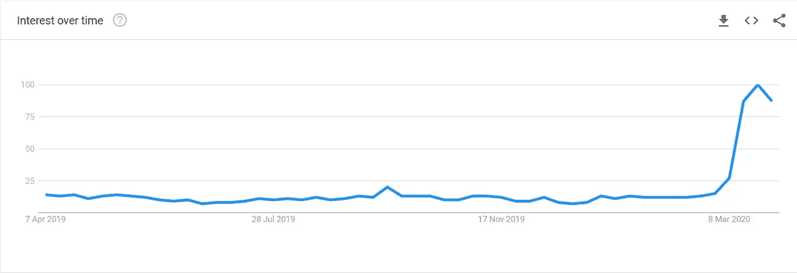
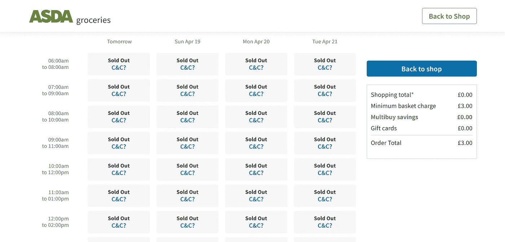
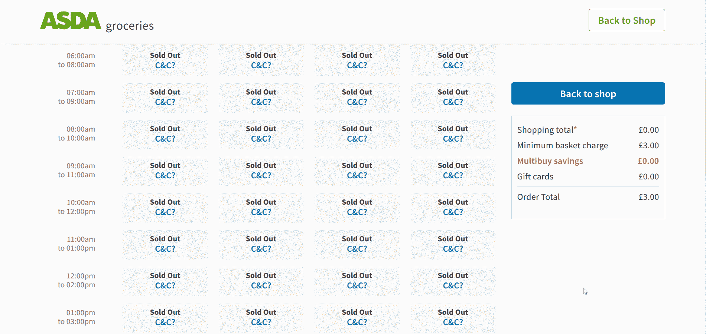
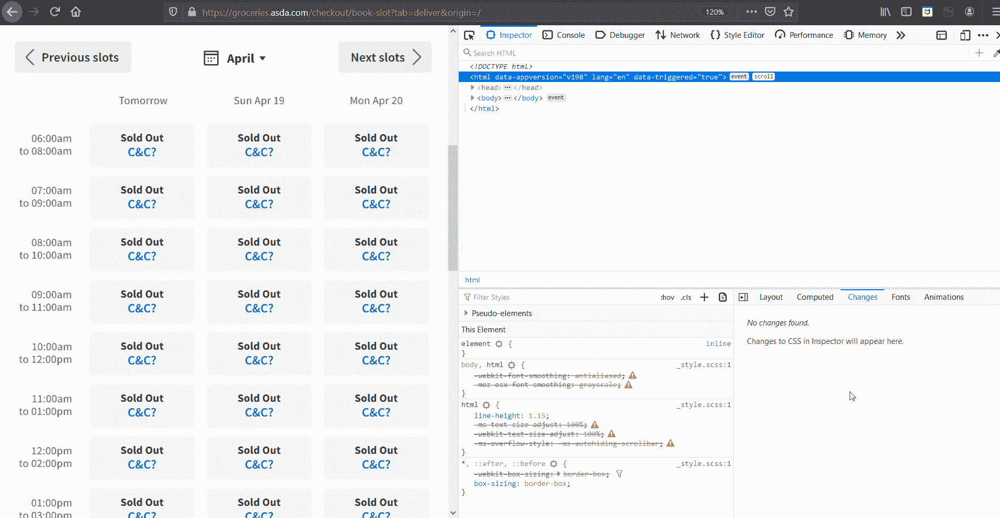
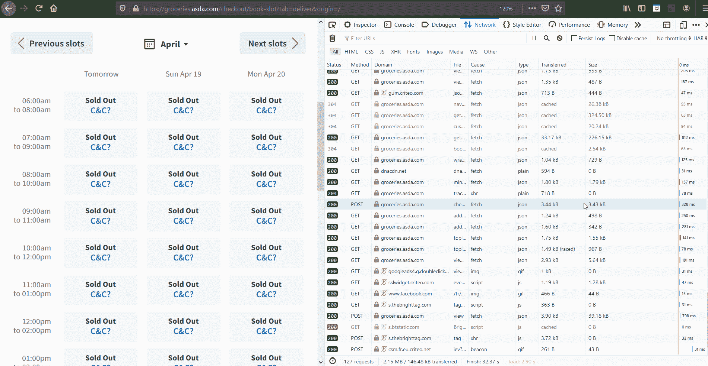
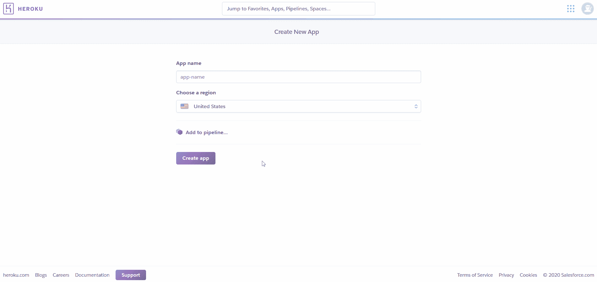
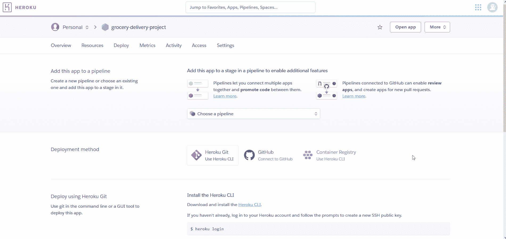
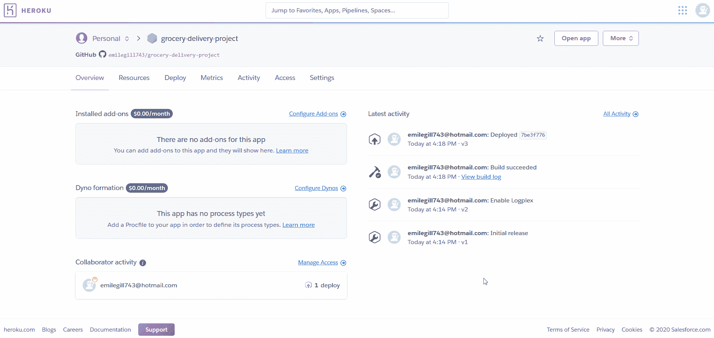

# 聪明的方法是找到一个杂货递送点

> 原文：<https://towardsdatascience.com/finding-a-grocery-delivery-slot-the-smart-way-f4f0800c4afe?source=collection_archive---------21----------------------->

## 使用 Python、Heroku 和 Twilio 从一个杂货网站的 API 中抓取数据，并在有空位时获得文本通知


照片由 [nrd](https://unsplash.com/@nicotitto?utm_source=medium&utm_medium=referral) 在 [Unsplash](https://unsplash.com?utm_source=medium&utm_medium=referral) 上拍摄

如果你还没听说，我们生活在**前所未有的**时代…



随着时间的推移,“史无前例”一词的使用。来源:谷歌趋势

前所未有的时代带来了新的挑战。其中一个问题是我们如何维持食品供应链，由于新冠肺炎病毒的传播，数百万人现在处于封锁状态。对于那些脆弱的、孤立的或者不能亲自去超市的人来说，唯一的选择通常是在网上预订超市送货位置。然而，随着对这些服务的巨大需求，找到一个可用的位置变得众所周知的困难——使得许多人不停地登录以检查位置。

这让我思考——随着我在生活中面临的问题越来越多——我如何使用 Python 来自动完成这个过程？

# 检查我们的杂货网站

我们实现某种形式的“自动递送槽检查器”的目标的第一步是弄清楚我们如何以编程方式从杂货店网站提取我们想要的数据。

在选择 [**Asda**](https://groceries.asda.com/) 作为我们的杂货网站之后，创建一个帐户，并输入送货邮政编码，我们就进入了 [**送货位置页面**](https://groceries.asda.com/checkout/book-slot?tab=deliver&origin=/) ，如下所示。



[Asda 交付槽页面](https://groceries.asda.com/checkout/book-slot?tab=deliver&origin=/)，显示我们想要抓取的数据。

在这里，我们可以看到一个整洁的日期，时间和每个位置的可用性表。不出所料，所有插槽目前都显示为“售完”。但是我们现在可以看到我们希望通过工具获取的目标数据。

下一步可能是最重要的一步。如果你以前做过网络抓取，或者从事过网络开发，你会很熟悉大多数主流浏览器内置的 **DevTools** 功能。对于那些不是这样的人，这些是一套工具，允许用户检查网页的幕后，检查 HTML，CSS，Javascript，以及-对我们的项目至关重要的-与服务器和我们的网页发出的网络请求相关的元数据。我们可以通过**在我们的网页上右键单击**并选择“**检查元素**”或键入 **Ctrl+Shift+I** 来访问 DevTools 选项卡(我使用的是 Firefox，但类似的过程也适用于 Chrome、Internet Explorer 等。).



访问 Firefox 开发工具

随着我们的 DevTools 窗口现在可见，我们可以开始在我们的网页中看到幕后发生的事情，使我们能够看到最新的插槽可用性表。导航到 DevTools 窗口的“ **Network** ”选项卡，我们现在可以访问我们的网站发出的所有网络请求，以获得我们可以看到的最新数据。刷新我们的网页将产生一个请求列表，其中一个请求必须包含找出我们的空位可用性数据来自哪里的关键。



追踪杂货网站发出的网络请求

这个列表最初可能看起来有点混乱，因为我们将有大量不同的请求，收集了从描述网页格式的 CSS 到确定网站功能的 Javascript 的所有内容。然而，我们感兴趣的是被收集起来并呈现在网页上的数据。因此，只过滤那些类型为' **XHR** ' (XMLHttpRequest)的请求，允许我们只关注那些从服务器请求数据的请求，忽略那些关注网页样式的请求。这仍然留下相当多的请求需要检查；幸运的是，赌上我们需要的请求将包含单词“slot ”,将我们的搜索缩小到只剩下四个请求。



过滤请求

点击一个请求并选择' **Response** '选项卡，显示请求产生的 JSON 响应，从而显示发送到网页的数据。由此，我们可以很快看出，包含我们正在寻找的数据的请求是对 URL 的一个 **POST 请求**，[**https://groceries.asda.com/api/v3/slot/view**](https://groceries.asda.com/api/v3/slot/view)。看一下' **Params** '选项卡，我们可以看到我们的浏览器在 POST 请求中发送的 JSON 数据，右键单击并选择' **Copy All** '将这些 JSON 数据复制到我们的剪贴板，这意味着我们拥有了向 Python 解释如何收集数据所需的一切。

# 使用 Python 发出 web 请求

Python 中的[请求库](https://requests.readthedocs.io/en/master/)使得以编程方式发出 HTTP 请求变得非常容易。从我们对网站的上述检查中，我们现在知道:我们需要向其发送请求的 **URL** ，我们需要使用的**请求类型**(POST)以及我们需要发送的 **JSON 数据**(当前存储在我们的剪贴板中)。

实际上，这留给我们下面的代码:

我们在这里所做的就是从剪贴板中粘贴出我们的 JSON 数据，并添加一个简单的请求，使用`requests.post()`方法的`json`参数将这些数据发送到我们的 URL。我们的请求响应对象现在存储在变量`r`中，以备后用。

我们还用变量替换了数据中的一些参数。`start_date`和`end_date`变量向 API 传递一个动态日期范围，因为我们总是对从当前日期算起的两周内的情况感兴趣。datetime 对象的`strftime`方法允许我们指定我们希望 datetime 对象采用的确切的字符串格式，这可以与我们在复制的初始 JSON 数据中检查的格式相匹配。

存储为`os.environ`变量的参数是我们不想在 GitHub 上公开显示的敏感信息。稍后，我们将看到如何安全地存储这些内容，以便部署到我们的脚本中。

我们现在有了一个全功能的 Python 脚本，我们可以用它来**向 Asda 的 API 发送一个请求**，并且**存储我们作为结果接收到的响应对象**。现在让我们看看这个响应对象，并探索如何解析它以提取我们正在寻找的数据。

# 解析 JSON 响应

我们的响应对象`r`包含从我们对 Asda 的 API 的 POST 请求中接收到的所有数据/元数据。我们应该检查的第一件事是我们对服务器的请求是否成功，或者在这个过程中是否出现了错误。为此，我们可以检查响应对象的`status_code`属性。

```
r.status_code # Inspect status code of response
```

如果这个没有返回`200`，那么这个请求就有问题了。在这种情况下，我们需要仔细检查 URL 和数据的格式是否正确。可能的 HTTP 状态代码的完整列表可以在[这里](https://en.wikipedia.org/wiki/List_of_HTTP_status_codes)找到；但是，一般来说，我们会收到一个表示' **OK** 的`200`代码和一个分别表示' **Bad Request** '和' **Not Found'** 的`400`或`404`代码。

假设我们已经收到了一个`200`状态代码，我们现在准备检查我们在响应中收到的数据。因为以 JSON 的形式接收数据是很常见的，所以 requests 带有一个内置的 JSON 解码器。

```
r.json() # Decoding JSON response content
```

将`r.json`的值打印到终端将会很快显示出我们已经从服务器收到了大量与插槽可用性、价格、容量等相关的数据。因为我们主要对项目中的插槽可用性感兴趣，所以我们可以遍历这个 JSON 响应并用插槽和可用性填充一个字典。

我们首先循环查看我们所要求的两周内的每个时间段，然后在每一天内检查每个单独的时间段，填充我们的字典:

现在我们已经有了所有需要的数据，并且有了一种在我们需要的时候以编程方式提取数据的方法，让我们看看如何设置一种方法，以便在发现一个交付位置可用时通知我们的最终用户。

# Twilio —使用 Python 发送文本


[Alex Ware](https://unsplash.com/@alexbeware?utm_source=medium&utm_medium=referral) 在 [Unsplash](https://unsplash.com?utm_source=medium&utm_medium=referral) 上拍摄的照片

Twilio 是一个云通信平台，提供 API，使开发人员能够在他们的应用程序和项目中发送和接收短信和电话。这为自动短信通知、双因素认证、构建聊天机器人等打开了一个潜力无限的世界。在我们的例子中，我们将**创建一个简单的文本通知系统**，这样每当我们的脚本运行时，我们都会收到一个文本，详细说明任何可用的交付时间段。

虽然 Twilio 是一项付费服务，但他们提供了大约 13 英镑的免费试用余额。这足够让我们开始这个项目了——因为发送一条短信大约需要 0.08 英镑。为了**开始使用 Twilio** ，我们需要做的就是 [**在他们的网站上注册**](https://www.twilio.com/try-twilio) (不需要支付细节)并选择一个电话号码。一旦完成，Twilio 将为我们的项目提供一个帐户 SID 和认证令牌。

一旦我们都设置好了 Twilio 帐户，我们就可以开始使用 Twilio 提供的 Python API 了。Python 的 Twilio 模块可以简单地通过 pip 安装。

```
pip install twilio
```

Python 的 Twilio API 非常容易上手，在 https://www.twilio.com/docs 有大量的文档。要用我们新获得的电话号码发送短信，我们只需要以下信息:

```
from twilio.rest import Client

client = Client(account_sid, auth_token)

message = client.messages.create(
                             body='message text',
                             from_='+15017122661',
                             to='+15558675310')
```

将此合并到我们的脚本中以获得可用的交付时段，我们现在可以检查任何可用时段的数据，如果存在，就向我们选择的电话号码发送一条文本，通知我们选择的电话号码。这在我们脚本的最后一部分进行了概述:

我们现在有了一个完整的脚本，使我们能够在 Asda 检查可用的交付槽，如果有可用的话，通过文本接收通知让我们知道。我们项目中剩下的唯一一步是找到一种方法让我们的脚本按照计划自动运行。

# 部署到云— Heroku


eberhard grossgasteiger 在 [Unsplash](https://unsplash.com?utm_source=medium&utm_medium=referral) 上拍摄的照片

[Heroku](https://www.heroku.com/) 是一个云计算平台，支持开发者轻松**将应用和项目部署到云**。它在以最少的设置启动和运行 web 应用程序时特别有用:使其成为个人项目的理想选择。在这里，我们将使用 Heroku 作为一种简单的方式，让我们的脚本在云中以预定的时间间隔运行。

你可以报名**在这里与 Heroku [一起开始](https://signup.heroku.com/login)**。

我们需要采取的第一步是创建一个新的应用程序来存放我们的项目:



为了让我们的脚本在云上运行，我们需要**创建一个新的包含我们脚本的 GitHub 库**。你可以在这里 找到我的 [**供参考。我们还需要创建一个名为`requirements.txt`的文件。这将包含我们需要告诉 Heroku 在成功运行我们的脚本之前安装的所有包依赖项。**](https://github.com/emilegill743/grocery-delivery-project)

然后，我们可以将应用程序连接到刚刚为项目创建的 GitHub 存储库。启用'**automatic deployments**'**意味着当我们推进到我们的主分支时，我们的项目将自动部署最新的更新:如果我们希望在产品化的同时继续开发我们的项目，这是很有用的。**

****

**从 GitHub 部署 Heroku 应用程序(为演示加速)**

**正如我们前面提到的，在我们的脚本中有几个变量我们希望保持隐藏。我们可以使用 Heroku 应用程序的' **Config vars** '设置来实现这一点，这是一种在我们的项目中存储敏感信息的便捷方式，这些信息可以作为环境变量轻松访问:**

****

**剩下的唯一一步是让我们的脚本按照计划自动运行。为此，我们需要安装一个附加到我们的应用程序。 **Heroku scheduler** ，可以在这里[](https://elements.heroku.com/addons/scheduler)**安装，让我们每 10 分钟、小时、天运行一次任务。****

****一旦我们安装了 Heroku scheduler，我们就可以创建一个新的作业，这将允许我们选择我们的计划频率和我们想要运行的命令。由于插槽往往运行得很快，所以 10 分钟的频率可能是我们计划作业的最佳频率。我们想要的运行命令只是运行我们的 python 脚本:****

```
**python get-grocery-delivery-slots.py**
```

****我们现在可以高枕无忧，等待我们的短信通知来了！****

# ****结束语****

********

****权力越大，责任越大。来源: [knowyourmeme](https://knowyourmeme.com/photos/1466254-spider-mans-presentation)****

****在这个项目中，我们已经看到 Python 在为我们自动化任务方面是多么强大。但是我们知道，**伴随着巨大的力量而来的是巨大的责任。******

****考虑到我们为这个项目反向工程的 API 可能不是为公共使用而设计的，我们应该尊重地使用它，并记住这一点。从理论上讲，我们现在有能力向服务器发送比人类使用 web 界面所能做到的更多的请求。虽然人们会期望一家大公司有适当的保护措施来阻止行为不端的 IP 地址，但我们不应该得寸进尺。坚持原则上可以手动执行的操作可以确保我们尊重这种公平使用。****

****此外，仅仅因为我们现在有效地拥有了一个位置可用性的预警系统，并不意味着我们应该在不需要的时候预订位置。这个项目的动机源于对投递位置稀缺和许多人在寻找投递位置时所面临的困难的认识。因此，我们应该非常清楚这对社会中最弱势群体造成的障碍:对他们来说，这不是一种便利，而是一种必要。****

****也就是说，我们在这个项目中开发的技能为进一步的项目打开了一个**可能性的世界:******

*   ****我们现在可以使用 DevTools 检查网站，对 API 进行逆向工程，并使用 Python 的请求库提取数据:这给了我们从几乎任何公开网站提取数据所需的基本技能。****
*   ****我们使用了 Twilio，这是一个允许我们发短信和打电话的通信 API。这不仅为我们提供了一种通过文本接收或发送通知的便捷方法，还为我们打开了 Twilio 的更多可能性:聊天机器人、警报系统、机器人呼叫者等。****
*   ****我们将我们的项目部署到 Heroku，允许我们的脚本在云上按计划自动运行。这是一项很棒的技能，它消除了必须在笔记本电脑或 PC 上运行脚本的本地依赖性，并给了我们一个在网络上展示我们项目的绝佳机会。****

*******感谢阅读！*******

****这个项目的所有源代码都可以在这里找到:****

****[](https://github.com/emilegill743/grocery-delivery-project) [## Emile gill 743/杂货交付项目

### 项目从一个杂货网站的 API 抓取数据，并在有空位时获得文本通知。…

github.com](https://github.com/emilegill743/grocery-delivery-project)****