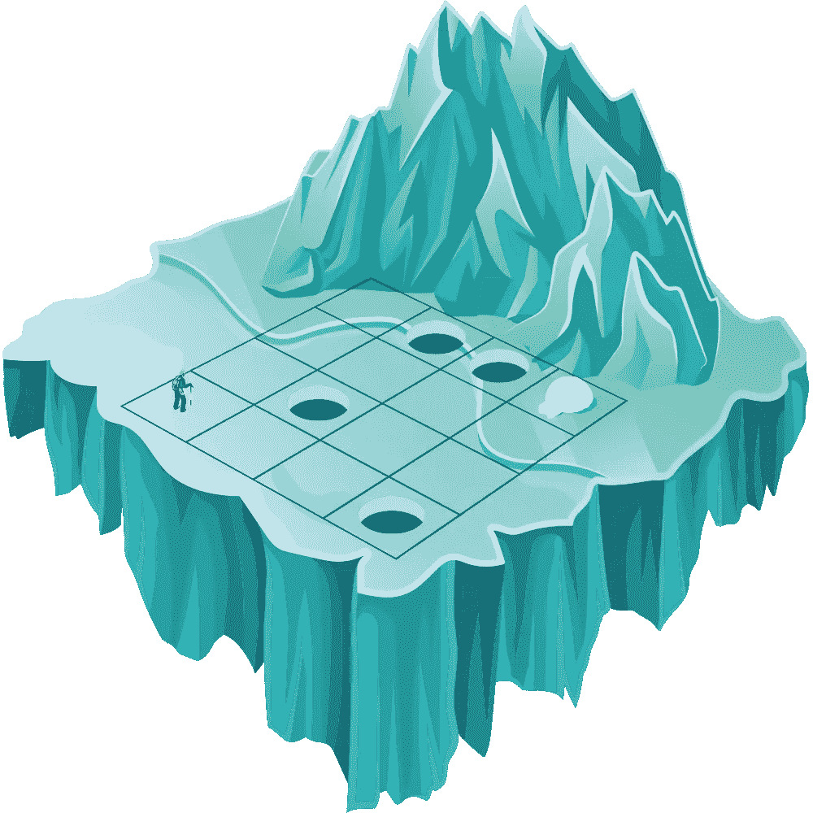
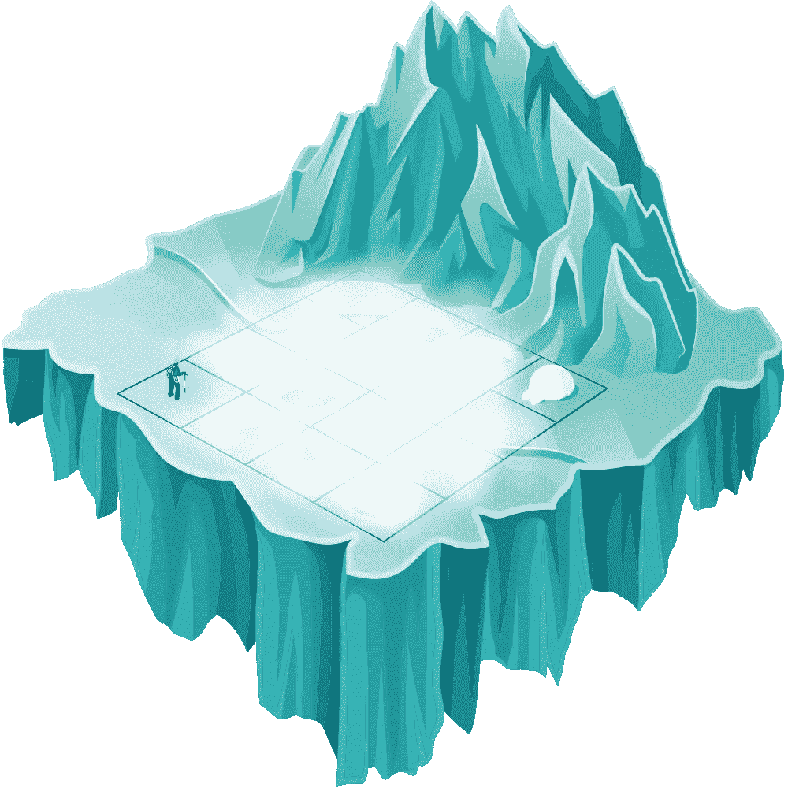
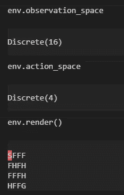
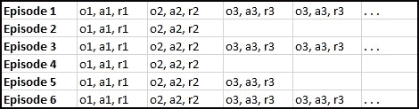
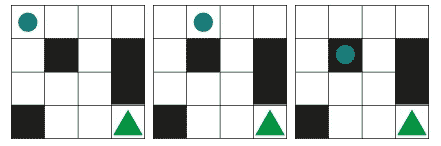

# 用强化学习找到一条通往雾湖上冰屋的路

> 原文：<https://towardsdatascience.com/finding-a-way-to-an-igloo-on-a-foggy-lake-with-reinforcement-learning-abac293d798d?source=collection_archive---------71----------------------->

## 在“frozenlake-nonslippery”环境下使用交叉熵方法开始强化学习。

环境中的智能体随着时间的推移对最优决策的学习通常是如何定义强化学习的。

在高层次上，有几种强化学习的方法，以一种过于简化的方式分类和解释如下:

**1。** **无模型还是有模型:** a. **无模型:**代理先行动后思考的蛮力法。
b. **基于模型:**代理根据历史数据做出预测，根据预测采取行动。

**2。** **基于价值还是基于政策:** a. **基于价值:**从一个环境的给定状态中，代理人可以获得的总报酬折现。
b. **基于策略:**当一个 agent 有很多动作空间，有了策略，解释器(we)就会控制 agent 的状态和动作。

**3。符合政策还是不符合政策:** a. **符合政策**:学习是所采取的行动及其对国家的影响的结果。
b. **非政策**:学习是几个行动的结果，然后累积奖励。

**交叉熵方法**是一种无模型、基于策略、基于策略的方法。

# **在结冰的湖面上:**

环境是一个冰冻的湖，一个代理试图到达一个目的地。

# 挑战

湖面上覆盖着冰和浓雾。对我们来说，冰原上有已知的开口，但特工并不知道。

代理人穿着钉鞋，以防止他转弯时在冰上滑倒。

演员的能见度也很差，导航也是一个挑战。对这个演员来说，每一步都是信念的飞跃。

这是一个生存游戏，目标是回家。因此，只有当我们到家时，才会收到奖励“1”。在余下的旅程中，我们的假设是，我们活着是为了迈出新的一步。

我们没有从生存的环境中得到任何回报。

将案例转换为确定的非连续场景:

Lake 是一个 4x4 的网格，代理可以上下左右移动。因此，观察空间从 0 到 15 是离散的，动作空间从 0 到 3 也是如此。

让我们继续创建一个类，通过使用 onehot 编码将观察空间和动作空间转换为二进制。

在代码中，我们的环境看起来像这样:

# **交叉熵方法:**

由于这是一种基于策略的方法，神经网络(非线性函数)确定代理人应该采取的行动，以使回报最大化。

该方法的步骤:

1.  使用当前模式和环境播放“n”集。
2.  计算每集的总奖励，并确定一个奖励范围。通常，我们使用所有奖励的某个百分点，比如第 50 到第 70。
3.  扔掉所有低于界限的有奖励的剧集。
4.  将观察结果作为输入，将发布的行动作为期望输出，对剩余的“精华”片段进行培训。
5.  从第一步开始重复，直到我们对结果满意或达到目标。

在我们冰冻的湖泊环境背景下，让我们看看“第二集”:

观察 1: **o1** =像素 1，1， **a1** = 0， **r1** = 0
观察 2: **o2** =像素 1，2， **a1** =右， **r1** = 0
观察 3: **o2** =像素 2，2， **a1** =下， **r1** = 0(结束

# **解决奖励问题:**

我们将通过引入折扣系数为 0.9 到 0.95 的总奖励来解决奖励检测进度的问题。

这都是在 filter_batch 函数中引入的:

我们会将成功的剧集或播放时间较长的剧集保留更长时间，以便模特可以从中学习，并通过降低学习速度来花更多时间学习。

# 结论和实用性:

尽管在我们的日常生活中，我们并不挣扎着寻找回家的路，我们也知道目的地，但与深度学习领域相比，冰湖或强化学习领域中的任何其他案例都被批评为与企业世界无关。

强化学习本身依赖于深度学习世界中现有的方法。在强化学习中，我们看待问题的方式是不同的。

作为欺诈检测的一个示例，我们将不得不创建一个环境，其中包含欺诈者和客户的丰富信息。然后，我们将需要一个代理人谁将试图检测和解决欺诈的个人资料。

这将使我们能够根据欺诈可能存在且不在我们覆盖范围内的可能性来训练模型。

如果你已经到了这一步，感谢你阅读这个故事，你可以在这里获得完整代码[。](https://gist.github.com/alaizaz/5ae4ad843ba7b68fb7be38797450816a.js)

# 来源:

非常感谢马克西姆·拉潘，他的书[“深度强化学习实践”](https://www.amazon.co.uk/Deep-Reinforcement-Learning-Hands-optimization-ebook/dp/B07ZKDLZCR/ref=sr_1_1?crid=2KCF37GX8TAHM&dchild=1&keywords=deep+reinforcement+learning+hands-on&qid=1587922972&sprefix=deep+reinfocr%2Caps%2C151&sr=8-1)帮助我开始了强化学习的世界。