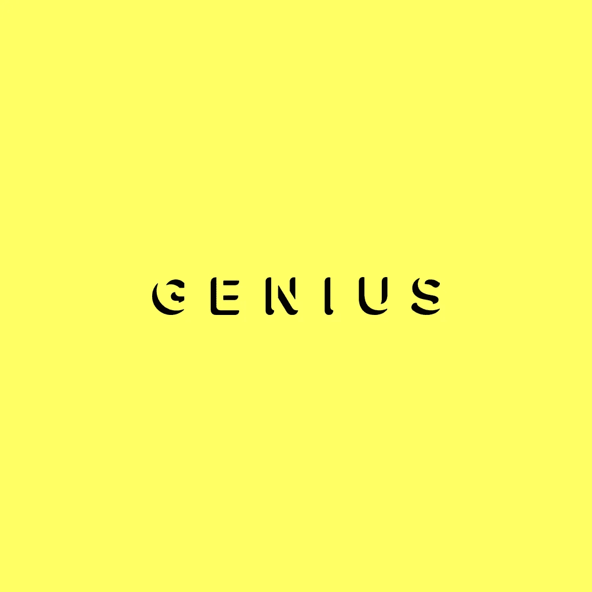
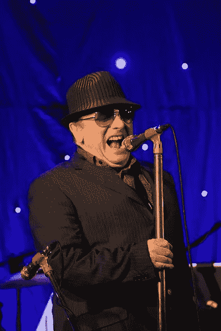
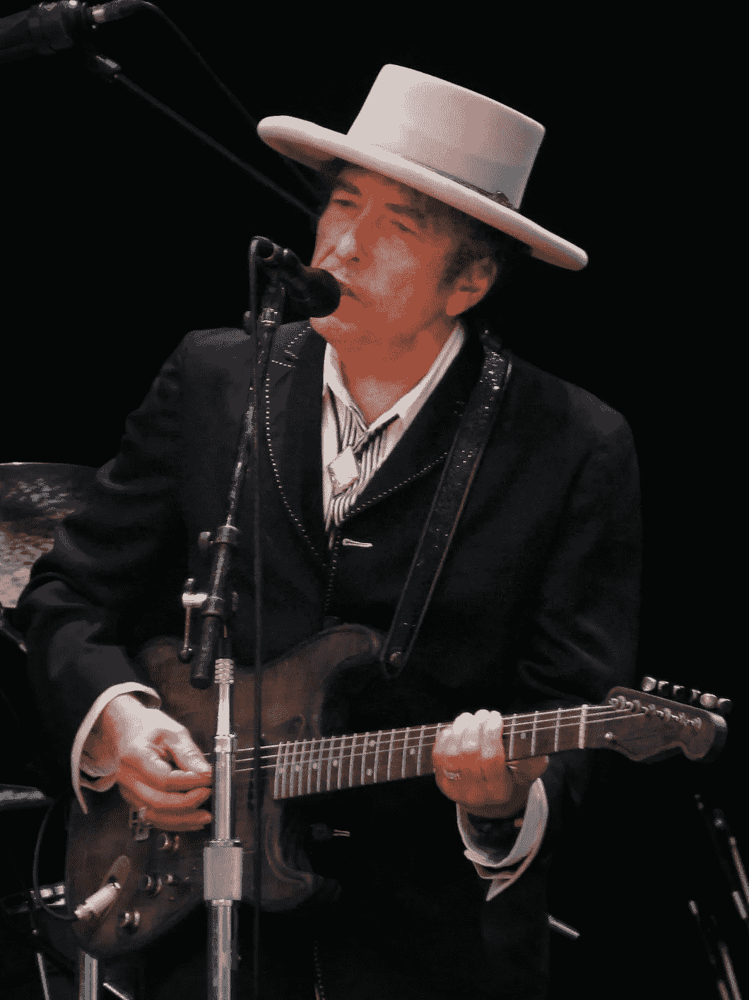
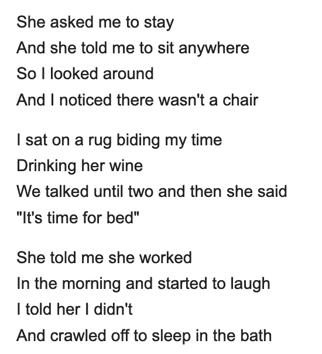
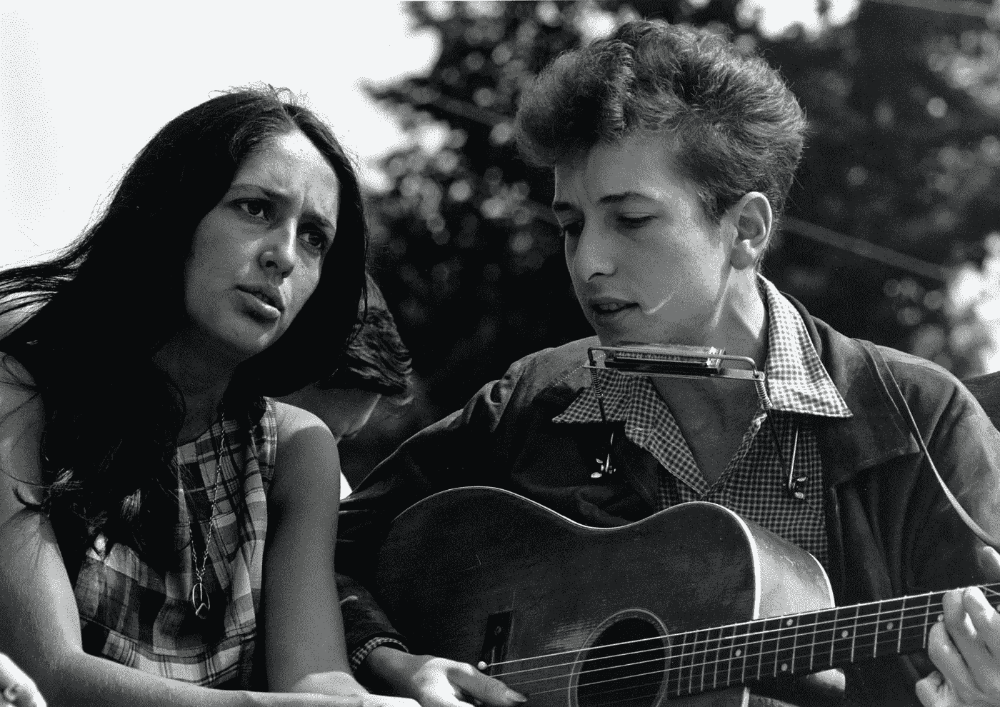
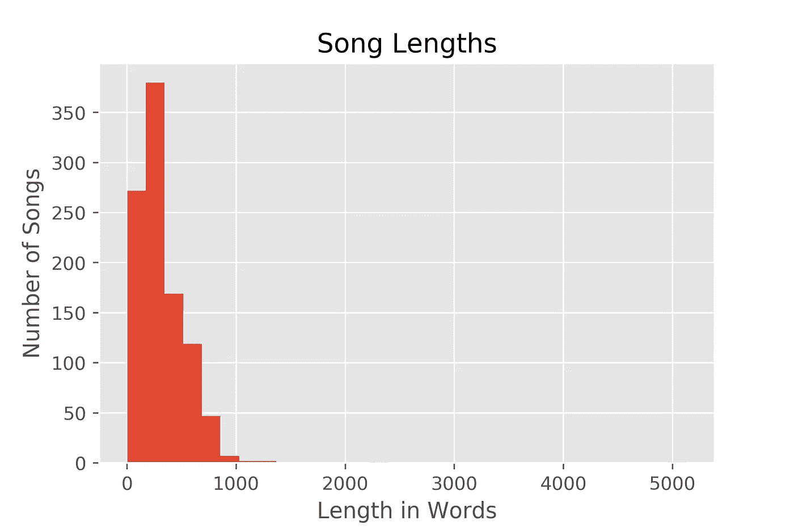
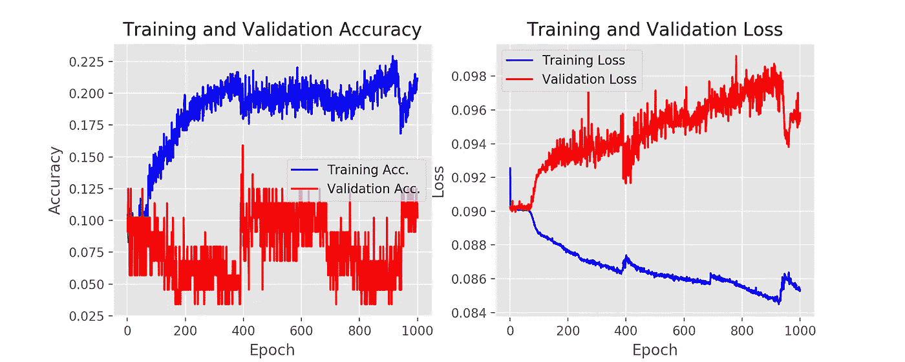
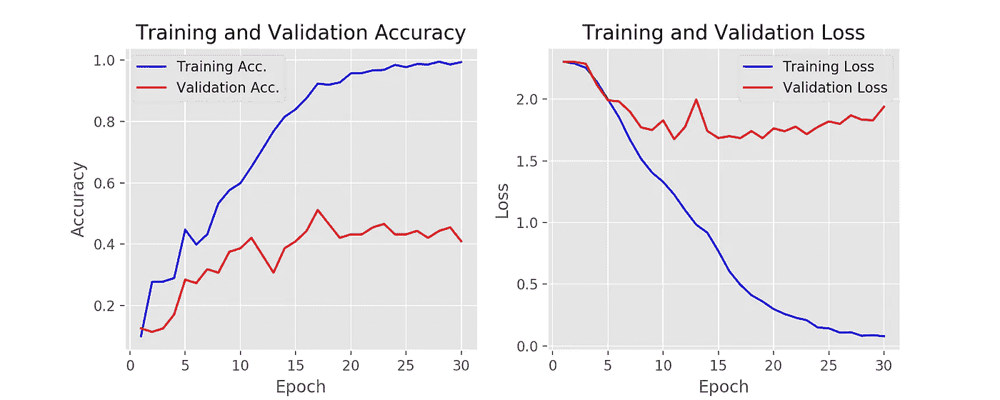

# 使用神经网络寻找作家的风格

> 原文：<https://towardsdatascience.com/finding-a-writers-style-using-neural-networks-a1c3efcb186b?source=collection_archive---------36----------------------->

## 使用 Genius API 训练歌词的网络模型

迈克尔·达茨、邓肯·格拉布斯和姬满·金

([https://genius.com/](https://genius.com/)

# 介绍

每个作家都有自己的风格。成为一个知名且受人尊敬的作家的部分关键是磨练这种风格，创造出完全属于你和你的生活经历的东西。音乐作为一种艺术形式，允许一种完全独特的表达形式，一些艺术家在他们的作品中确实是无与伦比的。作为热爱音乐的学生，我们已经看到了神经网络在文本分类方面的能力，我们想测试这样一个网络的边界。

仅仅通过看歌词，你能区分范·莫里生和鲍勃·迪伦的歌曲吗？(维基百科)

我们正在研究的问题对一个人来说已经够难了。单看歌词，你能说出是谁写的吗？

从这些歌词中，可能很难看出是谁写的，除非你对乐队和相关的词曲作者都非常熟悉。

事实上，我们甚至很难做出一个有根据的猜测——我们需要更多的背景知识，然后才能开始给出答案。

这些歌词显然来自甲壳虫乐队的“挪威的森林(这只鸟已经飞了)”，由列侬和麦卡特尼共同创作。

考虑到这一点，我们不仅要在广泛的艺术家上训练我们的网络，还要对他们的目录进行深度采样，这样我们才能提供模型需要的背景，以便给出答案。

我们通过这个神经网络项目的目标是看看一个网络是否能够发现和学习艺术家的风格，并能够预测谁写了一组歌词。这个想法是，给定足够的数据，模型可以根据流行艺术家的歌词进行训练，并能够将后来的输入分类为给定的艺术家。

# 在我们开始之前…

本文假设您对神经网络及其概念有基本的了解。我们将讨论编程语言 Python，以及我们用来构建网络的各种库。

至于数据，我们使用了 Genius API——一个允许我们连接到网站并收集所需数据的接口。我们能够使用 LyricsGenius Python 库访问这个 API 这使得查询变得更加容易。我们假设观众熟悉用于创建神经网络的库，如 Keras 和 TensorFlow。

 [## Home - Keras 文档

### Keras 是一个高级神经网络 API，用 Python 编写，能够运行在 TensorFlow、CNTK 或……

keras.io](https://keras.io/)  [## API 文档| TensorFlow Core v2.1.0

### TensorFlow 提供了几种语言的 API，用于构建和执行 TensorFlow 图。巨蟒…

www.tensorflow.org](https://www.tensorflow.org/api_docs) 

# 收集数据

这种方法的第一步是收集数据。虽然在 Kaggle 等网站上有许多歌词存储库，但我们发现，虽然这些文件中有许多艺术家，但他们没有足够的每位艺术家的歌曲，无法让网络对歌词风格有更深入的了解。

我们决定使用 Genius 的数据，这是一个歌词网站，人们可以在上面添加注释和评论歌曲。Genius 是由用户编写的，类似于维基百科，但在被审核为正确之前，也会与官方歌词数据和其他来源进行交叉引用。如前所述，Genius 是使用 LyricsGenius Python 库查询的。

 [## johnwmillr/lyricsgius

### lyricsgenius 为存储在 Genius.com 上的歌曲、艺术家和歌词数据提供了一个简单的接口。在使用这个之前…

github.com](https://github.com/johnwmillr/LyricsGenius) 

Genius 有一个非常大的众包歌词库，不仅可以很容易地找到各种各样的艺术家，而且如果他们的唱片目录足够大，还可以给我们足够的数据。考虑到我们选择调查的艺术家，找到大量的歌曲样本并不是什么大问题。

鲍勃·迪伦和琼·贝兹，两位美国最著名的民谣歌手(维基百科)

我们想用这些数据确定的一件事是，这些歌曲主要是由表演艺术家创作的。现在一个艺人有一个词曲创作团队是很常见的，这当然有助于形成风格，但也可能会脱离艺人的个人风格。也就是说，我们选择了职业生涯跨度很长的艺术家，主要是像鲍勃·迪伦这样的创作歌手。然而，我们发现这不仅难以持续，因为在任何特定的轨道上也可能有未被编辑的作家。

考虑到这一点，我们选择了 10 位知名艺术家开始，并从他们的 100 首歌曲中收集歌词。我们选择了有深度唱片的艺术家，他们每个人都能轻松地给我们 100 首歌。根据 Genius 的 API，这些歌词来自 Genius 网站上他们最受欢迎的 100 首歌曲。

我们为这个项目选择的艺术家

# 方法

收集完数据后，我们必须清理它。Genius API 不仅提供了歌曲的歌词，还提供了注释数据，这些数据对我们的项目并不重要。使用一个脚本，我们清理了文件，这样我们就只有歌词的原始文本，而没有其他内容。这被编译成 JSON 文件。

我们的 JSON 清理脚本

考虑到数据的大小，以及歌曲长度的范围，我们也选择将歌曲限制在 100 个词以内。这个限制将为每首歌曲提供一个标准，以防一些艺术家倾向于更长的歌曲。一旦数据被清除，我们需要一种方法将数据输入到我们的网络中。我们通过标记给定歌曲中的所有歌词来做到这一点。所以每个单词都有一个值，可以根据我们的需要馈入网络。

歌曲长度有很大的可变性。

# 符号化

标记化的一般思想是为每个单词创建一个唯一的数字表示，以便可以输入到网络中。在这种情况下，每首歌曲将被表示为一个数字向量，而每个艺术家将被表示为一个 10 向量的一键编码。我们会把这些输入到网络中，作为模型训练的一部分。

我们标记输入的方法

# 网络

在项目开始时，我们从 Keras python 库中的一个简单的顺序网络开始。虽然我们已经得到了结果，网络的性能很差。我们发现网络很快就达到了一个上限，不会再改善了。

顺序模型的输出

正如您在这里看到的，我们的训练准确性高于验证准确性，这是可以预期的，但总体而言，这两个值都非常低，只有 20%的准确性。产量如此之低，我们认为最好寻找一种新的方法。

 [## 基于 LSTM 的多类文本分类

### 如何开发 LSTM 递归神经网络模型的文本分类问题在 Python 中使用 Keras 深…

towardsdatascience.com](/multi-class-text-classification-with-lstm-1590bee1bd17) 

找到这篇文章后，我们选定了一个 LSTM 网络，它可以在文本分类中提供更好的结果。使用 LSTMs 是解决这类问题的一种非常常见的方法，并且已经得到了广泛的研究。LSTMs 对于这种类型的问题很常见，因为它们可以记住过去的数据序列。

正如您在下面的结果中所看到的，训练准确率非常接近 100%，而验证准确率上限在 40%左右。不过，应该提到的是，这些结果是在 30 个时期后获得的，而我们之前的模型需要数百个时期。

也就是说，当我们发现我们的训练精度非常高，而我们的验证精度相对较低时，我们再次遇到了障碍。只有 40%的验证准确率和超过 90%的训练准确率，网络显然是过度拟合的。

我们新的 LSTM 模型的输出

为了解决这个问题，我们相信我们需要更多的数据和更广泛的种类。例如，包括整首歌曲而不在 100 个单词处切断它们，或者向输入中添加歌曲的不同度量，例如平均单词长度和情感。虽然这些变化是可能的，但对于我们可用的基本技术和有限的存储来说是困难的。最重要的是，网络可以通过试错法以小的方式进行修改，以便在这种特定的环境中运行良好。

# 结论和进一步的项目

在这个项目之后，我们可以得出结论，我们的文本分类离能够分析歌曲歌词这样的风格化散文还有很长的路要走，特别是在我们能够使用的少量数据的情况下。尽管我们收集的结果很新颖，但我们发现再次探讨这个话题需要更多的数据。也就是说，这个话题是有潜力的。

虽然我们没有达到预期的业绩，但通过这次调查，我们还是学到了很多东西。在训练网络后，我们输入了它以前见过和没见过的艺术家的歌词，结果很有趣，给出的结果会比有根据的猜测更好。

虽然电视网之前看过披头士和泰勒·斯威夫特，但没看过德雷克和 ACDC。通过输入网络从未见过的数据，我们可以从一个新的角度了解我们的模型如何对歌词进行分类。当德雷克输入歌词时，模型输出这首歌是李尔·韦恩写的，这是一个可以理解的猜测。

虽然当 AC/DC 的“黑色归来”输入时，模型输出这首歌是 j .科尔写的。关于模型学习有一点要说——当我们输入已经被网络看到的歌曲时，正确的艺术家被输出。

> 德雷克，“上帝的计划”->李尔·韦恩
> 
> AC/DC，《黑色归来》-> J .科尔
> 
> 甲壳虫乐队，《嘿，裘德》->甲壳虫乐队
> 
> 泰勒·斯威夫特，《情人》->泰勒·斯威夫特

如前所述，是有潜力的。不仅在歌词分类中，而且在 NLP 文本作者分类的更广泛的问题中。这可以被情报机构用来识别谁写了电子邮件或短信，或者被谷歌和苹果这样的公司用来自动识别新电子邮件和短信的作者。

点击查看 Github [上的所有源代码和数据。](https://github.com/duncangrubbs/lyrics-to-artist)