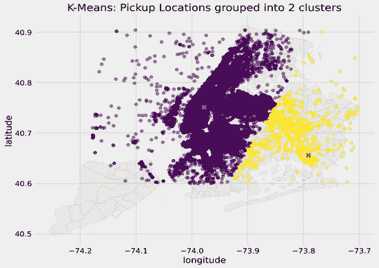
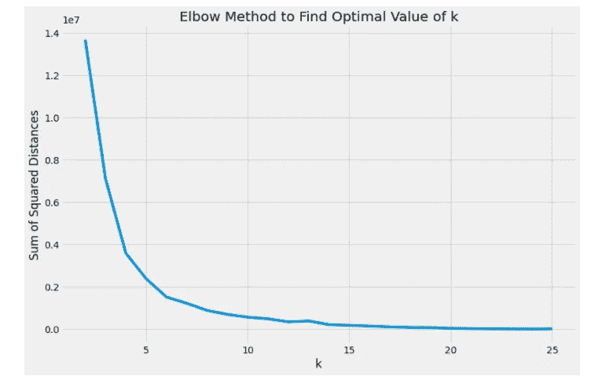

# 查找和可视化地理空间数据聚类

> 原文：<https://towardsdatascience.com/finding-and-visualizing-clusters-of-geospatial-data-698943c18fed?source=collection_archive---------8----------------------->

## 如何使用 geopandas 和 matplotlib 绘制地理位置坐标和聚类中心

处理地理空间数据时，查找纬度和经度坐标的聚类通常很有用，这可以作为机器学习模型的数据预处理步骤，也可以作为分段分析的一部分。但是，一些与查找地理空间聚类相关的常见问题包括:

*   哪种聚类算法最适合您的数据集？
*   哪些坐标属于哪些集群？
*   每个集群的边界在哪里/坐标是如何分离的？

我最近参加了一个来自 2017 年的 [Kaggle 竞赛](https://www.kaggle.com/c/nyc-taxi-trip-duration)，主要从地理空间和时间特征来预测出租车旅行持续时间(见帖子[此处](https://medium.com/analytics-vidhya/feature-engineering-with-geospatial-data-predicting-nyc-cab-trip-duration-a121ec16021b))。我做的一个预处理步骤是将地点分成 20 个组，并找出每个组中的接送人数，以获得组密度/交通的代理。

在本文中，我将展示如何使用 matplotlib 和 geopandas 在地图上可视化经纬度坐标和聚类中心。下面是我的数据集的不同聚类的样子，不同的值从 2 到 25 个聚类不等。不同颜色的点表示拾取位置以及使用 K-Means 聚类识别的它们所属的聚类，红色的叉表示聚类中心。



k 值从 2 到 25 的聚类坐标

## 选择聚类算法

有几种无监督学习方法可以从数据集中找到具有相似属性的聚类，包括 K-Means 聚类、凝聚聚类和 DBSCAN。由于我正在处理一个几乎有 150 万个数据点的大型数据集，所以我选择使用 scikit-learn 的`MiniBatchKMeans`，这是 K-Means 聚类的一个版本，它使用迷你批次来加速这个过程。

K-Means 聚类中的一个参数是指定聚类的数量( *k* )。寻找 k 最优值的一种流行方法是肘法，在这种方法中，绘制距离平方和与 k 值的关系图，并选择拐点(收益递减点)。

```
ssd = []for i in range(2, 26):
    km = MiniBatchKMeans(n_clusters=i)
    km.fit_predict(df_pickup_filtered)
    ssd.append(km.inertia_)
```



该图显示了距离平方和与 K 值(K 均值算法中的聚类数)的关系

elbow 方法建议，对于这个数据集来说， *k* 的最佳值是 6。由于纽约是一个大城市，6 个集群是否足够细化？为了进行检查，我将继续观察应用于该地理空间数据集的不同 k 值*的聚类。*

## 可视化集群

为了在纽约市的地图上可视化地理位置聚类，我编写了一个函数，允许您在纽约市的地图上绘制您的经纬度坐标和聚类中心。以下是该功能的细分:

1.  **将地理位置数据框架转换成地理数据库数据框架**

这个数据集中的地理位置来自一个. csv 文件，我用 python 中的 pandas 导入了这个文件。为了将它绘制到地图上，我们必须首先将这个常规的熊猫数据帧转换成地理熊猫数据帧

```
geo_df = gpd.GeoDataFrame(df.drop(['longitude', 'latitude'], axis=1), crs={'init': 'epsg:4326'}, geometry=[Point(xy) for xy in zip(df.longitude, df.latitude)])
```

**2。导入城市或地区的形状文件**

Geopandas 具有可在国家级别导入的形状文件，但要获得更详细的信息，您必须下载一个形状文件并使用 geopandas 手动导入。

在我的例子中，我去了 [NYC OpenData](https://data.cityofnewyork.us/City-Government/Borough-Boundaries/tqmj-j8zm) 并在`Export > Download > Download Geospatial Data > Shapefile`下下载了 shapefile。您可能希望将形状文件移动到可以从 Python 轻松访问的目录中，但请记住移动整个目录，因为 geopandas 无法仅使用。shp 文件！

获得形状文件后，您可以使用 geopandas 导入它们，并将其添加到您的绘图中。我将 shapefile 的 *zorder* 设置为 1，以表示它应该在我稍后将使用更高的 *zorder* 绘制的数据点之后。

```
# Set figure size
fig, ax = plt.subplots(figsize=(10,10))
ax.set_aspect('equal')

# Import NYC Neighborhood Shape Files
nyc_full = gpd.read_file('./shapefiles/neighborhoods_nyc.shp')
nyc_full.plot(ax=ax, alpha=0.4, edgecolor='darkgrey', color='lightgrey', label=nyc_full['boro_name'], zorder=1)
```

**3。在城市地图上绘制坐标**

随着城市地图的绘制，我们现在可以将我们的纬度和经度坐标添加到我们的绘图中！我们所要做的就是在我们的 geopandas 数据帧上调用`.plot()`,并将 *zorder* 设置为 2，以便我们的坐标位于城市地图的顶部。你可以自定义地图的颜色方案，matplotlib 的颜色图中有很多可供选择。

```
geo_df.plot(ax=ax, column=cluster, alpha=0.5, cmap='viridis', linewidth=0.8, zorder=2)
```

**4。绘制聚类中心**

为了绘制聚类中心，您必须首先将我们的 geopandas 数据框架中的聚类中心列转换为一系列地理点。在这之后，我们可以在地图上绘制这个，并将*设置为 3，这样聚类中心就可见了，并且在其他所有东西的上面。*

```
if centers is not None:
       centers_gseries = GeoSeries(map(Point, zip(centers[:,1], centers[:,0])))
       centers_gseries.plot(ax=ax, alpha=1, marker='X', color='red', markersize=100, zorder=3)
```

**5。显示并保存图形**

最后，通过调用`plt.show()`显示图表，并向图表添加标签。还有，别忘了保存！

```
plt.title(title)
plt.xlabel('longitude')
plt.ylabel('latitude')
plt.show()

if filename is not None:
     fig.savefig(f'{filename}', bbox_inches='tight', dpi=300)
```

就是这样！下面是整个函数的代码片段。

## 摘要

以下是查找和可视化地理位置数据聚类的步骤的快速回顾:

1.  选择一种聚类算法，并将其应用于您的数据集。
2.  将您的 pandas 地理位置坐标和聚类中心数据框架转换为 geopandas 数据框架。
3.  下载并导入城市或地区的形状文件。
4.  在城市地图上标出地理坐标。
5.  绘制聚类中心。
6.  显示并保存剧情！

可视化地理位置聚类是理解数据的一种很好的方式。您还可以使用`plot_geolocation_by_cluster`函数来可视化不同的聚类算法如何分割您的数据集。要访问完整的源代码，请点击下面*参考文献*下的“完整笔记本”选项。

# 参考

[完整笔记本](https://github.com/claudian37/DS_Portfolio/blob/master/NYC_cab_dataset/03_visualizing_kmeans_clusters_geospatial_data.ipynb)

[地理空间数据特征工程:预测纽约市出租车出行持续时间](https://medium.com/analytics-vidhya/feature-engineering-with-geospatial-data-predicting-nyc-cab-trip-duration-a121ec16021b)

[用 Python 创建纽约市出租车接送位置的时移热图](https://medium.com/python-in-plain-english/creating-a-time-lapsed-heatmap-of-nyc-cab-pickup-locations-in-python-fef773b31427)