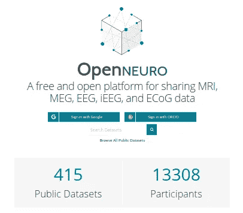
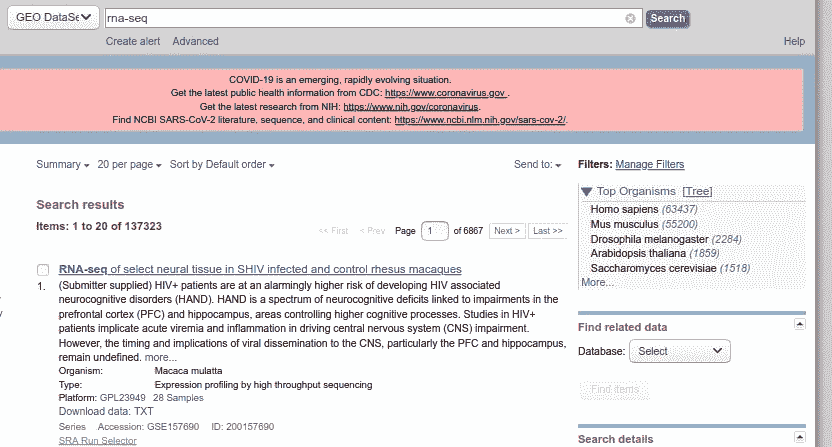

# 寻找生物数据集来启发你的下一个生物信息学项目

> 原文：<https://towardsdatascience.com/finding-biological-datasets-to-inspire-your-next-bioinformatics-project-5c6c6c17b6d2?source=collection_archive---------32----------------------->

## 无论是基因组学还是脑电图数据，网上有大量免费的数据集！

由[马库斯·斯皮斯克](https://unsplash.com/@markusspiske?utm_source=medium&utm_medium=referral)在 [Unsplash](https://unsplash.com?utm_source=medium&utm_medium=referral) 上拍摄的照片

信息专家在整个生物学领域提供不可替代的专业知识。毫不奇怪，大学为学生提供越来越多的机会来学习这些技术。虽然大学课程和在线课程提供了非常需要的背景，但它们可能不会给你提供足够的实践机会。毕竟，如果你想成为一名生物信息学家，真实数据集的经验是非常宝贵的。

随着许多新技术的突破，许多新技术的成本下降了。因此，科学家们被数十亿字节的生物数据淹没了。从 EEG 大脑信号到基因组信息的一切都需要处理和分析。显然需要专家来理解和处理这些数据。如果你正开始你的生物信息学之旅，本指南将为你提供一些拥有大型数据集的资源来发展你的技能。

如果您正在寻找教程来学习这些数据所需的基础知识和技能，我推荐以下资源:

1.  处理脑信号数据: [Makoto 的预处理流水线](https://sccn.ucsd.edu/wiki/Makoto%27s_preprocessing_pipeline)
2.  [RNA 测序教程](https://pachterlab.github.io/kallisto/starting.html)
3.  [微生物组 16S 教程](https://benjjneb.github.io/dada2/index.html)
4.  [WGS 微生物资源](https://huttenhower.sph.harvard.edu/biobakery_workflows/)
5.  [处理大型数据集的在线服务器:Galaxy](https://usegalaxy.org/)

# 开放神经系统:大脑记录

[还记得埃隆·马斯克最近对他的脑机接口公司 Neuralink](https://www.inverse.com/innovation/neuralink-neuroscientists) 的更新吗？神经科学的许多子领域的研究人员使用类似的、尽管不那么高通量的技术来测量大脑活动。这对于了解大脑如何对不同刺激做出反应的研究尤其重要，甚至对于癫痫发作的预测也是如此。

如果你有兴趣了解如何解码这些信号以及开发预测模型，你会在这里找到大量的数据集。你可以找到脑电图(EEG)、脑磁图(MEG)、皮层脑电图(ECoG)和颅内脑电图(iEEG)的链接。

这些数据集的处理通常发生在 MATLAB 和 Python 中。

作者截图

# RNA 测序数据集

随着技术的进步，高通量 RNA 测序的成本大幅下降。因此，在许多不同的测序平台上，有一个公众可访问的数据集的聚宝盆。我建议关注 Illumina 平台，因为它是当今许多研究人员最常见的选择。您可能遇到过不同的 Python 和 R 包来处理 RNA-seq 数据。现在是测试这些技能的时候了，将这些技能添加到你的投资组合中。

如果你对大脑特别感兴趣，艾伦脑图计划有几个数据集[可用](https://portal.brain-map.org/atlases-and-data/rnaseq)。否则，你会通过[基因表达综合数据集库](https://www.ncbi.nlm.nih.gov/gds)找到不同生物的数千个数据集。

作者截图|所有这些数据就等着你去细读了！

# 微生物组序列数据集

随着 RNA-seq 技术的出现，对微生物组的兴趣增加了。基因表达综合数据库中有许多数据集，用于测量胃肠、粪便、唾液或环境微生物组。也有大量的工具作为 R 包提供给你开放的数据集来练习。看看这些 R 包:

1.  [策划元数据数据](https://bioconductor.org/packages/release/data/experiment/html/curatedMetagenomicData.html)
2.  [HMP16SData](https://bioconductor.org/packages/release/data/experiment/vignettes/HMP16SData/inst/doc/HMP16SData.html) :人类微生物组项目 16S 数据
3.  [微生物组](https://www.bioconductor.org/help/course-materials/2017/BioC2017/Day1/Workshops/Microbiome/doc/MicrobiomeWorkshop.html)

# 单细胞 RNA 测序数据集

[分子转录组学最显著的创新之一是单细胞 RNA 测序](https://www.nature.com/articles/s12276-018-0071-8)。它让我们能够评估单个细胞中哪些基因是活跃的，让我们能够对它们进行表征和分组。因为这种技术相对年轻，所以可用于实践的数据集较少。尽管如此，结合可用的教程，它们足以练习数据处理、分析和可视化。这些数据集可以在[这里](https://bioinfo.uth.edu/scrnaseqdb/)找到。R 中的 [scRNAseq](http://bioconductor.org/packages/release/data/experiment/html/scRNAseq.html) 包也允许您访问这些数据。

你还在等什么？网上有许多免费的课程和教程可以与这些数据集配对！你可以从今天开始！

**快乐数据挖掘！**