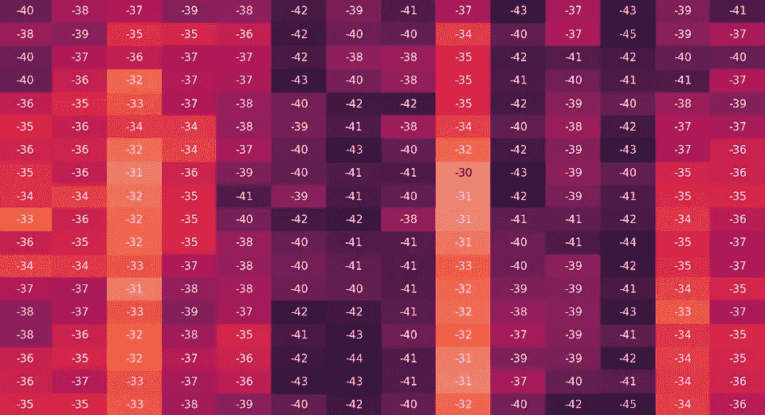
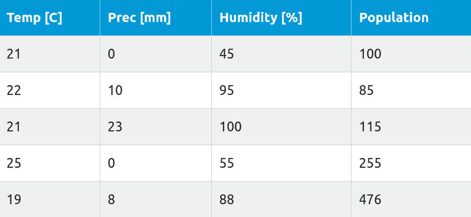
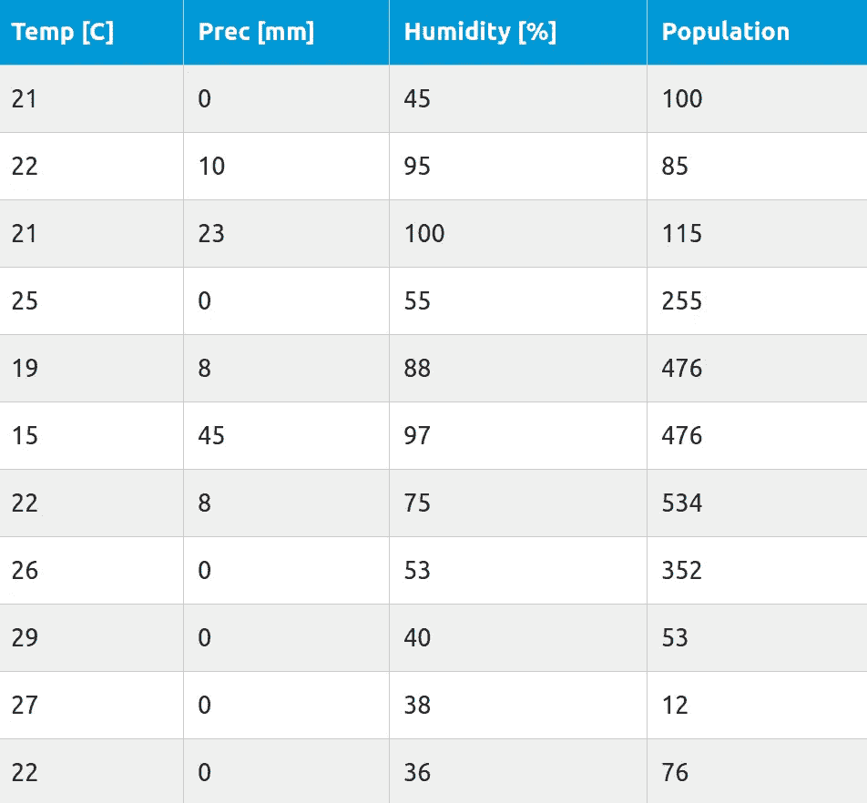
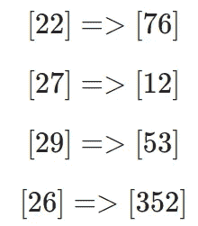
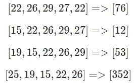
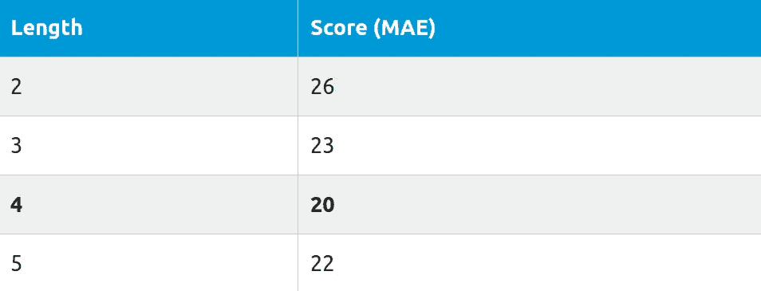
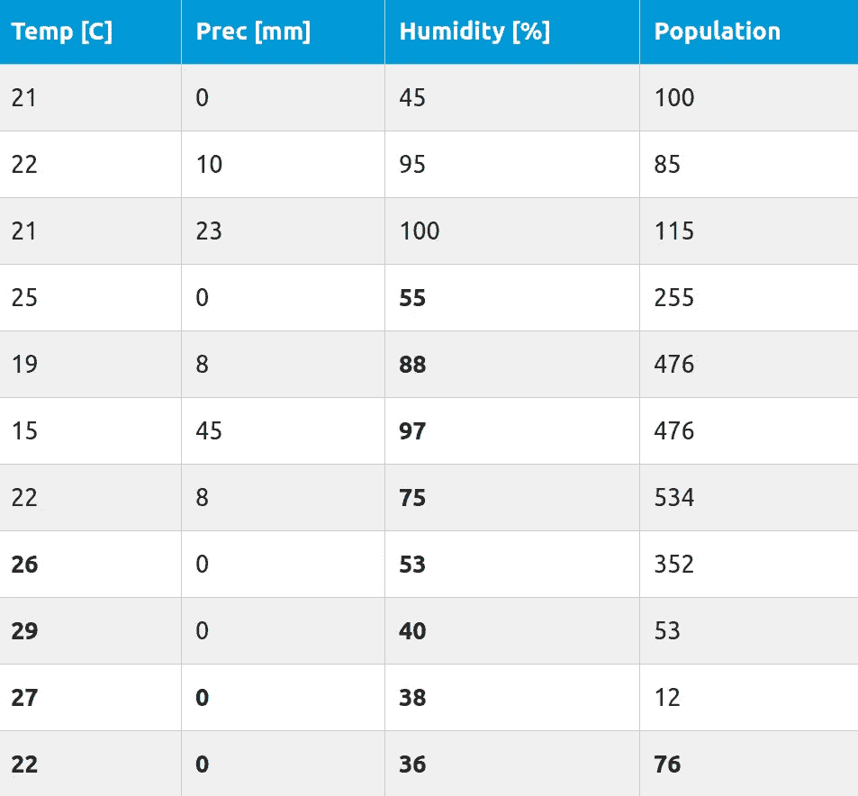
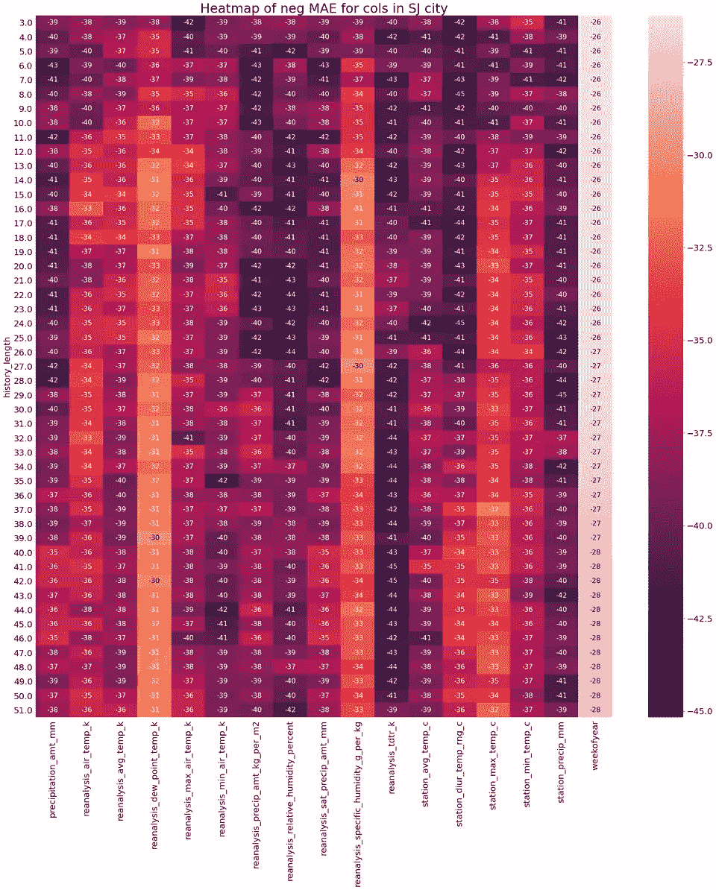

# 在时间序列数据中寻找相关性

> 原文：<https://towardsdatascience.com/finding-correlations-in-time-series-data-845e5dc538c4?source=collection_archive---------24----------------------->

## 理解 ML

## 如何找到不同长度的时间序列向量与预测结果之间的相关性？



如果你曾经做过数据分析，你很可能知道[数据相关性](https://en.wikipedia.org/wiki/Correlation_and_dependence)的概念。有许多方法可以计算数据之间的相关性，其中大多数已经在流行的数据科学工具包中实现。今天我想向大家展示的是如何找出不同长度的时间序列向量与目标结果(或任何其他值)之间的相关性。

当试图设计依赖于时间序列数据的模型时，这可能会很方便。我给你举个例子。假设您正在处理天气数据。你的目标是预测未来某一时刻的人口数量。这些人口并不依赖于当前的天气状况，而是依赖于过去。

# 数据样本



这是我们数据集中的一些样本。它显示了五个连续的时间段以及每个时间段的结束时间。**我们的目标是预测每个时间段**的人口数量。通常为了解决这个问题，我们需要设计某种模型。模型本身并不那么重要，重要的是找到我们应该把什么样的特性注入其中。

我们知道，当前的人口数量并不取决于当前的条件，而是取决于整个生命周期的条件。我们可以搜索关于该主题的出版物，并尝试计算出正确的数据量。过了一会儿，我们认为我们的人口可能取决于过去 4 周的温度、6 周的降水量和过去 2 周的湿度。这没问题，但是有没有更好的方法来找出数据中的相关性呢？我们甚至可以检查我们的月经是否正确吗？

# 标准相关性的问题

当考虑数据相关性时，我们通常会考虑一个数字和另一个数字之间的相关性。偶尔，我们可能会计算分类变量之间的相关性。这个案子不一样。如果我们考虑一系列这样的温度:

[21,22,21,25,19]

**每个数字出现的顺序很重要**。如果我们想用一些累计值(比如平均值或移动平均值)来代替整个系列，那是行不通的。

[21, 25, 19, 22, 21]

这给出了相同的平均值，但清楚地显示了不同的情况。另一个问题是**选择向量**的正确长度。当提供一个更长的向量时，比较信息增益就不那么容易了。

[16, 18, 22, 15, 17, 21, 22, 21, 25, 19]

常见的做法是为模型提供一个很长的向量，让它自己找出相关性。这是可行的，但在时间序列的情况下，我们通常没有那么多的训练数据(我们不能只是创造更多)。即使我们收集过去 5 年中每天的数据，我们也有(平均)1826 个(T2)记录。如果你想创建一个输入向量很长的深度模型，这个值太低了。

# 预测能力评分(PPS)

最近，一种不同的想法越来越受欢迎。它被称为预测能力得分(PPS ),基于计算数据集中每个属性的预测能力。**预测能力是对决策树模型在预测变量**的帮助下预测目标变量的成功程度的衡量。

当你计算一个变量(A)的 PP 预测另一个变量(B)时，我们必须把我们的变量 **B 当作目标**，把 **A 当作唯一的特征**。之后，我们将创建一个决策树(回归器或分类器)并计算有意义的指标(如回归问题的 MAE 或分类的 F1)。

基本上，你必须对每一对变量重复这个过程。分数的标准化是可选的，因为通常原始分数已经有了意义。在大多数情况下，**您不必为所有可能的特性组合计算 PPS**。只计算每个特征和目标之间的 PPS 就够了。在我们的示例中，我们将计算成对的 PPS:**(温度，人口)**， **(Perc，人口)**，**(湿度，人口)**。

这种方法的唯一问题是它不能解决我们的问题:)

# 扩展 PPS

如果我们看一下标准 PPS，我们能够检查一个变量的预测能力。我们的问题有点不同，让我给你看看是什么样子的。



我们的目标是**人群**，标准的 PPS 方法只会显示每个特征的一个项目的分数。



没关系，但我们可以做得更好。试着找出这个向量和目标的最后 x 值之间的关联。让我们从最后一行开始，因为对于这一行，我们有以前的数据。



前 4 行仍然有问题，因为我们没有前 5 行来获取数据。有两种解决方案:

*   删除这些行
*   创建数据

第一个选项很简单，通常，当您有超过 100 行时，它不会影响预测的精度。如果您想使用第二种方法，您可以使用移动平均或其他方法来填充数据。目前，我们只打算采用第一种方案。

# 如何用 sklearn 创建决策树？

要创建 DT，我们可以使用`sklearn`库并执行如下代码:

```
from sklearn.tree import DecisionTreeRegressor
from sklearn.model_selection import cross_val_score
X = [
    [22, 26, 29, 27, 22],
    [15, 22, 26, 29, 27],
    [19, 15, 22, 26, 29],
    [25, 19, 15, 22, 26]
]
Y = [76, 12, 53, 352]regressor = DecisionTreeRegressor(random_state=0)
score = cross_val_score(
    regressor,
    X,
    Y,
    cv=2, #change that base on the data size
    scoring='neg_mean_absolute_error'
)
```

因此，我们应该得到一些负的 MAE 值。

# 我们要计算什么？

现在的问题是“我们应该使用多少以前的数据点来获得最好的分数？”。我们可以创建不同长度的向量，并比较每个向量的得分。

如果我们只查看**温度**特征，我们应该得到如下数据集

```
Temp_five = [
    [22, 26, 29, 27, 22],
    [15, 22, 26, 29, 27],
    [19, 15, 22, 26, 29],
    [25, 19, 15, 22, 26]
]
Temp_four = [
    [26, 29, 27, 22],
    [22, 26, 29, 27],
    [15, 22, 26, 29],
    [19, 15, 22, 26]
]
Temp_three = [
    [29, 27, 22],
    [26, 29, 27],
    [22, 26, 29],
    [15, 22, 26]
]
Temp_two = [
    [27, 22],
    [29, 27],
    [26, 29],
    [22, 26]
]
```

目标总是不变的，唯一改变的是一组特性。此时，我们计算每个长度的分数，并比较结果以获得临时向量的正确长度。

让我们假设结果是这样的:



基于此，我们可以确定**温度**向量的正确长度为 **4** (最小误差)。现在，我们对每一个单独的特征执行类似的过程，并得出最终的特征集。



**粗体**选择显示一个目标为 76 的训练样本的一组特征。设计 NN 时，我们可以假设 14 个(4 个温度+ 2 个 Perc + 8 个湿度)输入特性。因此，我们针对底部 3 个样本的训练集将如下所示:

```
X = [
    [26, 29, 27, 22, 0, 0, 55, 88, 
     97, 75, 53, 40, 38, 36],
    [22, 26, 29, 27, 0, 0, 100, 55,
     88, 97, 75, 53, 40, 38],
    [15, 22, 26, 29, 0, 0, 95, 100,
     55, 88, 97, 75, 53, 40]
]Y = [
    76,
    12,
    53
]
```

# 现实生活中的例子

如果您想知道这种方法在真实数据中的表现，这里有一个例子:



每一列代表一个特征，每一行代表从该特征构建的向量的不同长度。在这个例子中，我计算了每个特征的 3 到 51 个元素之间的向量的 MAE。

## 我应该选择哪些功能？

选择正确的功能有几个规则。第一个(也是最明显的一个)是**选择 MAE 得分最低的特性**。我们可以对这些列进行排序，并开始选择具有最低值的列。问题是“有多少列？”。答案可能不会让你惊讶，看情况:)。当您有更多的训练数据时，您可以允许您的模型更大，因此，选择更多的功能。如果你只有少量的训练数据，你就不能设计一个有> 200 个特征的模型，因为你进入了[维数灾难](https://en.wikipedia.org/wiki/Curse_of_dimensionality)的领地。

另一件事是每列的长度。正如你在这个例子中看到的,`reanalysis_specific_humidity_g_per_kg`是`2 minimum values of MAE`的一个有用的特性(我们最好的特性之一)。当我们遇到这种情况时，我们通常选择较短的向量。所以决定选择长度为 14 而不是 27 的向量，即使两者具有相同的 MAE (30)值。

另一个要讨论的是最后一栏。有些列不应该被视为矢量，而应该作为一个单独的特征来使用。`weekofyear`列包含给定训练示例的周数。向模型发送周数向量是没有意义的，因为它总是每周增加 1。但是看一下这个专栏仍然很重要，因为它清楚地显示了长度是如何影响准确性的。

## 一些权衡

有时，在选择向量长度时，您可能需要做出一些权衡。看特征 15 ( `station_min_temp_c`)。它的长度为 3，得分为 35 MAE，然后长度为 26，得分高于 35 MAE。两个分数之间的差别只有 **1** 并且我们增加了 23 个额外的特性只是为了得到那 1 MAE。你必须记住，当构建一个具有多个特征的模型时，输入向量的最终长度是你选择的所有向量的总和。将输入长度增加 23 会迫使您拥有更多训练数据和更大的模型。在这种情况下，我个人会选择 3 个项目向量而不是 26 个，或者只是测试两个不同的模型。如果从 3 个项目变成 26 个项目时结果没有改善，你应该**使用 3，因为它产生一个更简单的假设**(根据[奥卡姆剃刀](https://en.wikipedia.org/wiki/Occam%27s_razor)规则)。

## 选择没有扩展 PPS 的功能时出错

我想告诉你的最后一件事是，如果没有这种方法，选择特征时是多么容易出错。让我们看看第 4 列(`reanalysis_dew_point_temp_k`)和第 11 列(`reanalysis_tdtr_k`)。你只要看着它们就能知道第 4 列有更好的预测能力。但是如果你手动(或随机)选择这些向量的长度，你可能会使`reanalysis_dew_point_temp_k`比`reanalysis_tdtr_k`更差。如果事先不知道这个特性，您可以选择它的长度为 3，这样我们得到的 MAE 为 38，比第 21 行第 11 列的 37 还要差。这样，你就把你最好的特性之一变得和你最差的特性一样有用了。

# 结论

PPS 的扩展版本是一个强大的工具，用于在构建模型时选择一组要素。有时，即使没有这方面的专业知识，也可能导致对数据事件的更深入理解。即使可能需要一段时间来计算不同长度的输入向量的所有 PPS，这也是值得的。EDA ( [探索性数据分析](https://en.wikipedia.org/wiki/Exploratory_data_analysis))仍然是每一个数据科学/机器学习项目中最重要的部分之一，你不应该跳过它，或者仅仅局限于默认的工具集。

*原载于*[*https://erdem . pl*](https://erdem.pl/2020/06/finding-correlations-in-time-series-data)*。*