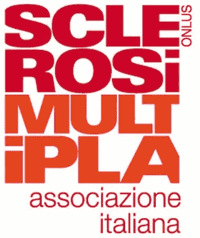

# 为 CharityML 项目寻找捐助者

> 原文：<https://towardsdatascience.com/finding-donors-for-charityml-project-e0f4a59dcea0?source=collection_archive---------23----------------------->

## Udacity 数据科学家纳米学位计划项目

[https://www . ledgerinsights . com/WP-content/uploads/2019/09/charity-810 x476 . jpg](https://www.ledgerinsights.com/wp-content/uploads/2019/09/charity-810x476.jpg)

这个项目是数据科学家纳米学位项目 [**Udacity**](https://eu.udacity.com/) **的一部分:为 CharityML 项目**寻找捐赠者，目标是对美国人口普查收集的数据应用监督学习技术，以帮助一个虚构的慈善组织 CharityML 确定最有可能为他们的事业捐款的人

让我们从使用 **CRISP-DM 流程**(数据挖掘的跨行业流程)开始:

1.  **业务理解**
2.  **数据理解**
3.  **准备数据**
4.  **数据建模**
5.  **评估结果**
6.  **部署**

**业务理解**

CharityML 是一个虚构的慈善组织，它希望通过向所在地区的居民发送信件来扩大潜在的捐助者群体，但只发送给最有可能捐款的人。在向社区中的人们发送了近 32000 封信后，CharityML 确定他们收到的每一笔捐款都来自年收入超过 50000 美元的人。因此，我们的目标是建立一个算法，以最好地识别潜在的捐赠者，并减少发送邮件的开销

**数据理解**

数据集由 45222 条记录组成，来自 [UCI 机器学习库](https://archive.ics.uci.edu/ml/datasets/Census+Income)。该数据集由 Ron Kohavi 和 Barry Becker 捐赠，发表在文章*“提高朴素贝叶斯分类器的准确性:决策树混合”*中

数据集属性

以前 5 条记录为例

概括起来，其特点是:

*   **年龄**:连续
*   **工作类**:私人，自我雇佣非公司，自我雇佣公司，联邦政府，地方政府，州政府，无薪，从未工作
*   **教育水平**:学士、部分大学、11 年级、HS-grad、Prof-school、Assoc-acdm、Assoc-voc、9 年级、7-8 年级、12 年级、硕士、1-4 年级、10 年级、博士、5-6 年级、学前
*   **教育编号**:连续
*   **婚姻状况**:已婚配偶、离婚、未婚、分居、丧偶、无配偶、已婚配偶
*   职业:技术支持、工艺维修、其他服务、销售、行政管理、专业教授、清洁工、机器操作员、行政文员、农业渔业、运输搬运、私人服务、保安服务、武装部队
*   **关系**:妻子、亲生子女、丈夫、非家庭成员、其他亲属、未婚
*   种族:黑人、白人、亚洲太平洋岛民、美洲印第安人、爱斯基摩人、其他
*   **性别**:女，男
*   **资本收益**:连续
*   **资本损失**:连续
*   **每周小时数**:连续
*   **母国**:美国、柬埔寨、英国、波多黎各、加拿大、德国、美国外围地区(关岛-USVI 等)、印度、日本、希腊、韩国、中国、古巴、伊朗、洪都拉斯、菲律宾、意大利、波兰、牙买加、越南、墨西哥、葡萄牙、爱尔兰、法国、多米尼加共和国、老挝、厄瓜多尔、台湾、海地、哥伦比亚、匈牙利、危地马拉、尼加拉瓜、苏格兰、泰国、南斯拉夫、萨尔瓦多、特立尼达和多巴哥&秘鲁、香港、荷兰
*   **收入** : > 50K，< =50K

正如我们从初步分析中看到的，我们的数据集是不平衡的，因为大多数人的收入不超过 50，000 美元，因此，正如我们将在**天真预测**部分更好地解释的那样，这可能会对我们将要开发的模型的准确性产生影响

对数据的初步分析

**变换偏斜的连续特征**

算法可能对这些值的分布很敏感，如果范围没有被适当地标准化，算法可能表现不佳，因此通常的做法是对数据应用[对数变换](https://en.wikipedia.org/wiki/Data_transformation_(statistics))，以便非常大和非常小的值不会对学习算法的性能产生负面影响。对于人口普查数据集，有两个特征符合这一描述:`capital-gain`和`capital-loss`

偏态分布`capital-gain`和`capital-loss`

对数变换分布`capital-gain`和`capital-loss`

**归一化数字特征**

对数据进行缩放不会改变每个要素分布的形状。我们将在`age`、`education-num`、`hours-per-week`、`capital-gain`和`capital-loss`上使用[sk learn . preprocessing . minmax scaler](http://scikit-learn.org/stable/modules/generated/sklearn.preprocessing.MinMaxScaler.html)来实现这一点

**准备数据**

使用**一键编码**方案转换分类变量

独热编码示例

与往常一样，我们现在将数据(包括要素及其标签)分成训练集和测试集。80%的数据将用于训练，20%用于测试

**数据建模**

生成**朴素预测器**的目的只是为了显示没有任何智能的基础模型是什么样子。如前所述，通过观察数据的分布，可以清楚地看出，大多数人的年收入不到 5 万美元。因此，总是预测`'0'`(即个人收入低于 50k)的模型通常是正确的

朴素预测结果

数据集不平衡的事实也意味着**精确度**没有太大帮助，因为即使我们获得高精确度，实际预测也不一定那么好。在这种情况下通常推荐使用**精确**和**召回**

让我们比较 3 个模型的结果:

*   **决策树**
*   **支持向量机**
*   **AdaBoost**

性能指标

混淆矩阵

如前所述，我们关注的是模型精确预测那些收入超过 5 万美元的人的能力，这比模型回忆那些人的能力更重要。**就`Accuracy`和`F-score`而言，AdaBoostClassifier** 是对测试数据表现最好的一个。此外 **AdaBoostClassifier** 的训练速度也非常快，如时间训练集大小直方图所示

现在我们将使用 [sklearn.grid_search 对模型进行微调。GridSearchCV](http://scikit-learn.org/0.17/modules/generated/sklearn.grid_search.GridSearchCV.html)

模型调整

最后，我们可以找出哪些特征提供了最强的预测能力。通过只关注少数关键特征和目标标签之间的关系，我们简化了对现象的理解。我们可以使用`feature_importance_`来实现

**评估结果**

我们的目标是预测一个人的年收入是否超过 5 万美元，因为满足这一要求的人更愿意向慈善机构捐款。在清理数据并将它们建模为准备用于 ML 训练的数据集之后，我们测试了三个不同模型的性能。考虑到 **F-1 评分**最佳模型是 **AdaBoostClassifier**

**赞助一些** **真正的慈善** **组织**

我想利用这篇文章谈谈我真正关心的一些**真正的慈善** **组织**:

意大利多发性硬化症协会(AISM)是一个治疗多发性硬化症的非营利组织

[https://www.aism.it/](https://www.aism.it/)

T21 急救组织是一个人道主义的非政府组织，为战争、贫困和地雷的受害者提供免费医疗

[https://www.emergency.it/](https://www.emergency.it/)

救助儿童会通过更好的教育、医疗保健和经济机会来提高儿童的生活质量。它还在自然灾害、战争和其他冲突期间提供紧急援助

[https://www.savethechildren.it/](https://www.savethechildren.it/)

澄清一下，我和这家公司没有任何商业关系

**注意:**代码可以在这个 github [仓库](https://github.com/simonerigoni/finding_donors_project)中找到