# 使用机器学习发现重复的 Quora 问题

> 原文：<https://towardsdatascience.com/finding-duplicate-quora-questions-using-machine-learning-249475b7d84d?source=collection_archive---------26----------------------->


埃文·丹尼斯在 [Unsplash](https://unsplash.com?utm_source=medium&utm_medium=referral) 上的照片

Quora 是一个令人惊叹的平台，互联网公司可以在这里提问、回答、关注和编辑问题。这使人们能够相互学习，更好地了解世界。每个月大约有 1 亿人访问 Quora，所以很多人问类似措辞的问题也就不足为奇了。quora 让它的关注者为同一个问题写一个答案并不是更好的一面。因此，如果有一个系统能够检测到一个新问题与已经回答的问题相似，那就更好了。

所以我们的问题陈述是**预测一对问题是否重复**。我们将使用各种机器学习技术来解决这个问题。这个博客不是一个完整的代码演练，但是我将解释我用来解决这个问题的各种方法。你可以从我的 [**Github 库看看我的代码。**](https://github.com/arunm8489/Quora-question-pair-similarity)

## 一些业务限制

*   **错误分类的成本可能非常高**。也就是说，如果一个用户问了一个特定的问题，而我们提供了其他的答案，那就不好了。会影响生意的。这是最重要的约束。
*   我们想要一对问题被复制的概率，这样你就可以选择任何选择的阈值。因此，根据使用情况，我们可以改变它。
*   我们没有任何延迟要求。
*   可解释性是部分重要的。即我们不想让用户知道为什么一对问题是重复的。但是如果我们知道会更好。

## 绩效指标

这里我们有一个**二元分类**任务，我们想预测一对问题是否重复。我们将使用**日志损失**作为衡量标准。有意义因为我们预测的是概率值，所以使用对数损失作为度量是有意义的。这是我们的主要 KPI(关键绩效指标)。我们还将使用混淆矩阵来衡量绩效。

> 对数损失只不过是可能性乘积对数的负值

# 探索性数据分析

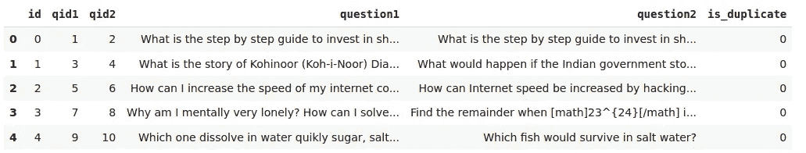

数据

我们有大约 404290 个数据点和 6 列。这 6 列/特征是:

*   id:问题对的唯一 id
*   qid1:第一题的 id。
*   qid2:第二个问题 id
*   问题 1:第一个问题
*   问题 2:第二个问题
*   is_duplicate:两者是否重复。

当最初接近时，我检查丢失值。我发现 3 行中有缺失值(在问题 1 和问题 2 中)。所以我放弃了那几行。接下来，我检查任何重复的行。但是没有这样的争吵。

## 目标变量分析

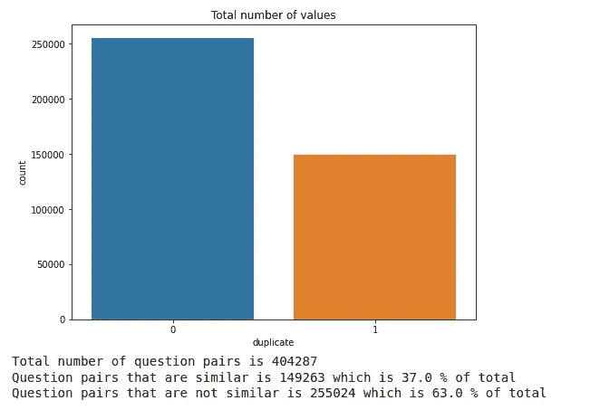

目标分布

很明显，我们有不平衡的数据，重复问题的数量超过了非重复问题。

## 问题分析

在分析了这些问题后，我得出了以下结论:

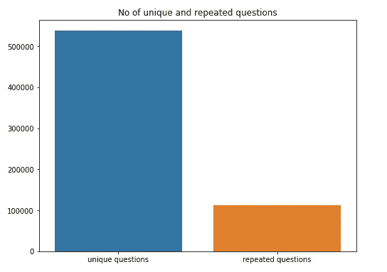

独特问题与重复问题

```
Total number of unique questions is 537929
Number of questions that repeated more than 1 time is 111778 which is 20.779322178205675%
The maximum number of times a question occured is 157
```

之后，我试着绘制了问题出现次数的直方图和问题数量的日志。我们可以看到，大多数问题的出现频率大约为< 60\. We can see there is 1 question that occurs 167 times, 1 question that occurs 120 times 1 question that occurs 80 times, and so on.

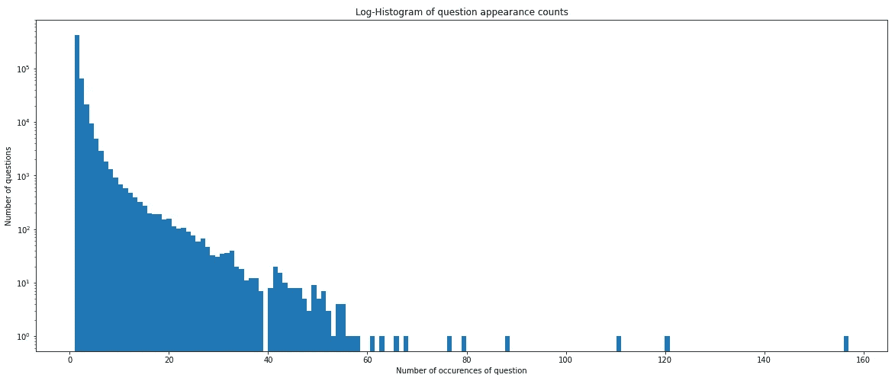

log histogram of question appearances

Now we have a broad understanding of data. Next, I created some basic feature features before preprocessing the data.

# Basic Feature Engineering

I created the following features:

*   **freq _ qid 1**= qid 1 的频率。
*   **freq _ qid 2**= qid 2 的频率，问题 1 出现的次数。
*   **Q1 len**= Q1 的长度
*   **q2len**= Q2 的长度
*   **q1_n_words** =问题 1 的字数
*   **q2_n_words** =问题 2 的字数
*   **word_Common** =(问题 1 和问题 2 中常见唯一词的个数)。
*   **word_Total** =(问题 1 总字数+问题 2 总字数)
*   **word _ share**=(word _ common)/(word _ Total)
*   **freq _ Q1+freq _ Q2**= qid 1 和 qid2 的频率总和
*   **freq _ Q1-freq _ Q2**= qid 1 和 qid2 的绝对频率差

## 工程特征分析

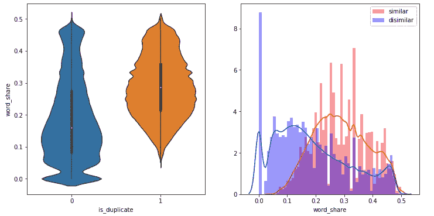

相似和不相似问题中的单词共享

我们可以看到，随着“份额”这个词的增加，出现类似问题的可能性越来越大。我们知道，对于 pdf 来说，它们重叠的越多，区分类别的信息就越少。从直方图中，我们可以看到单词 share 具有一些区分相似和不相似类的信息。

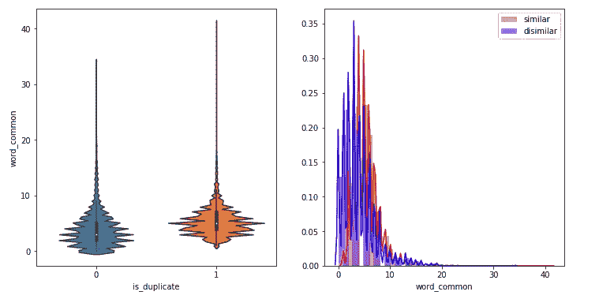

相似和不相似问题中的常用词

我们可以看到，common_words 没有足够的信息来区分类别。重复和非重复问题的 word_common 的历史图重叠。没有太多的信息可以检索，因为大多数的 pdf 文件是重叠的。

# 高级特征工程

现在，我们将使用现有数据创建一些高级功能。在此之前，我们将清理我们的文本数据。作为文本预处理的一部分，我已经删除了停用词、标点符号、特殊字符如“₹","$","€”等，并且我还应用了词干来获得更多的概括。接下来，我设计了以下功能。

> 注意:在下面的特征中， **tocken** 表示通过拆分文本获得的单词，**单词**表示不是停用词的单词。

*   **CWC _ min**:Q1 和 Q2 常用字数与最小字数长度的比值
    *cwc_min =常用字数/ (min(len(q1_words)，len(q2_words))*
*   **CWC _ max**:common _ word _ count 与 Q1 和 Q2 最大字数长度的比值
    *CWC _ max = common _ word _ count/(max(len(Q1 _ words)，len(q2_words))*
*   **CSC _ min**:common _ stop _ count 与 Q1 和 Q2 停车计数最小长度之比
    *CSC _ min = common _ stop _ count/(min(len(Q1 _ stops)，len(q2_stops))*
*   **CSC _ max**:common _ stop _ count 与 Q1 和 Q2
    停车计数最大长度的比值*CSC _ max = common _ stop _ count/(max(len(Q1 _ stops)，len(q2_stops))*
*   **CTC _ min**:common _ token _ count 与 Q1 和 Q2 令牌计数的最小长度之比
    *CTC _ min = common _ token _ count/(min(len(Q1 _ tokens)，len(q2_tokens))*
*   **CTC _ max**:common _ token _ count 与 Q1 和 Q2 令牌计数最大长度之比
    *CTC _ max = common _ token _ count/(max(len(Q1 _ tokens)，len(q2_tokens))*
*   **last_word_eq** :检查两个问题的最后一个单词是否相等
    *last _ word _ eq = int(Q1 _ tokens[-1]= = Q2 _ tokens[-1])*
*   **first_word_eq** :检查两个问题的首字是否相等
    *First _ word _ eq = int(Q1 _ tokens[0]= = Q2 _ tokens[0])*
*   **abs_len_diff** : Abs。长度差
    *ABS _ len _ diff = ABS(len(Q1 _ tokens)—len(Q2 _ tokens))*
*   **mean_len** :两个问题的平均令牌长度
    *mean _ len =(len(Q1 _ tokens)+len(Q2 _ tokens))/2*
*   有趣的部分来了。模糊率取决于 Levenshtein 距离。直观地说，如果从一个实例变成另一个实例所需的相应编辑很大，模糊比率就会很小。也就是说，大多数相似词的模糊率是相似的。

```
eg: s1 = “mumbai is a great place”   s2 = "mumbai is a nice place"
fuzz ratio = 91
```

*   模糊比率在某些情况下不能解决问题。

```
fuzz.ratio("YANKEES", "NEW YORK YANKEES") ⇒ 60
fuzz.ratio("NEW YORK METS", "NEW YORK YANKEES") ⇒ 75
```

s1 和 s2 的意思相同。但是它们的起毛率可以更小。所以我们会发现部分句子的比率会很高。在这种情况下，它被称为模糊部分比率。

```
fuzz.partial_ratio("YANKEES", "NEW YORK YANKEES") ⇒ 60
```

*   **token_sort_ratio** :在其他一些情况下，甚至 fuzz partial ratio 也会失败。

例如:

```
fuzz.partial_ratio("MI vs RCB","RCB vs MI") ⇒ 72
```

实际上这两个句子意思相同。但是模糊率给出了较低的结果。因此，更好的方法是对令牌进行排序，然后应用模糊比率。

```
fuzz.token_sort_ratio("MI vs RCB","RCB vs MI") ⇒ 100
```

*   token_set_ratio :还有另一种类型的模糊比率，即使在上述所有方法都失败的情况下，它也会有所帮助。就是令牌集比率。

为此，我们必须首先找到以下内容:

t0 ->找出 sentance1 和 sentance2 的交集词并排序。

t1-> t0+sentance 1 中的其余令牌

T2-> t0+sentance 2 中的剩余令牌

*tocken _ set _ ratio = max(fuzz _ ratio(to，t1)，fuzz_ratio(t1，T2)，fuzz_ratio(t0，t2))*

*   **longest _ substr _ Ratio**:Q1 和 Q2 令牌计数中最长公共子串长度与最小长度之比。

```
s1-> hai, today is a good day
s2-> No, today is a bad day
```

这里最长的公共子串是“今天是一个”。所以我们有 longest _ substring _ ratio = 3/min(6，6)= 0.5
*longest _ substr _ ratio = len(最长公共子串)/ (min(len(q1_tokens)，len(q2_tokens))*

## 更多数据分析

现在我们将绘制重复句和非重复句的词云。为了更好地理解，我在删除了停用词后绘制了它。

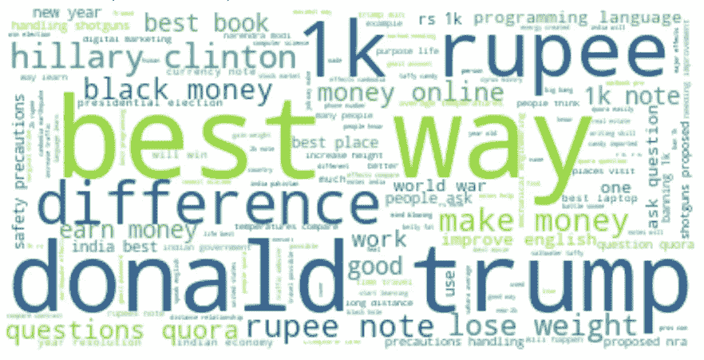

重复句子的词云

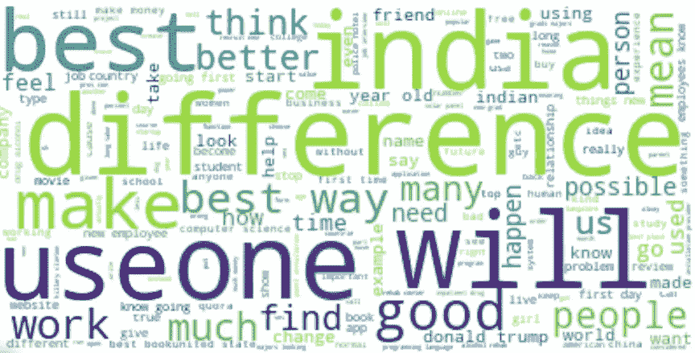

非重复句子的词云

单词越大，语料库中的重复频率就越大。我们可以看到，像唐纳德·特朗普、卢比、最佳方式这样的词在重复句中经常重复，而像差异、印度、使用等这样的词在非重复句中经常重复。

## ' ctc_min '，' cwc_min '，' csc_min '，' token_sort_ratio '的配对图

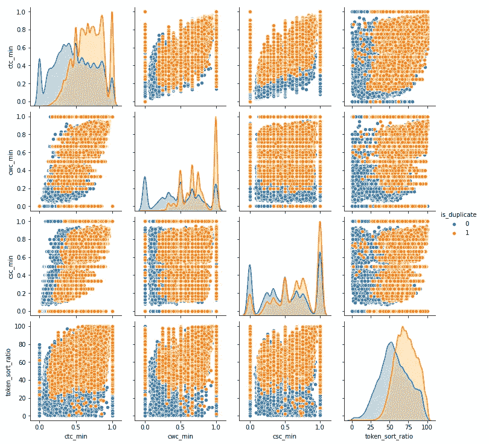

配对图

从 pair 图中，我们可以看到，在区分重复和非重复句子的所有特征中，都有一些有用的信息。其中 token sort ratio 和 ctc min 做得更好。

## 问题之间字数的绝对差异

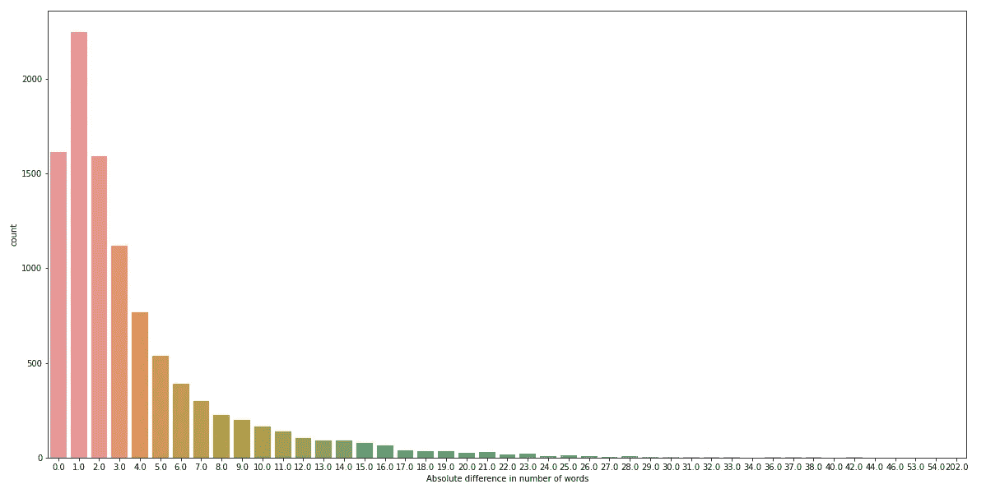

问题之间字数的绝对差异

我们可以看到，大多数问题的区别就在于一个词。差别巨大的问题只有极少数。

## TSNE 可视化

接下来，我尝试对数据进行低维可视化。我随机采样了 5000 个数据点，并使用 TSNE 进行低维可视化。我只使用了我们最近设计的功能来观察它对分析的影响。我们看到，在一些地区，阶级和阶层划分得很清楚。因此，我们可以说，现在我们的模型中有很多信息来执行良好的分类。

注意:你总是可以试验更多的数据点和困惑(如果你有足够的计算能力)，因为它会给出更多的信息。

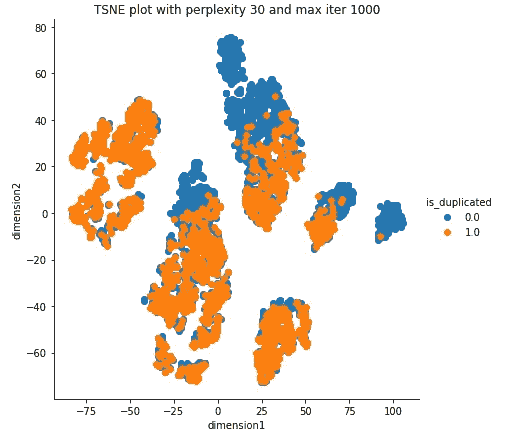

TSNE 可视化

## 列车测试分离

我们做了 70:30 的分割。也就是说，我们把 70%的数据点用于训练，剩下的 30%用于测试。

## 向量化文本数据

在使用数据创建模型之前，我们必须对文本数据进行矢量化。为此，我们使用了两种方法

*   TFIDF 矢量化
*   TFIDF 加权手套矢量化

在将这些矢量与我们创建的初始特征合并后，我们保存了单独的文件。

# 机器学习模型

让我们进入这个博客最有趣的部分——创建机器学习模型。现在我们有两个数据帧用于训练——一个使用 tfidf，另一个使用 tfidf 加权手套向量。

## 逻辑回归

**TFIDF 功能:**

在对 TFIDF 数据进行训练逻辑回归时，我们最终得到训练的对数损失约为 **0.43，测试的对数损失约为**0.53。我们的混淆精度和召回矩阵如下所示:


混淆矩阵/精确矩阵/召回矩阵

每个人都必须知道如何解释正常的混淆矩阵。我不想对它进行解释。让我们看看如何解释精度矩阵。上图中，第二个是精度矩阵。

直观上，精度意味着在所有预测为正的点中，有多少实际上是正的。这里我们可以看到，所有预测为 1 类的标签中，有 24.6%属于 2 类，剩下的 75.4 %属于 1 类。类似地，对于预测为第 2 类的所有点，69.2%属于第 2 类，30.02%属于第 1 类。这里，类 1 的精度是 0.754，类 2 的精度是 0.30。

我们的第三个矩阵是回忆矩阵。直观回忆是指，在属于一类的所有点中，有多少是正确预测的。在召回矩阵中，在属于类别 1 的所有标签中，86.5%被预测为类别 1，13.5%被预测为类别 2。同样，在所有属于 class2 的原始点中，59.9%属于 class2，其余属于 class1。

**TFIDF 加重手套:**

在超参数调整之后，我们最终得到的对数损失大约是测试的 0.39 和训练的 0.38。

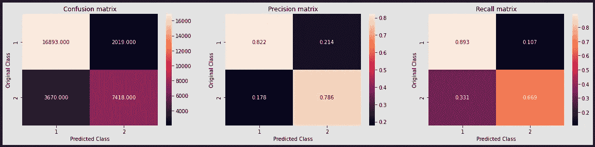

混淆矩阵/精确矩阵/召回矩阵

从两个召回矩阵中，我们可以看到召回值较低。让我们看看它如何执行线性 SVM。

## 线性 SVM

## TFIDF 功能:

列车日志损失:0.3851

测试日志损失:0.3942

混淆矩阵:

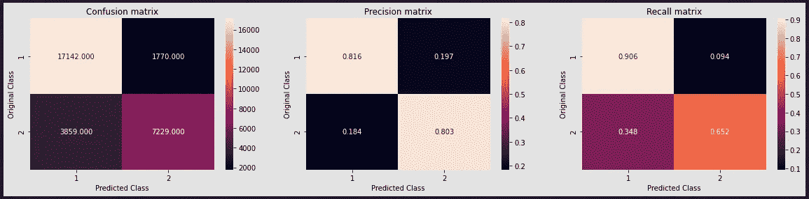

混淆矩阵/精确矩阵/召回矩阵

**TFIDF 加重手套:**

列车日志损失:0.3876

测试日志损失:0.395

混淆矩阵:

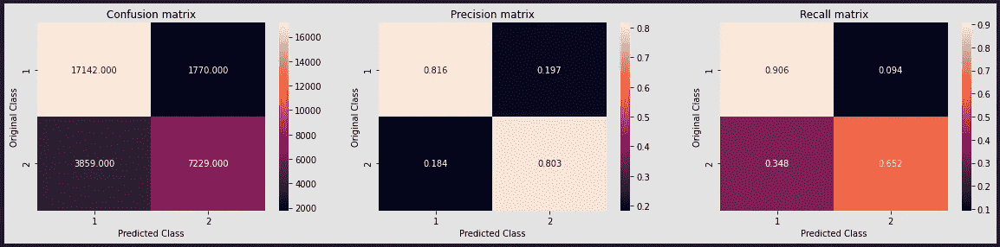

混淆矩阵/精确矩阵/召回矩阵

我们可以看到，无论是逻辑回归还是线性 SVM，我们的回忆值都很低。但是这两个模型都没有过度拟合。所以我在这里想到了一个偏高的问题。如果我们选择一些提升方法，我们可以克服这一点，可以获得更好的召回值。出于这个目的，我在 tfidf 和 tfidf 加重手套功能上试用了 XGBoost。

## XGBOOST

**TFIDF 功能:**

列车日志损失:0.457

测试日志损失:0.516

混淆矩阵:

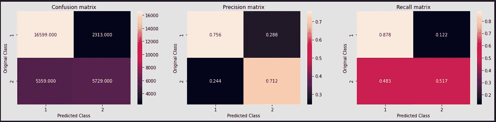

混淆矩阵/精确矩阵/召回矩阵

**TFIDF 加重手套特征:**

列车日志损失:0.183

测试日志损失:0.32

混淆矩阵:

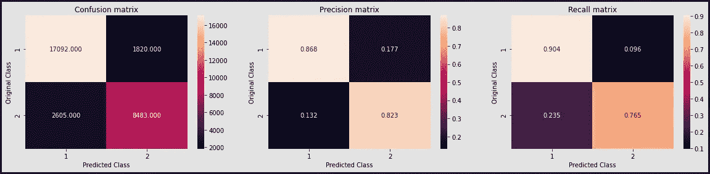

混淆矩阵/精确矩阵/召回矩阵

我们可以看到，使用 Xgboost 后，两个类的召回率都略有提高。在所有这些 xgboost 手套向量表现更好。

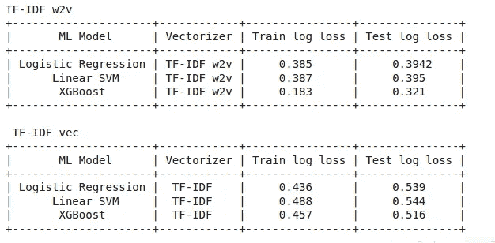

结果

要查看完整的代码，你可以访问我的 [GitHub 库](https://github.com/arunm8489/Quora-question-pair-similarity)。

## 参考

*   应用课程