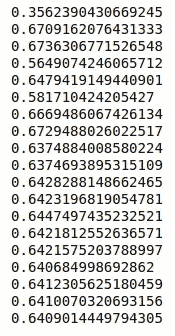
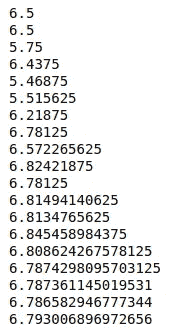
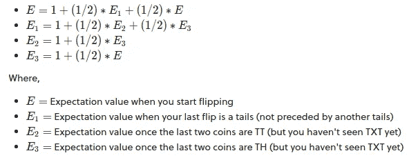

# 使用蒙特卡罗模拟寻找期望值:简介

> 原文：<https://towardsdatascience.com/finding-expected-values-using-monte-carlo-simulation-an-introduction-c083a5b99942?source=collection_archive---------26----------------------->

## 使用 Python 中的蒙特卡罗模拟解决常见概率难题教程

如果你对解决概率难题感兴趣，很有可能你会遇到一些难题，这些难题要求你在观察到所需的结果之前找到预期的试验次数。

如果你已经解决了足够多的问题，你就有可能知道如何通过分析来解决它们。我希望这篇文章能让你用不同的方法解决同样的问题，如果你想用分析的方法解决问题，给你锦囊妙计。

但是首先，蒙特卡罗(MC)方法是什么？根据[维基百科](https://en.wikipedia.org/wiki/Monte_Carlo_method)，

> 蒙特卡罗方法是一种广泛的计算算法，它依靠重复的随机抽样来获得数值结果。基本概念是用随机性来解决原则上可能是确定性的问题。”

让我们用一个简单而实际的问题来进一步理解 MC。如何使用 MC 来估计π的值？

1.  画一个正方形，画一个半径等于正方形边长的圆的四分之一圆
2.  在正方形表面上均匀分布给定数量的点
3.  计算圆内的点数
4.  找出落在这个圆内的点与总点数的比率。理论上，这个比例是 *π* /4。将所述比率乘以 4 以得到 *π* 的值。

直观上，我们可以看到，随着我们在正方形表面上散布的点数的增加，精确度也在增加。对于无限多的点，该比率接近 *π* /4。

维基百科上用户 nicoguaro 的 GIF

## **压断骆驼背的稻草**

这个谜题源自著名的习语，讲的是骆驼如何在最后一根稻草看似微小的附加重量下屈服。

数学上，假设稻草被一根一根地放在骆驼背上。吸管的重量同样可能是 0 到 1 之间的任何真实值。当稻草的重量超过 1 磅时，骆驼的背就会折断。求最后一根稻草重量的期望值。

你可能会想，最后一根稻草的预期重量会和 0.5 有什么不同吗，0.5 是单根稻草重量的预期值。答案是肯定的，因为较重的稻草比较轻的稻草更容易压断骆驼的背。因此，直觉上，最后一根稻草的预期重量大于 0.5。

在继续下一步之前，试着分析性地解决这个问题，看看你是否能找到正确的答案。

**蒙特卡洛方法**

使用 Python，让我们通过在骆驼背上添加吸管来模拟折断骆驼的背。

*免责声明:在模拟这个谜题时，没有骆驼受到伤害。*

定义函数 break_camel_back()返回压断骆驼背的稻草的重量和模拟压断骆驼背 n 次的 expected _ weight _ of _ last _ straw(n)并返回每次压断骆驼背的稻草的平均重量。对于 n 的大值，这个函数的输出就是我们问题的答案。

[https://gist . github . com/aditator/62 ddda 3369 acf8d 66331 c 854 F5 A8 b 963](https://gist.github.com/aditator/62ddda3369acf8d66331c854f5a8b963)

Camel.py 的输出

可以看出，对于大的值(在这种情况下为 2 ⁹)，期望值接近 0.64 左右的值，符合我们的直觉。

确切的期望值是 2-e/2，大约是 0.640859(感谢那些通过分析成功解决这个问题的人)。如果你不能解析地解决它，不要担心，你可以在这里找到解决方案。

附加练习:调整代码以找到相同重量分布下折断骆驼背的预期 ***根*** 。(答案是 e)

## **获得“TXT”图案所需的投掷硬币次数**

找出你需要翻转的次数的期望值，以便看到图案“TXT”，其中 T 是反面，X 是正面或反面。

(你将继续投掷硬币，直到你观察到 TTT 或 THT，并数出你投掷硬币的次数)

**蒙特卡洛方法**

定义 coin_toss()函数，该函数模拟在随机库中选择的帮助下投掷硬币。将 res 初始化为 3(获得 TXT 模式的最小投掷次数),并返回发生这种情况时的投掷次数。

像前面一样，定义 expected_tosses()来返回生成“TXT”模式所需的平均投掷次数。

[https://gist . github . com/aditator/C5 EC 83 dbb BAC 77 ab 6897 EAA 86 b 7 b 50 e 3](https://gist.github.com/aditator/c5ec83dbbbac77ab6897eaa86b7b50e3)

TXT.py 的输出

可以看出，对于大值(在这种情况下为 2 ⁹)，预期值趋向于 6.8 左右的值。

在分析上，这可以很容易地用一组线性方程来解决。

由 brilliant.org 的用户 [Geoff Piling](https://brilliant.org/profile/geoff-xxs185/) 发布

在求解 E 的方程之后，我们发现答案是 34/5 (6.8)，并且 MC 模拟与结果一致。

# 就是这样！

我们已经证实蒙特卡罗方法是模拟简单随机事件的有力工具。这些方法的应用不仅仅局限于概率谜题，而是跨越了金融、计算生物学、数据科学、工程学，甚至[定律](https://web.archive.org/web/20181106220526/https://legalaidresearch.org/wp-content/uploads/Research-Increasing-Access-to-REstraining-Order-for-Low-Income-Victims-of-DV-A-Cost-Benefit-Analysis-of-the-Proposed-Domestic-Abuse-Grant-Program.pdf)！

请在评论中告诉我你的想法，或者你希望我详细阐述什么。

我会推荐初学者从这里开始[。](https://www.youtube.com/watch?v=OgO1gpXSUzU&feature=emb_logo)