# 在 JavaScript 中使用贝叶斯搜索寻找丢失的对象

> 原文：<https://towardsdatascience.com/finding-lost-objects-using-bayesian-search-in-javascript-f502e3a1eb8c?source=collection_archive---------47----------------------->

## 用贝叶斯搜索理论模拟对失踪飞机的搜索。

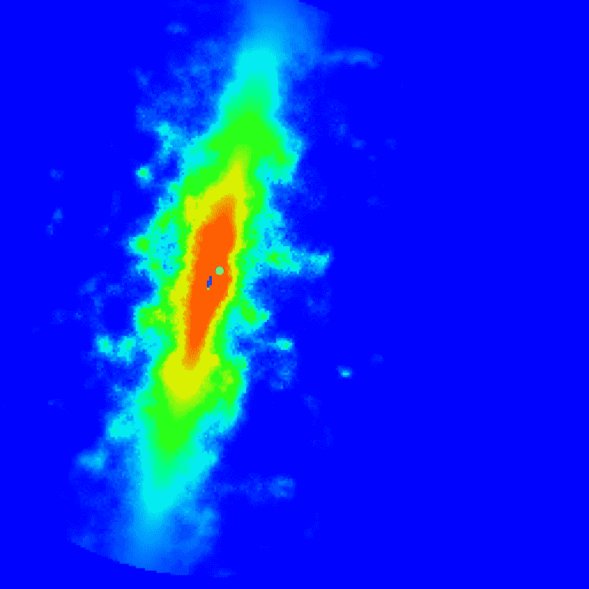

一架飞机在海上失踪的概率分布的例子。

寻找丢失的物品时，有多种搜索方法可供使用。[贝叶斯搜索理论](https://en.wikipedia.org/wiki/Bayesian_search_theory)就是其中之一。它已经被多次用于搜寻失踪的船只和飞机，如[号航空母舰蝎子号](https://en.wikipedia.org/wiki/USS_Scorpion_(SSN-589))、[号法航 447 航班](https://en.wikipedia.org/wiki/Air_France_Flight_447)和[号马航 370 航班](https://en.wikipedia.org/wiki/Malaysia_Airlines_Flight_370)。

我会试着用 [p5.js](https://p5js.org/) 用 JavaScript 模拟贝叶斯搜索理论。

# 贝叶斯搜索理论

贝叶斯搜索理论涉及应用贝叶斯统计来搜索丢失的对象。它依赖于贝叶斯定理。在[贝叶斯优化](https://en.wikipedia.org/wiki/Bayesian_optimization)中使用的相同定理。

贝叶斯搜索理论的目标是在信息有限的情况下最大化检测概率。它有助于在不必等待新数据的情况下做出决策。

贝叶斯搜索通常如下进行:

1.  设想所有可能的情况。
2.  计算每个场景的概率分布。
3.  将它们与每个场景的概率结合起来，做出一个总体概率分布。
4.  构建一个从最高概率到最低概率的搜索路径。
5.  使用贝叶斯定理在搜索过程中更新概率。

# 寻找失踪的飞机

让我们假设我们正在大海中寻找一架失踪的飞机。飞行员宣布他们的发动机失灵了。通讯中断后不久。

## 可能的情况

由于引擎失灵，一种可能的情况是它们失去了高度，溅入了海洋。在这个例子中，我们将假设这是唯一可能的情况。

## 计算概率分布

假设我们知道飞行计划和飞机的**最后已知位置(LKP)** 。

根据飞行员在溅落前可以保持的高度，我们可以估计一个搜索区域。

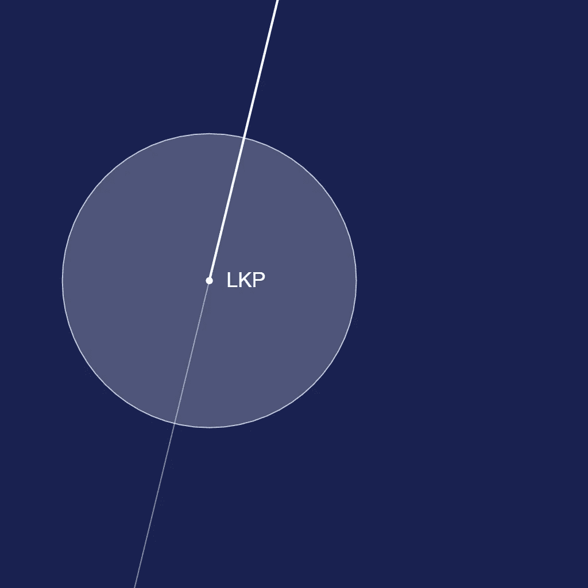

我们将使用一个[正态分布](https://en.wikipedia.org/wiki/Normal_distribution)作为飞机距离飞行轨迹距离 **d** 的概率。

标准偏差 **σ** 将根据水深、水流等进行选择。

分布可能看起来像这样:

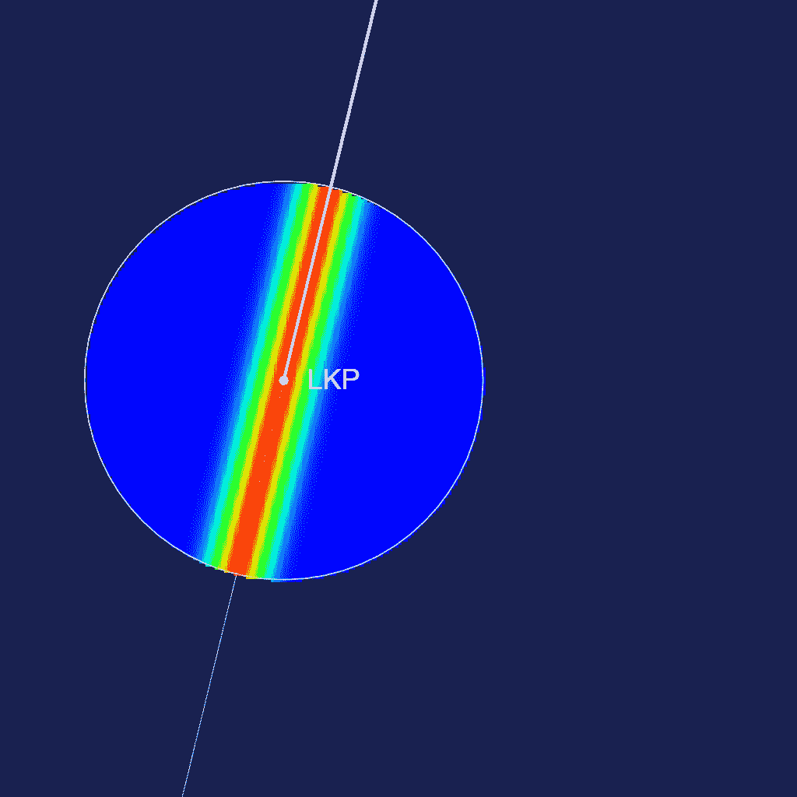

我们将再次使用正态分布计算飞机飞离最后已知位置的概率。结合这两个分布，我们得到:

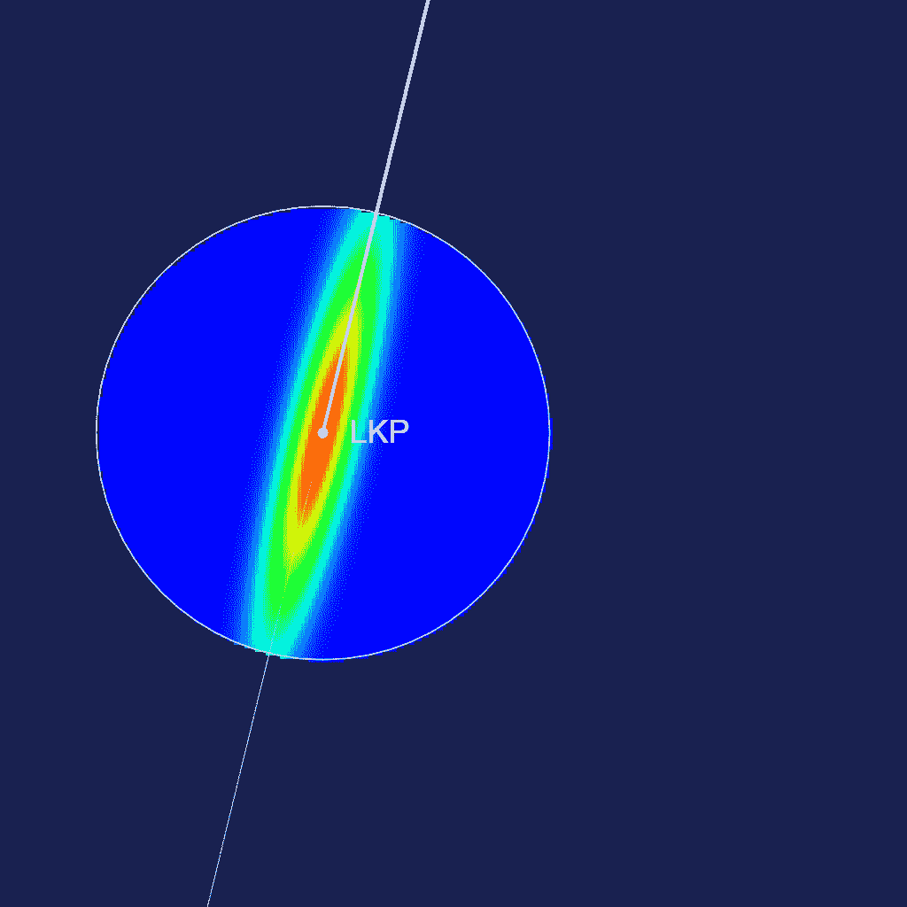

我们可以加上其他因素，比如水流。在这个例子中，我将添加一些随机值和柏林噪声。

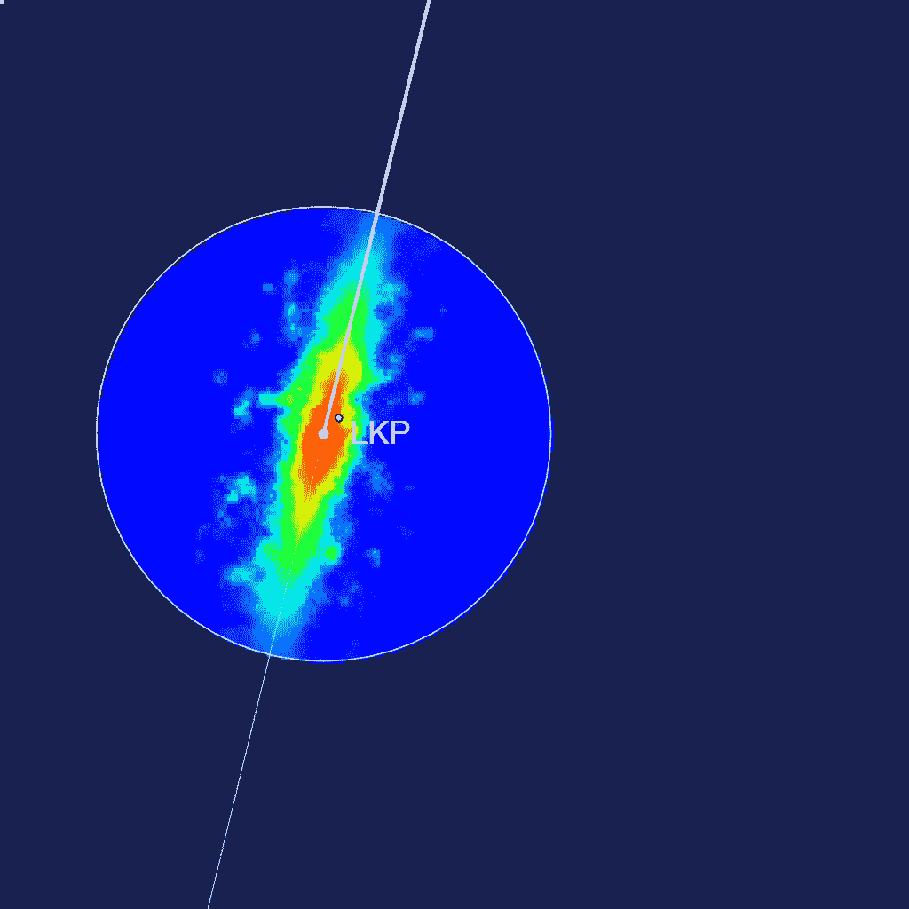

我创建了两个函数。`generate_lost()`生成飞机的随机位置。`generate_distribution()`生成一个更靠近飞机的随机点，并将其作为 LKP 来生成分布。

## 搜索模式

通常是从概率最高的地方开始搜索到概率最低的地方。现实生活中有很多搜索模式可以使用，比如:

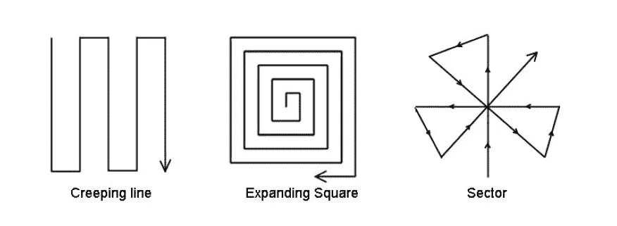

我们将使用不同的方法。我们将总是选择当前方块范围内概率最高的方块。如果有多个，我们将选择最近的一个。虽然对于现实生活中的应用程序来说不是很好，但它更容易实现。

在正方形中搜索时，有三种情况。我们可以用概率来表示它们。

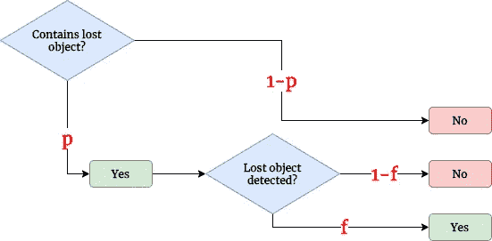

*   **真正:** *概率* ***pf*** *。* 如果找到飞机。
*   **真否定:** *概率* ***1-p.*** 如果没有找到飞机且正方形不包含飞机。
*   **假阴性:** *概率****p(1-f)****。* 如果你没有找到飞机但飞机确实在那里。这是因为搜索有可能找不到飞机。

你不可能得到误报，因为你不可能发现一架不在那里的飞机。(或者至少我们会这样假设)。

如果我们在一个正方形中没有找到飞机，我们将使用正方形拥有飞机的概率来更新概率，假设搜索没有找到它。这就是我们要用到贝叶斯定理的地方。

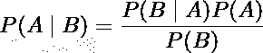

也可以写成

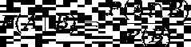

飞机在那里但搜索没有找到的概率是

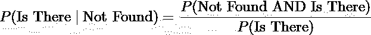

利用上图我们可以看到，平面 ***存在而*** 未被发现的概率为 **p(1-f)** 。而飞机被**没发现**的概率就是 ***有没有*** ***没发现*p(1-f)*****有没有 1-p*** 也就是 **p(1-f)+1-p** 。

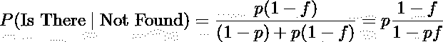

对于其他方块，没有机会( **f=0** )在那里找到飞机，因为我们还没有搜索那里。所以，可能性是

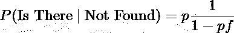

# 搜索！

直觉上，随着搜索概率的下降，我们应该期待更多的迭代来找到对象。

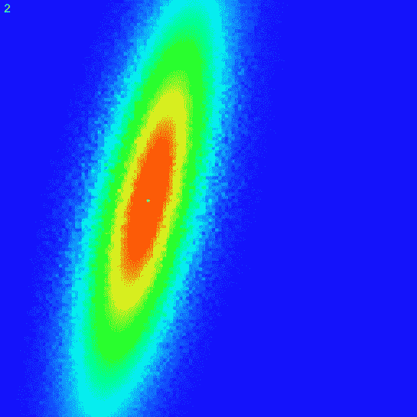

70%(左)和 30%(右)的搜索发现概率。

**假设:**较高的搜索概率平均需要较少的步骤来找到对象。

当搜索概率较低时，如果什么也没找到，概率会缓慢下降。因此，执行了更多的搜索。

让我们针对不同的概率分布和搜索概率进行多次运行，以确认我们的假设。

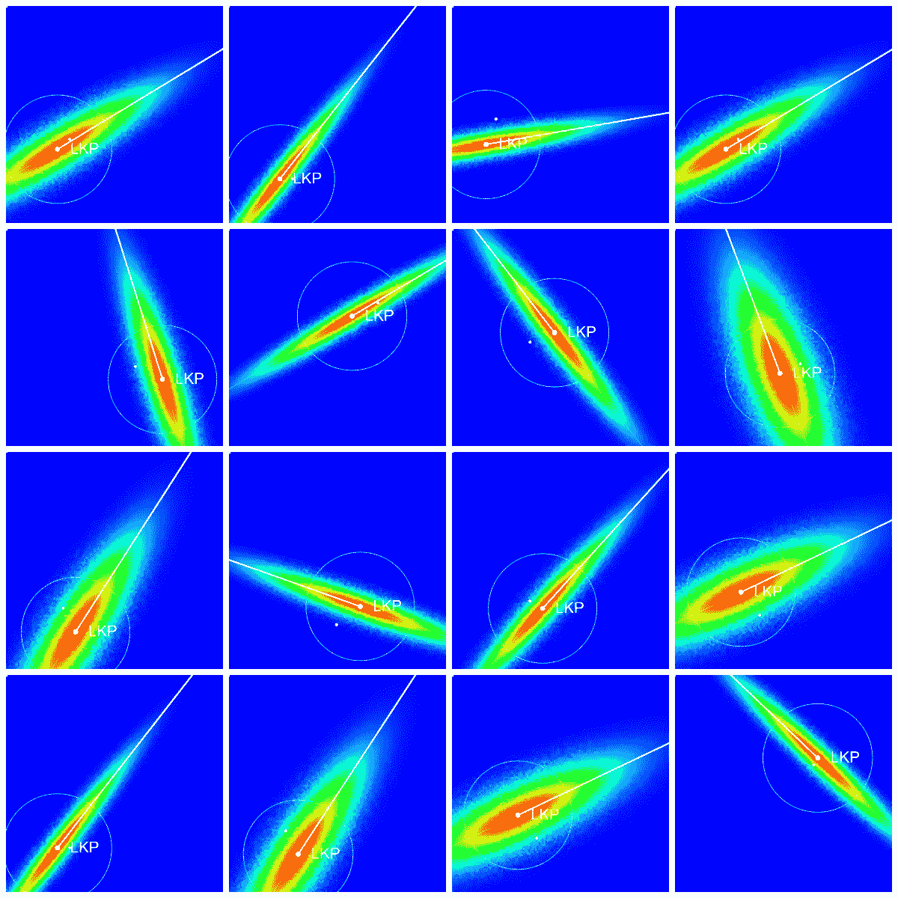

16 个随机生成的概率分布。

这是运行 1000 次后的结果。

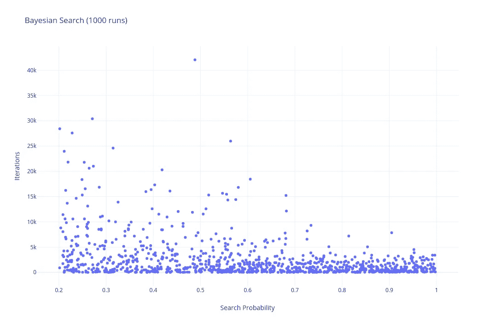

对于高概率值(接近 1)，与低概率值相比，在发现飞机之前采取的步骤数量非常小且紧凑。

我们可以清楚地证实我们的假设。

你可以在这里找到 *JavaScript + p5.js* 项目和源代码[。](https://editor.p5js.org/BilHim/sketches/3gsKfQCTx)

我们可以通过给每个方块一个搜索成本来进一步扩展这一点。那么问题就变成了:如何在最小化成本的同时最大化找到对象的几率。这是一个[吉廷斯指数](https://en.wikipedia.org/wiki/Gittins_index)的例子。

更进一步，我们可以将这种方法与基于神经网络的搜索进行比较。