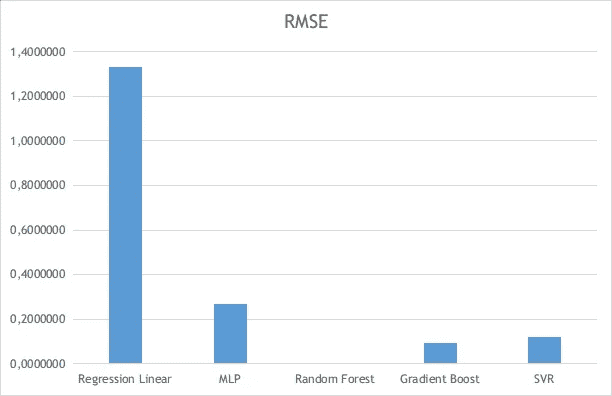

# 用机器学习寻找大气的混合比:一种未知函数的逼近

> 原文：<https://towardsdatascience.com/finding-mixing-ratio-of-the-atmosphere-using-machine-learning-an-approaching-of-the-unknown-2341e3c47f49?source=collection_archive---------45----------------------->

## 通过数据集对未知函数进行反向工程


[腾雅特](https://unsplash.com/@tengyart?utm_source=medium&utm_medium=referral)在 [Unsplash](https://unsplash.com?utm_source=medium&utm_medium=referral) 上拍摄的照片

# 序言

简而言之，我需要编写一个脚本来自动将 TEMP 代码转换为 Wyoming university 表格文本格式，因为我将用来处理高级数据的一些库只接受这种格式。这里是怀俄明大学表格的标题文本格式。


压力、位势高度、温度、露点、相对湿度、混合比、风向、风速、位势温度、等效位势温度、虚拟位势温度

这是临时代码的示例

```
TTAA 75007 96749 99010 25612 25002 00096 24810 29507 92771 21414 31020 85497 18211 32521 70115 00413 33013 88999 77999=TTBB 75008 96749 00010 25612 11981 23017 22914 21212 33886 19411 44837 18214 55799 16216 66782 14413 77762 14014 88744 01420 99739 02219 11721 02218 22717 01815 33716 01015 44715 01613 55714 02410 66710 01009 77693 00016 88659 00517 99650 00015 11648 00315 22644 02615 33639 02516 44615 01911 55581 06302 66580 05901 77579 03100 88578 06500 21212 00010 25002 11977 29513 22850 32521 33611 32514 44588 30507 31313 73508 82330 41414 45422=
```

我不会详细说明如何解码这段代码，因为这将是一个很长的解释。

通过解码数据，我得到了压力、位势高度、温度、露点、风向和风速。其余的通过预测公式得到。我知道如何利用预测公式**得到除混合比**之外的其余部分。但是在这里我知道一个事实

> 混合比受压力、温度和相对湿度的影响

# 机器学习拯救世界

这是使用机器学习的绝佳机会和绝佳案例。为什么？因为我们只需要得到**未知固定函数**的近似，而不是**经验函数**。当你经常要在气象的实际情况中(例如降雨量预测、温度预测等)寻找非线性经验函数时，**你不得不考虑诸如昼夜、地形、季节等因素**。因此，你不应该只是使用所有现有的数据集和训练模型。不，我打赌你的模特表现会**差**。但是这里我们知道一个事实，在这种情况下，**混合比的公式**在任何季节，白天或夜晚，在任何地形，**在任何条件下都是一样的**。所以在这里，你可以**直接包含你所有的数据集**而不用动脑！

有 3 个参数影响混合比，即压力、温度和相对湿度。所以这些参数会是机器学习模型的参数和作为标签的混合比例。

在这里，我已经从怀俄明大学的网站上抓取了两年的怀俄明格式的临时数据。你可以在这里下载它，但是…


我超过 50%的数据被省略:(

不过不用担心，我已经为这个机器学习实验[这里](https://github.com/genomexyz/mixing_ratio_experiment/blob/master/dataset.npy)保存了 npy 格式的怀俄明格式数据中提取的参数(压力、温度、相对湿度)和标签(混合比例)。

这里是从 Wyoming 数据中提取参数和标签的脚本。

在我们提取数据并获得矩阵后，现在我们用这些数据训练机器学习模型。

这里我们使用线性回归(作为一个比较器，任何模型的准确性都低于线性回归，这意味着**该模型在这种情况下不太可行，或者未知的混合比例函数在这种情况下是线性的，因此使用机器学习是多余的**)、多层感知器(MLP)、随机森林、梯度增强和支持向量回归(SVR)。在这种情况下，我们将使用除 **MLP** 之外的所有车型的超参数的默认设置。这是因为 MLP 的默认设置是 1 层 100 个神经元，这对于只有 3 个参数的情况来说太多了。这也是因为与这里的其他模型相比，MLP 模型是我最了解的一个。如果我像了解 MLP 一样了解其他模型，我也会设置其他模型的超参数，以避免不平衡设置。

我设置了 10000 个数据作为测试数据，其余的作为训练数据。我们使用均方根误差(RMSE)和运行时间作为性能指标。结果是


最大的 RMSE 和最快的运行时间来自线性回归，这意味着我们的未知函数是非线性的。第二大 RMSE 是 MLP，这意味着最差的模式，在这种情况下，是 MLP。最小的 RMSE 来自随机森林，它在其他模型的最左边。



如果从运行时间来看，最长的来自 SVR。它的运行时间远远落后于其他型号，其 RMSE 是第三大。最快的机器学习模型是梯度推进，RMSE 次之。这是一场精彩的表演。


最后，如果你真的想使用机器学习模型，你可以用

因为我们已经训练了模型，并且运行时间的最大部分是训练时间，所以最好的选择是保存最准确的模型，不管训练时间有多长。

你可以在这里访问全部代码和数据[。另一篇文章再见。](https://github.com/genomexyz/mixing_ratio_experiment)

# **参考文献**

http://weather.uwyo.edu/upperair/columns.html 于 2020 年 6 月 18 日进入

[https://www . geeks forgeeks . org/saving-a-machine-learning-model/](https://www.geeksforgeeks.org/saving-a-machine-learning-model/)2020 年 6 月 19 日访问