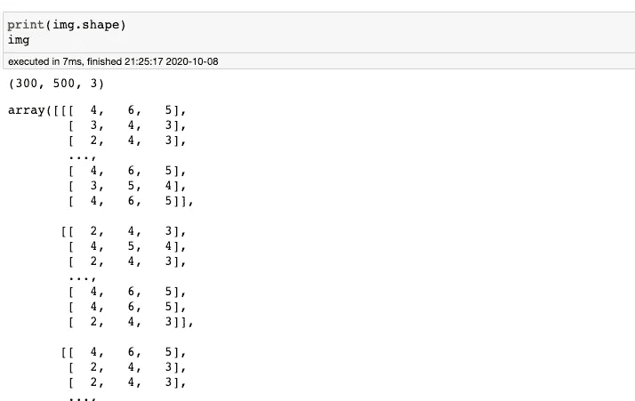
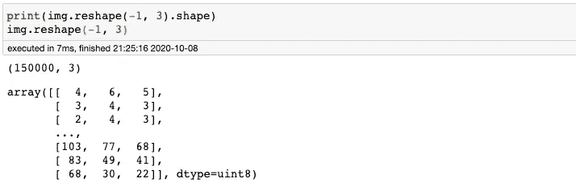
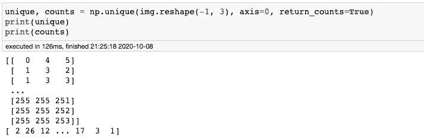
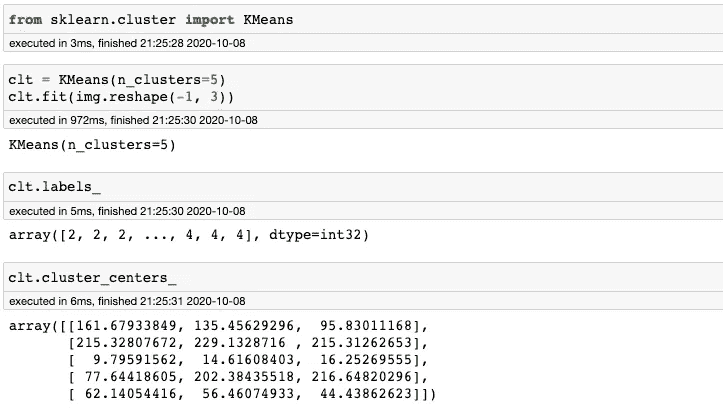
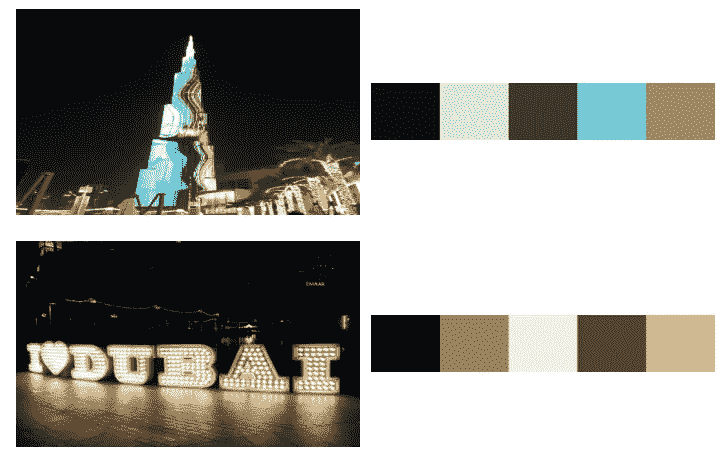
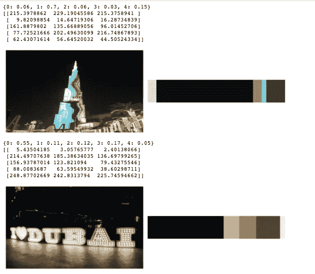

# 在 Python 中查找最常见的颜色

> 原文：<https://towardsdatascience.com/finding-most-common-colors-in-python-47ea0767a06a?source=collection_archive---------6----------------------->

## 图像处理任务中的标准但至关重要的功能

如果我们知道图像或物体最常见的颜色是什么，就可以解决图像处理中的几个用例。例如，在农业领域，我们可能想要确定水果的成熟度，例如橙子或草莓。我们可以简单地检查水果的颜色是否落在预定的范围内，看看它是否成熟、腐烂或太年轻。

照片由[莎拉·瓜尔蒂埃里](https://unsplash.com/@sarahjgualtieri?utm_source=medium&utm_medium=referral)在 [Unsplash](https://unsplash.com?utm_source=medium&utm_medium=referral) 上拍摄

像往常一样，我们可以使用 Python 加上简单而强大的库(如 Numpy、Matplotlib 和 OpenCV)来解决这个问题。我将演示几种方法来使用这些包找到图像中最常见的颜色。

## 步骤 1 —加载包

我们将在这里加载基本包。我们会继续加载更多的包。还有，既然我们是用 Jupyter 编程，那就别忘了包含`%matplotlib inline`命令。

## 步骤 2 —加载并显示样本图像

在本教程中，我们将大量并排显示两幅图像。因此，让我们创建一个助手函数来完成这项工作。

接下来，我们将加载一些我们将在本教程中使用的示例图像，并使用上面的函数显示它们。

来源:作者图片

现在我们准备好了。是时候找出这些图片中最常见的颜色了。

## 方法 1 —平均

第一种方法是最简单的(但不是最有效的)，只需找到平均像素值。

使用`numpy`的`average`函数，我们可以很容易地得到整个行和宽度的平均像素值— `axis=(0,1)`

最常见的颜色#1 —平均法

我们可以看到，平均方法可能会产生误导或不准确的结果，因为它给出的最常见的颜色有点偏离。这是因为平均值考虑了所有像素值。当我们有高对比度的图像(在一个图像中既有“亮”又有“暗”)时，这确实是个问题。这在第二张图中更加清晰。

> 它给了我们一种新的颜色，在图像中看不清楚/不明显。

## 方法 2 —最高像素频率

第二种方法会比第一种方法更精确一点。我们将简单地计算每个像素值中出现的次数。

对我们来说幸运的是，`numpy`再次给了我们一个函数，给出了这个精确的结果。但是首先，我们必须重塑图像数据结构，以仅给出 3 个值的列表(每个值对应一个 R、G 和 B 通道强度)。

我们可以简单地使用`numpy`的`reshape`函数来获取像素值列表。

既然我们有了正确结构的数据，我们可以开始计算像素值的频率。我们可以使用`numpy`的`unique`函数，带参数`return_counts=True`。

好了，让我们运行它到我们的图像。

最常见的颜色#2 —频率法

这比第一个更有意义，对吗？最常见的颜色在黑色区域。但是我们可以更进一步。如果我们不只选择一种最常见的颜色，而是不止一种呢？用同样的概念，我们可以取前 N 个最常见的颜色。除此之外，如果你看第一张图片，许多频率最高的颜色很可能是相邻的颜色，可能只有很小的像素差异。

> 换句话说，我们想要取最普通的、不同的**色群**。

## 方法 3 —使用 K 均值聚类

Scikit-learn package 来拯救我们。我们可以使用臭名昭著的 K-Means 聚类来将颜色分组。

很简单，对吧？现在，我们需要的是一个函数来显示上面的颜色簇，并立即显示出来。

我们简单地创建一个高度为 50，宽度为 300 像素的图像来显示颜色组/调色板。对于每个颜色簇，我们将其分配到调色板中。

最常见的颜色# 3—K-均值聚类

很漂亮不是吗？K-Means 聚类在图像中最常见的颜色方面给出了很好的结果。在第二个图像中，我们可以看到调色板中有太多的棕色阴影。这很可能是因为我们选择了太多的集群。让我们看看是否可以通过选择一个更小的 *k* 值来修复它。

是的，解决了。由于我们使用 K-Means 聚类，我们仍然需要自己确定合适的聚类数。三簇似乎是个不错的选择。

但是我们仍然可以改进这些结果，并且仍然可以解决一些集群问题。

> 不如我们也显示整个图像中聚类的比例？

## 方法 3.1-K 均值+比例显示

我们需要做的就是修改我们的`palette`函数。我们不使用固定的步长，而是改变每个聚类的宽度，使其与该聚类中的像素数量成比例。

最常见的颜色# 3.1—K-表示聚类+比例

好多了。

它不仅给了我们图像中最常见的颜色。它还给出了每个像素出现的比例。

它还有助于回答我们应该使用多少个集群。在顶部图像的情况下，两到四个集群似乎是合理的。在第二个图像的情况下，看起来我们至少需要两个集群。我们不使用一个集群( *k=4* )的原因是我们会遇到与平均方法相同的问题。

结果为 k=1 的 k 均值

# 结论

我们已经介绍了几种使用 Python 和几个著名的库来获得图像中最常见颜色的技术。另外，我们也看到了这些技术的优缺点。到目前为止，使用 K-Means 和 *k > 1* 找到最常见的颜色是找到图像中最常见的颜色的最佳解决方案之一(至少与我们经历过的其他方法相比)。

如果你对剧本有问题，请在评论中或者我的 [Github](https://github.com/mrakelinggar/data-stuffs/tree/master/frequent_color) 中告诉我。