# 使用 Python 数据可视化寻找最佳 NBA 体格

> 原文：<https://towardsdatascience.com/finding-optimal-nba-physiques-using-data-visualization-with-python-6ce27ac5b68f?source=collection_archive---------27----------------------->

## 使用 python、pandas 和 Plotly 探索和可视化数据，以获得快速、即时的洞察力(包括[代码](https://gitlab.com/jphwang/online_articles) &交互式图表)

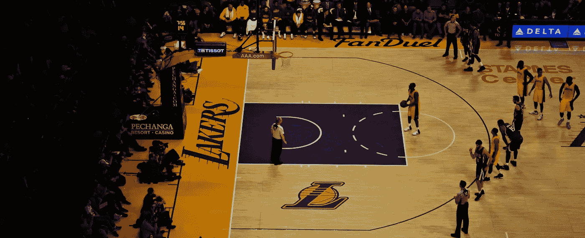

照片由[拉米罗·皮亚诺罗萨](https://unsplash.com/@rapiana?utm_source=unsplash&utm_medium=referral&utm_content=creditCopyText)在 [Unsplash](https://unsplash.com/s/photos/body-basketball?utm_source=unsplash&utm_medium=referral&utm_content=creditCopyText) (RIP Kobe)上拍摄

*在开始详细分析之前，您是否希望更好地评估数据集？这篇文章是一个例子，展示了我是如何用篮球运动员的身体数据来做这件事的。如果你感兴趣，请继续阅读。像以往一样，主题(篮球)的讨论被留到了最低限度。*

我敢打赌，你见过一个非常高的人，并想知道(大声)他们是否打篮球。或者向一个发育过度的孩子的父母建议。篮球运动员都很高。在这项运动中，将球放入离地 10 英尺(305 厘米)高的篮圈，身高将是一个优势。

但是优势有多大呢？这种优势表现出来了吗，尤其是在最高层？如果我管理一个篮球队，在其他条件都相同的情况下，哪种体质更有优势，随着时间的推移，球员会如何发展或变老？

因为我希望建立一个模型，可以根据过去的表现数据以及球员的身体属性来预测球员的表现。在建立一个严格的模型之前，我想先感受一下这些问题的答案。所以让我和你们分享一下我是如何做到的。

*和往常一样，代码包含在我的*[*git lab repo here*](https://gitlab.com/jphwang/online_articles)*(****NBA _ physiques****目录)中，请放心下载使用/改进。*

*我还包括了* ***链接到图的交互版本*** *s 沿途适用的地方。这些链接在图的标题中。*

# 在开始之前

## 数据

本文使用 [Kaggle 的 NBA 球员数据集](https://www.kaggle.com/drgilermo/nba-players-stats)。数据集来自 basketball-reference.com，由于它相对较小，我的 repo 中包含了一个副本(在 *srcdata* 目录中)。

## 包装

我假设您熟悉 python。但是，即使你相对较新，这个教程不应该太棘手。如果你有什么不确定的地方，请随时联系 twitter 或这里。

你需要用一个简单的`pip install [PACKAGE NAME]`将`plotly`和`pandas.`安装到你的虚拟环境中。

# 数据清理/预处理

虽然我们在前面的文章中直接进入了数据可视化，但是让我们从一点数据工作开始。

> 注意:我将这一部分保持简短，但是如果您对数据清理/处理不感兴趣，请随意跳到“数据概述”部分—我们通过加载已处理的数据(在我的 repo 中提供)来了解这一部分。

我们将使用 kaggle 数据集中的`Seasons_Stats.csv`和`player_data.csv`。由于`player_data.csv`包含玩家的身体属性，我们将通过匹配`Seasons_Stats.csv`数据集中的玩家姓名来加入数据集。

使用以下内容加载两个数据集:

```
import pandas as pd
player_data_df = pd.read_csv('srcdata/player_data.csv')
season_stats_df = pd.read_csv('srcdata/Seasons_Stats.csv', index_col=0)
```

而且看一下数据，有`.head(),` `.info()`和`.describe()`。有一些(小)问题。

球员身高值为`string`值，比较困难，在`[FEET-INCHES]`中。还有一些丢失的值，您将通过每列中非空值的计数看到(在`.info()`)。

首先，让我们在球员数据中填入身高&和体重`NA`的值。

熊猫。describe()方法提供关于数据集分布的统计信息。通过`season_stats_df[[‘Year’, ‘MP’]].describe()`查看赛季统计数据告诉我，75%的统计数据是从 1981 年开始的，这些数据包括 0 分钟比赛的赛季(平均 1053 分钟)。

在这项研究中，让我们忽略旧的(1980 年以前)数据，忽略少于 1000 分钟的小样本赛季(相当于一场比赛 12 分钟)。

这将引入一点生存偏差，但由于我们正在寻找最佳体质，这可能没那么重要。(请随时联系( [twitter](https://twitter.com/_jphwang) )如果您对此有任何意见，我很乐意了解更多。)

此处执行进一步的数据清理是为了:

*   对于年中换队的球员，去掉部分赛季(只保留总数)(例如通过交易)
*   将身高/体重数据添加到赛季统计数据框架中
*   简化列在多个位置下的玩家的位置(“C-F”变成“C”)
*   填充值，
*   删除一些空白列，然后
*   重置数据帧索引

数据集有一个错误，如果玩家有两个以上的名字，他们的名字会被截断。“尼克·范·埃克塞尔”变成了“尼克·范”。我更正了这些，但是在做了一些检查之后，我发现正确的全名正在被查找。这也无妨，因为:

**令人惊讶的是，多个名字前两个都是“飞车手罗德”的人在 NBA 打球。飞车手罗德·威廉姆斯和飞车手罗德·亨德利。**

检查统计年和球员生物年帮助我找到了正确的飞车手罗德。

结果数据保存为“`Seasons_Stats_proc.csv`”。

## 数据概述

使用以下内容加载数据集(如果尚未加载):

```
proc_stats_df = pd.read_csv('srcdata/Seasons_Stats_proc.csv', index_col=0)
```

数据包括大量的列，但是为了简单起见，我们只使用其中的几列。

在我们对体质的分析中，如果没有身高的背景，体重本身可能不是一个有用的统计数据。

相反，让我们添加一个新的衡量标准(身体质量指数)，它的定义考虑了身高。下面的代码引入了一个新列:

```
proc_stats_df = proc_stats_df.assign(bmi=proc_stats_df.weight / ((proc_stats_df.height/100) ** 2))
```

展望未来，身高和身体质量指数将被用作主要的独立变量(物理属性)。我们为初始视图制作一个散点图:

```
import plotly.express as px
fig = px.scatter(
    proc_stats_df, x='height', y='bmi',
    color='pos_simple', category_orders=dict(pos_simple=['PG', 'SG', 'SF', 'PF', 'C']),
    marginal_x="histogram", marginal_y="histogram", hover_name='Player')
fig.show()
```

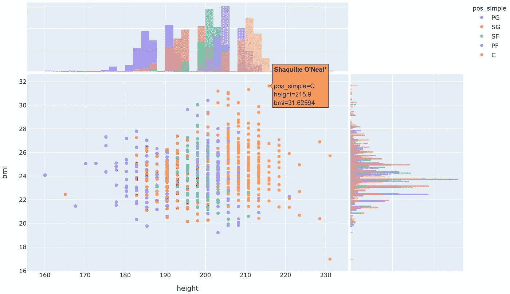

NBA 历史球员 bmi vs 身高(1981–2015)([互动](https://jolly-snyder-46e349.netlify.com/202002_nba_physique/nba_physiques_scatter_height_bmi.html))

身高分布看起来基本正常。这表明在 NBA 打球有最佳高度，尽管还不清楚为什么会有最佳高度。

> 有趣的是，许多 NBA 球员的 BMI 超过 25，这被认为是标准人的“超重”。这确实表明，这些标准化的衡量标准并不真的适用于所有人。他们(大部分)都是精英运动员，不可能有这么多 NBA 球员超重。

你可能会注意到有更多的高个子球员比矮个子球员有更高的 BMI。在我们继续前进的时候，请记住这一点。

此外，高度和身体质量指数属性数据将被放入离散数据箱(类似于直方图)。这有助于使数据对异常值不那么敏感，允许更容易的比较，并将帮助我们在精神上/视觉上过度拟合数据。毕竟，我们只有成千上万的数据点(尽管每个“点”都是由整个赛季收集的数据组成的——并非所有的数据点都是相同的)。

Pandas 提供了一个方便的功能来实现这个功能(`pandas.cut`)。实现为:

```
ht_limits = [0, 190, 200, 210, np.inf]
ht_labels = [str(i) + '_' + str(ht_limits[i]) + ' to ' + str(ht_limits[i+1]) for i in range(len(ht_limits)-1)]
proc_stats_df = proc_stats_df.assign(
    height_bins=pd.cut(proc_stats_df.height, bins=ht_limits, labels=ht_labels, right=False)
)
```

> 通过查看百分位数数据并使用我自己的判断，得出了区间宽度。

引入列表`ht_limits`和`ht_labels`是为了让我能够更容易地跟踪使用了什么样的限制，也是为了以后可以重用标签来指定图表中的顺序。

身体质量指数被分成四个容器。我们现在准备开始研究身体素质与职业的细节——让我们开始吧。

> 注意:如果你想要基于分位数的分类——使用`pandas.qcut`

# 让我们变得强壮

## 韵律学

在这篇文章中，我使用了一个高级指标——“PER”(玩家效率等级)。这一指标旨在“将一名球员的所有贡献归结为一个数字”。你可以[在这里](https://www.espn.com/nba/columns/story?columnist=hollinger_john&id=2850240)了解更多。

我选择这个统计数据是因为它将一个球员的统计数据与他们的同龄人进行了比较(所以平均 PER 总是每年 15)，这使得跨时代的球员比较更加容易。

## 职业生涯长度

作为常识的检查，让我们看看在联盟中打球的年数(或者，在我们的数据库中)，vs 身高/身体质量指数。我是这样计算的。

有意思。每个身高和身体质量指数组显示非常相似的年龄/球员人数全面！因此，根据身体质量指数/身高，职业寿命看起来相对均衡，至少根据这个非常粗略的标准。

## **PER(玩家效率等级)—散点图**

那么，看看性能指标怎么样呢？一般来说，个子高会让你变得更好吗？PER 数据与高度的散点图可创建如下:

```
fig = px.scatter(
    proc_stats_df, x='height', y='PER', hover_name='Player'
    , color='Year', color_continuous_scale=px.colors.sequential.Teal,
)
fig.show()
```

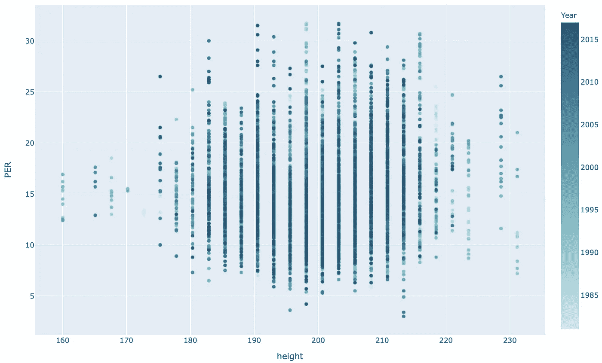

PER(绩效评定)与身高([互动](https://jolly-snyder-46e349.netlify.com/202002_nba_physique/nba_physiques_scatter_per_height.html))

那很有趣。似乎存在一个最佳的高度“区域”。只有身高在 183 厘米(6 英尺)到 216 厘米(7 英尺 1 英寸)之间的人才能达到超过 30 的赛季。

将同样的数据与身体质量指数而不是身高进行对比:

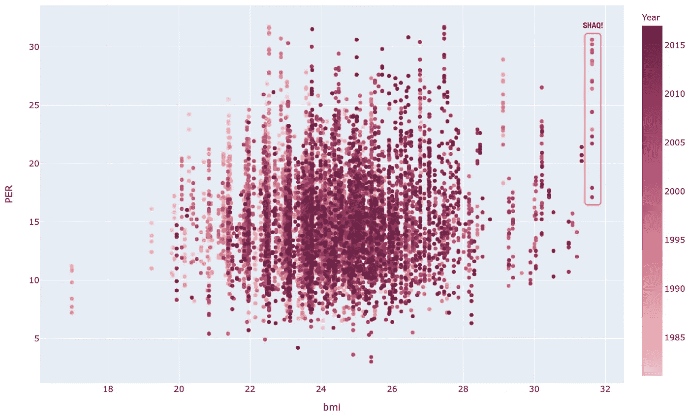

PER(绩效评分)vs 身体质量指数([互动](https://jolly-snyder-46e349.netlify.com/202002_nba_physique/nba_physiques_scatter_per_bmi.html))

同样，似乎存在一个中间最佳范围。除了一个人——那就是沙奎尔·奥尼尔，他在那个时代是一股不可阻挡的力量，防守者被他弹开就像孩子对抗跳跃的城堡一样。

然而，他是一个非常特殊的人，公平地说，这些数据并没有充分地捕捉到他这些年来不断变化的体格，因为他的身体质量指数在他的职业生涯中波动很大。

另一个观察结果是，PERs 的下限似乎随着身体质量指数数字的增加而增加。

## PER(玩家效率等级)—箱线图

尽管如此，这些数据还是很嘈杂。让我们再画一次这些，但是作为一个方框图。

使用箱线图，我们可以很容易地将数据(PER)的*分布*可视化为独立变量(身体质量指数&高度箱)的函数。

```
fig = px.box(
    proc_stats_df, x='height_bins', y='PER', color='bmi_bins', hover_name='Player',
    category_orders=dict(height_bins=ht_labels, bmi_bins=bmi_labels))
fig.show()
```

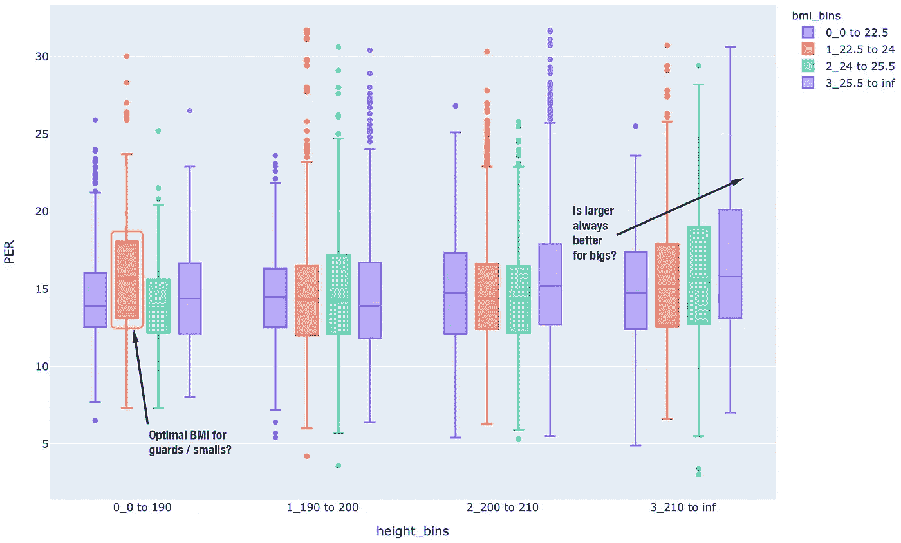

PER vs 身高/身体质量指数([互动](https://jolly-snyder-46e349.netlify.com/202002_nba_physique/nba_physiques_box_per_height.html)

结果中跳出了两个输出，我已经在上面的输出中标记了它们。

190 厘米以下球员的曲线显示了 22.5 到 24 岁身体质量指数带的 PER 增加。210 厘米及以上的极右翼群体的数据表明，越大越有可能成为伟人。

暂停一会儿，你会想起数据还包括每个球员的位置。让我们看看这些身高是否对应于特定的球员位置分组。

我们可以将这些位置的计数绘制成直方图，并使用子图来分离出每个高度和身体质量指数仓的位置分布。

下面的代码片段实现了这个目的:

```
fig = px.histogram(
    proc_stats_df, x='pos_simple', facet_row='bmi_bins', facet_col='height_bins', color='pos_simple',
    category_orders=dict(height_bins=ht_labels, bmi_bins=bmi_labels, pos_simple=['PG', 'SG', 'SF', 'PF', 'C']))
fig.show()
```

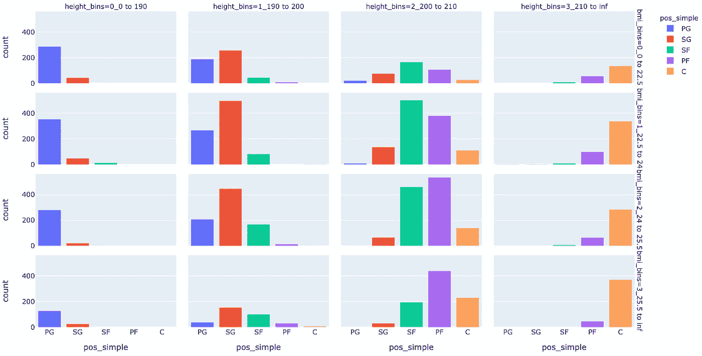

身高/身体质量指数组，按职位([互动](https://jolly-snyder-46e349.netlify.com/202002_nba_physique/nba_physiques_hist_height_pos.html))

首先，事实证明，身高是一个非常合理的位置预测指标。把注意力转回到方框图，它表明身体质量指数 22.5 到 24 的增加主要与控卫有关。

篮球中的控球后卫是主要的控球者，他们负责进攻和分配球。

我对这个身体质量指数带(22.5-24)的 PER 增加的业余解释是，它是一种身体类型的指示，这种身体类型最大限度地提高了灵活性和爆发力，这在主要控球者中是有价值的，而不是太小，这可能会对你的耐用性产生不利影响。

大个子的数据(在箱线图和直方图的最右边)可能更简单。作为中锋或大前锋，在篮筐附近打球，更大的块头可能会让你在身体上控制你的对手，就像沙克或查尔斯·巴克利一样。

## 老化

太好了。父亲时间呢？某些体型会比其他体型更容易衰老吗？这一部分根据身体类型来看球员的表现范围随时间的变化。

我们再一次创建了年龄箱:

```
age_limits = [0, 23, 25, 27, 29, 31, np.inf]
age_labels = [str(i) + '_' + str(age_limits[i]) + ' to ' + str(age_limits[i+1]) for i in range(len(age_limits)-1)]
proc_stats_df = proc_stats_df.assign(
    age_bins=pd.cut(proc_stats_df.Age, bins=age_limits, labels=age_labels, right=False)
)
```

下面是按身高细分的每对年龄箱线图。

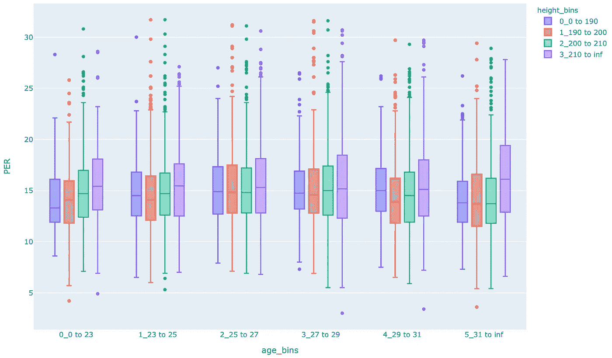

按年龄段，按身高细分([互动](https://jolly-snyder-46e349.netlify.com/202002_nba_physique/nba_physiques_box_per_height_bins.html))

那不是很迷人吗！对于年轻球员来说，身高是一个明确的优势，但这种优势在他们的壮年时期(23-31 岁之间)或多或少会消失，然后在老年时期再次出现。

我认为这表明身高可以让球员更容易补偿年龄的增长和运动能力的丧失。

同样，下图显示了按身体质量指数范围细分的 PER 与年龄。

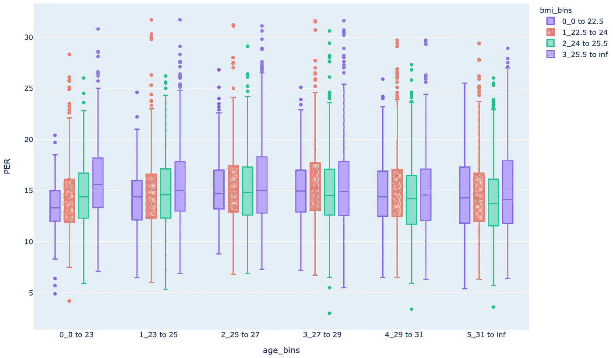

PER 按年龄段，由身体质量指数细分([互动](https://jolly-snyder-46e349.netlify.com/202002_nba_physique/nba_physiques_box_per_bmi_bins.html))

在这种情况下，更大的身体质量指数似乎对年轻球员更有优势。对此的解释可能是，这使他们能够在块/内部发挥更好的作用，但随着年龄的增长，任何优势都会被灵活性的损失所抵消。

这种敏捷性的损失对某些类型的玩家的影响会比其他玩家更大吗？我们可以按位置把数据分成支线剧情来看一下:

```
fig = px.box(
    proc_stats_df, x='age_bins', y='PER', color='bmi_bins', hover_name='Player', facet_row='pos_simple',
    category_orders=dict(bmi_bins=bmi_labels, age_bins=age_labels, pos_simple=['PG', 'SG', 'SF', 'PF', 'C'])
)
```

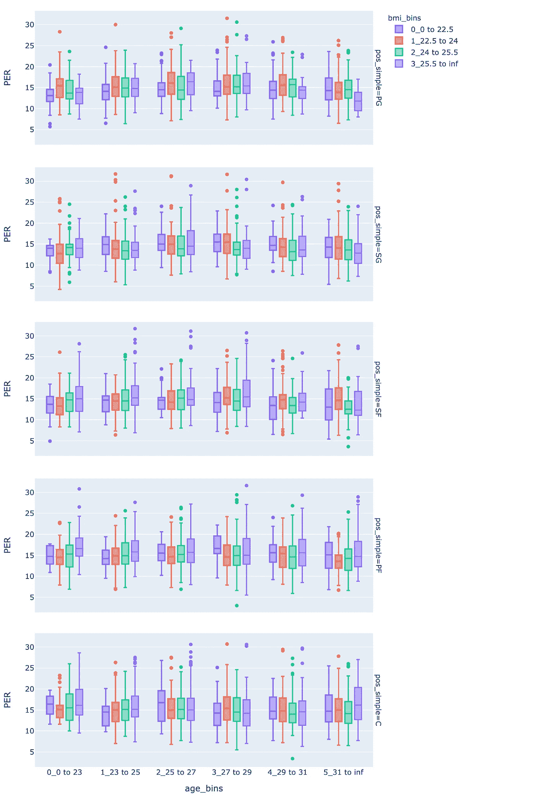

按年龄段，按身体质量指数和职位细分([互动](https://jolly-snyder-46e349.netlify.com/202002_nba_physique/nba_physiques_box_per_bmi_bins_pos_sub.html))

随着我们对数据的划分越来越深入，我们处理的样本规模越来越小，我们应该警惕对太多数据的解读。说到这里，答案似乎是一个响亮的是！

这与我们之前所想的高度补偿运动中的损失是完全一致的。后卫一般都比较矮，随着年龄的增长，很难弥补他们运动能力的不足。

更重要的是，如果组织后卫(在次要情节的顶部)和得分后卫有更大的身体身体质量指数，他们会不成比例地受到年龄的影响。处于底部的中心，似乎随着年龄的增长做得越来越好——而且身体质量指数和表现之间根本没有太大的关联。年纪大、块头也大的警卫受害最深。

有趣的是，年纪大的大前锋和中锋看起来最显老。这是真的吗？

我们把数据翻过来，把身高仓作为我们的 x 轴数据，按年龄段排列。

```
fig = px.box(
    proc_stats_df, x='height_bins', y='PER', color='age_bins', hover_name='Player',
    category_orders=dict(height_bins=ht_labels, age_bins=age_labels)
)
fig.show()
```

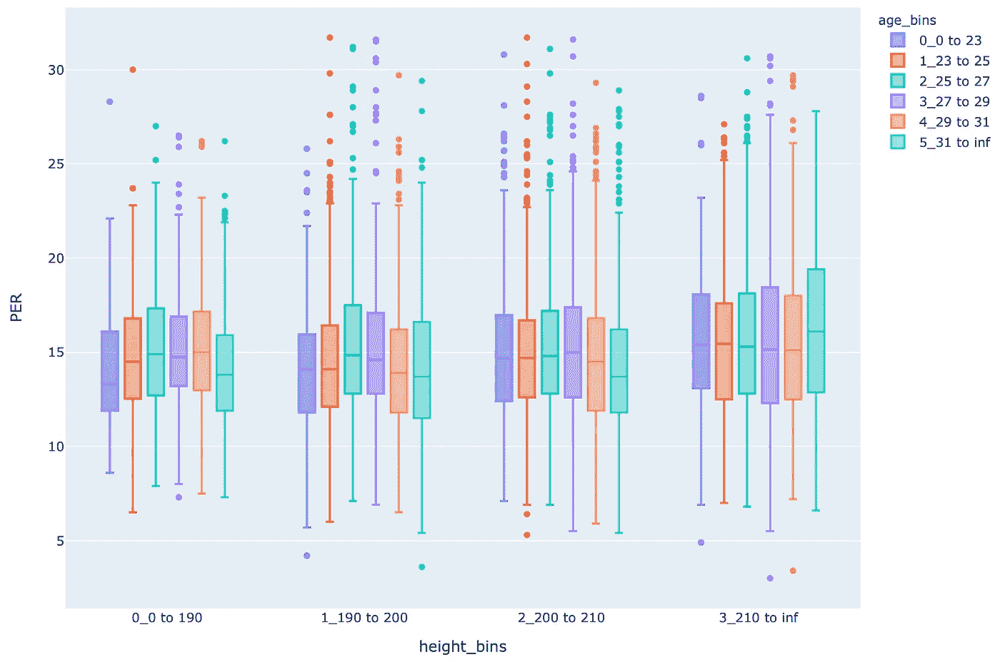

按身高分类，再按年龄分类([互动](https://jolly-snyder-46e349.netlify.com/202002_nba_physique/nba_physiques_box_per_height_bins_age_bins.html))

这张图表显示，高个子球员绝对比矮个子球员更容易衰老。

事实上，高个子球员从很小的时候就被期望有更高的生产力，而矮个子球员需要更长的时间来发展。这将意味着，在他们成为重要贡献者之前，将他们吸收到团队中的团队所需要的时间投入会显著减少。

## 现代篮球

作为最后的回顾，让我们看看这对于现代篮球来说是否成立。上面使用的数据集涵盖了 1981 年至 2017 年。篮球在那个时候发生了显著的变化，包括防守规则的变化，三分革命和对空间的重视，而不是大个子在内线的统治。

这产生了什么影响？如果我们把数据分成三组 12 年的时间段会怎么样？

```
yr_limits = [0, 1995, 2007, np.inf]
yr_labels = [str(i) + '_' + str(yr_limits[i]) + ' to ' + str(yr_limits[i+1]) for i in range(len(yr_limits)-1)]
proc_stats_df = proc_stats_df.assign(
    year_bins=pd.cut(proc_stats_df.Year, bins=yr_limits, labels=yr_labels, right=False)
)
```

我们可以将 PER 作为年龄和身高的函数，用子图(行)显示不同的年龄:

```
fig = px.box(
    proc_stats_df, x='height_bins', y='PER', color='age_bins', hover_name='Player', facet_row='year_bins'
    , category_orders=dict(height_bins=ht_labels, age_bins=age_labels, year_bins=yr_labels)
)
fig.show()
```

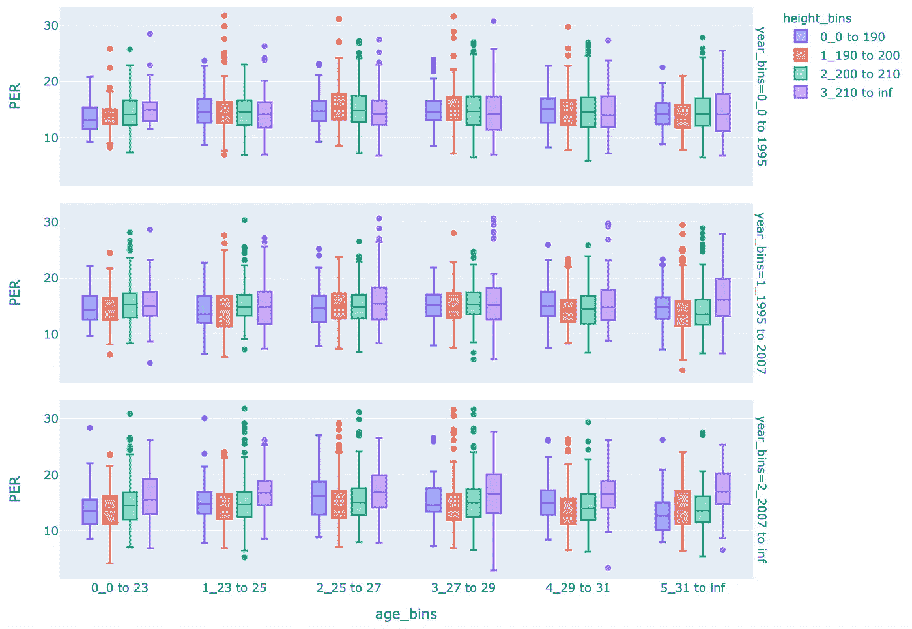

按年龄段，按身高和年龄细分([互动](https://jolly-snyder-46e349.netlify.com/202002_nba_physique/nba_physiques_box_per_height_bins_age_bins_yr_sub.html))

根据这些数据，2007-2017 年的 NBA 是大个子的黄金时代，远远超过 81-94 和 95-06。我将在另一篇文章中谈到篮球方面的事情，但看起来 NBA 的大个子变得更重要、更好，而不是更差。

这就是可视化探索数据集的力量。通过划分来自近 1500 名球员的约 8700 个赛季的数据，我们可以快速识别数据中的趋势。

仅仅在很短的时间和一些图表中，我们就发现了潜在的有趣和有价值的数据，这些数据可能值得进一步研究。我们已经看到了特定身高的最佳身体质量指数范围，不同身高范围的球员如何才能充分发挥生产力，或者根据年龄回归，并比较各个时代。

这些也可能成为选择在机器学习模型中包括什么特征或者开发新特征的有价值的输入。

此外，用跨时代标准化的身高/身体质量指数数据重新审视这些数据可能会很有趣，可以补偿跨时代的任何变化。评估另一个联赛(国际、欧洲联赛或 WNBA)的数据也是很有趣的，看看这些数据如何比较。

我希望这是一个有用的例子，你可以通过简单的操作和可视化数据来获得信息。有时候，在你能很好地理解它之前，没有什么可以替代眼前的事物。

如往常一样，如果你有任何问题或意见，打电话给我。

如果你喜欢这个，比如说👋/在[推特](https://twitter.com/_jphwang)上关注，或者关注更新。我还写了这些可视化篮球投篮数据的文章，以及关于可视化气候数据的文章。

[](/interactive-basketball-data-visualizations-with-plotly-8c6916aaa59e) [## 用 Plotly 实现交互式篮球数据可视化

### 用 hexbin shot 图表分析体育数据，用 Plotly 和 Plotly Express 分析气泡图(源代码&我自己的数据…

towardsdatascience.com](/interactive-basketball-data-visualizations-with-plotly-8c6916aaa59e) [](/interactive-climate-data-visualizations-with-python-plotly-de0472490b09) [## 用 Python & Plotly 实现交互式气候数据可视化

### 使用 plotly 可视化时间序列数据，包括条形图(柱形图)和子图(我的 GitLab repo 中的源代码和数据)

towardsdatascience.com](/interactive-climate-data-visualizations-with-python-plotly-de0472490b09)