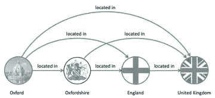
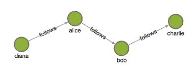
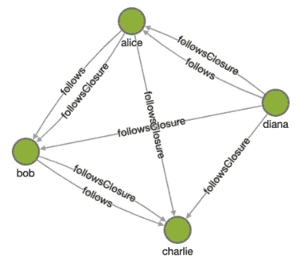
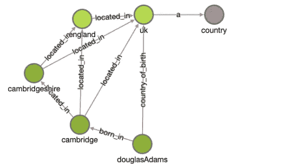
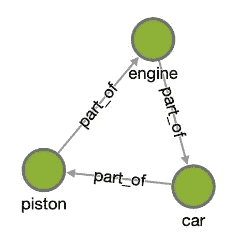
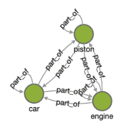
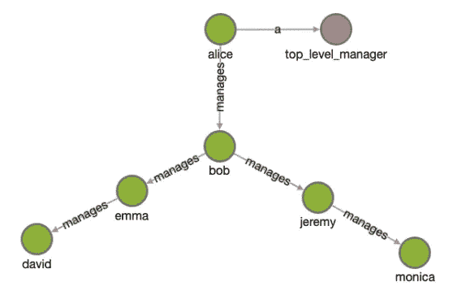

# 使用知识图和语义推理寻找有规则的模式

> 原文：<https://towardsdatascience.com/finding-patterns-with-rules-4227ee4e8f58?source=collection_archive---------38----------------------->

## 概念和示例


机器学习算法现在等同于在数据中寻找模式，但并非所有模式都适合基于统计的数据驱动技术，例如当这些模式没有明确标记的学习目标时。

在某些情况下，这些模式可以精确地表达为一个规则。推理是匹配基于规则的模式或验证它们在图中不存在的过程。因为这些模式是用演绎逻辑发现的，所以与从数据中归纳的机器学习模式相比，它们可以被更有效地发现和更容易地解释。

本文将介绍一些常见的模式，以及如何使用牛津语义技术公司开发的知识图和语义推理引擎 [RDFox](https://www.oxfordsemantic.tech/product) ，用规则语言 Datalog 来表达它们。RDFox 是基于标准的，[RDF](https://www.w3.org/RDF/)-三重存储，我们将使用 [SPARQL](https://www.w3.org/TR/rdf-sparql-query/) 对其进行查询。如果你还不熟悉知识图和推理，你可以在这里阅读发表在《走向数据科学[上的介绍。如果您没有 RDF 数据，请阅读我们的简单教程](/the-intuitions-behind-knowledge-graphs-and-reasoning-59df2f1ad054)[将 CSV 和 SQL 数据导入 RDF 图。](https://www.oxfordsemantic.tech/importing-data-into-rdfox)

# 传递关系模式

“位于”关系在直觉上是可传递的，但可能无法在图中完全表达。例如，一个图形可能包含以下三元组:

```
@prefix : <https://oxfordsemantic.tech/RDFox/tutorial/> .:oxford       :located_in :oxfordshire .
:oxfordshire  :located_in :england .
:england      :located_in :uk .
```

SPARQL 查询不会返回牛津位于英格兰，因为它缺少三个字符:

```
:oxford       :located_in :england .
```

该三元组可以一次性添加，但这很快在较大的图表上变得不切实际，因为位于牛津郡的其他城镇也可能会缺少位于英格兰边缘的城镇。

在这种情况下，传递关系规则可以毫不费力地自动绘制相关的:located_in 边:

```
[?x, :located_in, ?z] :- 
   [?x, :located_in, ?y], 
   [?y, :located_in, ?z] .
```

第一部分是规则的头，如果在图中找到符号`:-`后的模式，该规则将变为`?x :located_in ?z` 三元组。

在我们的例子中，规则将变量`?x`绑定到`:oxford`，变量`?y`绑定到`:oxfordshire`，变量`?z`绑定到`:england`，然后作为满足规则的逻辑结果，通过用`:oxford`替换`?x`和用`:england`替换`?z`来创建`:oxford :located_in :england`三元组。



原始数据被规则扩展，新的关系在这里显示为绿色。

无论何时在图表中添加或删除新的数据点，RDFox 都会在运行中逐渐实现规则，这使得它成为动态数据源的有效解决方案。

# 传递闭包模式

传递闭包模式有助于将图中尚不存在但可能存在的传递关系具体化。例如，一些 Twitter 关注者可以用下图来表示:

```
:alice :follows :bob .
:bob   :follows :charlie .
:diana :follows :alice .
```



将图表可视化。

当向用户推荐以下建议时，我们可能希望使用以下规则将缺失的连接计算为`:follows_closure`边:

```
[?x, :follows_closure, ?y] :- 
   [?x, :follows, ?y] .[?x, :follows_closure, ?z] :-
   [?x, :follows, ?y], 
   [?y, :follows_closure, ?z] .
```

第一个规则指定新关系`:follows_closure`是关系`:follows`的扩展。第二个规则实现了闭包，它说如果一个人`?x`直接跟随`?y`并且`?y`(直接或间接)跟随人`?z`，那么`?x`(间接)跟随`?z`。



更新的关系显示添加了:follows_closure 边。

因此，最初不是`:follows`关系的新`:follows_closure`关系是:

```
:diana :charlie .
:alice :charlie .
:diana :bob .
```

这些简单的规则可以被增强以包括用户兴趣、地理、语言、共同的追随者等。

# 将关系定义为其他关系的组合

知识图的一个重要实际用途是支持开放式问答(Open QA)应用程序或聊天机器人，其中用户用自然语言提出一个问题，然后自动根据图进行回答。开放式问答系统通常很难解释涉及图中几个“跳”的问题。例如，考虑由下面给出的三元组组成的图。

```
:douglas_adams :born_in  :uk .
:uk            rdf:type  :country.
```

用户可能会问道格拉斯·亚当斯出生在哪个国家。为了获得这些信息，系统需要在图中构建一个包含两跳的查询。特别是 SPARQL 查询

```
select ?c where {
   :douglas_adams :born_in ?c .
   ?c rdf:type :country .
}
```

会返回`:uk`作为答案。

如果只需一跳就能获得所需的信息，那么开放式质量保证系统的结果将会大大提高。在这种情况下，可以使用 RDFox 规则来提供一个干净的解决方案。特别是，我们可以使用规则来定义一个新的`:country_of_birth`关系，为直接访问所需信息提供一条“捷径”。

```
[?x, :country_of_birth, ?y] :- 
   [?x, :born_in, ?y], 
   [?y, rdf:type, :country] .
```

规则说，如果一个人`?x`出生在一个地方`?y`，而那个地方`?y`是一个`:country`，那么`?y`就是`?x`的出生国。

因此，RDFox 会推断出道格拉斯·亚当斯的出生国是英国。开放的 QA 系统现在只需要构造以下更简单的查询，该查询涉及图中的单跳，以获得期望的信息。

```
select ?x ?y where {?x :country_of_birth ?y}
```

正如我们已经看到的，规则可以建立在其他规则的结果上，因此这种模式与第一个传递关系相结合，可以满足包括道格拉斯·亚当斯出生地点的更多完整细节的数据。比如:

```
:douglasAdams   :born_in    :cambridge .
:cambridge      :located_in :cambridgeshire .
:cambridgeshire :located_in :england .
:england        :located_in :uk .
:uk             rdf:type    :country .
```

当这些规则应用于这些数据时，它们会生成下图。



输入数据以及由规则导出的边的图表。

# 循环检测

知识图中的一个常见任务是识别循环关系。例如，部分经济关系通常是非循环的(例如，如果引擎是汽车的一部分，我们不会期望汽车也是引擎的一部分！).在这些情况下，可能需要循环检测来检测图表中的错误，从而提供数据验证。通过识别例如网络中不应该存在的通信关系，周期检测对于检测欺诈或内部交易也是有用的。

考虑下图中的“部分”关系:

```
:piston :part_of :engine .
:engine :part_of :car .
:car    :part_of :piston .
```

该图包含一个循环路径`:piston`->-`:engine`->-`:car`->-`:piston`。通过`:part_of`关系。



通过查看这个小图表，很明显有些地方不对劲。想象一个更大的东西，在结构中有许多层次的嵌套和分支。

该关系自然是可传递的，并且可以用以下规则来定义:

```
[?x, :part_of, ?z] :- 
   [?x, :part_of, ?y], 
   [?y, :part_of, ?z] .
```

下面的 SPARQL 查询将返回(直接或间接)属于其他元素的元素

```
select ?x ?y where {?x :part_of ?y}
```

这给了我们以下结果

```
:piston :piston .
:car. :car .
:engine :engine .
:piston :car .
:car :piston .
:engine :car .
:piston :engine .
```

一个循环通过自循环的存在来表明它自己(例如`:piston`被导出为它自己的一部分)。



因此，可以用下面的 SPARQL 查询检测关系的循环部分。

```
ask {?x :part_of ?x}
```

或者，我们可以用以下规则定义循环关系:

```
[:part_of, rdf:type, :cyclic_relation] :- 
   [?x, :part_of, ?x] .
```

它告诉我们，如果任何物体被确定为自身的一部分，那么部分命名关系就是循环的。

我们现在可以很容易地检索图中的循环关系列表。

```
select ?x where {?x rdf:type :cyclic_relation}
```

获得:作为结果的一部分。

# 排序模式

许多关系自然意味着某种顺序，在这种情况下，我们可能有兴趣找到这种顺序的第一个和最后一个元素。

例如，考虑一家公司的管理结构。

```
:alice  :manages :bob .
:bob    :manages :jeremy .
:bob    :manages :emma .
:emma   :manages :david .
:jeremy :manages :monica .
```

我们希望认可公司中哪些人是“高层管理者”。我们可以用一个规则来定义一个高层管理者，他管理一个人，而不被其他任何人管理。

```
[?x, rdf:type, :top_level_manager] :-
   [?x, :manages, ?y], 
   not exists ?z in ([?z, :manages, ?x]) .
```



如此处所示，Alice 符合规则的模式，因此标记为类型:top_level_manager。

该查询

```
select ?x where {?x rdf:type :top_level_manager}
```

询问高层经理的名单，答案是`:alice`。

我们现在可以用一个规则来定义“初级员工”为那些有一个经理但自己不管理其他任何人的人。

```
[?x, rdf:type, :junior_employee] :- 
   [?y, :manages, ?x], 
   not exists ?z in ([?x, :manages, ?z]) .
```

对初级雇员的查询是

```
select ?x where {?x rdf:type :junior_employee}
```

这将返回`:monica`和`:david`作为答案。

# 在实践中寻找模式

这是对基于规则的模式示例的简短介绍，我将在下一篇文章中用更多的例子和应用来扩展它。想象一下，将这些规则与其他规则相结合，并在您的数据上大规模运行，会有什么样的效果。

如果您想自己搜索基于规则的模式，请访问 [RDFox 的](https://www.oxfordsemantic.tech/product)入门指南。

# 关于牛津语义技术

牛津语义技术[背后的团队](https://www.oxfordsemantic.tech/team)于 2011 年在牛津大学计算机科学系开始研究 RDFox，他们坚信灵活和高性能的推理是数据广泛应用的一种可能性，而不会危及结果的正确性。RDFox 是第一个面向市场的知识图，它是基于推理从头开始设计的。牛津语义技术公司是牛津大学的一个分支，由主要投资者支持，包括三星风险投资公司([**【SVIC**](https://www.samsungventure.co.kr/english_main.do))、牛津科学创新公司( [**OSI**](https://www.oxfordsciencesinnovation.com/) )和牛津大学的投资部门( [**OUI**](https://innovation.ox.ac.uk/) )。笔者很自豪能成为这个团队的一员。

*照片由* [*波维切维斯基*](https://unsplash.com/@pawel_czerwinski?utm_source=unsplash&utm_medium=referral&utm_content=creditCopyText) *上* [*Unsplash*](https://unsplash.com/s/photos/fractal?utm_source=unsplash&utm_medium=referral&utm_content=creditCopyText)