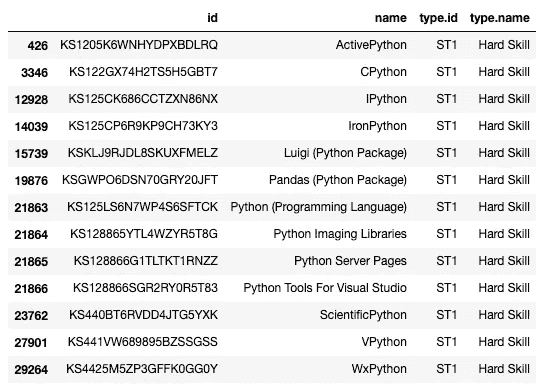

# 通过 Python 中的 API 查找相关工作技能

> 原文：<https://towardsdatascience.com/finding-relevant-job-skills-via-api-in-python-ced56cbb3493?source=collection_archive---------21----------------------->

令人敬畏的开源插图 [unDraw](https://undraw.co/)

# 工作技能的世界

所以你想弄清楚你的技能适合今天的就业市场。也许你只是好奇，想看看一系列全面的、干净的、标准化的工作技能。或者你需要一个简历解析项目的技能分类。嗯， [**EMSI 技能 API**](https://api.emsidata.com/apis/skills) 是这项工作的一个可能工具！

在本教程中，我将带您浏览一些样板代码，您可以使用这些代码从 API 访问一些关键的端点:一个**全局技能列表、从文档中提取技能、按名称查找技能，以及最后按技能 ID** 查找相关技能。让我们开始吧。

# 设置

开始使用就像[注册](https://skills.emsidata.com/access)免费获取 API 一样简单。完成该过程后，您会收到通过电子邮件发送给您的身份验证凭据。

## 导入报表

我们将在这里使用几个包，所以让我们先导入它们:

导入报表([来源](https://gist.github.com/rileypredum/62e0bcb20f1588ac6aefd72ff5f44e8e))

所有这些都很标准。我使用的是`json_normalize`包，这是一种将 JSON 转换成 Pandas 数据帧的简单方法，可读性会更好。

## 验证您的连接

访问 API 的第一部分只是使用注册电子邮件中的凭证来建立连接并获得访问令牌。我用 Python 在 Jupyter 笔记本的一个单元格中运行了以下内容。

认证([来源](https://gist.github.com/rileypredum/84fb7e8a4a21f49ab0510498334c3e72))

*旁注:如果我的代码块(就像上面的代码块)被截掉了，请按照它们标题中的源代码链接阅读完整的代码！*

这段代码产生一个认证 JSON 对象，其中一个键是`access_token`。在这里，我显式地访问了那个键的值，并将它赋给了一个同名的变量，供以后使用。

# “你好，世界！”EMSI 的技能 API

EMSI 有多个 API，但在本教程中我们将重点关注技能 API。首先，我们将使用该访问令牌来获取可供我们使用的完整技能列表。

## 调出全球工作技能列表

我编写了一个简单的函数来提取技能列表，并将其写入 Pandas 数据帧，以获得更好的格式和可读性。

全球技能列表([来源](https://gist.github.com/rileypredum/f2d5dd42002cf2a327ab7d94943eeb23))

我将 url 设置为技能列表端点，将访问令牌与 API 的必要语法规范连接在一起，并使用请求库来获取数据。这会产生以下技能的全局列表:

全球技能列表的数据框架

您可以看到这里有硬技能和软技能，每个技能都有一个唯一的 ID，并且每个技能都是标准化的，有适当的大小写。每个技能类型也有一个类型 ID。这里列出了近 3 万个技能！

## 提取给定文档中出现的技能

换句话说，你有一份文件(例如简历或工作描述)，你想找到简历持有人或招聘者想要的相关技能。下面的函数将提示您输入文本。将文本粘贴到那里，并设置一个介于 0 和 1 之间的置信区间(我通常使用 0.4 来查看更长的技能列表)，瞧——技能提取！

提取文档中出现的技能([来源](https://gist.github.com/rileypredum/95293b6c9b9e2a6928921dd634cb5a29))

作为一个简单的例子，我输入了“python 等”,毫无疑问，它以 100% (1.0)的置信度返回了这个技能提取:

从文档中提取的技能的数据框架

这一切都很好。但是，如果您想找到一种技能在这种分类法中是如何引用的呢？嗯，有一个 API 是通过 ID 查找相关技能的，但是我们需要先知道 ID！我们现在就去找。

## 通过名称查找技能来找到它的 ID

下面的代码使用 Python 的`str.contains`方法来查找包含作为函数参数输入的子串的技能。

通过名字查找技能 ID([来源](https://gist.github.com/rileypredum/02b6bafe32ae2eab63abccdc4db1c0f0)

正如您所看到的，使用`str.contains(name_substring)`方法可以找到所有包含单词`Python`的技能。这使我们能够看到所有的可能性，并选择我们想要找到相关技能的 id。上述函数返回的数据帧如下所示:

这里有很多粒度！接下来让我们以熊猫和 Python 为例，通过获取它们的 id 并将其输入到下一个代码块中来找到相关的技能。

## 查找与技能相关的技能

我们有自己感兴趣的技能的 id。现在我们想找到与他们相关的技能。我已经将相关技能的 id 添加到有效负载的代码中，并作为注释添加在下面代码块的顶部。如果要添加更多，请密切注意`payload`的格式。它避开了“和其他细微差别，如在结束前需要空格}。

相关技能([来源](https://gist.github.com/rileypredum/76d333c829ef6588c3a8f0dcba2021b3))

我们在前面涉及单词`Python`的技能输出中看到有很多选项。我选择寻找与`Python`和`Pandas`相关的技能。生成的数据帧如下所示:

Python 和熊猫相关技能的数据框架

这是伟大的表演！它本质上向我们展示了其他 Python 包，包括 NumPy，它几乎总是伴随着我们在数据科学中的 import 语句！

# 结论和今后要做的工作

感谢阅读这个关于 **EMSI 技能 API** 的快速教程。我希望它对您的任何用例都有用。如果你想看到这在一个特定的进一步的方向发展，请在下面给我留言！还有许多来自 EMSI 的有趣的数据集值得一查，包括那些关于劳动力市场、招聘信息以及更多信息的数据集。

在接下来的步骤中，我可以重新设计相关的技能代码块，使其成为一个函数，将技能 id 列表作为关键字参数，并将它们添加到有效负载中。现在它有点挑剔，还没有标准化。我想把它设计成一个模块，其中一个连接是一个类，每个端点的利用是一个具有更健壮的属性和参数的方法。这肯定会节省许多行代码。

但是下一次——快乐编码！

奢侈的生活