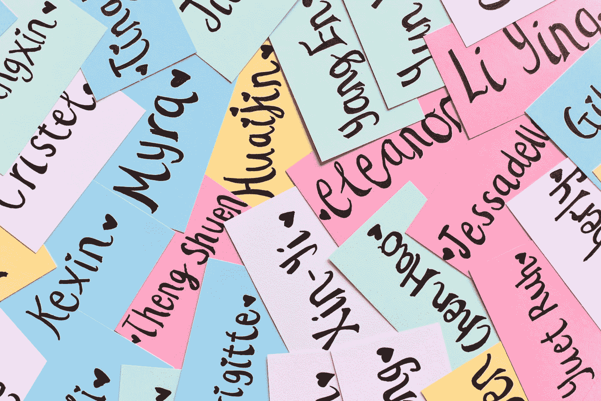

# 使用余弦相似度查找相似名称

> 原文：<https://towardsdatascience.com/finding-similar-names-using-cosine-similarity-a99eb943e1ab?source=collection_archive---------20----------------------->

## 客户数据很乱。这里有一个简单的方法来寻找看起来相似的名字。


Photo by [浮萍 闪电](https://unsplash.com/@vsmilelx?utm_source=medium&utm_medium=referral) on [Unsplash](https://unsplash.com?utm_source=medium&utm_medium=referral)

人类容易犯错误。有了手动输入的数据，出错只是时间问题。对于客户数据来说尤其如此。这通常有两个原因:

*   客户必须通过用户界面自己输入信息，或者
*   其他人会代表他们输入信息。

因此，错误是必然会发生的。这些错误可能是文本错误，如输入姓名时的打字错误。它们可能是误击，比如在输入邮政编码后从下拉菜单中选择错误的地址。因此，同一客户的多个条目可能会显示为两个不同的客户，尤其是在他们是回头客的情况下。即使你正确地分析了数据，由于数据质量差，你也可能从分析中得出错误和误导性的结论。

收集不正确的客户信息是一个非常普遍的问题。试图在大型数据集中找到文本错误和异常可能会非常困难。也就是说，已经有很多技术可以找到看起来相似的名字/文档。 **C *osine 相似度*就是这样的技术之一。它实现起来相对简单，为查找相似文本提供了一个简单的解决方案。**

由于我们通常收集客户数据的方式，不正确的客户信息是一个非常常见的问题。试图在大型数据集中找到文本错误和异常可能会非常困难。幸运的是，已经有很多方法可以找到看起来相似的名字/文档。其中一种方法叫做 ***余弦相似度。*** 实现起来相对简单，并且提供了查找相似文本的简单解决方案。

# 余弦相似性

与许多自然语言处理(NLP)技术一样，该方法计算数值。因此，该技术仅适用于**矢量**。

这个想法很简单。余弦相似度通过取两个**非零**向量之间角度的余弦来计算一个称为 ***相似度*** 的值。范围从 0 到 1，0 表示最低(最不相似)，1 表示最高(最相似)。

为了证明，如果两个向量之间的角度是 0，那么相似性将是 1。相反，如果两个向量之间的角度为 90°，则相似度为 0。对于两个大于 90°的向量，我们也认为它们是 0°。

然而，重要的是要注意余弦相似性**不**考虑向量的大小。只有两个向量之间的角度有关系。这在某些情况下很有用。

例如，假设我们正在比较两个文档，其中它们各自向量的每个维度都代表一个唯一的单词。如果一个文档大得多，并且某个特定单词出现的频率高得多，它们仍然可以被认为是相似的。

当比较名字而不是单词时，我们可以做同样的事情。我们只需要让每个向量维代表一个字符。假设我们有两个拼写相似但字符长度不同的名字，如 **Conor** 和**Conor**，那么这仍然会导致高相似性得分。

## 公式

余弦相似性的数学定义如下:


其中θ是两个非零向量 **A** 和 **B** 之间的角度。虽然这个公式看起来很复杂，但它只是两个向量的 ***点积*** 的定义的重新排列。我们取矢量 **A** 和 **B** 的点积，并除以这两个矢量的大小的乘积。每个 *i* 代表向量的一个维度；在这种情况下，它可以是字母或单词。如果没有匹配的字母或单词，那么我们忽略它们(即认为它们是 0)。

# 将名称转换成向量



[丘特尔斯纳](https://unsplash.com/@chuttersnap?utm_source=medium&utm_medium=referral)在 [Unsplash](https://unsplash.com?utm_source=medium&utm_medium=referral) 上拍照

我们的第一个任务是定义一个函数，它可以将单词作为输入，并将它们转换成向量表示。代码将使用 Python 3，但是您可以随意使用您觉得最舒服的语言——基本概念应该是相同的。

我们的目标是创建一个名为`word2vec()`的函数，它将把一个单词分解成它的字符组成部分，这样我们就可以在以后输入这些信息作为`cosine_similarity()`函数的输入。

```
def word2vec(word): # Count the number of characters in each word.
    count_characters = Counter(word) # Gets the set of characters and calculates the "length" of the vector.
    set_characters = set(count_characters) length = sqrt(sum(c*c for c in count_characters.values())) return count_characters, set_characters, length, word
```

首先，我们使用`collections`库中的`Counter()`方法来统计每个字母在我们输入的单词中出现的次数，如`count_characters`变量所示。这只是一本字典，每个键代表一个字符。键值是该字符出现的次数。

然后，我们通过使用`set()`函数获得输入单词中使用的字符集，这样我们就可以获得两个单词之间的字符交集，我们将这个变量命名为`set_characters`。我们稍后在计算余弦相似度时需要用到这个。

最后一部分是计算单词的“长度”。这是前面余弦相似性公式中所示的单词向量的大小。请记住，我们这样计算长度的原因是因为我们将这些单词表示为**向量**，其中每个使用的字符表示向量的一个维度。

这些都以元组的形式返回，这样我们可以很容易地提取信息。我们还将输入单词添加到输出元组的末尾，以便在我们想要使用该函数来迭代一个姓名列表时，可以很容易地计算出原始单词是什么。

# 余弦相似函数

我们现在可以创建`cosine_similarity()`函数，如下所示。这里的输入将是`word2vec()`功能的输出；也就是说，`vector1`和`vector2`通过应用`word2vec()`函数来计算。

```
def cosine_similarity(vector1, vector2, ndigits):
    # Get the common characters between the two character sets
    common_characters = vector1[1].intersection(vector2[1]) # Sum of the product of each intersection character.
    product_summation = sum(vector1[0][character] * vector2[0]                  [character] for character in common_characters) # Gets the length of each vector from the word2vec output.
    length = vector1[2] * vector2[2] # Calculates cosine similarity and rounds the value to ndigits decimal places.
    if length == 0:
        # Set value to 0 if word is empty.
        similarity = 0
    else:
        similarity = round(product_summation/length, ndigits) return similarity
```

首先，我们需要通过使用`intersection()`函数获得两个单词共有的字符列表，我们称这个变量为`common_characters`。

回到这个公式，我们必须计算点积。这是通过遍历列表`common_characters`并获得每个迭代字符的计数值来完成的，如变量`product_summation`所示。

然后，我们计算两个向量长度的乘积，并将这个变量称为`length`(回头看，我可能应该使用一个不那么容易混淆的变量名)。

我们现在准备将所有东西都插入公式中。然而，由于涉及除法，余弦相似性仅允许**非零**向量。因此，我们需要添加一个条件，如果`length = 0`，那么相似度为 0；否则，照常计算余弦相似度。还使用了`round()`函数，这是我们利用`ndigits`参数将相似性分数四舍五入到所需的小数位数的地方。

# 寻找相似的名字


[乔·塞拉斯](https://unsplash.com/@joaosilas?utm_source=medium&utm_medium=referral)在 [Unsplash](https://unsplash.com?utm_source=medium&utm_medium=referral) 上的照片

创建了必要的函数后，我们可以把所有的东西放在一起创建一个名为`find_similar()`的函数，它扫描一个名字列表并返回结果的数据帧。结果数据框将是一个`pandas`数据框(因此确保`pandas`已安装并别名为`pd`)，它将由三列组成:

*   名称列表中使用的名称将是第一列。这些是用作`cosine_similarity()`函数第一个参数的向量。
*   第二列将包含用于与第一列进行比较的名称。这些是用作`cosine_similarity()`函数第二个参数的向量。
*   第三列将包含使用第一和第二列中的名称计算的相似性得分。

# 最终代码

下面是这个函数的 Python 代码。它接受一个名字列表作为输入和一个“相似性阈值”。此阈值设置了在最终结果数据帧中包含名称对所需的最小值。这样做可以从结果中去除那些没有意思的比较。然后，像`cosine_similarity()`函数一样，有一个用于计算小数位数的参数叫做`ndigits`。

```
def find_similar(full_names_list, similarity_threshold, ndigits):# Initiate an empty list to store results.
    results_list = [] # Apply word2vec function to each name and store them in a list.
    vector_list = [word2vec(str(i)) for i in full_names_list] # Two loops to compare each vector with another vector only once.
    for i in range(len(vector_list)):
        # Get first vector
        vector1 = vector_list[i] for j in range(i+1, len(vector_list)):
            # Get the next vector
            vector2 = vector_list[j] # Calculate cosine similarity
            similarity_score = cosine_similarity(vector1, vector2, ndigits) # Append to results list if similarity score is between 1 and the threshold.
            # Note that scores of 1 can be ignored here if we want to exclude people with the same name.
            if 1 >= similarity_score >= similarity_threshold:
                results_list.append([vector1[3], vector2[3], similarity_score]) else:
                pass # Convert list to dataframe.
    results_df = pd.DataFrame(results_list)
    if len(results_df) != 0:
        results_df.columns = ['full_name', 'comparison_name', 'similarity_score']
    else:
    # Can add error here if there's no results to return if desired.
    pass return results_df
```

首先，我们初始化一个结果列表来存储我们的结果。然后我们使用`word2vec()`函数在列表中理解名字列表中的每个名字。

现在我们需要一种方法将每个名字与其他名字只比较一次；这可以使用两个`for`循环来完成，我们在每次迭代中应用`cosine_similarity()`函数。由于我们不希望导致相似性分数低于我们指定的输入阈值的比较，我们在内部的`for`循环中包含了一个`if`语句。这基本上就是说，如果相似性分数高于阈值，我们将把它附加到`results_list`上。

然后我们将列表转换成一个`pandas`数据帧。最后，有一个`if`语句来检查数据帧是否为空。我个人没有为此在`else`语句中添加任何东西，但是如果需要的话，可以在这里为空结果添加一个错误。然后，它返回最终的数据帧作为输出。

# 示例 1

假设我们有 4 个名字:**康纳**、**康纳**、**乔恩**和**约翰**。我们可以通过比较每个名字和其他名字来计算余弦相似度。现在我们已经准备好了函数，接下来就是简单的插入所有东西了！

首先，我们将创建一个姓名列表。

```
names_list = ['Conor', 'Connor', 'Jon', 'John']
```

然后，我们需要决定相似度阈值和我们想要的小数位数。现在让我们使用相似性阈值 0。这样做将给出每一个比较对，我们还将把所需的小数位设置为 3。

```
similarity_threshold = 0
ndigits = 3
```

让我们把这些放进去，看看我们能得到什么。

```
results_df = find_similar(name_list, similarity_threshold, ndigits)

print(results_df)
```


立刻，我们应该注意到我们有 6 个比较。这是我们所期望的，因为一组 N 个项目中唯一对的数量是 N*(N-1)/2。我们还可以看到具有高相似性得分的配对是**康纳**和**康纳**配对，以及**乔恩**和**约翰**配对，这也是我们所期望的。

如果我们将相似性阈值更改为 0.8，那么我们应该预期只有提到的对会保留下来。让我们试一试。


是的，正如我们所料。然而，我们可以通过使用我们已经知道结果的名字来做额外的检查。例如，我们知道如果我们比较完全相同的名字，那么我们期望相似性得分为 1。相反，如果我们比较完全不同的名字(完全没有共同的字符)，那么我们期望相似性得分为 0。

# 示例 2

让我们通过使用不同的名称列表来做同样的事情。假设我们有两个名字:**康纳**和**李**。现在我们可以创建一个新的名字列表。

```
names_list_2 = ['Connor', 'Connor', 'Lee', 'Lee']
```

如果我们使用这个相似性阈值为 0 且小数位数相同的新名字列表运行`find_similar()`函数，那么我们会得到下面的结果。


检查通过！这正是我们预期的分数。如果我们想的话，我们可以在单元测试的时候使用它作为检查，但是我不会深究这个。这给了我们一些信心，让我们相信事情正在按计划进行。

# 最后的想法

W 我们已经看到，通过将名字转换成向量并计算余弦相似度，可以很容易地找到相似的名字。如果我们将此应用于真实的客户数据，我们还可以对其他属性进行额外的检查，如性别、出生日期等。因为当我们找到相似的名字时。例如， **Leon** 和 **Leona** 将获得高相似性分数，但是 Leon 最有可能是男性而 Leona 最有可能是女性**和**；如果是这样的话，这种相似性不太可能是由于诸如打字错误之类的错误造成的。我们想排除这些。像这样进行一些额外的检查会降低返回这种比较的可能性。

我们也可能不想包括那些相似性得分为 1 的，因为人们可能有相同的名字。同样，我们可以添加一些对其他属性的检查，比如性别和出生日期。例如，如果有两条 **Leon** 记录，我们可以检查它们是否具有相同的性别和出生日期。如果有，那么很可能是重复记录。无论如何，您是否希望包含相似性分数 1 都可以在`find_similar()`函数的`if`语句中轻松更改。

一些读者指出，word2vec()函数也没有考虑字谜。你可以像滑动窗口一样查看每个单词的**对**(或更多)字母来解决这个问题。如果我们将*检查员*与*检查员*和*接收器*进行比较，算法会认为*检查员*更类似于*检查员*。这是因为尽管*起始符*是*检查员*的变位词，但是

最后，我们可能希望在应用`find_similar()`函数之前添加一个过程来首先清理名称，比如删除大写字母和连字符，连接每个客户的名和姓，等等。

就是这样！希望这为基于名称在数据集中查找可能的错误提供了一个简单的起点。如果任何人有任何关于如何改进这一点的其他想法，或者想讨论如何在真实环境中实现它，或者只是对代码有一般的疑问，请随时与我联系。我很想聊聊！