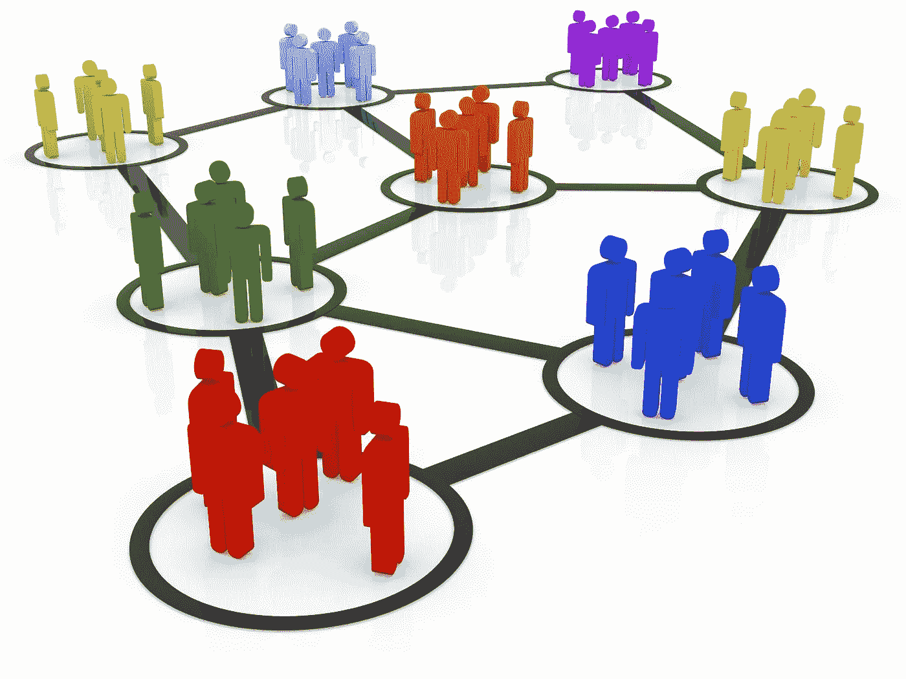
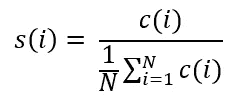
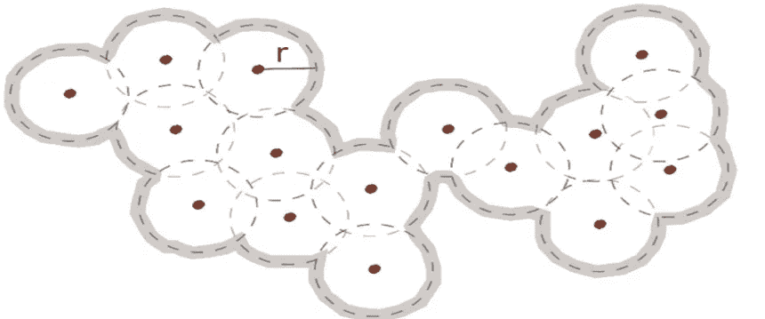

# 通过通话详细记录发现社会行为模式

> 原文：<https://towardsdatascience.com/finding-social-behavior-patterns-through-call-detail-records-e3c107be62f7?source=collection_archive---------19----------------------->

## 移动运营商数据如何让我们了解社会隔离？

社会行为与流动模式相关，因为社会和其他外部因素会影响我们对交通方式或路线的选择。袁等人[1]将一些移动性度量与用户的性别和年龄相关联。在其他有趣的结论中，人们发现青少年和老年人不像中年人和年轻人那样长途旅行。Isaacman 等人[2]得出结论，人们倾向于在夏天比冬天旅行更多。所以，季节实际上会影响我们旅行的数量。此外，Cho 等人[3]向我们表明，与短途旅行相比，长途旅行受我们的社会关系影响更大。他们使用 cdr(呼叫详细记录)来描述迁移的数量、方向、持续时间和季节性。Blumenstock [4]也能够通过 cdr 分析推断内部迁移模式。

根据 Deville 等人[5]，cdr 实际上是预测人口流动的一个很好的工具。Wang 等人[6]和 Tatem 等人[7]的贡献与通过移动运营商数据描述人类移动性来理解流行病学现象和病毒传播相关。此外，Eagle 等人[8]帮助我们了解人们如何适应和改变他们在交流中的行为，以更好地适应新的社会环境。这项研究的发现构成了事件管理和拥塞减少的关键信息来源。

为了检查迁移期间用户社会关系中的联系强度、社交水平和其他因素的演变，Phithakkitnukoon 等人[9]利用了葡萄牙 11 个月的 cdr。Krings 等人[10]也发现了有价值的结论。例如，获得了以下描述两个城市之间通信强度的公式:强度“与两个人口的乘积除以城市之间距离的平方成比例”。除此之外，还观察到“城市内部通信规模与城市人口呈超线性关系”[10]。

按照这种思路，现在是讨论离散选择模型的时候了。这些模型允许我们通过考虑多种因素的函数来发现用户使用确定的交通方式的概率[11]。因此，这个模型假设用户的行为是由可能获得的最大收益和其他竞争者的替代品的吸引力决定的。然而，我们的选择并不像我们想象的那样理性，Phithakkitnukoon 等人[11]试图在社交度和用户移动模式之间建立一种关系。那么，在某种意义上，我们需要意识到，我们倾向于与和我们相似的人交往并建立联系，在这个意义上，同性恋的概念是核心。这些人倾向于与我们分享共同的特征或财产(例如，性别或年龄)。因此，可以合理地推断，使用特定旅行方式的社会关系越多，我们使用相同旅行方式的可能性就越大。这项研究的结果证明，我们最密切的关系对选择私人交通工具有更大的影响。相反，我们最脆弱的关系是那些说服我们更多地采用公共交通工具的关系。除此之外，奇怪的是地理上离我们更近的朋友在我们的通勤旅行中对交通工具的选择上有更大的权力。不出所料，研究还发现，乘坐公共交通工具的距离也是拒绝乘坐公共交通工具的原因之一。

仔细研究 Phithakkitnukoon 等人[12]的工作，我们发现可以从 cdr 中提取移动性度量，如移动性多样性、移动性离散度和范围。移动性多样性是用户“访问的不同位置的总数”。迁移率分散“测量迁移率的变化量(或随机性)”[12]。移动性范围“推断人的移动性的旅行距离范围，其被定义为从人的家庭位置到人曾经到过的最远位置的距离(以千米为单位)”[12]。除了移动性度量，社交度量也从 cdr 中提取(例如，呼叫频率、呼叫持续时间和社会联系的数量)。对所有这些指标进行分析，以了解哪一个指标影响我们的交通模式，即我们对交通方式的选择。通过 cdr，我们可以计算出我们的社会互动有多激烈，从而推断出我们和我们最紧密的社会联系之间的一些重要的共同特征。然而，由于这种数据总是匿名的，除了他/她的位置和他/她呼叫的用户之外，我们无法知道更多关于用户的信息。

在对每个用户及其社会关系的六个测量值进行比较之后，得出的结论是，移动多样性与社会关系的强度成比例。这是成比例的，社会联系越强，他们的流动性多样性和流动性范围就越相似。相反，人们发现流动性分散与社会关系的强度完全不相关。在社会性度量方面，我们发现在用户和他们最亲密的社会关系之间，这三个度量都是相似的。因此，由于我们倾向于与最亲密的朋友有相似的社会行为，这项研究向我们表明，从我们最亲密的社会关系中观察到的行为中推断出一些流动模式是可能的。流动性分散是唯一偏离这一结论的指标。通过这项研究，人类哲学得到了加强。这项研究的潜在问题是，它仅限于分析共享同一移动运营商的社会关系。

知道如何计算社会关系中的社会力量变得至关重要。为此，我们需要回忆一下 Granovetter 等人的工作。他们将其定义为“时间量、情感强度、亲密度(相互信任)和互惠服务的组合”。因此，受 Nicholas 等人[14]工作的启发，在我们的案例中，我们可以将通过语音通话交流的时间与符合 Granovetter 先前定义的社交能力测量联系起来。为此，我们需要考虑以下比率:

该公式意味着具有社交关系 *i* 的用户社交强度 *(s)* 等于用户与关系 *i* — *c(i)* 交谈的时间量除以用户与其所有社交关系交谈的时间量( *N* )。为了正确地进行计算，最基本的是将社会关系视为那些与被观察用户保持相互通话的人。我们说这是至关重要的，因为我们经常会偶尔打电话给一些服务或不一定是我们的朋友或熟人的人(例如，处理一些业务)。

在推断社交网络的关注点时，cdr 可能被定位为使用的最佳机会数据之一。一旦我们拨打/接听电话的人尽可能地模仿我们真实的社交网络，这就是一个合理的结论。例如，如果我们从脸书或 Instagram 等社交网络获取数据，并将我们的社交关系建立在这些平台上所谓的“朋友”或“关注者”的基础上，我们最终会高估用户社交关系的实际数量。

Olivier 等人[15]也调查了天气状况对我们社会交往的影响。天气对社会经济活动有影响。由于周围的天气条件，人们可能更喜欢居住在一个确定的区域。除了调节社会交往，天气状况的变化也影响着流动模式。除了 CDRs，这次调查还需要气象数据集。数据集来自里斯本的三个基站，每 30 分钟测量一次温度、湿度和压力。最后得出的结论是，天气状况对人们的平均通话时间没有显著影响。在极端的温度(过冷或过热)和压力(高或低)以及 20%-100%的湿度水平下，人们愿意与较少数量的社会关系交谈，并与他们牢固的关系保持更多的联系。

尽管有有价值的结论，这项研究也有一些问题。大气参数的影响可能是相互依赖的；然而，一次只研究了一个标准的重要性。可能已经调查了天气条件的多个参数的同时变化的影响。此外，该研究忽略了一个事实，即人们可能在一些基础设施内，可以免受某些类型的天气影响。也不考虑与被观察个体有联系的人的天气条件。事实上，节假日和其他社交活动也会影响平均通话时间，这一点也没有考虑在内。

Olivier 等人[16]开展的研究是关于人口流动的社会地理的另一项重大研究。在这项研究中，我们发现 80%的受访地点都在距离最近的用户社交网络 20 公里的范围内。如果我们考虑 45 公里的*地理社交半径*，那么我们可以说百分比增加到 90%。同样令人惊讶的是，我们往往在地理上更接近弱关系，而不是强关系。一般来说，我们所在的地区越是城市化，我们与社会的联系就越遥远，我们的*地理社会半径*就越短；此外，我们 80%的旅行范围将在 10 公里*地理社交半径*内。这里，*地理社交半径*被定义为与社交关系的地理距离。因此，如果“受试者访问的地方(或旅行范围)在受试者社会关系的 x 公里范围内”，那么地理社会半径将是 x。这个概念在图 1 中进行了适当的描述。

图 1—红点表示社会关系的位置， *r* 是*地理社会半径*。轮廓线包围了预测的行程范围。该图最初来自 Olivier 等人[16]。

这项研究的一个更普遍和令人惊讶的结论是，“尽管人们倾向于居住在他们强关系附近，但他们的流动性偏向于他们弱关系的地理位置”[16]。这项研究和其他研究一样，提出了一些问题。我们假设我们在分析期间给每个朋友打电话/接电话，这是不现实的。此外，我们都有社会关系，我们经常面对面地与他们交谈，我们不需要给他们打电话。还假设在研究期间，人们没有迁移或没有改变居住地，而是迁移到另一个地方。人们也可能因为度假而暂时住在某个地方。然而，由于假期只是人们生活中的一小部分，它不太可能对这项研究产生重大影响。

# 参考

[1]Yuan，M. Raubal，和 Y. Liu，“计算机、环境和城市系统与手机使用和出行行为的关系——中国哈尔滨的案例研究”，*computu。环境。城市系统。*，第 36 卷，第 2 期，第 118-130 页，2012 年。

[2] S. Isaacman、R. Becker、S. Kobourov、M. Martonosi、J. Rowland 和 A. Varshavsky，“洛杉矶和纽约的人口流动范围”，第 1-6 页。

[3] E. Cho，“友谊和移动:基于位置的社交网络中的用户移动”

[4] J. Blumenstock，“从手机通话记录推断国内移徙模式:来自卢旺达的证据”，2012 年。

[5] P. Deville，C. Linard，S. Martin，M. Gilbert，F. R. Stevens，A. E. Gaughan，“使用手机数据进行动态人口制图”，第 111 卷，第 45 期，2014 年。

[6] P. Wang、M. C. González、C. A. Hidalgo 和 A. Barabási，“了解手机病毒的传播模式”，第 1076 卷，第 1071-1076 页，2009 年。

[7] A. Tatem 和 D. L. Smith，“量化人口流动对疟疾的影响量化人口流动对疟疾的影响”，2014 年 3 月号，2012 年。

[8] N. Eagle 和 M. A. Bettencourt，“社区计算:使用移动电话数据比较农村和城市社会”，第 144-150 页，2009 年。

[9] F. Calabrese，“眼不见心不烦——我们的移动社交网络在迁移过程中如何变化”，2018 年。

[10] C. Link、G. Krings、F. Calabrese、C. Ratti 和 V. D. Blondel，“城市间通信网络的扩展行为”，2012 年。

[11] S. Phithakkitnukoon、T. Sukhvibul、M. Demissie、Z. Smoreda、J. Natwichai 和 C. Bento，“使用移动电话数据推断交通方式选择的社会影响”，*《EPJ 数据科学》。*，2017 年第 6 卷第 1 期。

[12] S. Phithakkitnukoon 和 Z. Smoreda，“社会关系对人类流动性和社会性的影响:细胞网络中社会联系的研究”， *Soc .Netw。肛门。量滴*2016 年第 6 卷第 1 期第 1–9 页。

[13] M. S. Granovetter，T. American 和 N. May，“弱关系的力量”，第 78 卷，第 6 期，第 1360-1380 页，2007 年。

[14] A. Nicholas、J. Onnela、S. Arbesman 和 M. C. Gonza，“社交网络群体的地理限制”，第 6 卷，第 4 期，2011 年。

[15] S. Phithakkitnukoon、T. W. Leong、Z. Smoreda 和 P. Olivier，“天气对移动社交互动的影响:葡萄牙里斯本移动电话用户案例研究”，*《公共科学图书馆综合报告》*，第 7 卷，第 10 期，第 1-13 页，2012 年。

[16] S. Phithakkitnukoon、Z. Smoreda 和 P. Olivier，“人类流动的社会地理:利用纵向移动电话数据进行的研究”，*《公共科学图书馆综合报告》*，第 7 卷，第 6 期，第 1-9 页，2012 年。