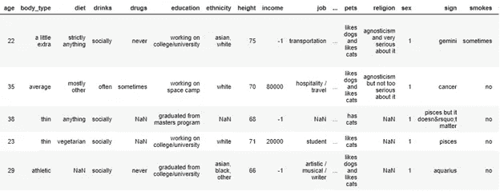
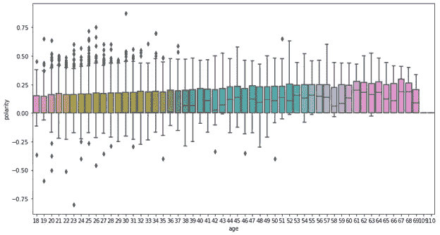
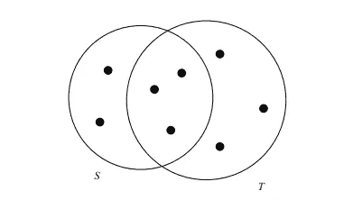
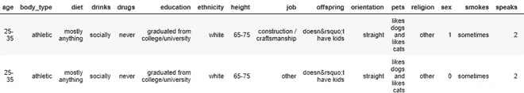

# 使用 Python 寻找灵魂伴侣

> 原文：<https://towardsdatascience.com/finding-soul-partners-using-python-883d6017442c?source=collection_archive---------41----------------------->

## 使用 Jaccard 相似性来查找最相似的可能匹配

[来源](https://www.pexels.com/photo/audio-e-guitars-guitars-music-6966/)

# 目标是什么？

目标是使用 OkCupid 的个人资料数据创建一个匹配算法，找到你的灵魂伴侣，他有最相似的特征和异性。Jaccard 算法将用于计算相似性得分。

# 数据是什么？

图 1:查看数据

这些数据包括来自最大的在线约会网站之一 OKcupid.com 的近 6 万份个人资料。它由年龄、体型、教育、宗教和一些习惯等特征组成。这些功能是人们在注册交友平台时被问到的问题。第一眼看到的数据表明，它有许多非空值，需要特性工程。

首先，我想根据一个人对 10 个不同的作文问题的回答，了解他的积极/消极和极性/非极性程度。问题的范围从“我这辈子在做什么”到“我永远离不开的六件事”。为了对一个人有一个整体的了解，我把所有的论文答案都放在了一个专栏里，并使用 TextBlob 的情感分析工具运行了一个情感分析器。

找到极性和主观性分数后，需要将语言口语列改为整数。这是通过计算逗号的数量并添加 1 作为默认值(英语)来完成的。

*profiles[' speaks ']= profiles . speaks . str . count("，")+ 1*

来源:https://www . pexels . com/photo/黑白-game-match-chess-2902/

由于数据的复杂性，我使用了众数或中位数估算法，而不是更复杂的估算方法，如随机森林估算法。然后我删除了收入和星座列，因为它们缺少太多的值。

整数列和浮点列被转换成 bin 的字符串表示。例如，年龄被转换成带有代码的箱:

# 用户积极性得分——随着年龄的增长，人们会变得更加痛苦吗？

为了继续下去，我想看看我的情感分数是否显示出显著的结果，并且与其他特征有关系。为了展示这一点，我绘制了用户积极情绪得分与年龄的关系图。在这样做的时候，我回答了一个流行的问题。人，尤其是交友网站上的人，会不会随着年龄的增长而失去希望，变得更加苦涩？

图 2:年龄和积极性图

该图显示，年轻人可能写了非常积极的回答，但却是离群值。平均而言，随着年龄的增长，乐观情绪会略有增加。没有很强的增量，但绝对可以观察到一个关系。

# 雅克卡相似性

集合 S 和 T 的 Jaccard 相似度为|S ∩ T |/|S ∪ T |，即 S 和 T 的交的大小与它们的并的大小之比。我们将用 SIM(S，T)来表示 S 和 T 的 Jaccard 相似性。

图 Jaccard 相似性的维恩图

该图显示了 3/8 的 Jaccard 相似性。

Jaccard 相似性编码为:

匹配查找函数被写成:

当我们运行随机用户 id 4002 的函数时；我们得到用户和匹配:

图 4:用户和他/她的匹配

我们可以看到特征大多相似。Jaccard 相似性得分为 0.811。特征基本相同，两个没有孩子也不吸毒的年轻人。这些通常对普通人来说更重要，但是我们的准则不考虑问题值。

# 结论

这里，我们只讨论了一个基本的匹配算法。像 OKCupid 这样的顶级约会网站使用更复杂的代码和各种其他指标，例如用户之间的距离，以及不同指标的不同权重，这取决于用户最不重视/最重视什么。

在本文中，我演示了一个函数，它可以查找与所选用户相似的用户。一般来说，Jaccard 相似性可用于查找相似产品或基于文本的问题。由于这里的数据来自一个交友网站，我称之为“the match”。结果表明，它确实找到了具有最相似特征的最佳匹配。当我在做的时候，我发现随着年龄的增长，积极的情绪会增加，这否定了约会网站上的人随着年龄的增长会变得更加痛苦的观点。

有问题吗？在 [Linkedin](https://www.linkedin.com/in/nurullah-sirca-2125ba62/) 上联系我，在这里找到[代码](https://gist.github.com/nuru1234)。