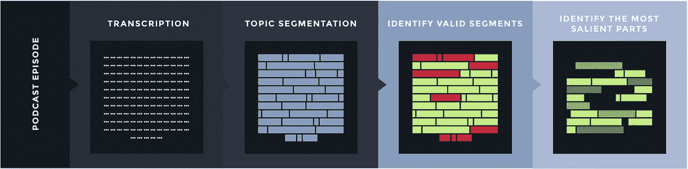
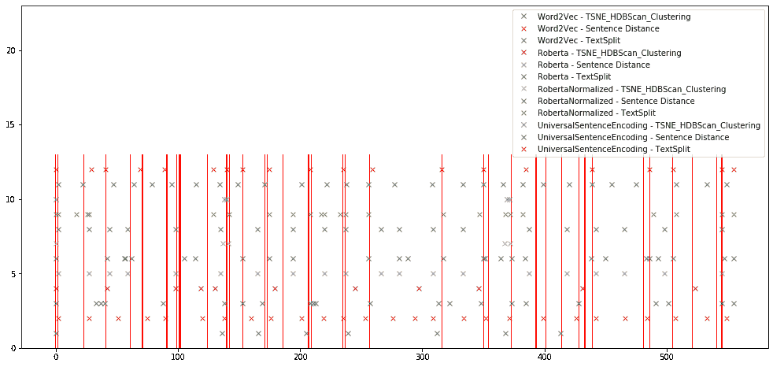
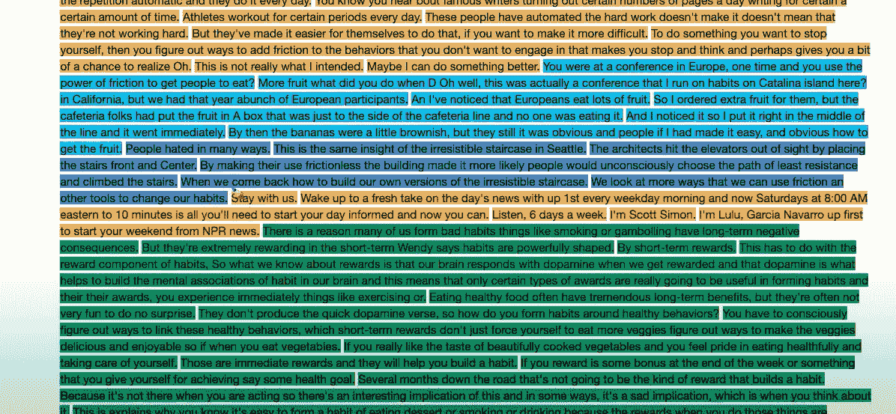
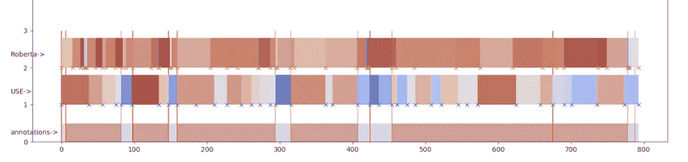
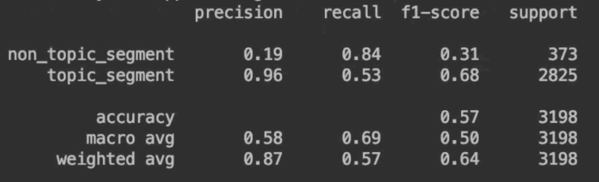

# 找到你的播客中最好的部分来通过 NLP 推广

> 原文：<https://towardsdatascience.com/finding-the-best-part-of-your-podcast-to-promote-via-nlp-f844a88b287a?source=collection_archive---------57----------------------->

我们最后的管道

播客正在蓬勃发展，因此推广你的播客以增加你的观众比以往任何时候都重要。在[头条](https://www.headliner.app/)，我们帮助播客制作用于社交媒体的[视频](http://www.headliner.app/gallery)。我们的用户每天制作超过 10，000 个视频，带来数百万次的收听，我们一直在寻找方法来加快他们的过程。最耗时的活动之一是选择播客的最佳部分进行推广。从历史上看，有两种选择可以从 2 小时的剧集中找到最好的 30 秒剪辑:在后期制作中标记它，或者参加一个名为“seek-seek-oh-this-is-good-no-seek-seek”的无趣练习。想象一下这有多痛苦。通常情况下，找到正确的片段会变成再次听完整集。制作一个 30 秒的社交媒体帖子不应该花几个小时，这就是我们想要解决的问题。

目标:自动向我们的用户推荐好的剪辑。

第一步:转录

在 [nRelate](https://xconomy.com/new-york/2014/09/15/can-nrelate-cut-down-the-noise-in-web-content-recommendations/) (我们上一家公司)，我用绝对令人惊叹的[斯坦福解析器](https://nlp.stanford.edu/software/lex-parser.html)和 [NLTK](https://www.nltk.org/) 库编写了我们上下文推荐引擎的主干。然而，音频是另一个野兽，因为几乎所有成熟的 NLP 库都是用于书面文本，而不是音频。我们计划将来向开源社区发布一个全声学模型。目前，鉴于我们在文本处理方面的历史，我们从转录开始我们的目标。

[谷歌](https://cloud.google.com/speech-to-text/pricing)和[微软](https://azure.microsoft.com/en-us/services/cognitive-services/speech-to-text/) ASR(自动语音识别)对我们很有帮助。在英语中，WER(单词错误率)非常好，加上我们有句子标记，这使得剪切文本更容易。随着语音二进制化，我们可以实现播客的良好表示。

第二步:主题分段

一旦我们得到了抄本，我们希望在向量空间中表示文档并对片段进行聚类。对于矢量化，我们尝试了包括 [word2vec](https://en.wikipedia.org/wiki/Word2vec) 、[通用句子编码](https://tfhub.dev/google/universal-sentence-encoder/4)(使用)和 [RoBERTa](https://ai.facebook.com/blog/roberta-an-optimized-method-for-pretraining-self-supervised-nlp-systems/) 在内的技术。对于聚类/分组，我们尝试了像 [t-SNE](https://lvdmaaten.github.io/tsne/) (以克服“[维数灾难](https://en.wikipedia.org/wiki/Curse_of_dimensionality)”)和 [HDBSCAN](https://hdbscan.readthedocs.io/en/latest/how_hdbscan_works.html) 这样的技术，这样我们可以从句子到主题片段。

接下来，我们设置了一种方法来观察各种技术在表示和后续主题分割方面的表现。对大量转录本进行精确标记需要花费大量时间，而且成本相当高。因此，我们选择了一种无监督的方法，并选择将我们的结果与一小组人类注释进行比较(下图中的红线)。最初的结果看起来很有希望，尽管所有的算法都发现了更多的主题段边界(用 x 表示)。

*主题边界(不同颜色的 x 符号)由不同的算法结合不同的矢量器找到。x 轴是抄本中的第 n 个句子，y 轴代表不同的算法组合。红线是人类注释者发现的边界。*

我们需要的是从连续的句子组中形成有意义的簇的解决方案。为什么？因为我们的技术比人类注释者发现了更多的主题片段。

第三步:句子聚类

我们开始寻找一种方法，将句子组合在一起，形成更好的片段。在我们的例子中，使用普通聚类方法的一个关键问题是它们忽略了给定句子的位置(由它们的向量嵌入表示)。我们发现，即使我们成功地运行了基于邻域的聚类技术，如 [HDBSCAN](https://hdbscan.readthedocs.io/en/latest/basic_hdbscan.html) 并在其中添加了明确的位置信息，得到的聚类也是基于意义的。这里的问题是它们并不总是以文本的连续片段出现。

为了改善这些结果，我们需要一种更好的方法。幸运的是 [TextSplit](https://github.com/chschock/textsplit) 提供了一种方法来寻找最佳的“分割边界”,给出了一个大的高维向量序列。这允许放开维数减少。请参见下面的结果:

*算法发现的彩色编码主题片段。用橙色标识的广告被准确挑选出来*

步骤 4:测量文本簇以提高准确性

看是一回事，“测”又是另一回事。为了正确地比较不同的基本向量(word2vec average、USE 和 RoBERTa)，我们必须找出要使用的最佳度量。首先，我们认为通过 [Jaccard](https://en.wikipedia.org/wiki/Jaccard_index) 距离进行分段重叠是一个很好的衡量标准。然而，不一致的数据段大小会导致许多问题。我们很快意识到口语文本是基于序列的，我们可以利用这个属性。接下来，我们进行了一项分析，并确定了一个可以代表两个序列之间距离的度量标准，即使它们表现出不同的长度:[动态时间扭曲](https://en.wikipedia.org/wiki/Dynamic_time_warping)。在这种情况下，我们将人类和机器生成的注释表示为一系列分割点，以测量这两个系列的 DTW 距离。

那成功了！基于这一分析，我们决定使用 DTW 作为我们的比较指标。我们认为这种方法将在片段识别中提供期望的准确性。

然而，我们还有更多的工作要做:我们如何区分好坏呢？例如，我们如何将介绍/结尾/广告与播客的真实有机部分区分开来？

事实证明，在嵌入中测量语义相关性的常用方法，即[余弦距离](https://en.wikipedia.org/wiki/Cosine_similarity)，对于转录的口语单词音频非常有效。文本的向量表示的方向比向量的欧几里德距离重要得多(参见这里的好文章)。由于广告中的句子通常与剧集的主题不同，我们可以很容易地区分介绍/结尾、广告和播客的主题。所要做的就是抓住这一集的“精髓”，或者说“主题”。下图显示了文字记录中不同的主题片段:

*我们的注释/使用/Roberta 主题片段相对于整个播客剧集评分的屏幕截图。*

在上图中，深色部分表示与整个文档的片段向量更相似的片段。蓝色部分表示相对的线段。注意广告是如何突出的！

基于这些距离，可以建立一个阈值。如果达到(或超过)，我们会将这些片段视为“非核心内容”，例如广告、介绍、结尾。

一旦我们调整了阈值，我们得到了这些分类分数:

*得分输出*

主题细分的“精确度”是我们的主要标准。“回忆”现在并不重要，因为对于我们的用例来说，丢失一些片段是可以接受的——我们更担心挑选一些我们不应该挑选的东西，而不是挑选最好的东西(至少在这个阶段)。

实施阈值后，我们得到了以下结果:

*仅使用文本分割可视化通用句子嵌入。如图所示，该算法可以完美地识别广告片段。*

输出中的底部(浅红色)线表示人工注释。最上面一行(更多样/丰富多彩)是使用 Textsplit 找到的内容。同样，蓝色表示我们不想用来向用户建议的部分，作为该集推广播客的最佳部分。我们发现的界限与广告非常吻合。

我们还有最后一个变通办法要考虑。我们大多数的假阳性都发生在介绍上。这是有意义的，因为介绍通常总结播客的插曲，这就是为什么他们在我们的模型中是红色的。解决方法是使用一个简单的时间界限来消除这些误报。

通过利用 NLP，我们能够找到值得推广的播客片段。以下是我们目前收到的一些精彩反馈:

*   “这个。是。厉害了！”
*   “我非常喜欢这个自动听力图工具。我觉得很神奇！！我节省了很多时间来挑选和识别可用于社交内容的剪辑。”
*   “首先，我想说我喜欢自动播客视频！我特别喜欢剪辑功能，它可以从我的播客中挑选出一段特定的引文。”
*   “我其实挺喜欢选拔的！”

当然，并不是所有的反馈都是积极的，但总的来说，我们非常受鼓舞，并将继续改进我们的用户如何在他们的播客集中识别最佳剪辑。

请继续关注，我们的下一篇文章将关注第五步:通过找出红色片段中最好的部分来识别播客中最突出的部分。我们还将介绍如何在模型中使用声音信号(人们的声音或笑声)。如果你读到这里，很有可能你对 NLP 和音频非常感兴趣，所以请告诉我们，我们[正在招聘](https://www.headliner.app/contact/)。

感谢[米克罗斯托特](https://www.linkedin.com/in/miklostoth/)、[勒万特·萨巴多斯](https://www.linkedin.com/in/levente-szabados-76334728/)和[亚当·杰曼](https://www.linkedin.com/in/adamjermann)，他们与我们一起参与了这个项目。

供进一步阅读的好参考:

[https://www . researchgate . net/publication/321227216 _ Text _ Segmentation _ techniquences _ A _ Critical _ Review](https://www.researchgate.net/publication/321227216_Text_Segmentation_Techniques_A_Critical_Review)

[https://www . aims press . com/file other/PDF/BDIA/2380-6966 _ 2016 _ 2&3 _ 261 . PDF](https://www.aimspress.com/fileOther/PDF/BDIA/2380-6966_2016_2&3_261.pdf)

[https://www . INF . uni-Hamburg . de/en/inst/ab/lt/publications/2012-riedl-biemann-jlcl-text-segmentation . pdf](https://www.inf.uni-hamburg.de/en/inst/ab/lt/publications/2012-riedl-biemann-jlcl-text-segmentation.pdf)

[https://pdfs . semantic scholar . org/da03/9 DBC 849 C4 e 2e C1 b 0 F2 b 324 ADB 38 DC 45989 DC . pdf](https://pdfs.semanticscholar.org/da03/9dbc849c4e2ec1b0f2b324adb38dc45989dc.pdf)

[https://arxiv.org/abs/1908.10084](https://arxiv.org/abs/1908.10084)