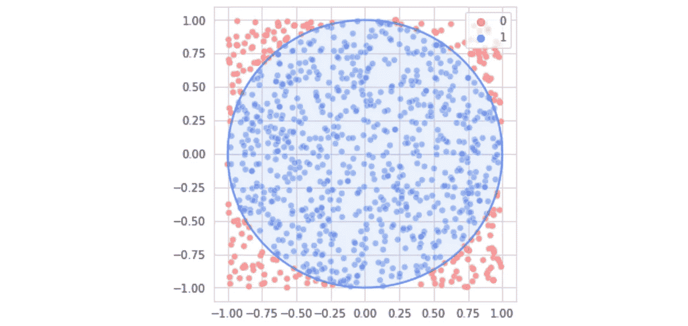
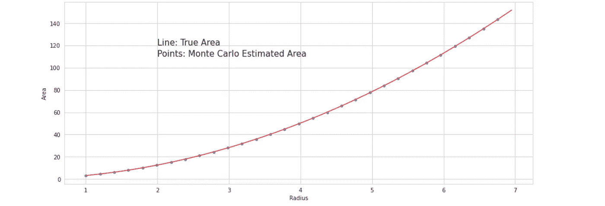

# 不用任何数学就能找到圆面积的公式

> 原文：<https://towardsdatascience.com/finding-the-formula-for-circle-area-without-using-any-math-898cbee70253?source=collection_archive---------63----------------------->

[去飞溅](https://unsplash.com/photos/ZPP-zP8HYG0)

## 当有疑问时，使用计算能力

问任何人一个圆的面积是多少，他们都会告诉你，“*π-r 平方*”。让他们告诉你为什么，他们很可能不知道。

这是有充分理由的——圆的面积公式的证明，在很大程度上，要么不直观，不令人满意，要么充斥着积分等高级数学概念。

借用统计学和机器学习的核心原理，我们将使用蒙特卡罗模拟和多项式/二次回归来创建一种基于计算的方法来寻找圆的面积公式。

为了在不使用任何数学的情况下求圆的面积，我们使用蒙特卡罗方法。从寻找不规则形状的区域到预测股票市场，这种方法背后的主导思想是，通过向系统中添加随机性并测量系统对它的响应，我们可以获得关于系统的有用信息，甚至不需要知道它背后的机制。

在使用蒙特卡洛来近似圆的面积的情况下，我们生成随机坐标点( *x1* ， *x2* )，其中两者都是从- *半径*到+ *半径*的均匀分布中抽取的。让我们在圆上放置 250，000 个这样的点。正如大数定律所说，我们应用的真正随机采样的数据点越多，结果就越准确。

对于圆内的每一个点，我们给一个变量加 1，该变量计算落入圆内的点的数量。在放置了所有随机点之后，圆内的点数除以总点数(在本例中为 250，000)表示包围属于该圆区域的方框的正方形的分数。

这个正方形的边长是半径的两倍，所以正方形的完整面积是 4 *r* ，其中 *r* 代表半径。4 *r* 乘以导出的分数，得到圆的面积。通过蒙特卡罗方法，我们可以非常非常接近一个圆的真实面积，甚至不知道计算它的数学公式。

几乎完全正确！

给定半径 *r* 我们可以求出任意圆的面积，但是我们还没有把它推广成一个公式。为了找到公式，我们将创建一个二次方程来建模，该方程接受半径并试图输出面积。为了正确拟合方程，我们必须收集每个半径的蒙特卡罗近似区域的数据。

接下来，我们将手动编写一个程序，将二次模型(回归模型)拟合到数据中，该程序将采用 *y* = *ax* 的形式。我们可以通过绘制数据来验证数据是二次的，而不是某个三次或四次多项式。这从根本上来说是一个基本的机器学习问题，所以我们必须了解该领域的一些术语:

*   *模型参数*。这些是程序为了找到最佳方案而修改的参数。在这种情况下，参数是 *a* 。当一个模型有 *n* 个参数时，称其为 *n* 维。我们的基本模型只有一维，而深度神经网络(仍然遵循类似的、更有效的学习过程，如下所述)可以对图像进行分类，可能有数百万维。
*   *损失函数。*损失函数或误差度量是对当前参数表现有多差的度量。该程序希望通过找到产生最低误差度量的一组参数来最小化损失函数。如果某个参数值 *j* 产生的损失函数值为 3，而参数值 *k* 产生的损失函数值为 2，程序应切换到参数值 *k* 。
*   *指绝对误差。我们的程序将使用这种损失函数/误差度量，因为它易于实现和理解。给定当前参数( *a* )和真实值(面积)的模型预测，平均绝对误差得出给定半径的圆的预测和真实蒙特卡罗近似面积之间的平均差。较低的 MAE 意味着模型更符合数据。*
*   *学习率*。为了优化参数，模型将参数逐渐向某个方向偏移。由于我们的模型仅优化一个参数( *a* )，因此它仅需要决定是否增加或减少一维平面上的参数值(基于哪个变化产生更低的损失函数)。它在任一方向上移动的程度称为学习率。较高的学习速率意味着模型可以快速达到一组良好的参数，但不能获得精度，而较慢的学习速率将能够以较长的训练时间为代价，利用最佳参数的值获得高水平的精度。

考虑到这些变量，我们可以构建一个非常基本、简单的程序，用二次模型来拟合我们的数据:

1.  将参数`coef` ( *a)* 的初始值初始化为 0.1。
2.  对于训练循环总数中的每次迭代；
3.  > >为`coef`提出两条路径；`coef+lr`和`coef-lr`，其中`lr`是学习率。
4.  > >评估带有`coef = coef+lr`的模型和带有`coef = coef-lr`的模型的平均绝对误差。
5.  > >设置`coef`等于`coef+lr`或`coef-lr`，取决于哪一个具有较小的平均绝对误差。

通过对平均绝对误差的反复优化，该模型将最终收敛于`coef`的“最佳”值(最大程度地最小化平均绝对误差)。这种想法是机器学习的核心原则——通过反复预测、评估和校正，机器可以锁定一组最佳参数。

当我们查看`coef`的训练值时，我们看到该值为π:

的确，圆的面积公式是𝜋r！在不使用任何微积分中的严格数学或其他圆面积证明的情况下，我们能够找到它的公式，并发现了一种使用蒙特卡罗模拟和二次回归来计算𝜋值的方法。我们用这种方法找到了一个圆的面积公式，但是人们可以用这种方法找到任何东西的面积公式——一个椭圆，一个心形，一个二维的乌龟——只要画出了形状的参数。

计算机证明正开始接管高变量、复杂的数学问题，这只是它如何用于简单问题的一个例子。考虑一下[四色地图定理](https://www.popularmechanics.com/science/math/a25746/how-computer-solved-100-year-old-problem/)(假设任何地图都可以只用四种颜色适当着色)，这是第一个被数学家广泛接受的计算机生成的证明。在计算机的帮助下，人类将能够探索以前从未敢涉足的极其复杂的数学和科学领域。