# 利用高维数据分析发现人类最重要的染色体

> 原文：<https://towardsdatascience.com/finding-the-most-important-chromosome-in-human-using-high-dimensional-data-analysis-10cc466b440f?source=collection_archive---------54----------------------->

# 染色体

人体细胞通常由细胞膜、细胞质和细胞核组成。细胞核内有 23 对染色体。每条染色体都是由紧密排列的 DNA 链组成的。第 23 对由女性的 **XX** 染色体和男性的 **XY** 染色体组成。男性的 Y 染色体相对来说比其他染色体要小。

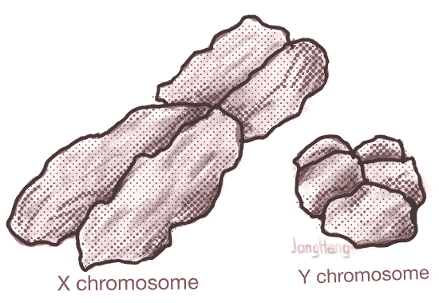

X 和 Y 之间的大小比较

DNA 是一种携带遗传指令的分子，用于所有已知生物的生长、发育、功能和繁殖。这些指令位于被称为**基因**的 DNA 链的特定区域。据估计，人类有超过 20，000 个蛋白质编码基因。

基因编码指令产生消化食物的酶，构建骨骼结构的胶原蛋白，指甲、皮肤和头发的角蛋白，保护大脑的脑脊液等。基因表达是一个过程，通过这个过程，来自这些基因的信息被用来合成所说的产物，这些产物给予我们作为一个人的可观察的特征。

当一个基因表达时，储存在 DNA 中的遗传密码被转录成一种叫做**信使 RNA (mRNA)** 的特殊分子。mRNA 现在携带着遗传密码，其中包含在那个时间点制造哪种蛋白质的指令。接下来，mRNA 被运输到称为核糖体的细胞中的工厂。制造蛋白质的过程叫做[翻译](https://www.nature.com/scitable/topicpage/translation-dna-to-mrna-to-protein-393/)。在生产出想要的产品后，它们将被折叠成能够正常工作的结构。

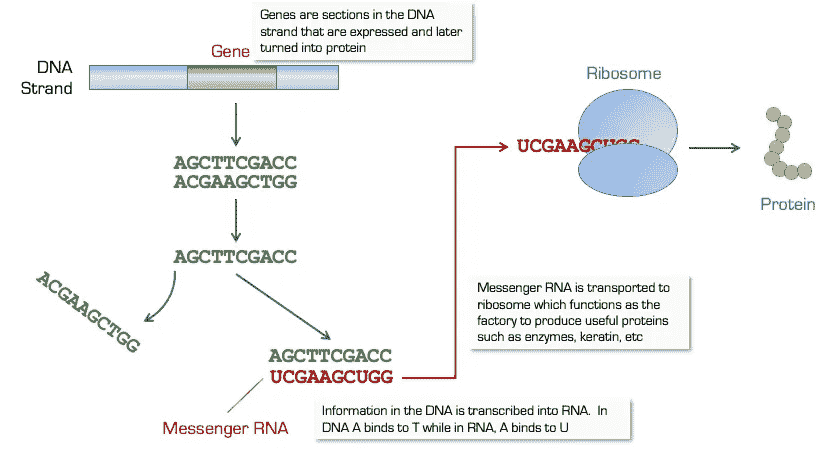

为了控制蛋白质合成的数量和时间，基因表达受到细胞机制的高度调控。控制表达对细胞生产所需的适量产品至关重要；反过来。在特定环境条件下正常细胞中表达的基因可以不同于在不同环境中表达的基因。在正常细胞中表达的基因可能不同于癌细胞；一种组织类型可能与另一种不同，等等。

# 测量基因表达水平

[Affymetrix 基因芯片](https://www.affymetrix.com/about_affymetrix/outreach/educator/microarray_curricula.affx)微阵列通常用于测量基因表达量。DNA 由 4 个分子组成——**腺嘌呤(A)** 、**鸟嘌呤(G)** 、**细胞素**和**胸腺嘧啶(T)** 。在 RNA 中，胸腺嘧啶被**尿嘧啶(U)** 取代。在自然界中，A 总是与 T 结合形成 **A-T** 对，而 C 和 G 形成 **C-G** 对，形成 DNA 双链螺旋。在 RNA 中，配对是 **A-U** 和 **C-G** 。这些配对是自然发生的，如果你把双链 DNA 拉开，它们会像两条长长的磁铁链一样，合在一起。基因芯片微阵列利用了这种配对特性。

基因芯片就像一个棋盘，上面有成千上万个方格。每个方块都有一个探针，它是一个短的 DNA 序列。每个探针检测一个特定的基因。

在活细胞的基因表达过程中，在细胞核中合成的 RNA 分子被运输到细胞质中。在实验室实验中，从细胞质中提取 RNA 分子，并将其置于芯片表面，使其与探针结合。测量与每个探针结合的 RNA 的量，并用作计算每个基因表达水平的基础。这是通过将荧光分子连接到 RNA 链的末端来实现的。然后，这种 RNA 链在芯片上找到互补的 DNA 链(回想一下，U 总是找到 A，C 总是找到 G)并与之结合。当激光从传感器照射到荧光分子上时，荧光分子会发光。测量发射光的强度，作为代表细胞中基因表达量的 RNA 量的指标。

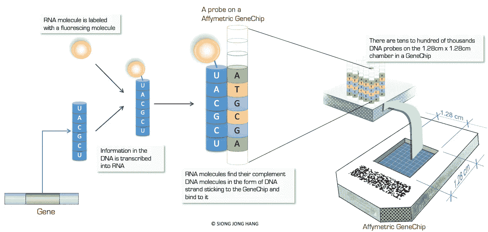

# 基因表达数据

## 数据采集

两组基因表达数据用于该分析:研发环境中的 **GSE5859Subset** 和 **tissueGeneExpression** 。这两个数据集都可以在 Github 包中找到，由哈佛大学 TH Chan 公共卫生学院的 Rafael A. Irrizary 教授向公众提供。安装这些数据集的步骤描述如下:

`install.packages("devtools")`

`library(devtools)`

`install_github("genomicsclass/tissuesGeneExpression")`

`install_github("genomicsclass/GSE5859Subset")`

成功安装后，将数据加载到 R:

`library(GSE5859Subset)`

`data(GSE5859Subset)`

`library(tissuesGeneExpression)`

`data(tissuesGeneExpression)`

**GSE 5859 子集**数据集包含 3 个表格:

**基因注释**表:

*   **探针**:与基因相关的基因芯片探针 ID
*   **CHR** :基因所在的染色体
*   例如，基因 DDR1 与位于染色体 6 上的探针 ID 1007_s_at 相关联

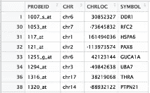

基因注释

**基因表达式**表格:

*   每一列(**GSM136508.CEL.gz，GSM136530.CEL.gz**等)表示一种细胞类型，如肝、肺、结肠等

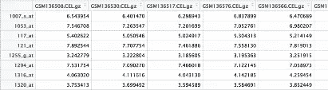

基因表达

表格:种族:ASN =亚洲人，CEU =高加索人

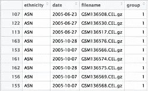

样本信息

**tissueGeneExpression** 数据集包含两个表格:

**e** 表:

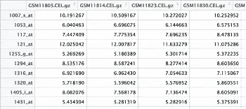

e

**选项卡**表:

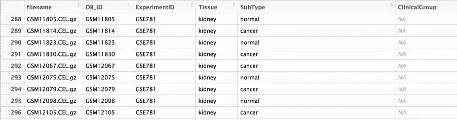

标签

# 数据有效性

使用**多维标度(MDS)** 图验证数据。这些图用于确定数据的有效性和质量。

MDS 为*肝*、*肾*和*结肠*:

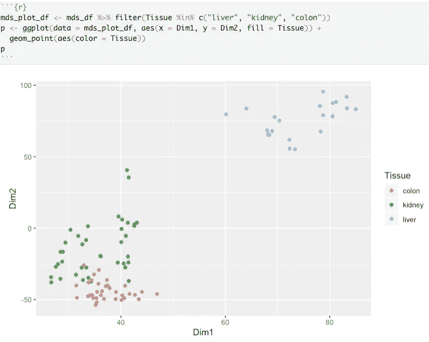

肝、肾和结肠的 MDS 图

MDS 用于*海马*、*小脑*、*胎盘*和*子宫内膜*:

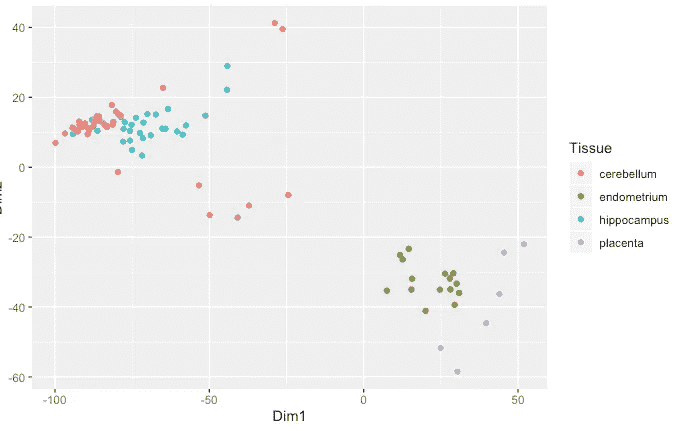

上面的图是先前描述的不同环境、组织类型等中基因表达的一致概念。MDS 还表明，功能相似的组织之间的距离比功能不同的组织之间的距离短。

# 最重要染色体的标准

为了从高维基因芯片基因表达数据的分析中找到最重要的染色体，感兴趣的染色体上的基因表达谱似乎与所有其他染色体不同。这可以通过 189 个样本中的所有对来完成，这可能需要成千上万个图，非常耗时且不切实际。

一种可行的方法是使用**降维**方法。这种方法使我们能够尽可能地保留数据的重要属性，例如样本之间的距离。减少的数据维度使我们更容易可视化每个染色体的基因表达特征。

**主成分分析**和**奇异值分解**是两个潜在的候选。选择 SVD 是因为它有几个特性适合于基因表达数据。

## 属性 1 : SVD 解决方案不是唯一的

对于这个测试，我们使用 SVD 的形式:

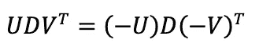

这个性质表明，如果我们翻转 U 的每一列的符号，我们仍然会得到相同的解。

首先，在表 **e** 上执行 SVD，然后翻转 U 列的符号:

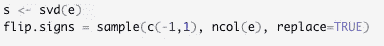

翻转标志后。通过使用 **sweep** 函数获得新的 U 和 V，将函数 **FUN="*"** 应用于每一行，最终得到 **x[i] * a[i]** 。

现在我们来看看我们是否能为 **UDVT** 得到同样的答案。因为我们比较的是矩阵而不仅仅是变量，所以我们使用 **all.equal** 函数。以下应给出**真**响应:

## 属性 2:改变意味着不改变距离

根据行数生成随机值:

`random.vals <- rnorm(nrow(e))`

然后，通过添加随机值来修改 e 中的值:

`new.e <- e + random.vals`

计算原始 e 值的距离:

`sqrt(crossprod(e[,3] — e[,45]))`

计算修改后的 e 值的距离:

`sqrt(crossprod(new.e[,3] — new.e[,45]))`

两者给出的答案应该是一样的 *156.5662* 。

## 特性 3:能够降维

最后，SVD 必须能够帮助我们降低维数。在 **e** 上应用 SVD 后，可以单独得到其单独的 U、D、V。使用 dim(e)获得数据的维数，预计为 22215 x 189。

在测试 SVD 的这种能力之前，我们先回顾一下属性 2。从属性 2 得出的结论是，每行的平均值并不能帮助我们近似列距离，我们将通过减去每行的平均值来计算新的 SVD:

`e.new <- e — rowMeans(e)`

`s.new <- svd(e.new)`

通过使用 **dim** 函数，我们可以确定 **U** 是 *m* x *p* 矩阵，V 是 *p* x *p* 矩阵， **D** 是 *p* x *n* 矩阵。

创建一个变量 z 来存储计算出的 **VD^T:**

`z <- s.new$v * t(s.new$v)`

检查 z 的尺寸:

`dim(z)`

答案应该是 *189 x 189* 。我们已经成功地将**的尺寸从*的 22，215* 减少到仅仅 189** 。随后的分析将采用在应用奇异值分解之前从表 e 中移除行平均值的方法。这样做还有一个最大的好处。它使 SVD 能够产生更精确的结果。

# 使用奇异值分解进行分析

对**基因表达**数据进行奇异值分解:

`tge.s <- svd(geneExpression — rowMeans(geneExpression))`

提取 SVD 产品中的成分 U。稍后将使用**基因注释**对该数据子集进行分层:

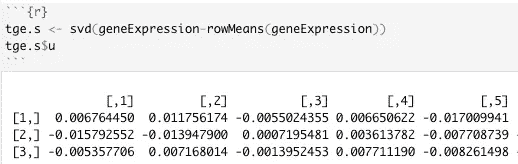

创建一个函数来从 SVD 获得的 U 矩阵的每一列中检索基因表达:

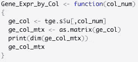

通过将 U 分量的每一列与从**基因注释**中检索到的染色体名称相结合，创建了一个函数:

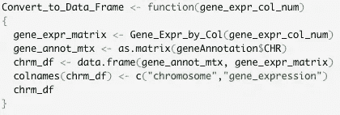

通过移除空值来清理基因表达数据:

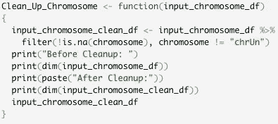

使用以下函数中的盒图完成了降维表达式数据的可视化:

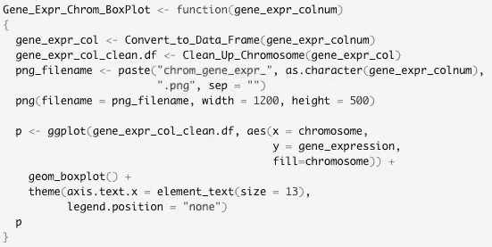

## 使用箱线图可视化 SVD 结果

为了简洁起见，这里只显示了其中两列的可视化效果。从箱线图来看，所有常染色体和 X 染色体的数据点都分布在盒子的两侧。然而，**Y 染色体看起来与其他染色体不同，因为其数据点仅位于一侧**。我们可以得出这样的假设，Y 可能是人类最重要的染色体。然而，Y 染色体基因表达谱的尴尬展示也意味着它是最不重要的染色体。让我们做一些文献调查，看看染色体研究结果对此有什么说法。

SVD 中 U 成分的第 1 列:

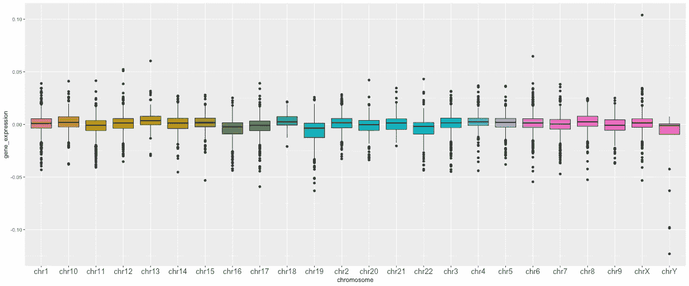

SVD 中 U 成分的第 7 列:

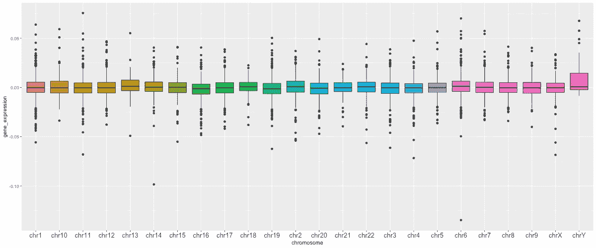

# Y 染色体文献综述

历史上，[Y 染色体被认为是基因垃圾场](https://www.ncbi.nlm.nih.gov/pmc/articles/PMC1692900/),因为它存在似乎没有任何用途的高重复序列。y 染色体在遗传上是退化的，已经失去了它们祖先中存在的大部分活性基因。Y 染色体迅速衰退甚至完全消失的理论得到了比较昆虫、脊椎动物(包括哺乳动物)的研究的支持。根据活跃基因的平均丢失率，人类 Y 预测它将在 1000 万年后灭绝。Y 染色体不能与其相邻的染色体重组，这进一步加速了它的衰变。

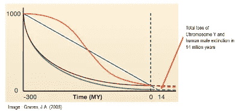

格雷夫斯，J. A. (2006 年)。哺乳动物的性染色体特化和退化。*单元格*。124(5):901–14

人类 Y 中活性基因的丢失率，假设为恒定速率(蓝色)，指数下降(绿色)，目标大小最初增加然后减少(橙色)，或在最后阶段通过正向选择减慢的指数下降(紫色)。

因此，这条染色体似乎在人类染色体中扮演了少年犯的角色:

*   富含垃圾
*   缺乏有用的属性
*   不愿与邻居交往
*   有不可避免的堕落趋势

# 但是等等…

在我们屈服于人类男性在 1400 万年后从地球表面消失的悲惨命运之前，让我们去马萨诸塞州的剑桥旅行吧。

面对无数对 Y 的人格及其未来前景的侮辱，马萨诸塞州剑桥市[怀特黑德生物医学研究所](http://pagelab.wi.mit.edu/)的主任兼教授[大卫·c·佩奇](https://biology.mit.edu/profile/david-c-page/)几乎花费了他的整个科学生涯来研究和捍卫 Y 的荣誉。他开创性的研究导致发现 Y 基因的关键作用不仅仅是性别决定，这表明人类的福祉可能取决于这个小小的 Y

y 包含了数量惊人的高度重复的序列，本质上是回文序列。当一段 DNA 序列是相邻序列的镜像时，就会出现回文序列。例如， **ABCDEF** 的序列是 **FEDCBA** 的镜像。大量回文序列通过对受损基因进行自我修复而提供了一种非常复杂的防御机制( [Skaletsky， *et al* ，2003](https://www.nature.com/articles/nature01722) )。当检测到一个受损的基因时，细胞会利用回文序列，通过在其镜像轴上弯曲来进行折叠，这样受损的基因就会与另一端未受损的基因非常接近，然后它会复制并替换受损的基因。多年来，Y 染色体经历了主要的倒位，以防止遗传物质与 X 染色体交换，从而使这一机制不被破坏。

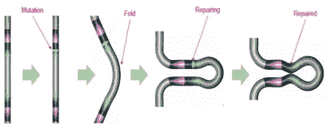

修改自 Skaletsky，h .、Kuroda-Kawaguchi，t .、Minx，P. J .、*等*。(2003).人类 Y 染色体的男性特异性区域是离散序列类别的镶嵌体。*性质*。423(19): 825–837

为什么这种不寻常的机制存在的答案在于它试图保护的基因。除了性别决定和精子发生之外，这些基因在健康和疾病的两性间的表型差异中起着至关重要的作用。已经发现 y 基因在人体各处都起作用——皮肤、肝脏、大脑等。我们都听说过人类的基因组有 99.9%是相同的。只有在男性或女性之间进行比较时，这种情况才是真实的。然而，当一个男性和一个女性的基因组进行比较时，只有 **98.5%** 。换句话说，就 DNA 序列的数量而言，一个男性和一个女性之间的遗传差异是两个男性或两个女性之间的 15 倍。有趣的是，一个男性人类和一只黑猩猩有 98.5%相同。这 1.5%的差异，即大约 4500 万个序列(0.015×30 亿个 DNA 序列)，被时尚地忽略了。

自从工业革命以来，在过去 250 年的现代医学中，我们一直在科学研究中对人类基因组进行男女通用的观察。[每一名男性患风湿性关节炎，就有 3 名女性患同样的疾病；每有一名女性患有自闭症谱系障碍，就有 5 名男性患有；每一个患狼疮的男人，就有 6 个女人。此外，女性比男性更容易患扩张型心肌病](https://www.youtube.com/watch?v=nQcgD5DpVlQ)和[肺动脉高压](https://www.atsjournals.org/doi/full/10.1164/rccm.201707-1345LE)。这些疾病不在生殖道。

更具挑衅性的是，不考虑这 **1.5%** 的差异(同样，**4500 万** DNA 碱基对)，同样，在过去的 250 年里，现代医学研究在理解疾病和寻找治疗方法方面，我们一直在做一门有缺陷的科学吗？

作为最后的思考，到底是什么让 Y 染色体如此神圣，以至于必须不惜一切代价保护它？