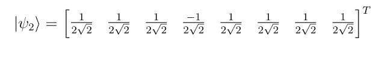
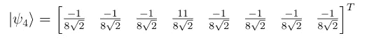

# 在量子计算机上大海捞针

> 原文：<https://towardsdatascience.com/finding-the-needle-in-a-haystack-on-a-quantum-computer-d658bce3e3cc?source=collection_archive---------43----------------------->

## Grover 的量子搜索算法在 O(√N)时间内从无序元素列表中找到目标元素。

给你一个数字列表和一个目标数字，要求你在列表中找到目标数字出现的索引。如果列表已排序，您可以使用搜索算法，如二分搜索法。但是如果列表没有被排序，你真的没什么可以做的；您只需遍历整个列表，直到找到元素。就算法复杂性而言，这需要 O(N)时间。然而，使用量子计算机，你可以在 O(√N)时间内解决这个问题。本文解释了这是如何通过 Grover 的搜索算法实现的。

***如果你是量子计算的新手，你应该先读读这本简短的入门书:*** [***量子并行性——量子计算机从***](/quantum-parallelism-where-quantum-computers-get-their-mojo-from-66c93bd09855?source=friends_link&sk=e5c03e138045cee2476d7804e2df3bd3) ***那里得到它们的魔咒。***

大海捞针(图片来自 [Pixabay](https://pixabay.com/photos/needle-hay-needle-in-a-haystack-1419606/)

让我们从框架问题开始。我们被给予:

*   一组 N 个元素`X = {x_1, …, x_i, … ,x_N}`，使得每个`x_i`是由 0 和 1 组成的 m 位串。
*   目标元素`x*`也是由 0 和 1 组成的 m 位字符串
*   函数 *f* 将 m 位字符串作为输入，如果该字符串为`x*`则返回 1，否则返回 0。这个函数可以写成:

Grover 的搜索分三步进行，如下所述。

**步骤 1:设置状态**

一个量子态建立在基态的相等叠加上。作为一个例子，考虑 N=8。我们使用 3 个量子位设置状态如下:

**第二步:相位反转**

在第二步中，如果`f(x)=1`我们翻转每个元素`x`的振幅，如果`f(x)=0`保持不变。这是使用实现以下单式门 O 的电路来执行的:

假设我们的目标元素`x*`出现在第四个位置。应用 O 门将为我们提供:

**第三步:围绕平均值反转**

第三步称为围绕平均值的*反转*涉及围绕它们的集合平均值翻转所有元素。这是使用 Grover 扩散算子实现的，该算子由下式给出:

将这个算符应用于我们的量子态，我们得到:

这完成了一个回合。如果我们在这一点上测量系统，我们将得到目标元素作为概率(5/(4*√2))等于 78%的结果。

第二步和第三步重复√N 次，最大化这个概率。在第二次迭代之后，我们得到下面的状态，它将以 95%的概率找到目标元素。

像许多量子算法一样，格罗弗的搜索是概率性的。它以很高的概率给你正确的结果。为了使这个概率足够大以至于实际上有用，您可能需要多次运行它。

同样的算法也可以用来查找 k 个匹配条目，而不是单个目标元素。已经提出了许多变体。其中之一是 Durr 和 Hoyer 最小化算法，该算法从列表中找到最小元素的索引——这在量子机器学习中找到了有趣的应用。详见:[监督学习的量子计算方法](https://arxiv.org/abs/2006.12025)。

*如果你喜欢这篇文章，可以在* [*中型*](https://medium.com/@diningphilosopher) *上查看我的其他作品，在*[*LinkedIn*](https://www.linkedin.com/in/kulkarniviraj/)*或*[*Twitter*](https://twitter.com/VirajZero)*，查看我的* [*个人网页*](https://virajkulkarni.org/) *，或发邮件给我*[*viraj@berkeley.edu*](mailto:%20viraj@berkeley.edu)