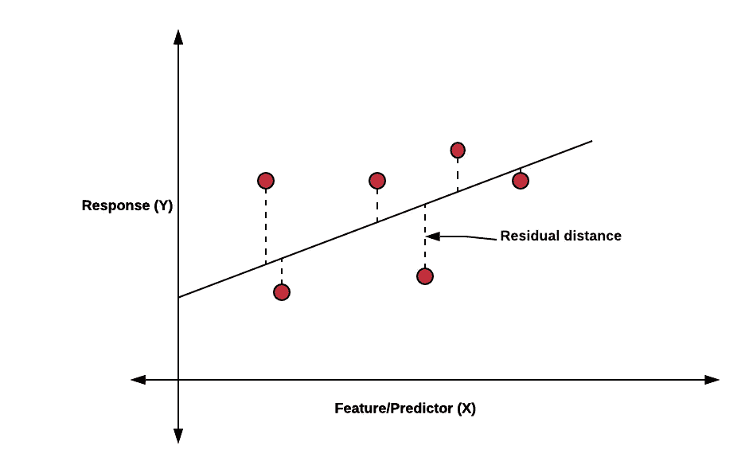

# 使用正则化找到正确的模型复杂度

> 原文：<https://towardsdatascience.com/finding-the-right-model-complexity-using-regularization-af13606cb393?source=collection_archive---------45----------------------->

## 理解偏差-方差的权衡，以及如何使用收缩正则化技术实现它们之间的平衡。

图片来源:[Pixabay.com](https://pixabay.com/photos/scale-kitchen-shelves-measure-1209837/)

在正态线性回归模型中，我们试图通过将所有预测因子拟合到一个线性方程来预测一个响应变量，如下所示:

在上面的等式中，我们尝试使用两个预测因子 X1 和 X2 来预测 Y，其中β1 和β2 是有助于估计预测因子对响应变量 Y 的影响的系数。这里ε是不可约误差，不在我们的控制范围内。

当我们用单个预测器/特征对一组训练数据点拟合上述方程时，我们得到一个模型，该模型可以如下所示

我们可以看到，上面的等式试图在数据点上拟合一条线，该线近似空间中的每个数据点。就训练数据而言，上述线并不理想，因为该线并不完全适合每个点。在被拟合的点和线之间有一个距离，我们称之为**残差**

在上图中，残差显示为实际数据点和拟合的线性方程线上的点之间的垂直距离。因此，我们可以用下面的等式来表示残差

在上面的等式中，我们取实际数据点和直线上拟合点之间的差值。每当我们试图拟合一个线性模型时，我们都试图使所有点的残差之和最小化。这个总和被称为**残差平方和**

我们计算距离的平方，这样正距离值和负距离值的处理方式是一样的。下图显示了一个最小化所有数据点残差的模型。

上述模型适合曲线上的所有点。上述模型的 RSS 等于 0，并且该模型具有**高复杂度。**具有高复杂性的模型试图捕捉数据点中的每一个变化。这样的模型据说有**高方差。**

在训练数据上具有高方差的模型往往在测试数据上表现不佳，因为当模型试图捕捉训练数据中的每个变化时，它还考虑离群值、随机数据点和高杠杆点，这些点很少并且可能不存在于测试数据中。在这种情况下，我们说模型是**过拟合**列车数据**。**

因此，为了提高模型在测试数据上的性能，我们降低了模型的复杂性并减少了它在训练数据集上的方差。当我们减少模型的方差时，我们在模型中引入了误差。该误差被称为**偏差**。

从上面一行可以看出，模型的复杂度降低了。上面的模型没有试图以增加偏差为代价来捕捉每一个数据点。这样一个复杂度稍低的模型在测试数据上会比我们上面看到的模型表现得更好。

因此，减少方差会增加我们模型中的偏差，反之亦然。这被称为**偏差-方差权衡。**偏差方差权衡可在下图中总结。

从上面我们可以看到，随着模型复杂度的增加，模型的方差增加，方差减小。随着复杂度的增加，测试误差也开始减小，但是直到某个点，之后它开始增加。我们必须在拟合模型时找到这个最佳点。

我们必须在拟合模型时找到合适的方差，并且必须确保方差不会太高。

# 减少方差的正则化技术

正则化技术本质上用于减少模型中的方差并避免过度拟合的问题。

减少模型中方差的一种方法是将系数估计值向零收缩。我们估计系数βi，用于估计预测值/特征 Xi 对响应变量变量 y 的影响。因此，将βi 的值向零收缩将低估该特征对响应变量的影响，并将使模型不那么复杂。我们有两种使用这种思想的正则化技术:

1.  山脊正则化(L2)
2.  套索正规化(L1)

## **山脊正规化**

由于我们希望降低系数估计βi 的值，从而降低特征对响应变量的影响，因此我们需要一个模型来惩罚系数估计的高值**。**

在回归模型中，残差平方和(RSS)被最小化。这种方法在岭回归中得到了扩展，除了最小化 RSS 之外，还最小化了系数估计的平方。

我们在岭回归中最小化以下内容

这不过是

因此，在岭回归中，我们不仅最小化 RSS，而且最小化所有特征的系数估计的平方。这导致系数估计值向零收缩。系数值向零收缩的程度由调谐参数λ控制。如果λ的值很大，模型将更多地惩罚系数估计的大值，并且将更多地降低模型复杂性。因此，调整参数用于控制模型复杂性。

请注意，我们只是缩小了特征的系数值，也就是说，我们减小了β1、β2、…，βp 其中 p 是特征的数量。我们没有缩小截距β0 的值，它是所有特征都为 0 时响应变量的平均值(X1=X2=…。Xp=0)

## **套索正规化**

脊正则化成功地将系数的值缩小到零，但从未将它们减小到等于零。这似乎是具有大量预测值的模型的一个问题。使用岭正则化和大量预测因子的模型是不可解释的。例如，如果我们有 **p** 个预测值，其中只有 3 个预测值是有用的，那么岭正则化将创建一个包含所有 **p** 个预测值的模型。

套索正则化是一个轻微的修改岭，克服了这个问题。在套索正规化，我们试图尽量减少以下

唯一的区别是，不是最小化系数估计的平方，而是最小化模数。在 lasso 正则化中，如果调谐参数λ的值足够大，一些系数估计将恰好等于零。因此，lasso 也有助于只找到那些对模型有用的预测因子。

## **选择调谐参数** λ

脊和套索正则化都利用调整参数来控制模型的复杂性。为了确定λ的最佳值，我们使用了交叉验证。我们制作λ值的网格，并对每个值的数据进行交叉验证，并检查哪个值的误差最小。然后，我们用从交叉验证中获得的λ值来拟合模型。

## **分类问题的正则化**

我们现在知道，在回归模型中，我们最小化 RSS，并且当我们在这些模型中应用正则化技术时，我们最小化 RSS 之外的系数估计。

类似地，由于 RSS 在回归中被最小化，我们有许多用于分类模型的损失函数。例如，一个这样的损失函数是交叉熵

其中 **y** 为实际值，**y′**为模型预测值。除了损失函数之外，其余的思想保持不变:将系数估计值向零收缩，并降低模型的复杂性。代替 RSS 的是分类的损失函数。

## **使用哪种技术？套索还是山脊？**

至于用哪种技术的问题，全靠数据。如果响应变量只能由一些预测值来衡量，lasso 将优于 ridge，因为它使系数估计值等于零。如果响应变量需要许多预测值，ridge 将优于 lasso。我们可以通过使用交叉验证来检查哪种技术更合适。

抛开模型的准确性不谈，lasso 总是具有固有特征选择的优势，因为它使系数估计等于零，因此人们可以解释哪些预测因子对于模型是不必要的。