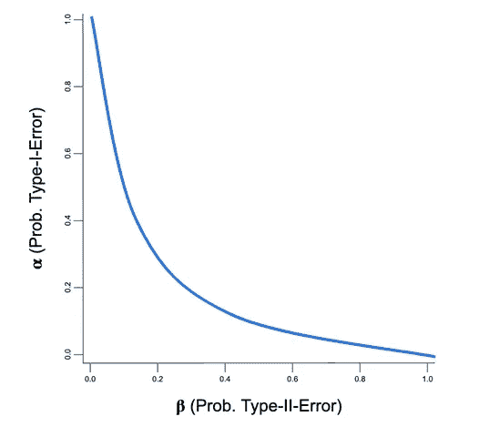
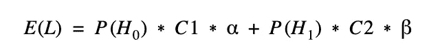
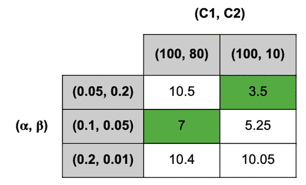

# 为 AB 测试找到正确的显著性水平

> 原文：<https://towardsdatascience.com/finding-the-right-significance-level-for-an-ab-test-26d907ca91c9?source=collection_archive---------40----------------------->

## 为什么使用默认的 95%显著性和 80%功效水平的 AB 测试可能无法充分评估业务风险。

AB 测试是如今产品和营销团队运作中不可或缺的一部分。这样做的原因是，它提供了一种方法来控制支持或反对新功能、营销活动或网站组件的简单颜色变化的决策风险。

基本上有两个参数可以控制 AB 测试的风险，从而控制基于测试结果的决策的风险:显著性和功效水平。从业者通常会退回到 95%显著性和 80%功效水平的默认值。虽然有些人可能仍然会考虑选择不同的显著性水平(主要是 90%或 99%)，但功效水平通常会被完全忽略。事实上，有相当多的在线样本大小计算器首先不能改变这个参数。

# 控制风险相关成本

那么，为什么这是进行 AB 测试的一种危险方式呢？让我们回忆一下这两个变量的实际含义:

**显著性水平**决定了我们实施变体的概率，尽管它实际上并不比对照更好(也称为 I 型错误)。这意味着显著性水平限制了实施劣质变体的风险相关损失(例如，可能是开发成本、转化率下降等。).

另一方面，**功率水平**控制决定反对变体的概率，尽管该变体实际上比当前版本更好(也称为类型 II 错误)。这意味着功率水平限制了不实施更好的变体的机会成本，例如转化率的增加。

# 实践中的意义和力量

> 对每个测试使用相同的显著性和功效水平相当于假设每个测试具有相同的风险/回报特征。

让我们假设我们为一家网上商店进行两个不同的实验:一个是关于直接在产品页面上添加一个 ***【立即购买】*-按钮**，用户可以在这里获得关于某个特定商品的更多信息。如果用户单击该按钮，商品将被添加到购物篮中，用户将被直接发送到结帐页面以完成购买过程。第二个实验包括一个新功能，让用户有机会留下关于他们购买的产品的评论。产品页面上的其他用户可以直接看到这些评论。

立即购买按钮与评论——在 AB 测试中，它们的风险/回报是否相同？

“立即购买”按钮似乎没有太多的实现风险(假设技术实现正确):转化率很可能不会受到负面影响，如果用户不使用该按钮，很容易再次删除它。与此同时，这个概念非常有前途，可以提高转化率。第二个实验包括很大一部分风险相关成本:差评可能会对潜在客户的转化率产生重大影响。与此同时，一旦审查功能对所有市场发布，几乎不可能回滚到以前的状态。用户将坚持保持审查的透明度。

因此，两个实验有非常不同的风险/回报曲线:对于“立即购买”按钮，我们希望确保我们没有错过一个好机会，而实施风险相当低。在这种情况下，统计能力变得更加重要。虽然这些评论可能会对业务产生负面的长期影响，但我们希望确保如果我们决定支持这一功能，我们做出的决定是正确的。这意味着我们需要设置一个更高层次的重要性。

# 为什么我们必须选择

现在有人可能会问，为什么我们不简单地使用高重要性级别以及高功率级别。原因是两者之间的反比关系:一个参数的增加导致另一个参数的减少，所有其他参数(样本大小、最小可检测效应等。)保持不变。增加样本量以增加两个参数会导致测试持续时间的增加。更长的测试持续时间再次导致风险相关成本的增加，因为更多的用户暴露于潜在的劣质变体，或者更少的用户看到潜在的更好的变体。下图描述了不同样本量的 I 型误差和 II 型误差之间的权衡。

# 如何处理取舍

一种更通用的权衡方式是使用**损失函数**，它计算两个参数的每个组合的预期损失。让我们假设原假设为真的概率是已知的，因此另一个假设也是已知的(P(H0) = 1 — P(H1))。实施一个新功能，尽管它的性能没有控制好，与 C1 成本相关，而不实施新功能，尽管它确实更好，与 C2 成本相关。这导致以下损失函数:

对于 P(H0)=0.5，根据相关成本，我们获得了不同的重要性理想水平和功率水平:

在第一种情况下(C1，C2) = (100，80)，90%的显著性水平和 95%的功效水平最小化损失函数，从而最小化预期成本。在第二种情况下，潜在机会成本的显著下降导致理想权力水平下降到 80%,从而重要性水平上升到 95%。

因此，使用损失函数有助于在特定实验的显著性水平和功效水平之间找到适当的平衡。当然，很难为我们进行的每个测试定义这样一个损失函数，但在考虑这两个参数的正确值时，记住这个想法是有帮助的。

# 摘要

应始终根据基础测试的风险/回报情况选择显著性和功效水平，并考虑风险相关的成本和收益。我认为，特别是在软件开发中，由于大多数变更的可逆性，人们可以经常考虑使用比默认的 95%更低的重要性级别。另一方面，在许多情况下，高于 80%的功率水平可能是合理的，以避免错过机会。

## 参考资料和进一步阅读

非常有趣的论文对本文很有帮助，并提供了更详细的概述:

[显著性水平。0.05，0.01，还是？](http://www.jstor.org/stable/1236396)

[经济学和计量经济学中的统计与经济意义](https://ssrn.com/abstract=1398723)

[如何选择重要性水平:教育学笔记](https://mpra.ub.uni-muenchen.de/66373/1/MPRA_paper_66373.pdf)