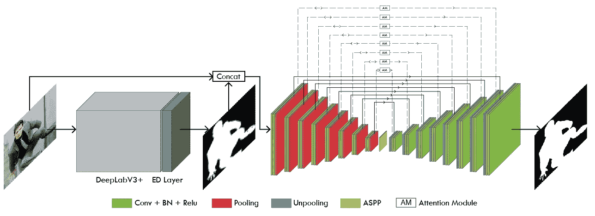
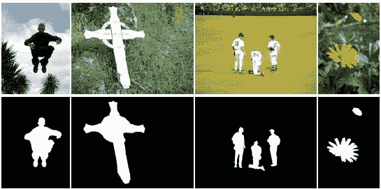
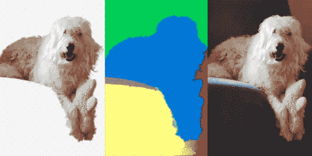
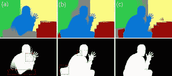

# 细粒度图像分割(FGIS)

> 原文：<https://towardsdatascience.com/fine-grained-image-segmentation-fgis-a0cec385ead0?source=collection_archive---------43----------------------->

## 内部人工智能

## 图像抠图 vs SOD vs 软分割

[来源](https://unsplash.com/photos/qFsMDwNJ7YY)

## 问题和计算机视觉的拯救

如今，照片的真实编辑需要仔细处理自然场景中经常出现的颜色混合。这些颜色混合通常通过场景或对象颜色的软选择来建模。因此，为了实现高质量的图像编辑和背景合成，图像区域之间的这些软过渡的准确表示是至关重要的。目前行业中用于生成这种表示的大多数技术严重依赖于由**熟练视觉艺术家**进行的某种用户交互。因此，创建如此精确的显著性选择成为一项昂贵而乏味的任务。为了填补熟练视觉艺术家的这一空白，我们利用计算机视觉来模拟人类视觉系统，人类视觉系统具有有效的注意力机制来确定视觉场景中最显著的信息。这种类型的**问题也可以解释为前景提取问题**，其中显著对象被认为是前景类，而剩余场景是背景类。计算机视觉和深度学习旨在通过一些选择性的研究分支来模拟这种机制，即**图像抠图、显著对象检测、眼睛注视检测和软分割**。还需要注意的是，与计算机视觉不同，深度学习主要是一种数据密集型的研究方法。

随着最近全卷积网络(FCN)用于图像分割的使用增加，深度学习已经显著改善了前景提取和显著性检测基线。尽管有所有这些改进，大多数建议的体系结构使用最初为图像属性分类任务设计的网络主干，其提取具有语义意义的代表性特征，而不是全局对比度和局部细节信息。但在这篇博客中，我们将把这个问题留到我以后的博客中更详细地讨论。

# 是细分问题吗？

是的，如果从我们输出格式的角度来看，这是一个分段问题。近年来，语义分割已经成为计算机视觉和深度学习领域的一个关键问题。因此，着眼于更大的场景，我们可以说语义分割是其领域中的关键任务之一，为更好的场景理解铺平了道路。越来越多的应用从图像和视频中推断认知事实，这也突出了场景理解的重要性。

我们讨论的三种实现平滑且感觉良好的细粒度语义分割的方法是:

1.  图像抠图
2.  显著目标检测
3.  软分割

[来源](https://giphy.com/gifs/abcnetwork-start-the-rookie-lets-begin-64aBXTVfd90zyUH2da)

# 图像抠图

图像抠图可以理解为绿屏抠像的一般化版本，用于在不受约束的设置中精确估计前景不透明度。图像抠图在计算机图形学和视觉应用中都是一个非常重要的课题。早期的图像抠图方法涉及大型稀疏矩阵，例如大型核抠图拉普拉斯算子及其优化。然而，求解这种线性系统的这些方法通常非常耗时，并且不受用户欢迎。许多研究试图通过使用自适应核大小和 KD 树来提高该线性系统的求解速度，但是在野生图像的质量和推理速度方面没有观察到显著的提高。因为问题是高度不适定的，所以用户通常给出指示明确前景、明确背景和未知区域的三分图(或笔画)作为支持输入。

一个自然图像抠图捕捉非常精细的细节的例子，比如头发— [来源](https://arxiv.org/abs/1908.00672)

让我们首先制定一个图像抠图的基本方程。将图像像素的背景色、前景色和前景不透明度(α遮罩)分别表示为 B、F 和α，像素的颜色 C 可以写成 B 和 F 的凸组合:

> **C = F(α)+B(1α)。**

图像抠图方法可以分为三种主要类型，基于传播的、基于采样的和基于学习的。在一些方法中，还使用基于采样和基于传播的抠图的混合组合。

基于采样的图像抠图基于这样的假设，即未绘制像素的真实背景和前景颜色可以从位于未知像素附近的已知背景和前景像素中导出。一些基于采样的方法有:

*   [共享采样](https://www.inf.ufrgs.br/~eslgastal/SharedMatting/)抠图
*   [迭代](https://ieeexplore.ieee.org/document/6738882)抠图
*   [贝叶斯](https://grail.cs.washington.edu/projects/digital-matting/image-matting/)抠图
*   [稀疏](https://arxiv.org/abs/1604.02898)编码

基于传播的图像遮片技术通过将已知的局部背景和前景像素的阿尔法值传播到未知区域来计算未绘制像素的阿尔法值。然而，在野生背景图像的情况下，对颜色知识的过度依赖导致图像中背景和前景颜色分布重叠的假象。一些基于传播的方法有:

*   [测地线](https://dl.acm.org/doi/10.1007/s11263-008-0191-z)抠图
*   [封闭式](https://people.csail.mit.edu/alevin/papers/Matting-Levin-Lischinski-Weiss-CVPR06.pdf)铺垫
*   [泊松](http://www.cs.jhu.edu/~misha/Fall07/Papers/Sun04.pdf)铺垫
*   [光谱](https://webee.technion.ac.il/people/anat.levin/papers/spectral-matting-levin-etal-cvpr07.pdf)抠图

然而，基于采样和传播的技术都不能提供令人满意的和完全自动化的结果。因此，最近，几项深度学习研究已经提出了通过将三分图和 RGB 图像级联输入到 FCN 中来解决上述线性系统或者仅 RGB 图像本身来预测最终阿尔法遮片的方法。一些已知的依赖于 trimap 的深度学习架构是:

*   深度自动人像抠图[沈等人](http://xiaoyongshen.me/papers/deepmatting.pdf)。
*   深度图像抠图(DIM)由[徐等人](http://openaccess.thecvf.com/content_cvpr_2017/papers/Xu_Deep_Image_Matting_CVPR_2017_paper.pdf)
*   [蔡等](http://openaccess.thecvf.com/content_ICCV_2019/papers/Cai_Disentangled_Image_Matting_ICCV_2019_paper.pdf)解开图像抠图

而一些独立于 trimap 的深度学习架构是:

*   后期融合铺垫由[张等人完成。](http://openaccess.thecvf.com/content_CVPR_2019/papers/Zhang_A_Late_Fusion_CNN_for_Digital_Matting_CVPR_2019_paper.pdf)
*   语义人体抠图[陈等](https://arxiv.org/abs/1809.01354)
*   AlphaNet:一个注意力引导的深度网络，用于自动图像抠图 [Sharma 等人](https://arxiv.org/abs/2003.03613)

用于自动图像抠图的注意力引导深度网络— [来源](https://arxiv.org/abs/2003.03613)

**根据我的个人经验**，基于深度学习的方法能够比其他两种方法更好地捕捉全局语义信息和局部细节，并且它们不偏向于已知和未知区域像素之间存在相关性的任何粗略假设。

# 显著目标检测

SOD 的主要目标是分割图片中最显著(重要)和视觉上最有吸引力的对象。在图像分割和视觉跟踪等许多领域，SOD 有着广泛的应用。与图像抠图类似，在用于显著性检测的全卷积网络(FCN)兴起后，SOD 的发展水平有了显著提高。

SOD 模型的理想显著图示例— [来源](https://www.cutoutimage.com/photoshop-masking-services)

与自然图像抠图不同，显著对象检测并不像看起来那么复杂。实现精确显著目标检测的主要挑战是:

①**显著性定位**。特定视觉资产的显著性通常定义在整个图像的全局对比度上，而不是任何逐像素或局部特征上。因此，为了实现精确的 SOD，显著性检测算法不仅必须捕获整个图像的全局对比度，还必须建立前景对象的细节结构的精确表示。为了解决这个问题，使用了多级深度特征聚合网络。

(2) **没有边界细化损失。**用于训练显著性对象检测模型的最常见损失是联合交集(IoU)损失或交叉熵(CE)。但是这两种方法都导致了模糊的边界细节，这是由于它们没有有效地区分边界像素。许多研究也使用骰子点数损失，但它的主要目的是处理有偏差的训练集，而不是专门加强精细结构的建模。

## **研究历史**

关于显著对象检测的深度学习文献有丰富的现代历史。一些研究强调使用具有注意力机制的深度循环网络对一些选择性图像子区域进行迭代细化。另一方面，一些研究强调了通过深层多路径循环连接将全球信息从网络的深层转移到浅层的有效性。许多作者，如胡等人[1]和王等人[2]提出了使用递归全连通网络或递归级联多层深度特征进行显著对象检测的方法。这些研究也显示了预测误差迭代校正的有效性。与之前提到的研究工作相反，一些研究还显示了在 [U-Net](https://arxiv.org/abs/1505.04597) 架构中使用上下文注意力网络来预测像素式注意力图。这些提取的逐像素注意力图在评估度量方面被证明对于显著性检测非常有效。很少提出的方法强调从粗略预测到精细预测的过渡。这些方法提出了通过捕捉更精细的结构来实现更精确的边界细节的细化策略。例如，Lu 等人提出了一种架构，该架构捕捉用于对显著性图的各种全局结构化显著性线索以及后细化阶段进行建模的深度分层显著性表示。最近发表的显著物体检测领域的进展(在我写这篇博客的时候)是由[秦等人](https://arxiv.org/pdf/2005.09007.pdf)提出了一个具有两级嵌套 u 型结构的强大深度网络架构()。作者陈述的关键改进是多尺度上下文信息捕获(感受域的混合)和增加的网络深度(在剩余 U 块中汇集),而没有任何显著的计算开销。

显著目标检测结果显示了空间分布的有效性— [来源](https://cvhci.anthropomatik.kit.edu/~bschauer/publications_long_list.html)

**根据我的个人经验**，SOD 在自然图像抠图方面也实现了较高质量的显著图，但在透明度建模和精细结构提取方面质量较差。

# 软分割

软分割被定义为将图像分解成两个或更多个部分，其中每个成员像素可以属于两个或更多个部分。

语义软段，通过为每个段分配
纯色来可视化— [源](https://syncedreview.com/2018/08/24/how-ai-generates-a-furry-dog-silhouette/)

## **研究历史**

大多数早期的软分割方法强调使用逐像素颜色分解或全局优化来提取各种同质颜色的软显著图。虽然观察到这些提取的柔和色彩图对于许多关键的图像编辑应用(例如图像重新着色)是有用的，但是与 SOD 类似，它们不特别考虑对象边界和过渡区域粒度。有趣的是，图像抠图与软分割的分支有非常密切的关系。事实上，一些图像抠图文献(如抠图拉普拉斯算子)完全符合软分割的关键思想，即捕捉图像中局部软过渡区域的强大表示。给定一组用户定义的区域，这些方法主要基于迭代求解两层软分割问题以生成多层的思想。Levin 等人关于频谱抠图的工作也通过经由频谱分解自动估计一组空间连接的软片段来服务于相同的目的。最近由 [Aksoy 等人](http://cfg.mit.edu/sites/cfg.mit.edu/files/sss_3.pdf)进行的软分割研究也遵循了结合光谱分解和遮片拉普拉斯算子的光谱遮片的思想。然而，与光谱抠图不同，他们的工作从光谱分解的角度解决问题，通过融合局部纹理信息和来自为场景分析训练的深度卷积神经网络的高级特征。他们的主要贡献之一是使用图状结构，通过语义对象以及它们之间的软转换来丰富相应拉普拉斯矩阵的特征向量。

(a)抠图拉普拉斯算子，(b)语义拉普拉斯算子和(c)两者一起应用的结果— [来源](http://cfg.mit.edu/sites/cfg.mit.edu/files/sss_3.pdf)

**以我个人的经验**，软分割是自然图像抠图的一个衍生分支，结合了丰富的历史图像抠图实践和深度学习的力量。也不同于普通的图像抠图，软分割给出了表示语义上有意义的区域的更多输出层。但是，尽管有这些显著的改进，仍有很大的改进空间需要解决。

# 结论

我已经从解决显著前景提取问题的角度解释了这些方法，但是这些方法旨在解决的实际问题在它们各自的研究分支中是非常多样和丰富的，并且以它们的方式对深度计算机视觉(我对计算机视觉+深度学习)的领域做出了贡献。

这篇博客给出了所有这些方法的概述，从一个研究者的角度来说，我们甚至没有恰当地触及这些主题的表面。要阅读关于抠图的详细内容，请查看 AlphaNet，我可能会在未来的博客中更深入地讨论这些话题。

# 参考

[1]，，，傅志荣，和冯江恒.用于显著目标检测的递归聚集深度特征。美国路易斯安那州新奥尔良市 AAAI-18 会议录，第 6943-6950 页，2018 年。

[2]，王，，陆沪川，，阮向军.基于递归完全卷积网络的显著目标检测。2018 年 IEEE 模式分析与机器智能汇刊。