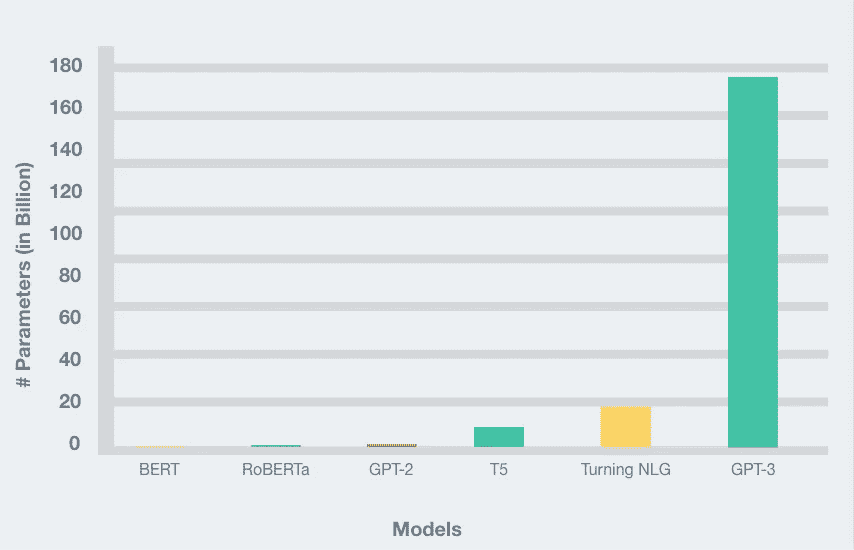
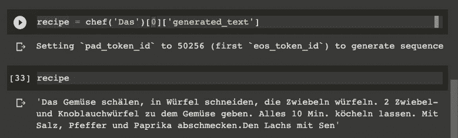
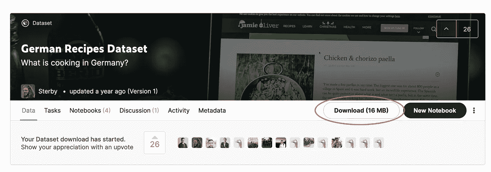

# 微调一个非英语 GPT-2 模型与拥抱脸

> 原文：<https://towardsdatascience.com/fine-tune-a-non-english-gpt-2-model-with-huggingface-9acc2dc7635b?source=collection_archive---------13----------------------->

## 微调非英语，德国 GPT-2 模型与德国食谱拥抱脸。使用它们的训练器类和管道对象

由[彼得道恩](https://unsplash.com/@fifthlane?utm_source=unsplash&utm_medium=referral&utm_content=creditCopyText)在 [Unsplash](https://unsplash.com/?utm_source=unsplash&utm_medium=referral&utm_content=creditCopyText) 上拍摄的照片

*原载于 2020 年 9 月 6 日*[*https://www . philschmid . de*](https://www.philschmid.de/fine-tune-a-non-english-gpt-2-model-with-huggingface)*。*

# 介绍

除非你生活在岩石下，否则你可能听说过 OpenAI 的 GPT-3 语言模型。你可能也看过所有疯狂的演示，其中模型编写了`JSX`、`HTML`代码，或者它在零/少量学习领域的能力。西蒙·奥里甘写了一篇[文章，里面有基于 GPT 3 的优秀演示和项目。](/gpt-3-demos-use-cases-implications-77f86e540dc1)

GPT-3 的一个缺点是它有 1750 亿个参数，这导致模型大小约为 350GB。相比之下，GPT-2 迭代的最大实现有 15 亿个参数。这小于 1/116 的大小。

事实上，由于有接近 175B 的可训练参数，GPT-3 在尺寸上比其他任何型号都要大得多。这里是最近流行的 NLP 模型的参数数量的比较，GPT-3 明显突出。

[作者创作](https://www.philschmid.de/fine-tune-a-non-english-gpt-2-model-with-huggingface)

这一切都很壮观，但是你不需要 1750 亿个参数就能在`text-generation`中获得好的结果。

已经有关于如何微调 GPT-2 的教程了。但是很多都过时了。在本教程中，我们将在最新版本(3.1.0)中使用 [Huggingface](https://huggingface.co/) 的`transformers`库。我们将使用新的`Trainer`级，并用来自 [chefkoch.de](http://chefkoch.de) 的德国配方对我们的 GPT-2 模型进行微调。

你可以在这个 [colab 笔记本上找到我们正在做的一切。](https://colab.research.google.com/github/philschmid/fine-tune-GPT-2/blob/master/Fine_tune_a_non_English_GPT_2_Model_with_Huggingface.ipynb)

# 变形金刚库由 [Huggingface](https://huggingface.co/)

[变形金刚标志](https://github.com/huggingface/transformers)

[变形金刚库](https://github.com/huggingface/transformers)为自然语言理解(NLU)和自然语言生成(NLG)提供最先进的机器学习架构，如 BERT、GPT-2、罗伯塔、XLM、DistilBert、XLNet、T5。它还提供了 100 多种不同语言的数千个预训练模型，并可在 PyTorch & TensorFlow 2.0 之间深度互操作。它使开发人员能够针对不同的 NLP 任务(如文本分类、情感分析、问答或文本生成)微调机器学习模型。

# 辅导的

在教程中，我们从 [Huggingface 模型中枢](https://huggingface.co/models)微调一辆德国 GPT-2。作为数据，我们使用[德国食谱数据集](https://www.kaggle.com/sterby/german-recipes-dataset)，它由 12190 个德国食谱组成，元数据从 [chefkoch.de](http://chefkoch.de/) 中抓取。

我们将使用食谱指导来微调我们的 GPT-2 模型，并让我们在事后编写我们可以烹饪的食谱。

[作者创作](https://www.philschmid.de/fine-tune-a-non-english-gpt-2-model-with-huggingface)

在本教程中，我们使用带有 GPU 运行时的 Google Colab。如果你不确定如何使用 GPU 运行时，看看这里的。

**我们要做什么:**

*   从 Kaggle 加载数据集
*   准备数据集并构建`TextDataset`
*   用`TrainingArguments`和 GPT-2 模型初始化`Trainer`
*   训练并保存模型
*   测试模型

你可以在这个 [colab 笔记本](https://colab.research.google.com/github/philschmid/fine-tune-GPT-2/blob/master/Fine_tune_a_non_English_GPT_2_Model_with_Huggingface.ipynb)里找到我们做的一切。

# 从 Kaggle 加载数据集

正如在教程介绍中已经提到的，我们使用 Kaggle 的"[德国食谱数据集](https://www.kaggle.com/sterby/german-recipes-dataset)"数据集。该数据集由 12190 个德国食谱组成，元数据从 [chefkoch.de](http://chefkoch.de/) 抓取而来。在这个例子中，我们只使用食谱的说明。我们使用“下载”按钮下载数据集，并将其上传到我们的 colab 笔记本，因为它只有 4,7MB 的压缩大小。

[Kaggle 比赛截图](https://www.kaggle.com/sterby/german-recipes-dataset)

上传文件后，我们使用`unzip`提取`recipes.json`。

*您也可以使用* `*kaggle*` *CLI 来下载数据集，但请注意，您需要在 colab 笔记本中保存您的 Kaggle 凭据。*

这是一个食谱的例子。

# 准备数据集并构建一个`TextDataset`

下一步是从所有食谱中提取说明，并构建一个`TextDataset`。`TextDataset`是变形金刚库实现的 [Pytroch](https://pytorch.org/tutorials/beginner/data_loading_tutorial.html#dataset-class) `[Dataset](https://pytorch.org/tutorials/beginner/data_loading_tutorial.html#dataset-class)` [类](https://pytorch.org/tutorials/beginner/data_loading_tutorial.html#dataset-class)的自定义实现。如果你想在 Pytorch 中了解更多关于`Dataset`的信息，你可以看看这个 [youtube 视频](https://www.youtube.com/watch?v=PXOzkkB5eH0&ab_channel=PythonEngineer)。

首先，我们将`recipes.json`分成一个`train`和`test`部分。然后我们从食谱中提取出`Instructions`并将它们写入`train_dataset.txt`和`test_dataset.txt`

下一步是下载标记器。我们使用来自`german-gpt2`模型的标记器。

现在我们可以建造我们的`TextDataset`。因此，我们用`tokenizer`和数据集的路径创建了一个`TextDataset`实例。我们还创建了我们的`data_collator`，它用于训练从我们的数据集形成一个批处理。

# 用`TrainingArguments`和 GPT-2 模型初始化`Trainer`

[训练器](https://huggingface.co/transformers/main_classes/trainer.html#transformers.Trainer)类为全功能训练提供了一个 API。Huggingface 的大多数[示例脚本](https://huggingface.co/transformers/examples.html)中都使用了它。在实例化我们的`Trainer`之前，我们需要下载我们的 GPT-2 模型并创建[训练参数](https://huggingface.co/transformers/main_classes/trainer.html#transformers.TrainingArguments)。`TrainingArguments`用于定义超参数，我们在`learning_rate`、`num_train_epochs`或`per_device_train_batch_size`等训练过程中使用这些超参数。你可以在这里找到完整的列表。

# 训练并保存模型

为了训练模型，我们可以简单地运行`trainer.train()`。

训练完成后，您可以通过调用`save_model()`保存模型。这将把训练好的模型从我们的`TrainingArguments`保存到我们的`output_dir`。

# 测试模型

为了测试这个模型，我们使用了变形金刚库的另一个[亮点`pipeline`。](https://huggingface.co/transformers/main_classes/pipelines.html?highlight=pipelines)[管道](https://huggingface.co/transformers/main_classes/pipelines.html?highlight=pipelines)是提供简单 API 的对象，专用于几个任务，`text-generation`等等。

结果:

*第一次做大足，2 分钟做大足。森林在河边倒下了。去死吧。黄油三明治。他的头发也是这样，比你的头发还长。”*

嗯，就是这样💫。我们做到了👨🏻‍🍳。我们已经成功地微调了我们的 gpt-2 模型来为我们编写食谱。

为了改善我们的结果，我们可以训练它更长时间，并调整我们的`TrainingArguments`或扩大数据集。

你可以在这本 [colab 笔记本](https://colab.research.google.com/github/philschmid/fine-tune-GPT-2/blob/master/Fine_tune_a_non_English_GPT_2_Model_with_Huggingface.ipynb)里找到一切。

感谢阅读。如果你有任何问题，随时联系我或评论这篇文章。你也可以通过 [Twitter](https://twitter.com/_philschmid) 或 [LinkedIn](https://www.linkedin.com/in/philipp-schmid-a6a2bb196/) 与我联系。