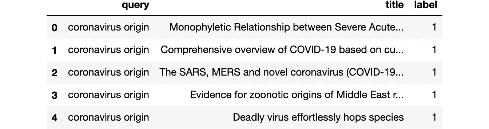

# 用变压器微调 BERT 模型

> 原文：<https://towardsdatascience.com/fine-tuning-a-bert-model-with-transformers-c8e49c4e008b?source=collection_archive---------8----------------------->

## 设置自定义数据集，用 Transformers Trainer 微调 BERT，并通过 ONNX 导出模型

这篇文章描述了一个开始微调变压器模型的简单方法。它将涵盖基础知识，并向您介绍来自`transformers`库的惊人的`Trainer`类。你可以从 [Google Colab](https://colab.research.google.com/github/thigm85/blog/blob/master/_notebooks/2020-11-12-fine-tune-bert-basic-transformers-trainer.ipynb) 运行代码，但是不要忘记启用 GPU 支持。


[Samule 孙](https://unsplash.com/@samule?utm_source=unsplash&utm_medium=referral&utm_content=creditCopyText)在 [Unsplash](https://unsplash.com/s/photos/transformers?utm_source=unsplash&utm_medium=referral&utm_content=creditCopyText) 上的照片

我们使用从[新冠肺炎公开研究数据集挑战赛](https://www.kaggle.com/allen-institute-for-ai/CORD-19-research-challenge)构建的数据集。这项工作是一个更大的项目的一小部分，该项目是建立 [cord19 搜索应用](https://cord19.vespa.ai/)。

## 安装所需的库

```
!pip install pandas transformers
```

## 加载数据集

为了微调 cord19 应用程序的 BERT 模型，我们需要生成一组查询文档特征和标签，以指示哪些文档与特定查询相关。在本练习中，我们将使用`query`字符串表示查询，使用`title`字符串表示文档。

```
training_data = read_csv("https://thigm85.github.io/data/cord19/cord19-query-title-label.csv")
training_data.head()
```



有 50 个唯一的查询。

```
len(training_data["query"].unique())50
```

对于每个查询，我们都有一个文档列表，分为相关(`label=1`)和不相关(`label=0`)。

```
training_data[["title", "label"]].groupby("label").count()
```


## 数据分割

为了便于说明，我们将使用一个简单的数据划分为训练集和验证集。即使我们在考虑独特的查询和文档对时有超过 5 万个数据点，我相信这个特定的案例将受益于交叉验证，因为它只有 50 个包含相关性判断的查询。

```
from sklearn.model_selection import train_test_split
train_queries, val_queries, train_docs, val_docs, train_labels, val_labels = train_test_split(
    training_data["query"].tolist(), 
    training_data["title"].tolist(), 
    training_data["label"].tolist(), 
    test_size=.2
)
```

## 创建 BERT 编码

创建训练和验证编码。为此，我们需要选择[使用哪个 BERT 模型](https://huggingface.co/transformers/pretrained_models.html)。我们将使用[填充和截断](https://huggingface.co/transformers/preprocessing.html#everything-you-always-wanted-to-know-about-padding-and-truncation)，因为训练例程期望一批中的所有张量具有相同的维数。

```
from transformers import BertTokenizerFast

model_name = "google/bert_uncased_L-4_H-512_A-8"
tokenizer = BertTokenizerFast.from_pretrained(model_name)

train_encodings = tokenizer(train_queries, train_docs, truncation=True, padding='max_length', max_length=128)
val_encodings = tokenizer(val_queries, val_docs, truncation=True, padding='max_length', max_length=128)
```

## 创建自定义数据集

现在我们有了编码和标签，我们可以创建一个`Dataset`对象，如变形金刚网页中关于[自定义数据集](https://huggingface.co/transformers/custom_datasets.html)的描述。

```
import torch

class Cord19Dataset(torch.utils.data.Dataset):
    def __init__(self, encodings, labels):
        self.encodings = encodings
        self.labels = labels

    def __getitem__(self, idx):
        item = {key: torch.tensor(val[idx]) for key, val in self.encodings.items()}
        item['labels'] = torch.tensor(self.labels[idx])
        return item

    def __len__(self):
        return len(self.labels)

train_dataset = Cord19Dataset(train_encodings, train_labels)
val_dataset = Cord19Dataset(val_encodings, val_labels)
```

## 微调 BERT 模型

我们将使用`BertForSequenceClassification`，因为我们试图将查询和文档对分为两个不同的类别(不相关、相关)。

```
from transformers import BertForSequenceClassification

model = BertForSequenceClassification.from_pretrained(model_name)
```

我们可以将所有基本模型参数的`requires_grad`设置为`False`，以便仅微调特定于任务的参数。

```
for param in model.base_model.parameters():
    param.requires_grad = False
```

然后我们可以用`Trainer`微调模型。下面是一个带有一组现成参数的基本例程。选择下面的参数时应该小心，但这超出了本文的范围。

```
from transformers import Trainer, TrainingArguments

training_args = TrainingArguments(
    output_dir='./results',          # output directory
    evaluation_strategy="epoch",     # Evaluation is done at the end of each epoch.
    num_train_epochs=3,              # total number of training epochs
    per_device_train_batch_size=16,  # batch size per device during training
    per_device_eval_batch_size=64,   # batch size for evaluation
    warmup_steps=500,                # number of warmup steps for learning rate scheduler
    weight_decay=0.01,               # strength of weight decay
    save_total_limit=1,              # limit the total amount of checkpoints. Deletes the older checkpoints.    
)

trainer = Trainer(
    model=model,                         # the instantiated 🤗 Transformers model to be trained
    args=training_args,                  # training arguments, defined above
    train_dataset=train_dataset,         # training dataset
    eval_dataset=val_dataset             # evaluation dataset
)

trainer.train()
```

## 将模型导出到 ONNX

一旦训练完成，我们可以使用 [ONNX](https://onnx.ai/) 格式导出模型，以部署到其他地方。下面我假设你有一个 GPU，比如你可以从 Google Colab 获得。

```
from torch.onnx import export

device = torch.device("cuda") 

model_onnx_path = "model.onnx"
dummy_input = (
    train_dataset[0]["input_ids"].unsqueeze(0).to(device), 
    train_dataset[0]["token_type_ids"].unsqueeze(0).to(device), 
    train_dataset[0]["attention_mask"].unsqueeze(0).to(device)
)
input_names = ["input_ids", "token_type_ids", "attention_mask"]
output_names = ["logits"]
export(
    model, dummy_input, model_onnx_path, input_names = input_names, 
    output_names = output_names, verbose=False, opset_version=11
)
```

## 结束语

如前所述，这篇文章涵盖了基本的培训设置。这是一个需要改进的良好起点。最好从简单的开始，然后补充，而不是相反，尤其是在学习新东西的时候。我将超参数调优、交叉验证和更详细的模型验证等重要主题留到后续文章中。但是有一个基本的训练设置是一个很好的第一步。