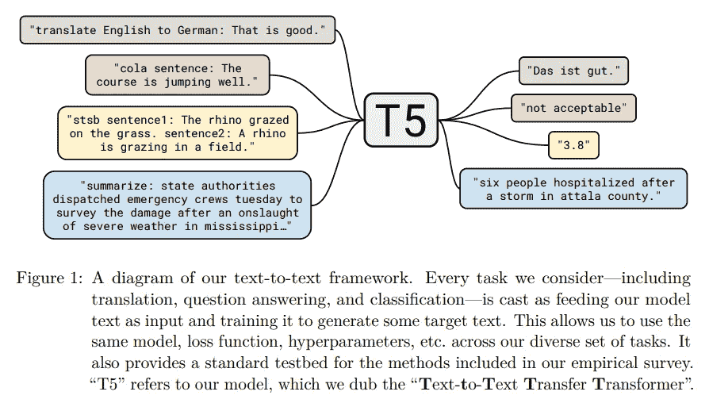
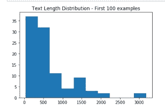
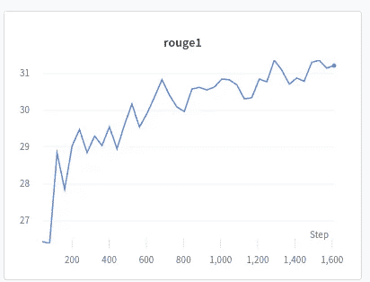

# 为任何摘要任务微调 T5 变压器

> 原文：<https://towardsdatascience.com/fine-tuning-a-t5-transformer-for-any-summarization-task-82334c64c81?source=collection_archive---------5----------------------->

## 用数据做很酷的事情！


借用自 pexels.com[的免版税图片](https://www.pexels.com/photo/book-eyeglasses-eyewear-page-261857/)

# 介绍

我对 [T5 变压器型号](https://arxiv.org/abs/1910.10683)的威力感到惊讶！T5 代表文本到文本转换转换器，它使得在任何文本到文本任务上微调转换器模型变得容易。任何 NLP 任务事件如果是分类任务，都可以被框定为输入文本到输出文本的问题。

在这篇博客中，我展示了如何在*的任何数据集*上调优这个模型。特别是，我演示了如何在汇总数据集上实现这一点。我在 CNN-每日邮报和维基百科数据集上亲自测试过。代码可以在我的 Github [这里](https://github.com/priya-dwivedi/Deep-Learning/blob/master/wikihow-fine-tuning-T5/Tune_T5_WikiHow-Github.ipynb)公开获得。

T5-small 接受过 Wikihow 培训，能够写出令人惊叹的摘要。请参见下面的实际文本、实际摘要和预测摘要的片段。这个模型也可以在 HuggingFace 变形金刚模型中枢[这里](https://huggingface.co/deep-learning-analytics/wikihow-t5-small?text=+Bring+1%2F2+cup+water+to+the+boil.Add+the+fresh+or+dried+rosemary+to+the+water.Remove+from+the+heat.+Set+aside+for+1%2F2+an+hour+to+infuse.+Added+flavour+can+be+released+by+pressing+down+on+the+rosemary+leaves+with+a+spoon.+Add+the+pieces+to+the+blender+or+food+processor+with+the+elderflower+cordial.+Blend+or+process+to+a+pur%C3%A9e.%2C%2C+Add+the+lemon+or+lime+juice+and+stir+to+combine.%2C+Add+a+cover+and+place+in+the+freezer.After+2+hours%2C+remove+from+the+freezer+and+break+up+with+a+fork.+This+helps+the+ice+crystals+to+form+properly.Continue+doing+this+every+hour+until+the+granita+freezes+properly.+Scoop+the+granita+into+dessert+bowls+and+serve.+Garnish+with+a+cucumber+curl+or+a+small+sprig+of+rosemary.)。该链接提供了一种在输入文本和 JSON 端点上测试模型的便捷方式。

```
WikiHow Text: Make sure you've got all the cables disconnected from the back of your console,
especially the power cord., You'll need the straight end to be about 2-3 inches long.You will need a
large size paper clip for this method because it will need to go in about 1 and a half inches to
push the disc out., It's located on the left side of the console, right behind the vents.The eject
hole on an Xbox One S is located at the second hole on the left from the right corner and the third
hole up from the bottom. It can be more difficult to spot, so it's best to have a good amount of
light available. Doing so will cause the disc to pop out a little bit., Carefully pull the disc the
rest of the way out with your fingers. It might be a good idea to use a cloth or soft fabric to
protect the disc from fingerprints and scratching.

Actual Summary: Unplug all cables from your Xbox One.Bend a paper clip into a straight line.Locate the orange circle.Insert the paper clip into the eject hole.Use your fingers to pull the disc out.

Predicted Summary: Gather the cables.Place the disc on your console.Section the eject hole on the left side of the console.Pull out the disc.Remove from the back of the console.
```

我经营一家机器学习咨询，[深度学习分析](https://deeplearninganalytics.org/)。在深度学习分析公司，我们非常热衷于使用数据科学和机器学习来解决现实世界的问题。如果您正在为您的业务项目寻找 NLP 专业知识，请联系我们。原文全文发表在[我们的网站这里](https://deeplearninganalytics.org/fine-tuning-a-t5-transformer-for-any-summarization-task/)。

# T5 变压器型号

google research 发布的 T5 模型在现有研究的基础上增加了以下内容:

1.  它创建了一个大规模通用爬网数据集的干净版本，称为巨大干净通用爬网(C4)。这个数据集是 s *比维基百科*大两个数量级。
2.  它在普通爬行上训练 T5
3.  它建议将所有的自然语言处理任务作为输入文本重新组织为输出文本公式
4.  它表明，使用预训练的 T5 和文本-文本公式化对不同任务(摘要、QnA、阅读理解)的微调产生了最先进的结果
5.  T5 团队还进行了系统研究，以了解预培训和微调的最佳实践。他们的论文详述了哪些参数对获得好的结果最重要。

来自 T5 论文的下图解释了这个输入文本到输出文本的问题公式。



T5 模型任务制定。图来自 [T5 论文](https://arxiv.org/pdf/1910.10683.pdf)

谷歌的这篇博客也很好地解释了这篇论文。现在让我们深入研究代码吧！

# T5 微调管道

我们将使用 T5 模型的 HuggingFace Transformers 实现来完成这项任务。非常感谢 Suraj 的这个[棒极了的作品](https://github.com/patil-suraj/exploring-T5/blob/master/t5_fine_tuning.ipynb)，我用它作为我代码的起点。

## 获取数据

为了简单地将这个管道扩展到任何 NLP 任务，我使用了 [HuggingFace NLP](https://github.com/huggingface/nlp/tree/master/datasets/wikihow) 库来获取数据集。这使得加载许多支持数据集变得容易。HuggingFace NLP 库也支持许多指标。我已经为我的模型使用了它 rouge score 实现。

我的 [Github](https://github.com/priya-dwivedi/Deep-Learning/blob/master/wikihow-fine-tuning-T5/Tune_T5_WikiHow-Github.ipynb) 上有完整的代码。在这个演示中，我将展示如何处理 [WikiHow 数据集。该代码可以灵活地扩展到任何摘要任务。](https://www.tensorflow.org/datasets/catalog/wikihow)

涉及的主要步骤是:

1.  加载 Wikihow 数据。请注意，对于此数据集，需要将两个文件下载到本地数据文件夹
2.  NLP 库创建的 dataset 对象可用于查看示例
3.  我们希望查看文本的平均长度，以决定输入是否可以标记为最大长度 512

对于 Wikihow 数据集，文本的平均长度是 660 个单词，摘要的平均长度是 49 个单词。下图显示了文本长度的分布



WikiHow 上的文本长度分布

WikiHow 文本通常是一个主题的 1-2 段说明性文本。下面分享一个例子

```
WikiHow Text: Each airline has a different seat design, but you should find a lever on the side of
your seat in many cases. Pull it up to bring the seat back up. If you can't find the lever, ask a
flight attendant for help., Most airlines still use seat belts that only go across your lap. Locate
the buckle on one side and the latching device on the other. Straighten out each side, if necessary.
Insert the buckle into the latching device. Make sure you hear a click. Pull the belt until it's
snug across the tops of your thighs., Do this even if the captain turns off the “Fasten Seat Belts”
sign. If you decide to recline, make sure the belt stays snug across your lap. If you're using a
blanket, place it between the belt and your body.
```

## 为数据创建 Pytorch 数据集类

接下来，我们定义一个 Pytorch 数据集类，它可以用于任何 NLP 数据集类型。对于文本到文本 T5，我们必须定义输入文本和目标文本的字段。这里，文章的“文本”是输入文本，“标题”是其摘要。

我使用了 512 个令牌的输入目标长度和 150 个输出摘要长度。wikihow 数据集类的输出是:

*   source_ids:标记化的输入文本长度被截断/填充到最大长度 512
*   source_mask:对应于输入令牌 id 的注意掩码
*   target_ids:标记化的目标(摘要)文本长度被截断/填充到最大长度 150
*   target_mask:对应于目标令牌 id 的注意掩码

我在 [Github](https://github.com/priya-dwivedi/Deep-Learning/blob/master/wikihow-fine-tuning-T5/Tune_T5_WikiHow-Github.ipynb) 上的笔记本有示例代码，您可以用它来玩数据集类，以检查输入是否被正确编码和解码。

## 定义 T5 调谐器

T5 调谐器是一个 pytorch lightning 类，它定义了数据加载器、模型前向传递、一步训练、一步验证以及时期结束时的验证。

我在这里添加了一些功能，以便更容易地使用它进行总结:

1.  我已经使用了 [NLP 库](https://github.com/huggingface/nlp)来导入 rouge_metric
2.  我扩展了代码以在验证步骤生成预测，并使用这些预测来计算 rouge 指标
3.  将 WANDB 添加为记录器

# 训练模型

我决定训练一个 T5 小模型。我对 train 和 val 都使用了 4 的批量大小，可以在大约 4 小时内在 GTX 1080Ti 上训练这个模型。该模型被训练了 2 个时期，并且 WANDB logger 在模型被训练时显示出 Rouge1 分数和 Val 损失的良好改善。



Rouge1 分数— Wikihow T5 小型 WandB 记录器

该模型的完整报告在这里[分享。](https://app.wandb.ai/pdwivedi/wikohow-t5/reports/Wikihow-T5-small-model--VmlldzoyMjk4ODY)

# 测试模型

我已经把这个模型上传到 Huggingface Transformers 模型中心，并在这里测试。要在本地测试模型，可以使用 HuggingFace AutoModelWithLMHeadand 和 AutoTokenizer 特性来加载它。下面分享了这样做的示例脚本。

当前模型的主要缺点是输入文本长度被设置为最大 512 个标记。这对于许多总结问题来说可能是不够的。为了克服这个限制，我正在研究一个基于 [Longformer](https://github.com/allenai/longformer) 的摘要模型。我会很快分享我的博客！

# 结论

T5 是一款很棒的车型。有了足够的数据，针对任何 NLP 问题微调转换器变得很容易。在这篇博客中，我创建了一个代码外壳，可以适应任何摘要问题。

我希望您尝试一下代码，并训练自己的模型。请在下面的评论中分享你的经历。

在[深度学习分析](https://deeplearninganalytics.org/)，我们非常热衷于使用机器学习来解决现实世界的问题。我们已经帮助许多企业部署了创新的基于人工智能的解决方案。如果您看到合作的机会，请通过我们的网站[这里](https://deeplearninganalytics.org/contact-us/)联系我们。