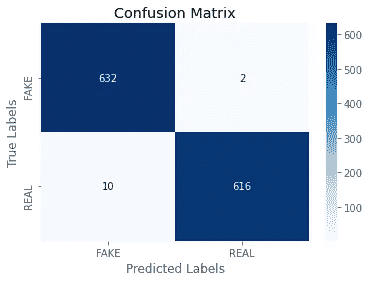
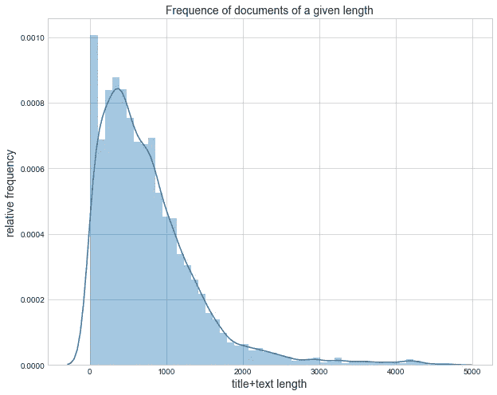
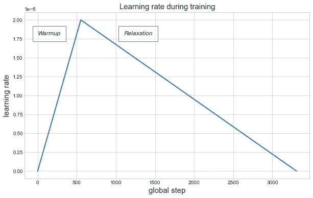

# 用 Python 实现高精度文本分类

> 原文：<https://towardsdatascience.com/fine-tuning-bert-and-roberta-for-high-accuracy-text-classification-in-pytorch-c9e63cf64646?source=collection_archive---------6----------------------->

## 如何微调 Huggingface 模型以获得 99%准确率的文本分类器。

布拉格的图书隧道，图片来自[pixabay.com](https://pixabay.com)

在撰写本文时，NLP 和 NLU 任务的最新结果是通过 Transformer 模型获得的。随着模型变得更深更大，有一种性能提高的趋势， [GPT 3](https://arxiv.org/abs/2005.14165) 浮现在脑海中。从头开始训练这种模型的小版本需要大量的时间，即使使用 GPU 也是如此。这个问题可以通过[预训练](https://openai.com/blog/language-unsupervised/)来解决，当使用高性能集群在大型文本语料库上训练模型时。稍后，它可以在更短的时间内针对特定任务进行微调。在微调阶段，可以为特定任务向模型添加附加层，这些任务可以不同于模型最初被训练的那些任务。这项技术与迁移学习有关，这是一个应用于 NLP 以外的机器学习领域的概念(快速介绍见[此处](https://machinelearningmastery.com/transfer-learning-for-deep-learning/)和[此处](https://www.datacamp.com/community/tutorials/transfer-learning?utm_source=adwords_ppc&utm_campaignid=898687156&utm_adgroupid=48947256715&utm_device=c&utm_keyword=&utm_matchtype=b&utm_network=g&utm_adpostion=&utm_creative=332602034349&utm_targetid=dsa-429603003980&utm_loc_interest_ms=&utm_loc_physical_ms=9071353&gclid=EAIaIQobChMIrpSllo2n6wIVgsEWBR1QXwx2EAAYASAAEgJ2ZfD_BwE))。

在这篇文章中，我想分享我微调[伯特](https://arxiv.org/abs/1810.04805)和[罗伯塔](https://arxiv.org/abs/1907.11692)的经历，这两个角色可以通过[拥抱脸](https://huggingface.co/)从变形金刚图书馆获得，用于一个文档分类任务。两种型号共享一个[变压器架构](http://nlp.seas.harvard.edu/2018/04/03/attention.html)，该架构至少由两个不同的模块组成——编码器和解码器。编码器和解码器都由基于[注意力](https://www.analyticsvidhya.com/blog/2019/11/comprehensive-guide-attention-mechanism-deep-learning/)机制的多层组成。编码器将输入的令牌序列处理成浮点数向量，这是一种隐藏状态，可以被解码器获取。隐藏状态包含了输入序列的信息内容。这使得能够用浮点数的单个密集向量来表示整个令牌序列。具有相似含义的两个文本或文档由紧密对齐的向量[表示。使用选择的度量来比较向量，例如](https://medium.com/wisio/a-gentle-introduction-to-doc2vec-db3e8c0cce5e)[余弦相似度](https://scikit-learn.org/stable/modules/generated/sklearn.metrics.pairwise.cosine_similarity.html)，使得能够量化原始文本片段的相似度。

**螺栓和螺母**

在研究这个话题时，我在 Kaggle 上找到了一篇关于[微调 BERT](/bert-text-classification-using-pytorch-723dfb8b6b5b) 以分类[假新闻数据集](https://www.kaggle.com/nopdev/real-and-fake-news-dataset)的文章。按原样运行文章中的代码得到的 F1 分数远低于声称的 96.99%。经过一个周末的阅读和添加一些东西，我已经设法在一个测试集上为罗伯塔模型挤出了 99.05%的 F1 分数，该测试集带有两个额外的线性层([代码](https://github.com/aramakus/ML-and-Data-Analysis/blob/master/RoBERTa%20for%20text%20classification.ipynb))。

首先，让我们简单看一下假新闻数据集。由正文超过 5 个字的 6299 条，假的 3128 条，真的 3171 条组成。下图显示了文本长度分布的直方图，以 5000 个标记裁剪。数据集中存在令牌计数高达 20000 的文档。

**批量大小和序列长度权衡**。BERT 和 RoBERTa 在其基本配置中都被限制为 512 个令牌序列。GPU 内存限制会进一步减少最大序列长度。用批量换取序列长度是可能的。在“语言模型是一次性学习者”[的论文](https://arxiv.org/pdf/2005.14165.pdf)中，作者提到了在训练后期更大批量的好处。随着微调在预训练结束时进行，较高的批量会产生更好的结果，并在一定程度上减少过度拟合。

训练批次中的序列可以有不同的长度。这需要将填充标记附加到每个序列，以使它们具有相同的长度。它可以使用专用的标记器来完成，由拥抱脸和相应的模型慷慨地提供:

Torchtext 库提供了几个易于使用的瑞士军刀迭代器。除此之外，它们能够将相似长度的序列分组并填充它们，将数据集分成训练集、验证集和测试集，必要时进行分层，在每个时期后进行洗牌。

**注意力面具进行批量训练。**填充的训练批次被传递给 RoBERTa，RoBERTa 输出一批隐藏状态向量，每个训练批次序列一个。填充索引不代表任何有用的信息。批处理中每个序列的结尾由一个特殊的字符串结束标记表示。事实上，一批大小为 1 的根本不需要任何填充。因此，填充索引应该从注意力权重计算中排除。这是借助于注意力屏蔽张量来实现的:

对于填充标记，掩码张量的值为 0(假)，对于所有其他标记，掩码张量的值为 1(真)。它通过逐元素乘法应用于关注层的键输入，这将填充标记的贡献减少到 0。如果批量进行验证和测试，也应在验证和测试期间应用注意屏蔽。

**预微调和学习率。**训练期间**RoBERTa 的输出是一批隐藏状态，传递给分类器层:**

**当上述模型被初始化时，RoBERTa 被分配预先训练的参数。因此，微调应以较小的学习速率进行，大约为 *1e-5* 。然而，分类器层被赋予其参数的随机未训练值。为此，我使用冻结的 RoBERTa 参数和更高的学习率 *1e-4* 运行了几个训练时期，同时只调整了分类器层参数。接下来，用同时更新的所有参数训练整个模型。**

****

**在训练的最后一步，一个线性学习率调度器，在每个训练步骤更新优化器学习率，证明是非常有益的。在前两个时期，优化器正在预热—学习率增加到其最大值 *2e-6* ，这使得模型能够探索局部参数空间。在随后的时代，学习率逐渐降低到零。**

## ****成绩汇总****

**Huggingface 库提供了现成的序列分类器。这些模型有一个以“ForSequenceClassification”结尾的名字，这是不言而喻的。它和上面的模型是一样的，但是有一个单一的线性层，前面有一个辍学。我用 BERT 和 RoBERTa 以及两个现成的模型“BertForSequenceClassification”和“RobertaForSequenceClassification”来训练我的模型。对于所有 BERT 模型，都使用了套管配置。下表显示了一组测试结果的简要总结。**

**训练集包含 70%的数据(4410 个项目)，10%的数据(629 个项目)在验证集中，20%的数据(1260 个项目)在测试集中。看起来罗伯塔的表现只好了一点点。然而，“ROBERTAClassifier”的错误率是测试样本的 1%,比“BERTClassifier”低 3 倍，后者的错误率几乎是 3%。**

**总之，通过微调最先进的模型，可以实现非常好的文本分类准确度，在本例中为 99%。对于后者，大声喊出来的是[拥抱脸团队](https://huggingface.co/)！**

## **进一步改进**

**事实上，所有型号都只能读取前 256 个令牌。套用一句古老的谚语，通过包括标题在内的前几百个标记来判断一条新闻可能不太准确。改善结果的一个显而易见的方法是让模型多读一些文本。克服文本大小限制的一种方法是将文本分割成长度易于管理的块。用 RoBERTa 对几个组块进行编码会产生一系列隐藏状态，这些隐藏状态包含了比单个第一组块更多的文本信息。为了将隐藏状态组合成单一向量，可以使用一系列技术，例如简单的平均或 RNN 单元。得到的聚合向量可以传递给后续层。这种模型有可能在新闻是真是假的问题上做出更明智的决定。**