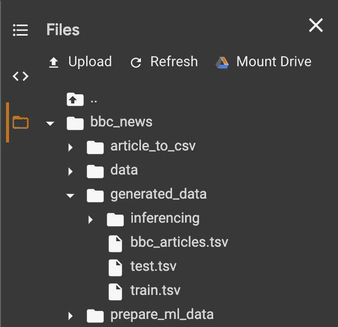

# 微调用于 FARM 文本分类的 BERT

> 原文：<https://towardsdatascience.com/fine-tuning-bert-for-text-classification-with-farm-2880665065e2?source=collection_archive---------22----------------------->

## 使用最先进的 NLP 模型进行简单快速的迁移学习


蒂莫西·埃伯利在 [Unsplash](https://unsplash.com?utm_source=medium&utm_medium=referral) 上的照片

去年秋天，当我在硕士论文的背景下努力微调预先训练的多语言 BERT 模型以进行论证挖掘(检测文本中的论证结构)时，我偶然发现了由 [Deepset.ai](https://medium.com/u/1cb8bc239339?source=post_page-----2880665065e2--------------------------------) 开发的开源框架[FARM](https://github.com/deepset-ai/FARM)(**F**framework for**A**adapting**R**presentation**M**models】。他们不仅提供了一个德国 BERT 模型，而且还提供了一个易于实现的框架，具有迁移学习的广泛特征。我不能说它拯救了我的论文，但至少拯救了我的神经和头发😅。

在这篇文章中，我提供了一个使用 D. Greene 和 P. Cunningham [1]在原始 BBC 新闻文章数据集上的框架对新闻文章体裁进行分类的指南。准备资料的过程可以在我上一篇[文章](/how-to-split-a-dataframe-into-train-and-test-set-with-python-eaa1630ca7b3)中找到。

首先，我将简要介绍迁移学习和 BERT。然后，我会给你提供指导，让你成为一个真正的农民👩‍🌾👨‍🌾。

# BERT 与迁移学习

一年前，Devlin、Chang、Lee 和 Toutanova 发表了 BERT(变压器的双向编码器表示法)[2]。这种创新的新模型在 11 个自然语言处理任务中取得了新的最先进的结果，如问题回答(SQuAD)或命名实体识别(NER)。

它结合了技术创新，如语言建模变压器的双向训练与各种不同任务的迁移学习能力。如果你有兴趣了解更多关于这个模型的信息，我强烈建议你阅读最初的[论文](https://arxiv.org/pdf/1810.04805.pdf)，因为我不会更详细地描述它。

将从一个问题学到的知识应用到一个新的不同的问题上代表了迁移学习的思想。如果我们仔细想想，人类的学习在很大程度上是基于这种学习方式。由于迁移学习，学习 Java 对我来说很容易，因为当我开始学习时，我已经理解了编程概念和 Python 语法。

然而，为了真正成功地解决新问题，对未知任务进行专门的微调是必要的。因此，我们将在下面的章节中发现如何使用预先训练好的 BERT 模型，并对其进行微调，以便根据新闻文章的文本对其体裁进行分类。

# 成为农民👩‍🌾👨‍🌾

在这个简短的主题介绍之后，让我们为这个领域做准备。

首先，我们可以看看农场的可能性。该框架不仅支持使用英语的 BERT 进行文本分类，还支持其他几个下游任务，包括多种语言的一些最新模型。


可用模型和支持的农场任务— [来源](https://github.com/deepset-ai/FARM#core-features)

所以，现在我们已经准备好去现场了。启动你首选的 IDE(我会在 Google Colab 中描述如何使用)，深呼吸，我们走吧。

## 设置

在 Colab 中键入并运行第一行之前，应该在笔记本设置(编辑>笔记本设置)中选择 GPU 作为硬件加速器。这将大大加快训练速度。

为了在 Google Colab 中使用 FARM，你必须安装它。有两种不同的方法可以做到这一点:

如果你想使用一个稳定的版本，那么在 [Github 库](https://github.com/deepset-ai/FARM/releases)的 release 标签下寻找最新的版本。目前，最新的版本是 0.4.3，我们正在使用以下命令安装 Google Colab:

```
!pip install farm==0.4.3
```

如果您想使用他们的前沿(尚未发布)特性，那么使用下面的命令安装它。但是请注意，这种方法不一定会安装一个稳定的版本，事情可能不会像预期的那样顺利。

```
!git clone https://github.com/deepset-ai/FARM.git
!pip install -r FARM/requirements.txt
!pip install FARM/
```

在将 FARM 安装到我们的环境中之后，我们还需要加载数据来训练我们的模型。通过克隆[我的 GitHub 库](https://github.com/guggio/bbc_news)，我们可以访问来自 Colab 的数据。

```
!git clone https://github.com/guggio/bbc_news
```

如果我们在 Colab UI 中打开左侧面板，我们现在可以看到 bbc_news 文件夹被添加到我们的文件中。为了进行微调，我们将使用 bbc_news 目录下 generated_data 文件夹中的训练和测试数据。



下一步，我们想要导入训练步骤所需的所有类和函数。

如果我们对实验更详细的分析感兴趣，我们可以在 FARM 的[公共 MLflow 服务器](https://public-mlflow.deepset.ai/#/)上跟踪培训。

因此，我们几乎准备好进入真正的编码部分。但是在开始之前，让我们初始化一些我们在这个过程中需要的环境变量。

我们设置一个种子值，使运行可重复(每次运行都进行相同的洗牌)，并获取正确的设备来加速训练过程。此外，我们确定训练时期的数量、批量大小和在开发集上评估我们的模型的频率。

## 数据处理

我记得我拼命地试图预处理我的数据以进行论证挖掘(按标记分类，类似于 NER)，但最终失败了，因为 BERT 的单词块标记化遵循了 HuggingFace 的传统方法。

幸运的是，由于 FARM 的数据处理结构，FARM 的预处理任务要方便得多。此外，这种基于块的结构使得该过程高度可定制。


基于块的农场数据处理— [来源](https://farm.deepset.ai/data_handling.html#building-blocks)

为了将输入(文件或请求)转换成 PyTorch 数据集，我们使用了处理器。

为了完成它的工作，处理器需要一个标记器，我们可以简单地根据我们想要的语言模型来加载它。因为我们正在处理包含大写和小写单词的英语文本，所以我们将使用基本的大小写 BERT 模型并将 do_lower_case 设置为 false。

初始化标记器后，我们创建处理器来处理数据。如前所述，我们可以根据需要定制数据处理流程的模块。

因此，我们可以简单地将所需的定制作为参数输入到处理器构造器中。对于我们的文本分类任务，我们使用 TextClassificationProcessor 类。对于不同的任务，我们显然会切换到相应的处理器类别。

一旦创建了处理器，我们就可以加载数据仓库了。

## 建模和培训

上面的概述显示了该框架在适用的语言模型和支持的任务方面的通用性。这种灵活性需要一种适应性模型，该模型具有易于更换的组件，以满足相应任务和模型的要求。


农场的适应模式— [来源](https://farm.deepset.ai/modeling.html)

自适应模型由我们想要微调的预训练语言模型和一个或多个预测头组成。预测头是放在模型上的最后一层，用于将模型的矢量表示转换为实际预测。

关于自适应模型的结构已经说得够多了，让我们来定义我们的模型并初始化优化器。

在我们开始训练我们的模型之前，还需要一个步骤。我们必须把一切都反馈给训练者，训练者管理训练过程，并在开发集上以定义的频率评估模型。

现在，是按下按钮的时候了。让培训开始:

```
trainer.train()
```

这将启动我们数据集的训练过程，需要 3-4 分钟。那么是时候收获我们播种的东西了🌽


培训结果

在两个时代之后，该模型在测试集上表现得非常好，总体宏观平均 F1 分数为 0.97。请注意，这些结果是在没有任何超参数调整的情况下获得的。

为了最大化我们模型的性能，我们可以使用不同的设置重新运行训练，例如不同的时期数、不同的批量大小、不同的退出率等。超参数优化的另一个选择是运行基于 json 配置文件的实验，我可能会在以后的文章中描述。

如果我们在开始时初始化 ML-logging，我们现在可以在 [MLflow 服务器](https://public-mlflow.deepset.ai/)上访问我们实验的进一步信息，例如训练损失的发展。


培训损失

## 保存和运行推理

在训练了我们的模型之后，我们肯定也想在不同的文本上尝试它。不幸的是，我们不能直接在训练好的模型上运行推理，因为自适应模型类不提供这样的功能。因此，我们必须保存它，以便用推理器加载它。

我们也可以从 Colab 中提取模型，并用下面的命令下载它。转到 Colab UI 的左侧面板，选择 zip 文件并下载它。

```
!zip -r saved_models/model.zip saved_models/bert-english-news-article
```

为了对样本文本进行推理，我们需要在字典列表中对它们进行格式化，其中“text”是键，实际的文章文本表示相应的值。

为了方便推理步骤，我准备了助手函数，并在我的[库](https://github.com/guggio/bbc_news/tree/master/generated_data/inferencing)中添加了两篇文章文本。一个额外的助手从结果中选择预测并返回一个数据帧。

让我们把准备好的文章分类！


推理的结果

# 结论

如果你做到了这一步，你会有一个美好的收获！🌽

如本文所述，FARM 迁移学习是一个简单直接的过程，提供了许多定制的可能性。因此，你可以考虑用[农场](https://github.com/deepset-ai/FARM)来解决下一个 NLP 问题。

我希望我的教程对你有帮助和价值！如果我的指南有什么不清楚的地方，请随时问我。你可以在这里查看我的源代码。

非常感谢你的阅读和快乐编码！

# 参考

1d .格林和 p .坎宁安。核心文档聚类中对角优势问题的实际解决方案。ICML 2006。

[2] Devlin，j .，Chang，m-w .，Lee，k .，& Toutanova，K. (2019 年)。BERT:用于语言理解的深度双向转换器的预训练。谷歌人工智能语言。[https://arxiv.org/pdf/1810.04805.pdf](https://arxiv.org/pdf/1810.04805.pdf)