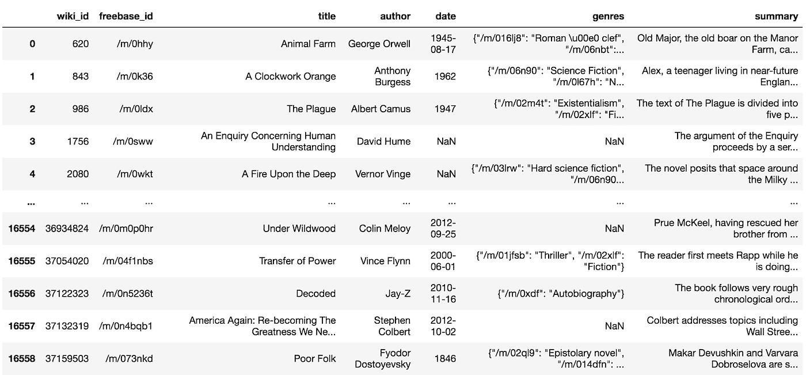
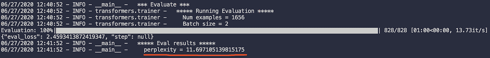

# 使用 Pytorch 微调用于文本生成的 GPT2

> 原文：<https://towardsdatascience.com/fine-tuning-gpt2-for-text-generation-using-pytorch-2ee61a4f1ba7?source=collection_archive---------5----------------------->

## 使用 Huggingface 库提供的 GPT2 生成任何故事


[亚历山大·奈特](https://unsplash.com/@agkdesign?utm_source=medium&utm_medium=referral)在 [Unsplash](https://unsplash.com?utm_source=medium&utm_medium=referral) 上拍照

# 介绍

在过去的几年里，NLP 的世界特别繁荣。这主要得益于 NLP 在现代十年最重要的突破之一——[**变形金刚**](https://papers.nips.cc/paper/7181-attention-is-all-you-need.pdf) 。如果你没有看过我之前关于 [**BERT 进行文本分类**](/bert-text-classification-using-pytorch-723dfb8b6b5b) 的文章，那就去看看吧！我们今天要说的另一款热门变压器是 [**GPT2**](https://cdn.openai.com/better-language-models/language_models_are_unsupervised_multitask_learners.pdf) 。GPT2 由 OpenAI 开发，是一个基于 transformer 的大规模语言模型，在一个大型文本语料库上进行预训练:800 万个高质量网页。它只使用预先训练的知识，而没有对它们进行明确的训练，从而在多种语言任务上产生竞争性的表现。GPT2 对于语言生成任务非常有用，因为它是一个自回归语言模型。

在今天的文章中，我们将深入探讨如何实现另一个流行的转换器 GPT2，以编写有趣和有创意的故事！具体来说，我们将使用 [CMU 图书摘要数据集](http://www.cs.cmu.edu/~dbamman/booksummaries.html)测试 GPT2 撰写有创意的图书摘要的能力。我们将使用 [Huggingface](https://huggingface.co/) 库来构建我们的模型并生成文本。

本文的**完整代码库**可以在[这里](https://github.com/itsuncheng/fine-tuning-GPT2)查看。

# 步骤 1:准备数据集

在构建模型之前，我们需要先下载并预处理数据集。

我们使用的是 CMU 图书摘要数据集，其中包含从维基百科中提取的 16，559 本图书，以及元数据，包括书名、作者、出版日期、流派和情节摘要。点击下载数据集[。以下是数据集的外观:](http://www.cs.cmu.edu/~dbamman/booksummaries.html)



作者图片

对于数据预处理，我们首先将整个数据集分成训练、验证和测试数据集，训练有效测试比率为 70–20–10。我们在每个摘要的开头添加了一个 bos 令牌<bos>，在每个摘要的结尾添加了一个 eos 令牌<eos>，以供以后培训使用。我们最终将摘要保存到。txt 文件，获取 train.txt，valid.txt，test.txt。</eos></bos>

你可以在这里获得预处理笔记本[。](https://github.com/itsuncheng/fine-tuning-GPT2/blob/master/preprocessing.ipynb)

# 步骤 2:下载库

为了构建和训练 GPT2，我们需要安装 Huggingface 库，以及它的存储库。

安装 Huggingface 库:

```
pip install transformers
```

克隆拥抱脸回购:

```
git clone github.com/huggingface/transformers
```

如果您想在训练期间看到模型和超参数的可视化效果，也可以选择安装 tensorboard 或 wandb:

```
pip install tensorboardpip install wandb; wandb login
```

# 第三步:微调 GPT2

在训练之前，我们应该按照之前在数据集中定义的那样设置 bos 令牌和 eos 令牌。

我们还应该设置 pad 令牌，因为我们将使用 *LineByLineDataset* ，它将把数据集中的每一行都视为不同的示例。在*transformers/example/language-modeling/run-language-modeling . py*中，我们应该在训练之前为模型追加以下代码:

```
special_tokens_dict = {'bos_token': '<BOS>', 'eos_token': '<EOS>', 'pad_token': '<PAD>'}num_added_toks = tokenizer.add_special_tokens(special_tokens_dict)model.resize_token_embeddings(len(tokenizer))
```

运行这段代码后，特殊的标记将被添加到标记器中，模型将调整其嵌入的大小，以适应修改后的标记器。

对于训练，我们首先定义一些参数，然后运行语言建模脚本:

```
cd transformers/example/language-modelingN=gpu_numOUTPUT_DIR=/path/to/modelTRAIN_FILE=/path/to/dataset/train.txtVALID_FILE=/path/to/dataset/valid.txtCUDA_VISIBLE_DEVICES=$N python run_language_modeling.py \--output_dir=$OUTPUT_DIR \--model_type=gpt2 \--model_name_or_path=gpt2 \--do_train \--train_data_file=$TRAIN_FILE \--do_eval \--eval_data_file=$VALID_FILE \--per_device_train_batch_size=2 \--per_device_eval_batch_size=2 \--line_by_line \--evaluate_during_training \--learning_rate 5e-5 \--num_train_epochs=5
```

由于 GPU 的限制，我们设置 per_device_train_batch_size=2，per_device_eval_batch_size=2。请随意使用适合您的 GPU 的批量大小。我们使用 line_by_line，它告诉我们的模型将数据集中的每一行都视为一个单独的示例，如前所述。Evaluate_during_training 在每个`logging_steps`之后对评估数据集进行评估，默认为 500。

如果您想从最后一个检查点继续训练，您可以运行:

```
CUDA_VISIBLE_DEVICES=$N python run_language_modeling.py \--output_dir=$OUTPUT_DIR \--model_type=gpt2 \--model_name_or_path=$OUTPUT_DIR \--do_train \--train_data_file=$TRAIN_FILE \--do_eval \--eval_data_file=$VALID_FILE \--per_device_train_batch_size=2 \--per_device_eval_batch_size=2 \--line_by_line \--evaluate_during_training \--learning_rate 5e-5 \--num_train_epochs=5 \--overwrite_output_dir
```

# (可选)步骤 4:评估测试数据集的困惑

这一步是可选的，取决于你是否想评估你训练过的 GPT2 的表现。您可以通过在测试数据集上评估困惑来做到这一点。

```
TEST_FILE=/path/to/dataset/test.txtCUDA_VISIBLE_DEVICES=$N python run_language_modeling.py \--output_dir=$OUTPUT_DIR \--model_type=gpt2 \--model_name_or_path=$OUTPUT_DIR \--do_eval \--eval_data_file=$TEST_FILE \--per_device_eval_batch_size=2 \--line_by_line
```

这里，在我的例子中，在训练 5 个时期后，我们获得了 2.46 的损失和 11.70 的困惑度:



作者图片

# 步骤 5:生成文本

在使用我们训练好的模型生成文本之前，我们首先通过在*transformers/examples/text-generation/run _ generation . py*中设置`add_special_tokens=True`来启用提示中的特殊标记:

```
encoded_prompt = tokenizer.encode(prompt_text, add_special_tokens=True, return_tensors=”pt”)
```

然后，我们准备生成一些文本！开始生成方式:

```
cd transformers/examples/text-generationK=k_for_top-k_sampling_decoderCUDA_VISIBLE_DEVICES=$N python run_generation.py \--model_type gpt2 \--model_name_or_path $OUTPUT_DIR \--length 300 \--prompt "<BOS>" \--stop_token "<EOS>" \--k $K \--num_return_sequences 5
```

我们输入提示“<bos>”作为输入，它代表每个例子的开始，一旦生成了“<eos>”标记，就停止模型的生成。这样，我们的 GPT2 将学习从头到尾生成一个完整的摘要示例，利用它在培训期间从 bos 令牌和 eos 令牌中学到的知识。此外，我们正在使用 top-k 采样解码器，该解码器已被证明在生成非竞争性和更好的文本方面非常有效。k=50 是一个很好的开始值。Huggingface 还支持其他解码方法，包括贪婪搜索、波束搜索和 top-p 采样解码器。有关更多信息，请查看`model.generate`的[文档串](https://huggingface.co/transformers/main_classes/model.html?highlight=generate#transformers.TFPreTrainedModel.generate)。</eos></bos>

下面是几个 k=50 的生成文本的例子。

> 主角是英国人威廉·拉克，他被英国政府派往北极执行任务，开始了一次冒险之旅。这部小说讲述了他的朋友和家人如何被卖到挪威小镇肖克当奴隶的故事…
> 
> 一个新的世界正在觉醒，沃尔塔星球的人类必须齐心协力拯救它免于毁灭。新地球现在居住着三个物种。第一个是年龄稍大的人类，第二个是沃尔塔人，第三个是有着深蓝色眼睛的人类…
> 
> 这部小说开始于 2143 年，一群“地牢”或女巫决定通过消耗死者的灵魂来打破阻止死者力量的咒语。他们用尸体来帮助垂死的人，也用尸体来复活死者…

你可以在这里看到更多生成的例子[。](https://github.com/itsuncheng/fine-tuning-GPT2/blob/master/generated_summaries.txt)

# 结论

在本文中，我们展示了如何实现最流行的 transformer 模型之一 GPT2 来创建有趣的文本。GPT2 的大规模预训练数据集和架构允许它产生连贯和流畅的写作片段。虽然 GPT2 的文本仍然可以与人类书写的文本区分开来，但这证明了机器的创造力只是从现在开始上升。想了解更多信息，你可以看看 GPT2 上的[官方论文](https://cdn.openai.com/better-language-models/language_models_are_unsupervised_multitask_learners.pdf)或者 OpenAI 的[博客](https://openai.com/blog/better-language-models/)。

本文只展示了如何生成由人工智能决定的文本。如果您想知道是否有可能控制正在生成的文本(这是可能的！)，看看我写的下面这篇文章😊。

[](/controlling-text-generation-from-language-models-6334935e80cf) [## 控制语言模型的文本生成

### 控制机器生成文本的样式和内容的实际操作方法

towardsdatascience.com](/controlling-text-generation-from-language-models-6334935e80cf) 

# 参考

[1] A .瓦斯瓦尼，n .沙泽尔，n .帕尔马等。，[注意力是你需要的全部](https://papers.nips.cc/paper/7181-attention-is-all-you-need.pdf) (2017)，第 31 届神经信息处理系统会议

[2] A .、j .吴、r .柴尔德等。，[语言模型是无监督的多任务学习器](https://cdn.openai.com/better-language-models/language_models_are_unsupervised_multitask_learners.pdf) (2019)，OpenAI