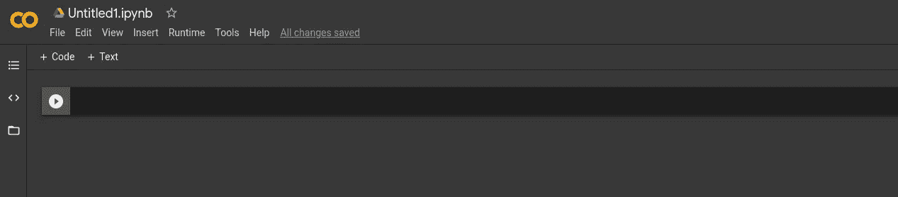
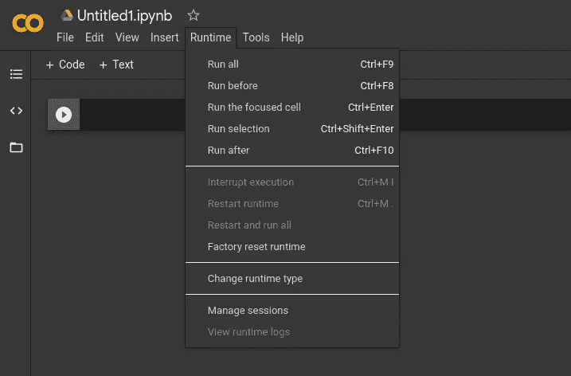
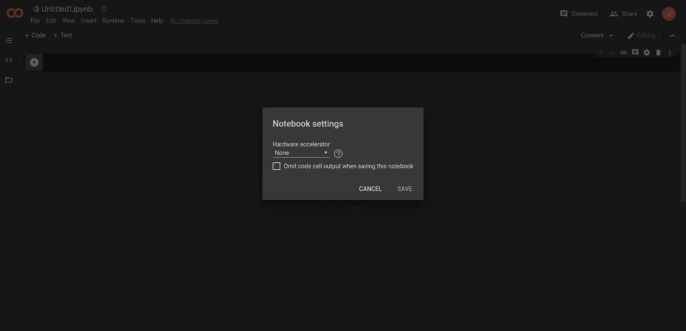
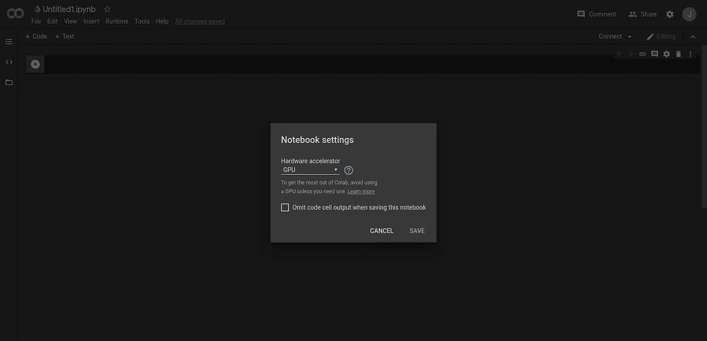
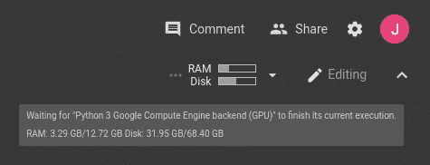
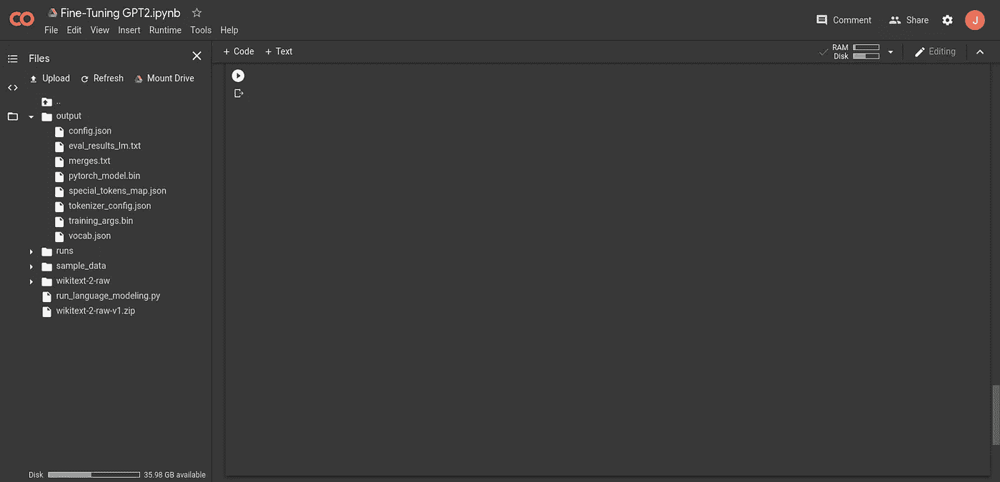
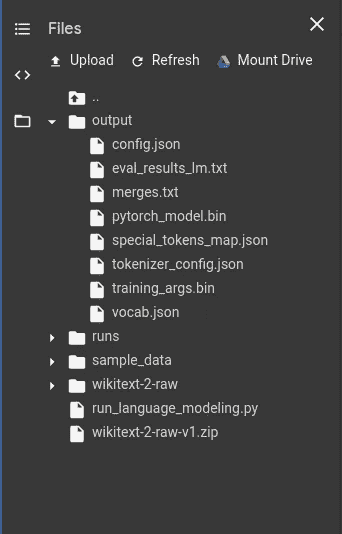
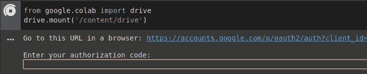
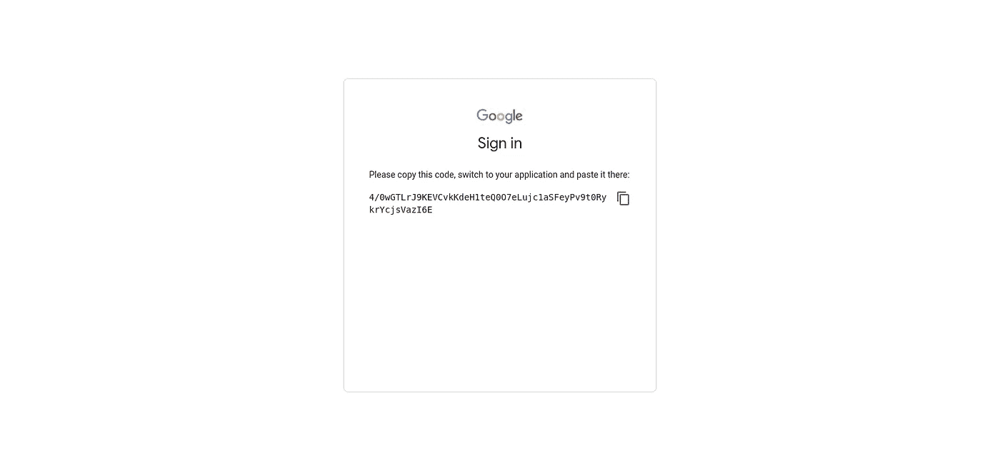
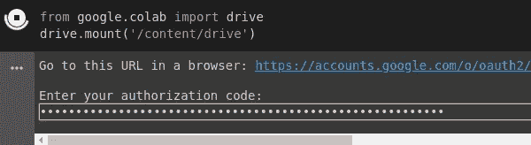

# 在 Colab GPU 上微调 GPT2 免费！

> 原文：<https://towardsdatascience.com/fine-tuning-gpt2-on-colab-gpu-for-free-340468c92ed?source=collection_archive---------24----------------------->

## 利用 Google Colab 的 GPU 来微调预训练的 GPT2


照片由[塞琳娜·纳多](https://unsplash.com/@celinen?utm_source=medium&utm_medium=referral)在 [Unsplash](https://unsplash.com?utm_source=medium&utm_medium=referral) 上拍摄

现在的模特都很大，我们大多数人都没有资源从头开始训练她们。幸运的是， [HuggingFace](http://huggingface.co) 已经慷慨地在 PyTorch 中提供了[预训练模型，并且](https://huggingface.co/transformers/pretrained_models.html) [Google Colab](https://colab.research.google.com/) 允许使用他们的 GPU(在固定时间内)。否则，即使在没有 NVIDIA GPU 的情况下，在我的本地计算机上微调数据集也会花费大量时间。虽然这里的教程是针对 GPT2 的，但这可以针对 HuggingFace 给出的任何预训练模型进行，也可以针对任何尺寸。

# 设置 Colab 使用 GPU…免费

转到 [Google Colab](https://colab.research.google.com/) 并创建一个新笔记本。它应该看起来像这样。



点击`Runtime` > `Change runtime type`设置使用 GPU



然后点击`Save`。

# 安装依赖项

我们通常会在 Bash 中运行`pip3 install transformers`，但是因为这是在 Colab 中，所以我们必须用`!`来运行它

```
!pip3 install transformers
```

# 获取 WikiText 数据

你可以在这里阅读更多关于 WikiText 数据的信息。总的来说，有 WikiText-2 和 WikiText-103。我们将使用 WikiText-2，因为它更小，而且我们在 GPU 上运行的时间以及在 Colab 中可以加载到内存中的数据量都有限制。要下载并运行，请在单元格中运行

```
%%bash
wget [https://s3.amazonaws.com/research.metamind.io/wikitext/wikitext-2-raw-v1.zip](https://s3.amazonaws.com/research.metamind.io/wikitext/wikitext-2-raw-v1.zip)
unzip wikitext-2-raw-v1.zip
```

# 微调 GPT2

HuggingFace 实际上提供了一个脚本来帮助微调模型[这里](https://github.com/huggingface/transformers/tree/master/examples/language-modeling)。我们可以通过运行以下命令来下载脚本

```
!wget https://raw.githubusercontent.com/huggingface/transformers/master/examples/language-modeling/run_language_modeling.py
```

现在我们准备微调。

脚本有很多参数，你可以通过[阅读手册](https://github.com/huggingface/transformers/tree/master/examples/language-modeling)来理解。我只是想复习一下基础训练中重要的内容。

*   `output_dir`是模型输出的位置
*   `model_type`就是你要用什么型号。在我们的例子中，它是`gpt2`。如果你有更多的内存和时间，你可以选择更大的`gpt2`尺寸，这些尺寸列在[抱脸预训练型号列表](https://huggingface.co/transformers/pretrained_models.html)中。
*   `model_name_or_path`是通往模型的道路。如果您想从头开始培训，可以留空。在我们的例子中，它也是`gpt2`
*   `do_train`告诉它要训练
*   `train_data_file`指向培训文件
*   `do_eval`告诉它事后评估。不总是必需的，但最好有
*   `eval_data_file`指向评估文件

一些你可能关心的额外的，但是你也可以跳过这个。

*   `save_steps`是何时保存检查点。如果您的内存有限，您可以将此设置为`-1`,这样它会跳过保存直到最后
*   `per_gpu_train_batch_size`是 GPU 的批量大小。如果你的 GPU 有足够的内存，你可以增加这个。为了安全起见，你可以从 1 开始，如果你还有内存的话，就增加它
*   `num_train_epochs`是要训练的历元数。由于我们正在微调，我将把它设置为`2`
*   如果`output_dir`中已经有内容，就使用`overwrite_output_dir`,您可以覆盖现有的模型

总而言之，要训练，在牢房里跑这个

```
%%bash
export TRAIN_FILE=wikitext-2-raw/wiki.train.raw
export TEST_FILE=wikitext-2-raw/wiki.test.raw
export MODEL_NAME=gpt2
export OUTPUT_DIR=outputpython run_language_modeling.py 
--output_dir=$OUTPUT_DIR \
--model_type=$MODEL_NAME \
--model_name_or_path=$MODEL_NAME \
--do_train \
--train_data_file=$TRAIN_FILE \
--do_eval \
--eval_data_file=$TEST_FILE \
--per_gpu_train_batch_size=1 \
--save_steps=-1 \
--num_train_epochs=2
```

请注意，如果您想要微调您刚刚训练的模型，您可以将`MODEL_NAME=gpt2`更改为`MODEL_NAME=output/`，这样它将加载我们刚刚训练的模型

## 花很长时间跑

当您运行这个程序时，如果花了一些时间没有任何输出，您可以将鼠标悬停在右上角的 RAM/Disk 上，看看发生了什么。



Colab GPU 的缺点是它是在 Colab 用户之间共享的。这意味着可能不会立即执行，因为另一个用户正在使用它。当这种情况发生时，它会说

```
Waiting for 'Python 3 Google Compute Engine backend (GPU(' to finish its current execution.
```

除了静观其变，实在没什么可做的。

# 结果

运行完模型后，您可以检查它是否存在于输出目录中。



要使用它，您可以运行类似

其中`= Toronto Raptors =`相当于把`Toronto Raptors`描述为文章标题。

我得到的结果(和你的会有所不同)是

```
 = Toronto Raptors = Toronto's first @-@ round draft pick in 2006 was selected by the Toronto Raptors with the seventh overall pick. He played in all 82 games, averaging 18 points per game and 6 assists. The Raptors won their third straight NBA championship in 2007, and won the 2009 NBA All @-@ Star Game. He played in a record 16 games for Toronto, averaging 19 points on 5 @.@ 6 rebounds and 6 assists in a season that saw Toronto win the Eastern Conference finals. He also played in the 2008 All @-@ Star Game and was named to the All @-@ Star Game MVP for the first time. He also was named to the All @-@ Star Game's all @-@ time career scoring list, and was the first player to accomplish the feat. He finished the season with an assist and an assist in eight games, and was the first player in NBA history to score in double figures. He was named to the All @-@ Star Game's All @-@ time scoring list in 2011, and was the first player to do this in consecutive seasons. = = Draft = = Toronto selected Jordan Matthews with the seventh overall pick in
```

在我的例子中，我只生成了前 250 个单词，这就是为什么它会被突然删除的原因。如果你想的话，你可以扩展它。请注意，对`Toronto Raptors`的描述完全是假的，因为[乔丹·马修斯](https://en.wikipedia.org/wiki/Jordan_Mathews)从未为猛龙队效力。文本一致性也可以更好，这可以通过使用更多的 epochs 进行调整，或者简单地使用更大的模型。然而，这需要更多的内存，所以要小心。

# 压缩/压缩模型

为了让我们保存这个模型，我们应该压缩它并保存在某个地方。这可以很容易地完成

```
! tar -czf gpt2-tuned.tar.gz output/
```

这会创建一个名为`gpt2-tuned.tar.gz`的文件

# 保存到 Google Drive

要将它从 Colab 保存到您的 Google Drive，首先您必须有一个 Google 帐户/Gmail 帐户。在你的牢房里，你可以跑

```
from google.colab import drive
drive.mount('/content/drive')
```

不需要安装任何额外的东西，因为`google.colab`图书馆附带使用谷歌 Colab。当您运行上述代码时，您应该会看到类似这样的内容



你必须点击链接，登录并允许你的 Google Drive 访问你的 Colab。最后，你会看到类似这样的东西



复制并粘贴到你的笔记本上。



现在，您可以通过运行以下命令将输出模型复制到您的 Google Drive 中

```
!cp gpt2-tuned.tar.gz /content/drive/My\ Drive/
```

# 结论

瞧啊。您已经成功地在 GPU 上调优了一个预训练模型，并将其保存在您的 Google Drive 中。而且你完全免费。

如果你对我们的工作有任何疑问或改进，请在评论中告诉我。

# 奖励:Colab 笔记本

您可以运行这个 Colab 笔记本来重现上面显示的所有内容