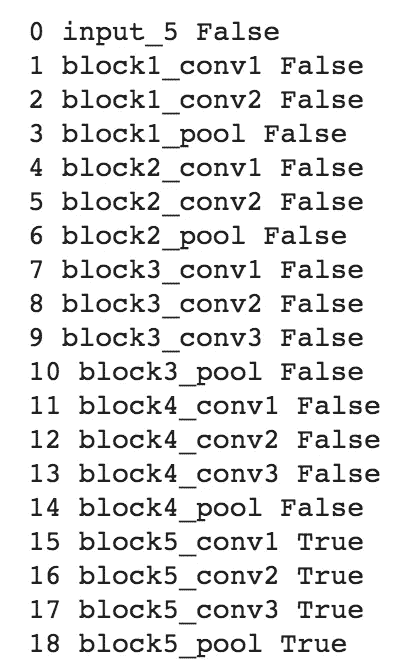
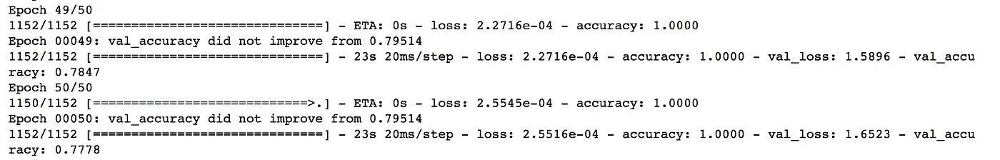
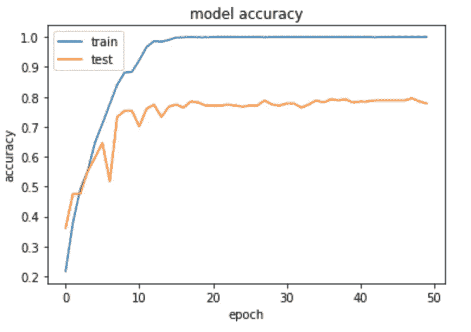
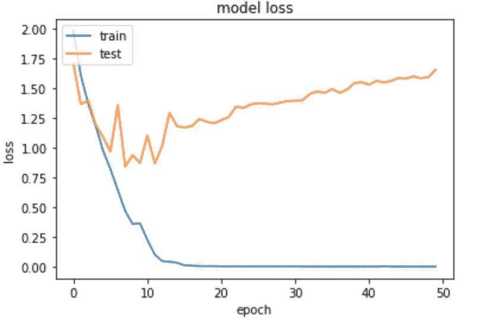
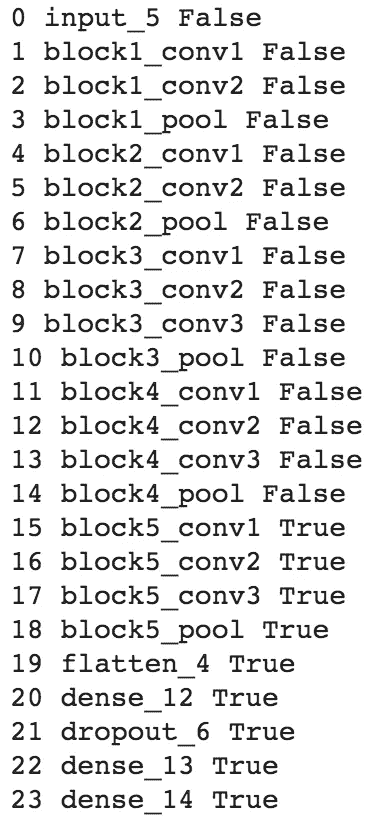
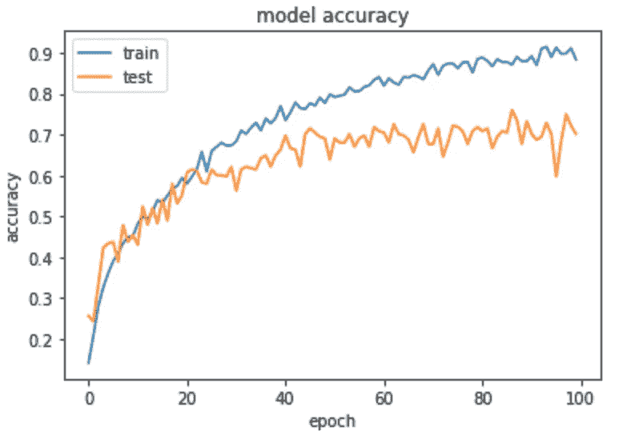
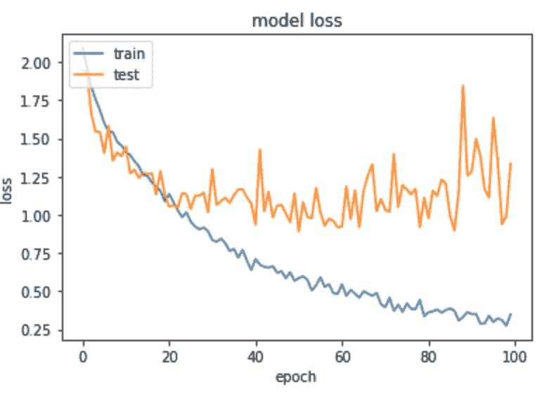

# 微调预训练模型 VGG-16

> 原文：<https://towardsdatascience.com/fine-tuning-pre-trained-model-vgg-16-1277268c537f?source=collection_archive---------5----------------------->

## *本文旨在展示如何在迁移学习中微调而不是使用预训练模型作为特征提取器，并在 RAVDESS 音频数据集上比较结果。*


由[凯文·Ku](https://unsplash.com/@ikukevk)在 [Unsplash](https://unsplash.com/) 上拍摄的照片

在我的[上一篇文章](https://medium.com/r?url=https%3A%2F%2Ftowardsdatascience.com%2Ftransfer-learning-in-speech-emotion-recognition-d55b6616ba83)中，我探索了使用预训练模型 VGG-16 作为在 RAVDESS 音频数据集上进行迁移学习的特征提取器。作为数据科学的新手，我通读了 Medium 上的文章，并看到了佩德罗·马塞利诺写的这篇便利的文章，其中他描述了迁移学习的过程，但最有见地的是人们可以微调他们选择的预训练模型的三种策略。佩德罗马塞利诺还提供了一个有用的大小相似性矩阵，以帮助确定使用哪种策略。在阅读了他的文章后，我开始意识到，与其使用预训练的模型作为特征提取器，我应该通过训练一些层并保持其他层冻结来微调模型，因为我的数据集很小(1440 个文件)，并且与 VGG-16 模型数据集不相似。在这里，我将探索这种对 RAVDESS 音频数据集上的 VGG-16 预训练模型的微调，并确定其对模型准确性的影响。

在导入了必要的库、我们的训练/测试集，并预处理了数据(在这里描述为)之后，我们开始建模:

1.  首先，导入 VGG16 并传递必要的参数:

```
from keras.applications import VGG16vgg_model = VGG16(weights='imagenet', include_top=False, input_shape=(224, 224, 3))
```

2.接下来，我们设置一些层冻结，我决定解冻最后一块，使他们的权重在每个时期得到更新

```
# Freeze four convolution blocks
for layer in vgg_model.layers[:15]:
    layer.trainable = False# Make sure you have frozen the correct layers
for i, layer in enumerate(vgg_model.layers):
    print(i, layer.name, layer.trainable)
```



作者图片

很好，所以我们将在预训练的 VGG-16 模型的最后四层训练我们的数据集。

3)我使用与我之前的 VGG-16 模型相同的模型架构作为特征提取器:

```
x = vgg_model.output
x = Flatten()(x) # Flatten dimensions to for use in FC layers
x = Dense(512, activation='relu')(x)
x = Dropout(0.5)(x) # Dropout layer to reduce overfitting
x = Dense(256, activation='relu')(x)
x = Dense(8, activation='softmax')(x) # Softmax for multiclass
transfer_model = Model(inputs=vgg_model.input, outputs=x)
```

4)我们来设置一些回调，比如 ReduceLROnPlateau 和 ModelCheckpoint。ReduceLROnPlateau 特别有助于微调我们的模型，因为正如佩德罗·马塞利诺所描述的，高学习率会增加丢失先前知识的风险，所以最好设置一个低学习率，有了 ReduceLROnPlateau，这可以帮助我们解决这个问题！ModelCheckpoint 总是有用的，因为它允许我们定义在哪里检查模型权重。

```
from keras.callbacks import ReduceLROnPlateaulr_reduce = ReduceLROnPlateau(monitor='val_accuracy', factor=0.6, patience=8, verbose=1, mode='max', min_lr=5e-5)checkpoint = ModelCheckpoint('vgg16_finetune.h15', monitor= 'val_accuracy', mode= 'max', save_best_only = True, verbose= 1)
```

4)接下来，我们编译并拟合我们的模型

```
from tensorflow.keras import layers, models, Model, optimizerslearning_rate= 5e-5transfer_model.compile(loss="categorical_crossentropy", optimizer=optimizers.Adam(lr=learning_rate), metrics=["accuracy"])history = transfer_model.fit(X_train, y_train, batch_size = 1, epochs=50, validation_data=(X_test,y_test), callbacks=[lr_reduce,checkpoint])
```



作者图片



作者图片

正如我们所看到的，该模型在很大程度上过度拟合了训练数据。经过 50 个时期后，我们的模型达到了 **78%** 的准确度，这比我们之前的分类器**高 9%**，在我们之前的分类器中，我们使用预训练的 VGG-16 模型作为特征提取器，但与我们预训练的 VGG-16 模型一样，使用图像增强作为特征提取器。

现在让我们尝试用图像增强来微调 VGG-16 模型，看看这是否会提高模型精度。使用我们之前模型的 **transfer_model** 变量中存储的相同的 VGG-16 模型对象，并解冻第五个卷积块，同时保持前四个块冻结。

```
for layer in vgg_model.layers[:15]:
layer.trainable = Falsex = vgg_model.output
x = Flatten()(x) # Flatten dimensions to for use in FC layers
x = Dense(512, activation='relu')(x)
x = Dropout(0.5)(x) # Dropout layer to reduce overfitting
x = Dense(256, activation='relu')(x)
x = Dense(8, activation='softmax')(x) # Softmax for multiclass
transfer_model = Model(inputs=vgg_model.input, outputs=x)for i, layer in enumerate(transfer_model.layers):
print(i, layer.name, layer.trainable)
```



作者图片

很好，现在第五个卷积块是可训练的，我们已经添加了自己的分类器。现在，我们将使用 Keras 的图像预处理模块的 **ImageDataGenerator** 来增强我们的图像，使其适合我们的训练集，编译模型，然后拟合模型。

```
#Augment images
train_datagen = ImageDataGenerator(zoom_range=0.2, rotation_range=30, width_shift_range=0.2, height_shift_range=0.2, shear_range=0.2)#Fit augmentation to training images
train_generator = train_datagen.flow(X_train,y_train,batch_size=1)#Compile model
transfer_model.compile(loss="categorical_crossentropy", optimizer='adam', metrics=["accuracy"])#Fit model
history = transfer_model.fit_generator(train_generator, validation_data=(X_test,y_test), epochs=100, shuffle=True, callbacks=[lr_reduce],verbose=1)
```

在 100 个时期之后，我们获得了 **70%** 的准确度分数，这比我们之前的模型降低了 **8%** ，并且作为特征提取器与我们的 VGG-16 模型表现相同(*在此插入巨大的悲伤面孔*)。



作者图片

可以清楚地看到，该模型过度拟合于训练数据，并且在大约 40 个时期之后，准确度似乎达到平稳状态。通过微调，与使用预训练模型作为特征提取器相比，我没有看到模型准确性有多大提高，这是我没有预料到的，因为与 VGG-16 模型相比，我使用的数据集不同且更小。

我已尝试调整 **ImageDataGenerator** 类的参数，但未能提高模型精度。如果有人对我的 VGG-19 模型有任何建议，请告诉我！感谢您的阅读:)