# 使用粒子群优化算法微调算法策略

> 原文：<https://towardsdatascience.com/fine-tuning-the-strategy-using-a-particle-swarm-optimization-a5a2dc9bd5f1?source=collection_archive---------15----------------------->

## 如果组合的数量非常巨大，如何定义交易策略的次优参数。

今天我们讨论一种技术，它允许在有限的时间内搜索一组好的参数，我们也将考虑一种交易策略作为奖励。好好读！

## 目录

1.  **粒子群算法简介**
2.  **交易策略算法**
3.  **让我们编码吧！**
4.  **实验**
5.  **进一步改进**
6.  **总结**


# 粒子群优化算法简介

我们任务优化的主要目标是定义交易策略**的次优参数，使目标函数**最大化或最小化(通常使用最小化)。

目标函数可以很简单，比如我们应该最大化的算法的回报或者我们应该最小化的下降。在这个实验中，我们使用了一个更复杂的函数来尝试组合几个因子。我将在下一部分描述这个函数。

许多研究者在他们的著作中描述了 PSO 方法。我的任务是在一个地方收集该方法背后的主要算法方案和原理。此外，我还提供了链接来获取更多信息，并根据您的兴趣进行深入研究。

> [来自维基百科:](https://en.wikipedia.org/wiki/Particle_swarm_optimization)
> 
> 在计算科学中，粒子群优化(PSO)是一种计算方法，通过迭代地尝试改进关于给定质量度量的候选解决方案来优化问题。它通过拥有一群候选解(这里称为粒子)并根据粒子位置和速度的简单数学公式在搜索空间中移动这些粒子来解决问题。每个粒子的运动受其局部最佳已知位置的影响，但也被导向搜索空间中的最佳已知位置，当其他粒子找到更好的位置时，这些位置被更新。这有望将群体推向最佳解决方案。
> 
> PSO 是一种元启发式算法，因为它对被优化的问题几乎不做任何假设，并且可以搜索非常大的候选解空间。然而，像 PSO 这样的元启发式算法并不能保证找到最优解。此外，PSO 不使用被优化问题的梯度，这意味着 PSO 不要求优化问题是可微的，如梯度下降和拟牛顿法等经典优化方法所要求的。

听起来很棒，我们可以使用不可微的目标函数。这是一个非常方便的点，因为我们的功能通常是复杂的，由不同的部分组成。此外，该算法可以在没有假设的情况下在大空间中工作。该算法的方案如下所示

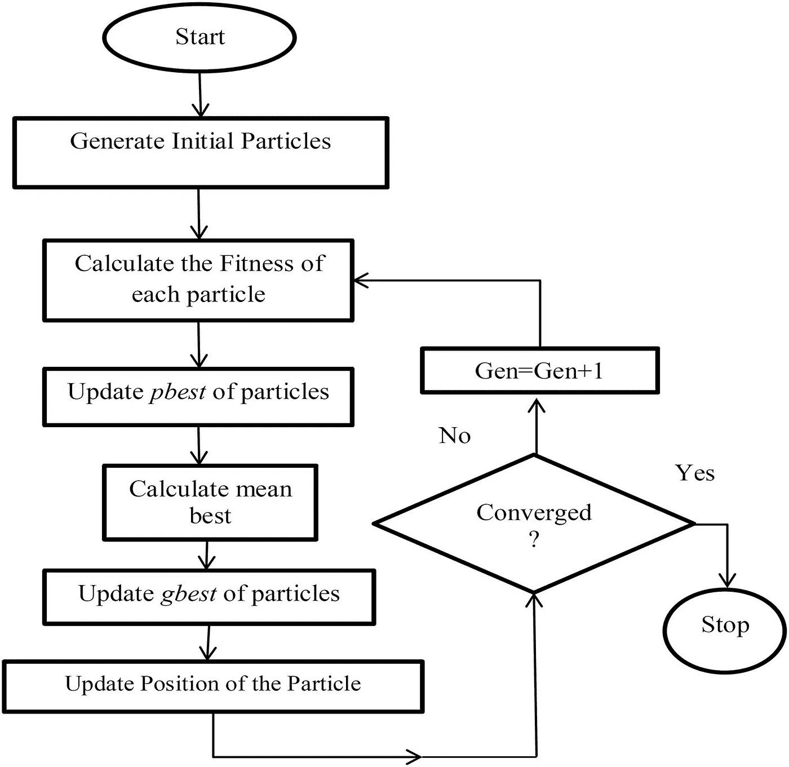

PSO 算法方案(来自[篇](http://www.scielo.br/scielo.php?script=sci_arttext&pid=S2179-10742017000300602)

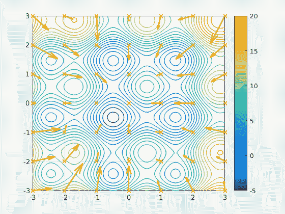

粒子群动画(来自[维基百科](https://en.wikipedia.org/wiki/Particle_swarm_optimization))

你可以在这个来源[文章](http://www.scielo.br/scielo.php?script=sci_arttext&pid=S2179-10742017000300602)中得到数学描述。该算法是一步一步尝试收敛的迭代，此图显示了该过程的动画。

一般接下来是独立于一门编程语言的具有基本操作的伪代码。

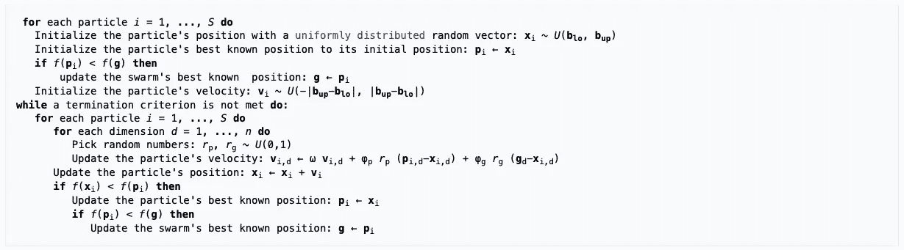

算法的伪代码(来自[文章](http://www.scielo.br/scielo.php?script=sci_arttext&pid=S2179-10742017000300602)

由 [Tarlan Ahadli](https://medium.com/u/49d8eab979a6?source=post_page-----a5a2dc9bd5f1--------------------------------) 亲自动手实现的算法的好解释你可以在这里找到[。另外，你可以看这个很棒的视频](/nature-inspired-optimization-algorithms-particle-swarm-optimization-2cd207d0d37e)

如果你想深入了解这种方法的不同修改，我会推荐[这个](http://downloads.hindawi.com/journals/mpe/2019/9367093.pdf)、[这个](https://www.frontiersin.org/articles/10.3389/fchem.2019.00485/full)和[这个](http://downloads.hindawi.com/journals/jcse/2019/7478498.pdf)。

# 交易策略算法

**策略的主要思想**是试图抓住价格在反向突破趋势的时刻。之后我们开仓，努力赚钱。

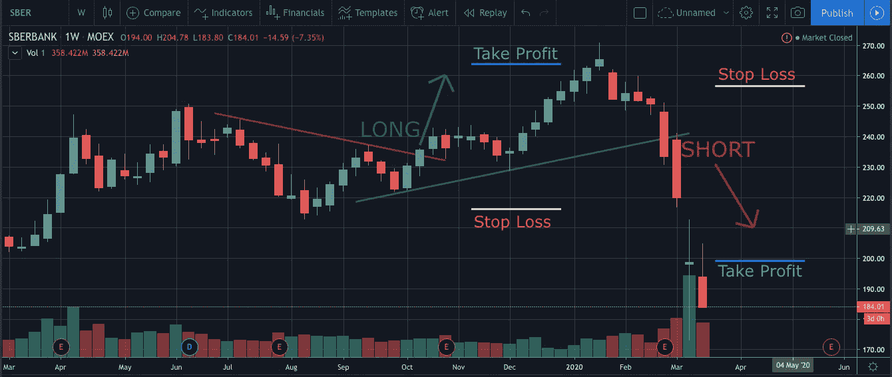

趋势线基于**两个支点**。对于上升趋势线(绿色下线)，下一个下降支点比前一个高**，下一个上升支点比前一个低**(红色上线)。****

****一个向下的支点是棒线的最低价，最低价格在几个棒线的周围(每边至少 2 个棒线)，一个**向上的支点有一个反转逻辑**。****

******当价格与下跌趋势线相交并且收盘高于这条线时，进入多头仓位**。**空头头寸的反转逻辑**。****

******头寸**的退出点是止盈(绿标)或止损(红标)。在这种情况下，固定水平用于 TP 和 SL。**退出**的替代事件以反转模式发生。****

# ****我们来编码吧！****

****在我们得到策略的描述之后，我们可以开始写代码了。使用回溯测试系统 [Backtrader](https://www.backtrader.com) 。这是一个开源的功能丰富的框架，用于回溯测试和交易。是的，用 Python。****

****这个项目我分成 5 个文件，其中 4 个文件组成一个类，一个文件是包含主要实验并运行其他实验的脚本。****

******main.py** 的代码包含了这里实验的逻辑。****

****该脚本包含三个重要部分:目标函数定义，在训练数据集上运行 PSO，以及在几个数据集(训练、测试、完整)上运行具有最佳参数的策略。由于使用了 PSO 库 [pyswarm](https://pythonhosted.org/pyswarm/) 。****

****在这个脚本中，我们创建了 *BacktestTrendBreakerPL* 类的对象。这个类负责数据读取、运行策略、计算指标和可视化结果。**backtesttrendbreakerpl . py**类的代码是****

****我们从主脚本传递过来的 *output_settings* 对象负责冗长性。****

****有趣的部分是*stability _ of _ time series*函数。该函数是研究的核心，直接影响优化过程。**主要目标是**利用传递的一组参数对交易策略进行质量评估。在数学上，它确定为累积对数收益的线性拟合的 R 平方。函数的符号取决于收益率。当该值接近 1.0 时，这意味着很好的结果，线随着小的下降而增长，当该值接近-1.0 时，结果不好。****

****该脚本包含来自 **DataFeedFormat.py** 的 *FinamHLOC* 类，其中放置了源文件的数据结构代码。****

****下一件有趣的事情是来自**TrendBreakerPL strategy . py**的 *TrendBreakerPL* 类的一个对象。****

****该类的主要功能是职位管理。第一种是信号出现时进场。第二种是当价格达到止盈或止损，或反转形态出现时平仓。****

****附加功能是打印订单状态。****

****该脚本使用基于指示器数据的信号，该指示器数据在**PivotPointLine indicator . py**中的 *PivotPointLine* 类中定义。基本功能是计算枢轴点、趋势线和收盘价相交时的信号，并根据方向关闭上/下趋势线。****

****我认为这段代码不是最佳的，它在回溯测试的一般流程中花费了很多时间。****

****当我开发这个解决方案时，我遇到了我用于可视化和一些度量的最新版本的 [Pyfolio](https://github.com/quantopian/pyfolio) 库的问题。我修改了几行代码，在这里是如何建议的。****

****另外，我像这样修改了 Pyfolio 的 **plotting.py** 中的几行代码，因为我需要一个 *DataFrame* 对象****

# ****实验****

****实验是在 [Sberbank](https://www.sberbank.ru/ru/person) 数据上进行的。Sberbank 是俄罗斯、东欧和中欧最大的银行。****

****我从 [Finam](https://www.finam.ru/profile/moex-akcii/sberbank/export/) 下载了每小时的数据。期限从 2014 年 1 月 6 日至 2020 年 2 月 21 日。然后这个时期被划分为****

> ******列车**期间(2014 年 1 月 6 日—2017 年 12 月 29 日)；****
> 
> ******测试**周期(2018 年 1 月 3 日—2020 年 2 月 21 日)。****

******该组优化参数包括:******

```
****pivot_window_len** - window length (the number of bars) by each side for determing the pivot point. Range is [2, 120];**history_bars_as_multiple_pwl** - history window length as a multiplication factor for pivot_window_len. Range is [10, 100];**fixed_tp** - value for the fixed level of take profit. Range is [0.01, 0.2];**fixed_sl_as_multiple_tp** - value for the fixed level of stop loss as a multiplication factor for fixed_tp. Range is [0.1, 1.5].*I used a multiplication factor instead of a simple value because it is easier to control and logically suitable in an optimization process. E.g., take profit and stop loss will be closer to each other.***
```

****该实验在 *40 次迭代*时启动，其中*的群体规模为 20* 。群优化的其他参数是默认的( *omega=0.5，phip=0.5，phig=0.5* )。列车数据的最佳参数集是:****

```
****pivot_window_len** = 9**history_bars_as_multiple_pwl** = 49**fixed_tp** = 0.06034064 (6.034%)**fixed_sl_as_multiple_tp** = 0.14778282\. It  means stop loss is 0.892%As a result the objective function is -0.9712, then stability is 0.9712\. This is very good result because it's very close to 1.0.**
```

****让我们看看我们实验的资本曲线****

****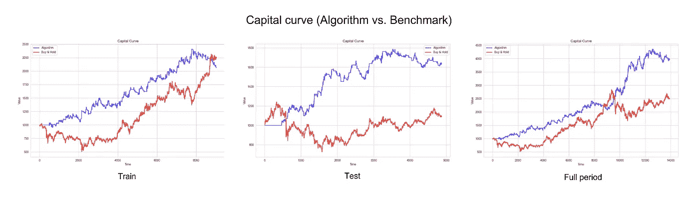****

****看起来相当不错。在训练阶段，我们有相同的回报水平，但下降幅度更低，曲线**更稳定**。测试期间的 algo 曲线展示了**强劲的正动态**，远好于基准(买入&持有)。最终曲线**强于基准曲线**。该算法的指标是****

```
****Train:** Return: 106.45%
Stability: 0.971
Maximum Drawdown: 14.37%**Test:** Return: 63.17%
Stability: 0.7934
Maximum Drawdown: 11.58%**Full Period:** Return: 296.3%
Stability: 0.9738
Maximum Drawdown: 14.37%**
```

****下一张图更有效地展示了下降周期****

****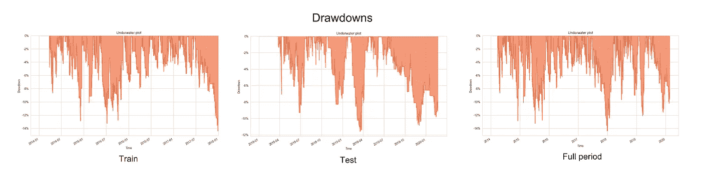****

****好处是在训练和测试期间**水位下降稳定**。甚至在测试期更低。让我们来看看前 5 名的提款****

****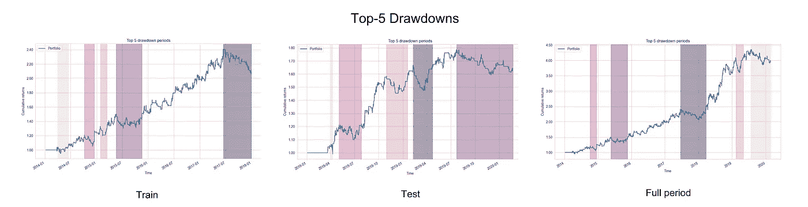****

```
****Train:
**  Net drawdown in %  Peak date Valley date Recovery date Duration
1            14.365 2017-06-15  2017-12-27           NaT      NaN
2           13.2355 2015-05-20  2015-07-07    2015-11-17      130
3           12.8431 2014-10-06  2014-12-02    2014-12-16       51
4           10.1103 2015-01-27  2015-02-12    2015-03-16       35
5            8.6618 2014-04-01  2014-04-22    2014-06-16       55**Test:**
  Net drawdown in %  Peak date Valley date Recovery date Duration
1           11.5807 2019-02-08  2019-03-18    2019-04-23       52
2           10.8415 2019-07-23  2019-12-02           NaT      NaN
3           9.28844 2018-05-03  2018-06-25    2018-07-27       62
4           8.26704 2018-10-30  2018-12-03    2019-01-18       59
5           7.07621 2018-04-03  2018-04-09    2018-04-09        5**Full Period:
**  Net drawdown in %  Peak date Valley date Recovery date Duration
1            14.365 2017-06-15  2017-12-27    2018-03-21      200
2           13.2355 2015-05-20  2015-07-07    2015-11-17      130
3           12.8431 2014-10-06  2014-12-02    2014-12-16       51
4           12.1112 2019-02-08  2019-03-18    2019-05-03       60
5           11.5791 2019-07-23  2019-12-02           NaT      NaN**
```

****如我们所见，最高下降发生在列车运行期间。****

****下图展示了每小时的回报。总的来说，离群值的数量很少。****

****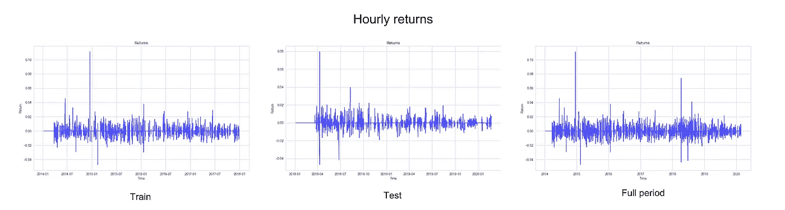****

****让我们来看看不同时间框架下的收益分位数图****

****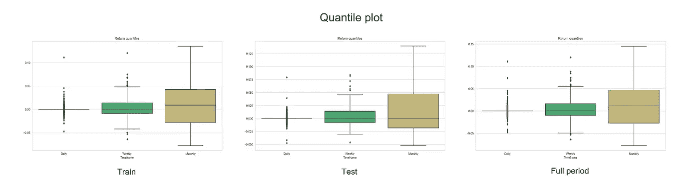****

******的形状与**相似，这是一个很好的迹象。接下来是月收益分布，均值**远高于 0.0** ，负收益**被压缩，没有异常值**。****

****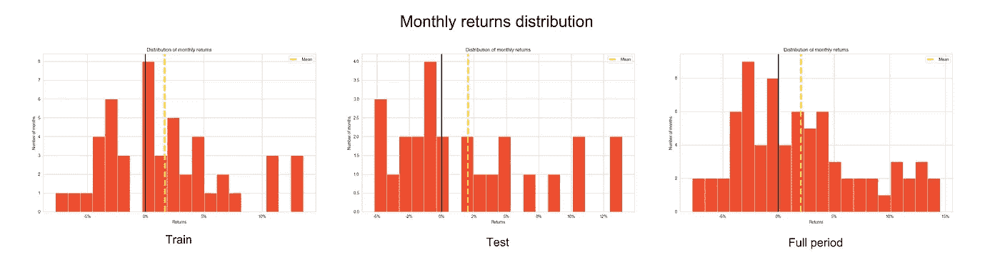****

****实验的最终总结是，PSO 允许在有限的时间内获得**相当好的质量，次优参数**在具有相同盈利水平和下降水平的样本外数据集**上工作。******

# **进一步的改进**

**我建议研究接下来的时刻**以获得更好的结果**:**

1.  **尝试 PSO 参数。还有，你可以试着用[另一种](/bayesian-optimization-in-trading-77202ffed530?source=---------4------------------)方法代替 PSO 进行优化，然后你们可以互相比较。**
2.  **基于波动性的止盈止损。**
3.  **跟踪止损，而不是止盈止损。**
4.  **在一个职位上的有限时间。**
5.  **任何模式触发平仓(例如，持仓时与趋势线相交)。**
6.  **不同的时间范围(例如 15 分钟或 1 天)。**
7.  **应用[前进分析](https://en.wikipedia.org/wiki/Walk_forward_optimization)研究结果的稳定性和鲁棒性。**

**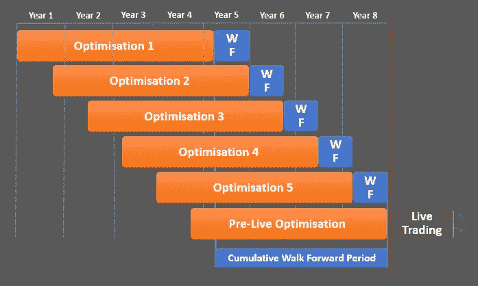**

**步行前进过程(来自[篇](https://www.tradelikeamachine.com/blog/over-optimization/part-3-in-sample-out-of-sample-trading-system-backtesting)**

**8.基于几个不相关的资产创建一个投资组合。**

**9.添加压力测试机制，用于策略稳健性验证。**

**10.添加更多的度量标准，如 [alpha、beta](https://medium.com/@sermal/how-to-develop-a-stock-market-analytical-tool-using-shiny-and-r-c2385e0d2f89?source=---------8------------------) 、 [Sortino ratio](/could-a-random-portfolio-management-be-applicable-to-investing-ba2d526c83ff) 等等。**

****这些改进**需要大量的计算，你应该考虑:**

1.  **重构**pivotpointline indicator . py**，因为这是一个非常慢的实现，或者为特定的时间框架和参数准备指标的预计算缓存。**
2.  **在可能的地方尽量用 GPU。**
3.  **在投资组合生成中使用多重处理模式。**
4.  **检查 PSO 方法的其他实现。[有些](https://pypi.org/project/fastPSO/)库可以在 GPU 和 CPU 多处理模式下进行计算。**

# **摘要**

1.  **描述了粒子群优化方法的快速介绍及其在算法交易中的应用。**
2.  **形式化了交易策略的模式和逻辑。**
3.  **演示了代码和描述，你可以在 [GitHub](https://github.com/lamres/TrendBreakerPL_PSO_backtrader) 上获得。另外，注意 *packages_env_list.txt* 来安装正确版本的软件包。**
4.  **训练和测试方法，并评估实验。**
5.  **建议进一步改进。**

**在这种情况下，建议的方法为这种策略提供了**良好的性能和适度的消耗**。**

**所有的步骤和实验都是可重复的，你可以得到代码和数据。作为数据源，你可以免费试用这个由 [Antoine Vulcain](https://medium.com/u/814af4da38ae?source=post_page-----a5a2dc9bd5f1--------------------------------) 提供的[服务](https://financialmodelingprep.com/developer/docs/#Stock-Historical-Price)。**

**投资愉快！**

**最诚挚的问候，**

**谢尔盖**

*****来自《走向数据科学》编辑的提示:*** *虽然我们允许独立作者根据我们的* [*规则和指导方针*](/questions-96667b06af5) *发表文章，但我们并不认可每个作者的贡献。你不应该在没有寻求专业建议的情况下依赖一个作者的作品。详见我们的* [*读者术语*](/readers-terms-b5d780a700a4) *。***