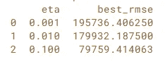

# 微调 XGBoost 模型

> 原文：<https://towardsdatascience.com/fine-tuning-xgboost-model-257868cf4187?source=collection_archive---------12----------------------->

## 让你的模型更好的基本要素

调整模型是增强模型性能的方法。让我们看一个例子，在这个例子中，根据 RMSE 分数，对未调优的 XGBoost 模型和调优的 XGBoost 模型进行了比较。稍后，您将了解 XGBoost 中对超参数的描述。

以下是 XGBoost 模型中未调整参数的代码示例:

**输出:34624.229980**

现在让我们看看当参数调整到一定程度时 RMSE 的值:

**产量:29812.683594**

可以看出，当调整参数时，RMSE 分数降低了大约 15%。

# XGBoost 超参数

对于 XGBoost 的每个基础学习者，都有不同的参数可以调整，以提高模型性能。

## 通用树可调参数

*   **学习率:**使用额外的基本学习器会影响模型拟合残差的速度。低学习率将需要更多的提升回合来实现与具有高学习率的 XGBoost 模型相同的残差减少。它用 eta 表示。
*   **gamma:** 这是创建新树分裂的最小损失减少。为了使算法更加保守，最好使用高 gamma 值。
*   **lambda:** 这负责对叶权重进行 L2 正则化。
*   **alpha:** 这负责叶子权重的 L1 正则化。
*   **max_depth:** 它是一个正整数值，决定了每棵树在任何一轮提升中的生长深度。
*   **子样本:**范围从 0 到 1，是可用于任何给定增强回合的总训练集的分数。该参数的低值可能导致不匹配问题，而高值可能导致过度匹配。
*   **colsample_bytree:** 该参数的取值范围也是从 0 到 1。它是在任何给定的提升回合期间可以选择的特征的一部分。

## 线性可调参数

*   **lambda:** 这负责对叶权重进行 L2 正则化。
*   **阿尔法:**这负责对叶权重进行 L1 正则化。
*   **lambda_bias:** 可以应用于模型偏差的 L2 正则化项。

以下是一些调整示例:

## **调谐 ETA**

**输出:**

**可以看出，eta 值的增加给出了更好的模型。**

**调整最大深度**

**输出:**

**可以看出，增加树深度的值给出了更好的模型。**

只有当超参数的值是最优的时，模型才会给出更好的性能。所以，问题是如何找到最优值以获得尽可能低的损失？

艾米丽·莫特在 [Unsplash](https://unsplash.com?utm_source=medium&utm_medium=referral) 上的照片

同时选择几个超参数的两种常用策略是**网格搜索**和**随机搜索**。

那么，我们来看看两者如何在 XGBoost 中使用？

## 网格搜索

这是一种彻底搜索可能的参数值集合的方法。例如，如果您必须调整 3 个超参数，并且每个超参数有 4 个可能的值，那么在该参数空间上的网格搜索将尝试所有 64 个配置，并挑选为所使用的指标提供最佳值的配置(这里我们使用均方根误差)。让我们看一个例子。

输出:最佳参数:{ '学习率':0.1，' n 个估计量':200，'子样本':0.5}最低 RMSE:2000。10001.686868686107

## 随机搜索

它与网格搜索有些不同。它为您想要搜索的每个超参数创建了一个超参数值范围。它还设置了继续随机搜索的迭代次数。在每次迭代中，在每个超参数的指定值范围内随机抽取一个值，用这些超参数搜索并训练/测试一个模型。在达到最大迭代次数后，它选择具有最佳分数的最佳超参数。

**输出:**最佳参数:{ ' learning _ rate ':2.000000000000001，' n_estimators' : 200，'子样本':6.0000000000000000005 }最低 RMSE:2 . 2000005

eta best _ RMSE
0 0.001 195736.406250
1 0.010 179932.192708
2 0.100 79797

## 结论

现在，您知道了调优的含义以及它如何帮助提升模型。本文讨论了调整超参数 eta 和 max-depth，但是也可以将其他超参数调整到最佳值，从而为您的模型提供更好的性能，并且可以在网格搜索和随机搜索的帮助下选择最佳值。

如果您想了解更多关于超参数调优的一般信息，请考虑以下链接:[https://Neptune . ai/blog/hyperparameter-tuning-in-python-a-complete-guide-2020](https://neptune.ai/blog/hyperparameter-tuning-in-python-a-complete-guide-2020)